# 技术指标服务

<cite>
**本文档引用的文件**
- [indicators.py](file://backend/services/indicators.py)
- [index_cache.py](file://backend/services/index_cache.py)
- [kline_scheduler.py](file://backend/services/kline_scheduler.py)
- [main.py](file://backend/main.py)
- [watchlist.json](file://backend/data/watchlist.json)
- [observation.json](file://backend/data/observation.json)
- [a_daily_qfq_889999.csv](file://backend/tests/fixtures/meihua2test/a_daily_qfq_889999.csv)
- [kline_60_889999.csv](file://backend/tests/fixtures/meihua2test/kline_60_889999.csv)
</cite>

## 目录
1. [简介](#简介)
2. [项目结构](#项目结构)
3. [核心组件](#核心组件)
4. [架构概览](#架构概览)
5. [详细组件分析](#详细组件分析)
6. [依赖关系分析](#依赖关系分析)
7. [性能考虑](#性能考虑)
8. [故障排查指南](#故障排查指南)
9. [结论](#结论)
10. [附录](#附录)

## 简介
本技术指标服务模块提供完整的A股、指数、ETF及港股的K线数据获取与技术分析能力，包括：
- 多数据源支持：AkShare、新浪、yfinance
- 缓存策略：本地CSV缓存、内存响应缓存、缓存失效机制
- 数据标准化处理：包含关系处理、分型识别、笔画构建
- 技术指标计算：MACD、布林带、KDJ等核心算法
- 性能优化与错误处理机制

## 项目结构
技术指标服务位于后端服务目录中，采用模块化设计：

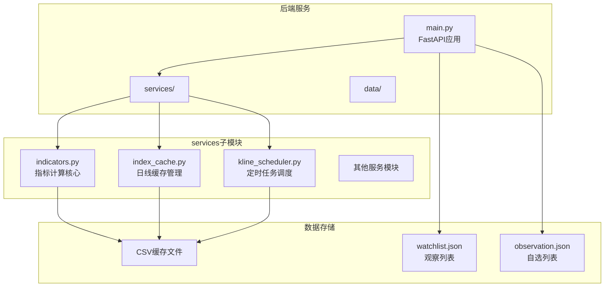

**图表来源**
- [main.py:105-184](file://backend/main.py#L105-L184)
- [indicators.py:1646-1947](file://backend/services/indicators.py#L1646-L1947)
- [index_cache.py:1-201](file://backend/services/index_cache.py#L1-L201)

**章节来源**
- [main.py:105-184](file://backend/main.py#L105-L184)
- [indicators.py:1646-1947](file://backend/services/indicators.py#L1646-L1947)

## 核心组件
本模块包含以下核心组件：

### 1. 指标计算核心模块
- **技术指标算法**：MACD、布林带、KDJ的完整实现
- **数据标准化**：包含关系合并、分型识别、笔画构建
- **缠论分析**：线段、有效笔、中枢计算
- **缓存管理**：内存响应缓存、本地文件缓存

### 2. 数据源管理层
- **多数据源支持**：AkShare、新浪、yfinance的统一接口
- **符号解析**：支持A股、指数、ETF、港股的符号格式
- **数据质量控制**：重试机制、数据完整性验证

### 3. 缓存策略模块
- **本地CSV缓存**：指数、A股、港股日线缓存
- **内存响应缓存**：进程内缓存，支持TTL和LRU
- **缓存失效机制**：基于文件mtime的智能失效

**章节来源**
- [indicators.py:1646-1947](file://backend/services/indicators.py#L1646-L1947)
- [index_cache.py:1-201](file://backend/services/index_cache.py#L1-L201)

## 架构概览
系统采用分层架构设计，实现了数据获取、处理、缓存和API暴露的完整闭环：

```mermaid
graph TB
subgraph "API层"
API[FastAPI接口]
ENDPOINTS[/api/index/kline<br/>/api/stock/indicators]
end
subgraph "服务层"
IND[indicators.py<br/>核心指标计算]
CACHE[index_cache.py<br/>日线缓存管理]
SCHED[kline_scheduler.py<br/>定时任务调度]
end
subgraph "数据层"
LOCAL[本地CSV缓存]
REMOTE[远程数据源]
MEMORY[内存缓存]
end
subgraph "数据源"
AK[AkShare]
SINA[新浪接口]
YF[yfinance]
end
API --> ENDPOINTS
ENDPOINTS --> IND
IND --> CACHE
IND --> MEMORY
CACHE --> LOCAL
IND --> REMOTE
REMOTE --> AK
REMOTE --> SINA
REMOTE --> YF
SCHED --> CACHE
SCHED --> IND
```

**图表来源**
- [main.py:156-184](file://backend/main.py#L156-L184)
- [indicators.py:1646-1947](file://backend/services/indicators.py#L1646-L1947)
- [index_cache.py:1-201](file://backend/services/index_cache.py#L1-L201)
- [kline_scheduler.py:1-496](file://backend/services/kline_scheduler.py#L1-L496)

## 详细组件分析

### 技术指标计算核心

#### MACD算法实现
MACD（Moving Average Convergence Divergence）是趋势跟踪动量指标，计算公式如下：

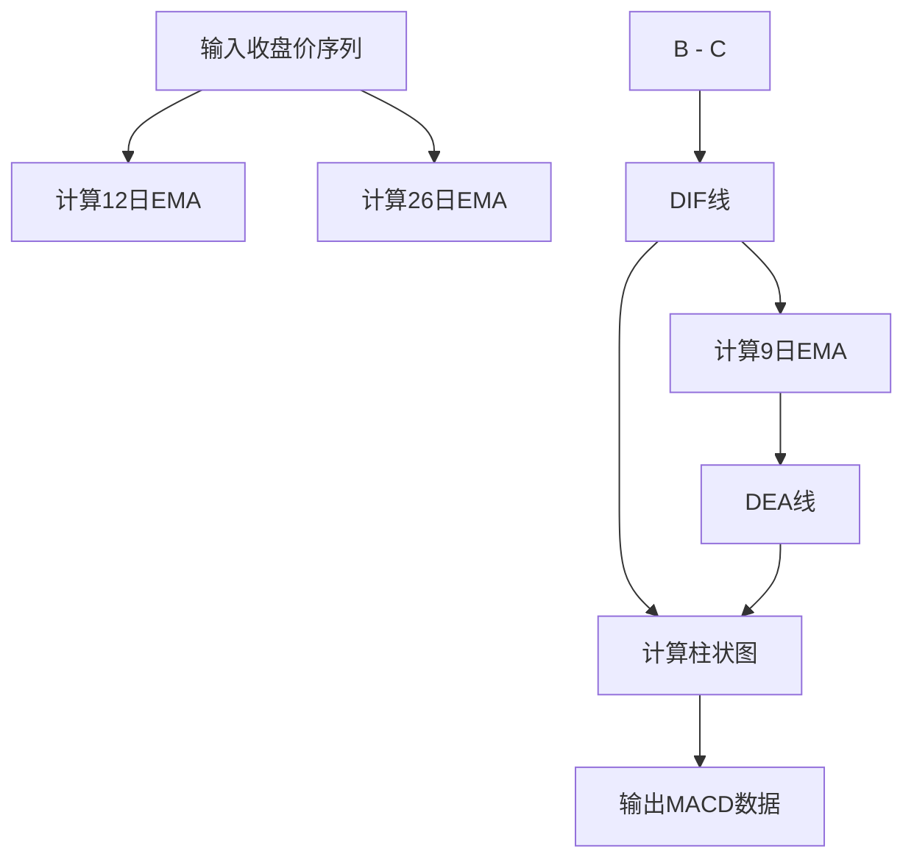

**图表来源**
- [indicators.py:659-665](file://backend/services/indicators.py#L659-L665)

#### 布林带算法实现
布林带由三条线组成，提供价格通道分析：

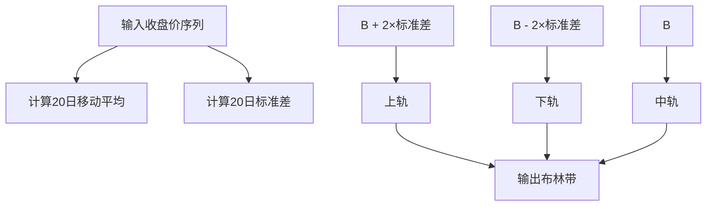

**图表来源**
- [indicators.py:668-673](file://backend/services/indicators.py#L668-L673)

#### KDJ算法实现
KDJ随机指标用于超买超卖分析：

```mermaid
flowchart TD
A[输入高、低、收序列] --> B[计算9日最低值]
A --> C[计算9日最高值]
D[收 - 最低] --> E[分子]
F[最高 - 最低] --> G[分母]
E/H --> I[Rsv]
I --> J[计算K值(1/3平滑)]
J --> K[计算D值(1/3平滑)]
K --> L[J = 3K - 2D]
M[I,K,L] --> N[输出KDJ数据]
```

**图表来源**
- [indicators.py:676-690](file://backend/services/indicators.py#L676-L690)

**章节来源**
- [indicators.py:659-690](file://backend/services/indicators.py#L659-L690)

### 数据标准化处理流程

#### 包含关系处理
包含关系是缠论的基础概念，通过以下步骤处理：

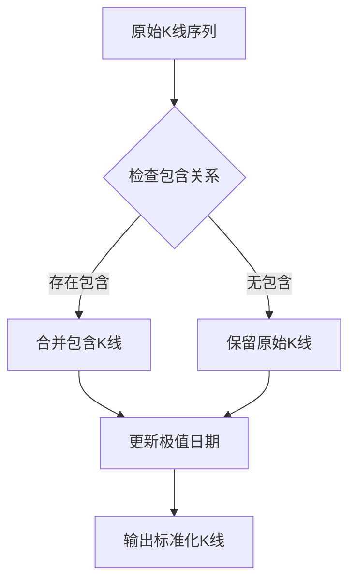

**图表来源**
- [indicators.py:783-835](file://backend/services/indicators.py#L783-L835)

#### 分型识别算法
分型识别遵循缠论的严格规则：

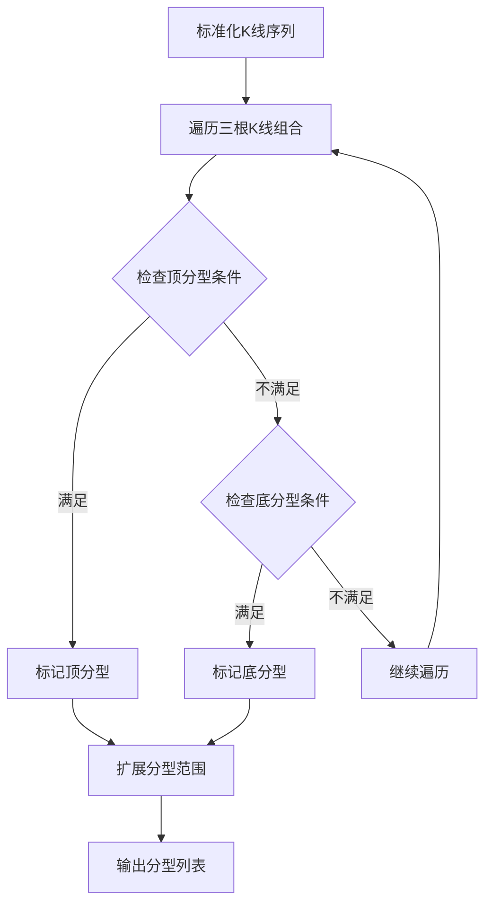

**图表来源**
- [indicators.py:838-933](file://backend/services/indicators.py#L838-L933)

**章节来源**
- [indicators.py:783-933](file://backend/services/indicators.py#L783-L933)

### 缓存策略设计

#### 多级缓存架构
系统采用三层缓存架构确保性能和数据一致性：

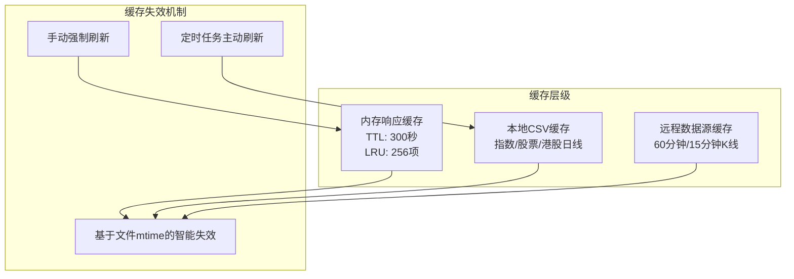

**图表来源**
- [indicators.py:27-91](file://backend/services/indicators.py#L27-L91)
- [index_cache.py:1-201](file://backend/services/index_cache.py#L1-L201)

#### 缓存键设计
缓存键采用四元组设计，确保精确匹配：

| 缓存键元素 | 描述 | 示例 |
|-----------|------|------|
| symbol | 标的代码 | sh000001, 600000, hk01810 |
| period | K线周期 | daily, 60, 15 |
| start_date | 开始日期 | 2025-01-01 |
| end_date | 结束日期 | 2025-01-31 |

**章节来源**
- [indicators.py:1664-1670](file://backend/services/indicators.py#L1664-L1670)

### 数据源管理

#### 符号解析系统
支持多种数据源的符号格式：

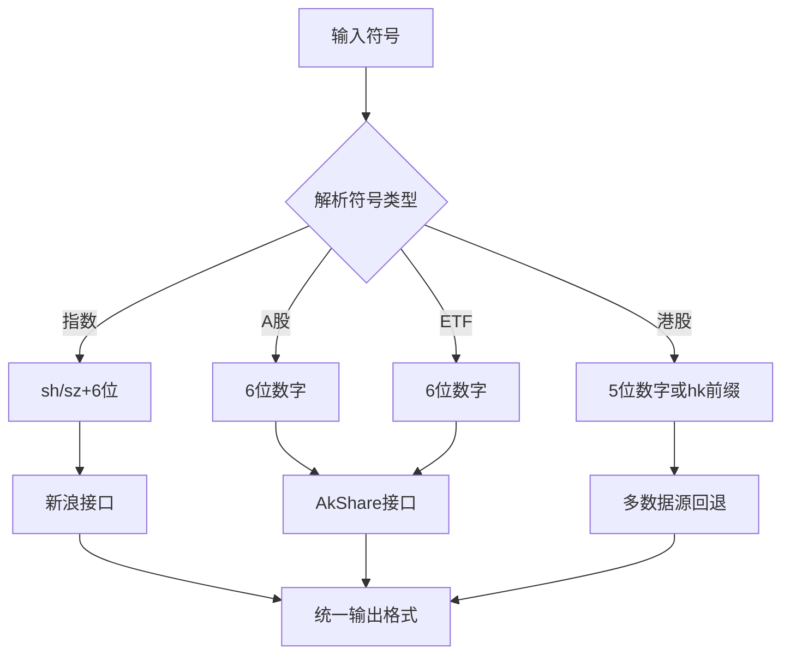

**图表来源**
- [indicators.py:206-233](file://backend/services/indicators.py#L206-L233)

#### 数据质量控制
实现多层次的数据质量保障：

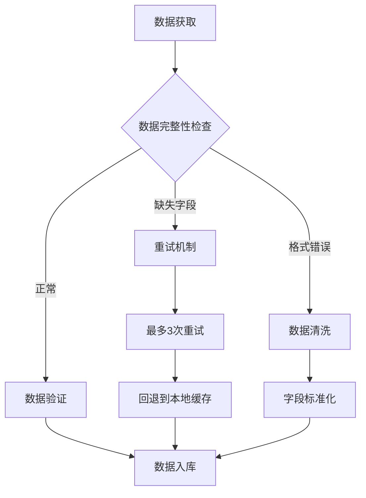

**图表来源**
- [indicators.py:236-250](file://backend/services/indicators.py#L236-L250)

**章节来源**
- [indicators.py:206-250](file://backend/services/indicators.py#L206-L250)

## 依赖关系分析

### 模块间依赖关系

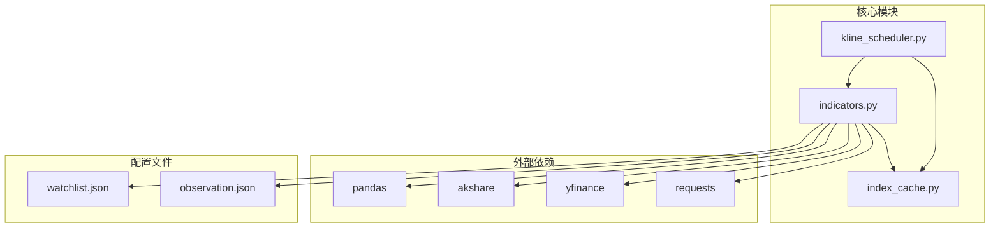

**图表来源**
- [indicators.py:12-25](file://backend/services/indicators.py#L12-L25)
- [index_cache.py:11-13](file://backend/services/index_cache.py#L11-L13)
- [kline_scheduler.py:28-31](file://backend/services/kline_scheduler.py#L28-L31)

### 数据流依赖

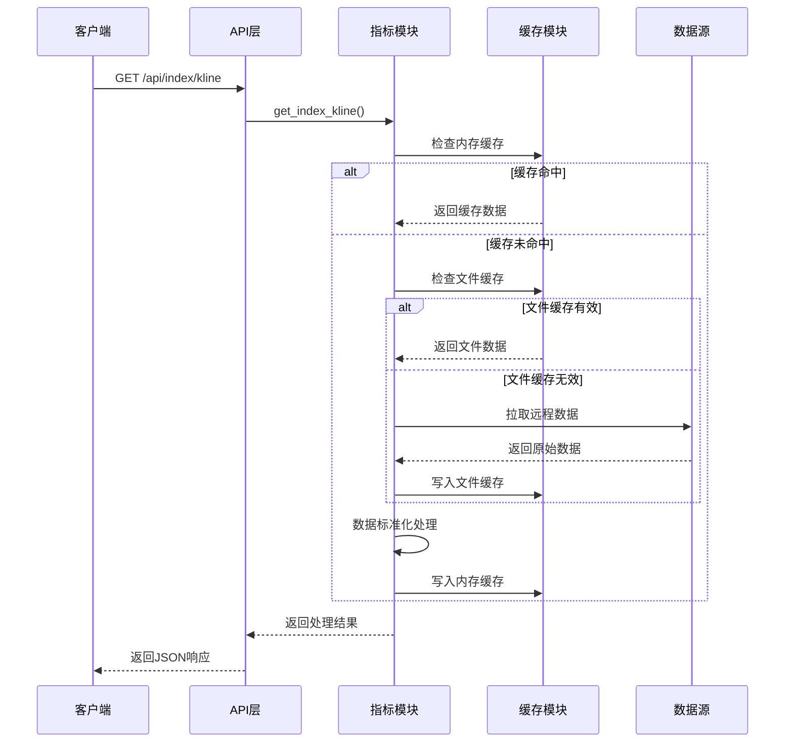

**图表来源**
- [main.py:156-184](file://backend/main.py#L156-L184)
- [indicators.py:1646-1947](file://backend/services/indicators.py#L1646-L1947)

**章节来源**
- [main.py:156-184](file://backend/main.py#L156-L184)
- [indicators.py:1646-1947](file://backend/services/indicators.py#L1646-L1947)

## 性能考虑

### 缓存优化策略

#### 内存缓存优化
- **TTL机制**：默认300秒，平衡新鲜度和性能
- **LRU淘汰**：最多256项，防止内存无限增长
- **智能失效**：基于文件mtime的自动失效

#### 数据标准化优化
- **批量处理**：使用pandas向量化操作
- **早期终止**：无效数据及时过滤
- **内存复用**：使用深拷贝避免数据污染

### 算法复杂度分析

| 操作 | 时间复杂度 | 空间复杂度 | 说明 |
|------|------------|------------|------|
| 包含关系合并 | O(n) | O(n) | 单次遍历 |
| 分型识别 | O(n) | O(n) | 三根K线滑动窗口 |
| 笔画构建 | O(n) | O(n) | 线性时间复杂度 |
| 线段计算 | O(n²) | O(n) | 三笔重叠检查 |
| 中枢构建 | O(n³) | O(n) | 三笔组合检查 |

### 性能监控
系统内置详细的性能监控：

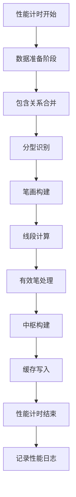

**图表来源**
- [indicators.py:1911-1946](file://backend/services/indicators.py#L1911-L1946)

## 故障排查指南

### 常见问题诊断

#### 缓存相关问题
1. **缓存未更新**
   - 检查文件mtime是否更新
   - 验证缓存键是否正确
   - 确认TTL设置是否合理

2. **内存缓存溢出**
   - 检查缓存项数量
   - 监控LRU淘汰机制
   - 调整缓存大小限制

#### 数据源问题
1. **网络连接失败**
   - 检查重试机制
   - 验证代理设置
   - 监控API限流

2. **数据格式错误**
   - 验证字段完整性
   - 检查数据类型转换
   - 确认时区处理

**章节来源**
- [indicators.py:236-250](file://backend/services/indicators.py#L236-L250)

### 错误处理机制

#### 异常分类处理
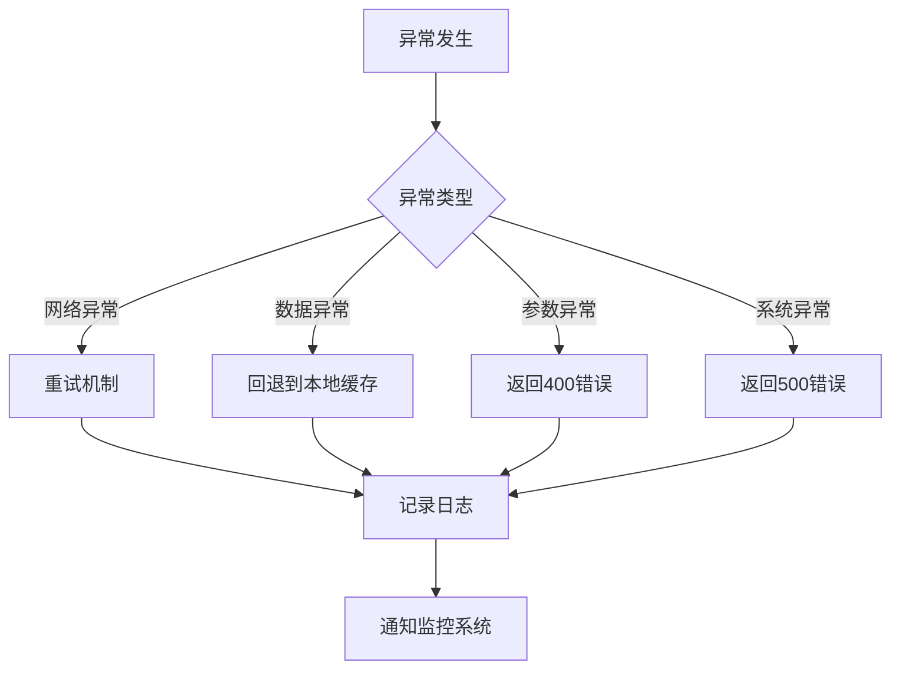

#### 日志记录策略
- **INFO级别**：正常操作和性能统计
- **WARNING级别**：缓存回退和数据质量警告
- **ERROR级别**：严重错误和异常处理

**章节来源**
- [indicators.py:236-250](file://backend/services/indicators.py#L236-L250)

## 结论
技术指标服务模块通过精心设计的架构和算法，提供了高性能、可靠的技术分析能力。主要特点包括：

1. **多数据源支持**：统一接口支持AkShare、新浪、yfinance
2. **智能缓存策略**：多级缓存确保性能和数据一致性
3. **完整的缠论实现**：从包含关系到中枢的完整分析链
4. **健壮的错误处理**：多层次的异常处理和回退机制
5. **性能监控**：详细的性能统计和日志记录

该模块为金融数据分析提供了坚实的技术基础，支持实时和历史数据的综合分析需求。

## 附录

### API使用示例

#### 获取K线数据
```python
# 基础查询
GET /api/index/kline?symbol=sh000001&period=daily&start_date=2025-01-01

# 获取60分钟数据
GET /api/index/kline?symbol=600000&period=60&start_date=2025-01-01&refresh=true

# 获取15分钟数据
GET /api/index/kline?symbol=hk01810&period=15&start_date=2025-01-01
```

#### 获取技术指标
```python
# 获取最新指标
GET /api/stock/indicators?code=600000

# 获取历史指标
GET /api/stock/history-indicators?code=600000&start_date=2025-01-01
```

### 配置文件说明

#### watchlist.json
维护用户持仓和自选标的，支持直接编辑。

#### observation.json  
维护观察标的列表，仅用于前端显示。

**章节来源**
- [main.py:126-184](file://backend/main.py#L126-L184)
- [watchlist.json:1-27](file://backend/data/watchlist.json#L1-L27)
- [observation.json:1-25](file://backend/data/observation.json#L1-L25)