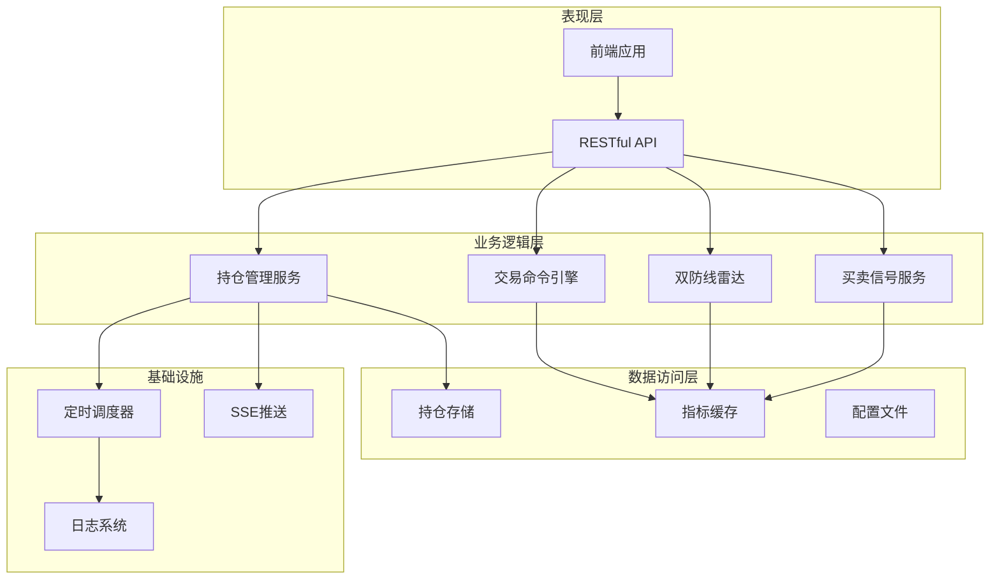
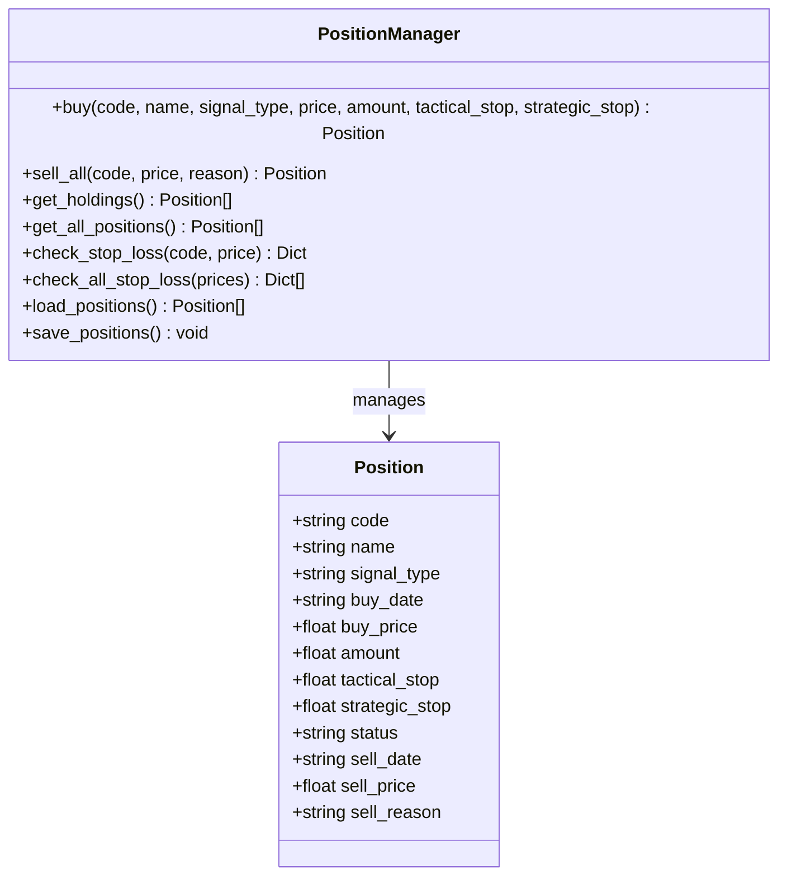
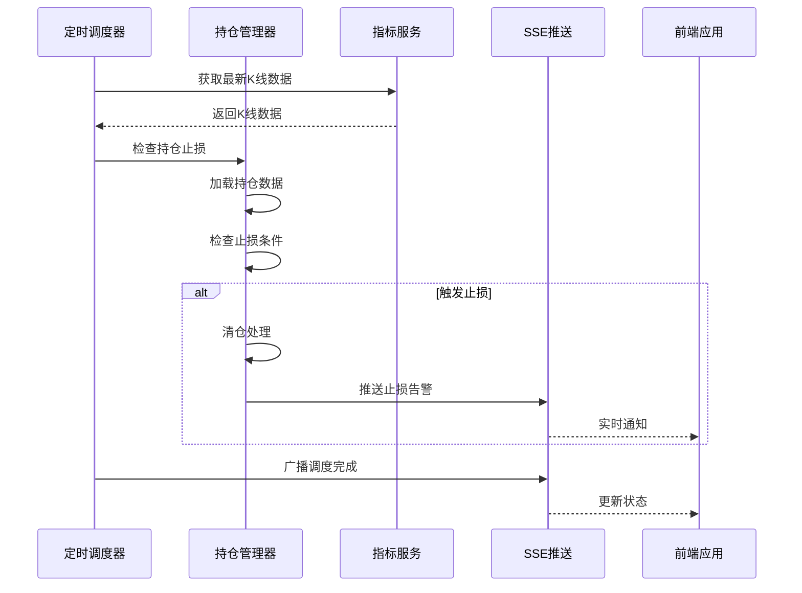
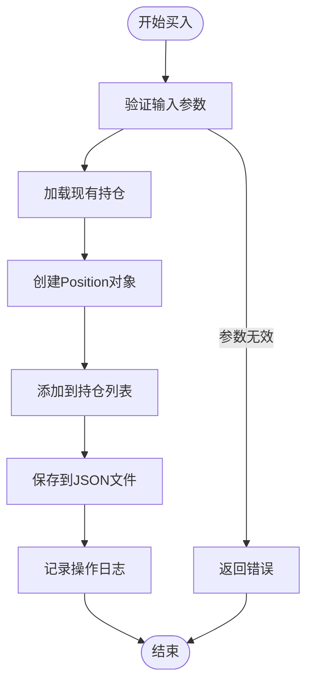
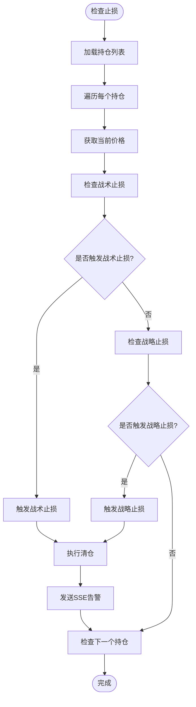
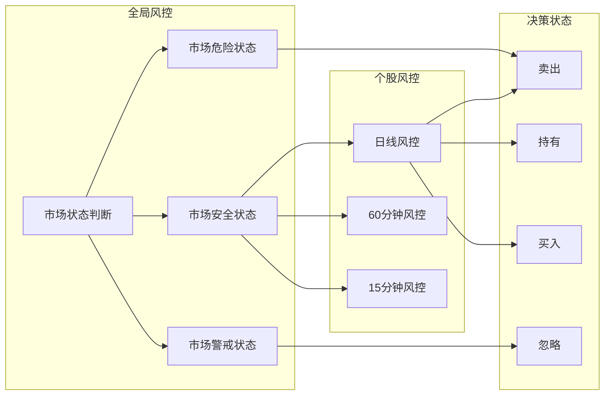
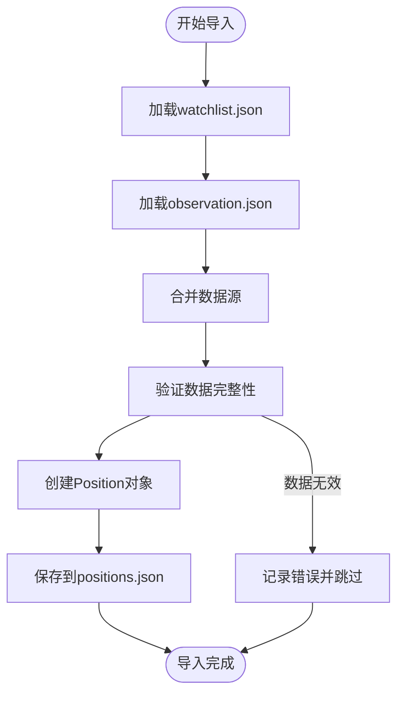
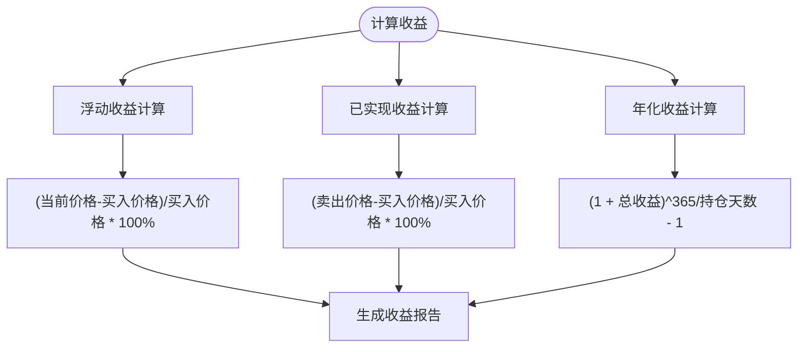
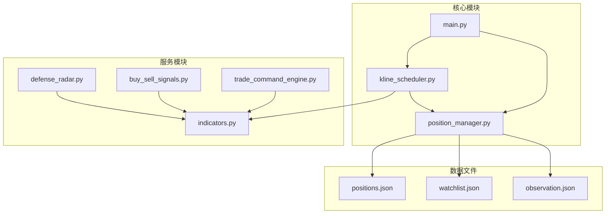

# 持仓管理服务

<cite>
**本文档引用的文件**
- [position_manager.py](file://backend/services/position_manager.py)
- [main.py](file://backend/main.py)
- [kline_scheduler.py](file://backend/services/kline_scheduler.py)
- [indicators.py](file://backend/services/indicators.py)
- [buy_sell_signals.py](file://backend/services/buy_sell_signals.py)
- [positions.json](file://data/positions.json)
- [watchlist.json](file://backend/data/watchlist.json)
- [observation.json](file://backend/data/observation.json)
- [run_trade_command.py](file://backend/run_trade_command.py)
</cite>

## 目录
1. [简介](#简介)
2. [项目结构](#项目结构)
3. [核心组件](#核心组件)
4. [架构概览](#架构概览)
5. [详细组件分析](#详细组件分析)
6. [依赖关系分析](#依赖关系分析)
7. [性能考虑](#性能考虑)
8. [故障排查指南](#故障排查指南)
9. [结论](#结论)
10. [附录](#附录)

## 简介

持仓管理服务是金融分析系统的核心模块，负责管理用户的股票持仓数据、执行止损监控、提供交易决策支持，并与系统的其他服务模块紧密集成。该服务采用JSON文件作为持久化存储，通过线程安全的读写机制确保数据一致性，同时提供了完整的API接口供前端和后端服务调用。

## 项目结构

系统采用分层架构设计，主要包含以下层次：

**图表来源**
- [position_manager.py:1-234](file://backend/services/position_manager.py#L1-L234)
- [main.py:1-607](file://backend/main.py#L1-L607)

**章节来源**
- [position_manager.py:1-234](file://backend/services/position_manager.py#L1-L234)
- [main.py:1-607](file://backend/main.py#L1-L607)

## 核心组件

### 持仓数据模型

持仓管理服务的核心数据模型是一个简洁而强大的Position类，包含以下关键字段：

**图表来源**
- [position_manager.py:38-54](file://backend/services/position_manager.py#L38-L54)

### 数据持久化策略

系统采用JSON文件作为持久化存储，具有以下特点：

- **文件锁定机制**：使用fcntl库实现文件级别的读写锁，确保多进程环境下的数据一致性
- **线程安全**：通过RLock确保同一进程内的线程安全访问
- **原子写入**：使用排他锁确保文件写入的原子性，防止数据损坏
- **自动恢复**：文件损坏时自动降级为默认状态，确保系统可用性

**章节来源**
- [position_manager.py:57-93](file://backend/services/position_manager.py#L57-L93)

## 架构概览

系统采用事件驱动的架构模式，通过定时调度器协调各个服务模块的工作：

**图表来源**
- [kline_scheduler.py:181-212](file://backend/services/kline_scheduler.py#L181-L212)
- [main.py:44-54](file://backend/main.py#L44-L54)

**章节来源**
- [kline_scheduler.py:1-504](file://backend/services/kline_scheduler.py#L1-L504)
- [main.py:1-607](file://backend/main.py#L1-L607)

## 详细组件分析

### 持仓管理器核心功能

#### 买入操作流程

**图表来源**
- [position_manager.py:95-135](file://backend/services/position_manager.py#L95-L135)

#### 止损检查机制

系统实现了双重止损机制：

1. **战术止损**：跌破底分型最低点
2. **战略止损**：跌破一买绝对低点

**图表来源**
- [position_manager.py:184-233](file://backend/services/position_manager.py#L184-L233)

**章节来源**
- [position_manager.py:95-233](file://backend/services/position_manager.py#L95-L233)

### API接口设计

系统提供了完整的RESTful API接口：

| 接口 | 方法 | 描述 | 参数 |
|------|------|------|------|
| `/api/positions` | GET | 获取当前持仓列表 | 无 |
| `/api/positions/buy` | POST | 手动记录买入 | code, name, signal_type, price, amount, tactical_stop, strategic_stop |
| `/api/positions/sell` | POST | 手动清仓 | code, price, reason |
| `/api/positions/history` | GET | 获取历史持仓记录 | 无 |

**章节来源**
- [main.py:428-485](file://backend/main.py#L428-L485)

### 风险控制功能

#### 三层风控体系

系统实现了多层次的风险控制机制：

1. **全局大盘风控**：基于上证指数的市场状态判断
2. **个股三维区间套**：日线、60分钟、15分钟的多级别分析
3. **终极状态机**：基于缠论的买卖点识别

**图表来源**
- [trade_command_engine.py:9-14](file://backend/services/trade_command_engine.py#L9-L14)

**章节来源**
- [trade_command_engine.py:1-800](file://backend/services/trade_command_engine.py#L1-L800)

### 交易逻辑实现

#### 买卖信号检测

系统基于缠论技术分析提供多种买卖信号：

| 信号类型 | 描述 | 触发条件 |
|----------|------|----------|
| 一买 | 第一类买点 | 底背驰 + 突破中枢 |
| 二买 | 第二类买点 | 回踩不创新低 + MACD动能增强 |
| 三买 | 第三类买点 | 突破中枢上轨 + 水上漂 |
| 一卖 | 第一类卖点 | 顶背驰 + 突破中枢 |
| 二卖 | 第二类卖点 | 反弹不创新高 + MACD转弱 |
| 三卖 | 第三类卖点 | 突破中枢下轨 + 水下转弱 |

**章节来源**
- [buy_sell_signals.py:1-800](file://backend/services/buy_sell_signals.py#L1-L800)

### 数据导入导出功能

#### 导入机制

系统支持从watchlist.json和observation.json文件导入持仓数据：

**图表来源**
- [trade_command_engine.py:79-91](file://backend/services/trade_command_engine.py#L79-L91)

#### 导出机制

系统提供多种导出选项：

1. **历史记录导出**：导出所有历史持仓记录
2. **当前持仓导出**：仅导出当前持有的股票
3. **配置文件导出**：导出系统配置和参数

**章节来源**
- [positions.json:1-30](file://data/positions.json#L1-L30)
- [watchlist.json:1-27](file://backend/data/watchlist.json#L1-L27)

### 收益计算与统计

#### 盈亏计算方法

系统支持多种收益计算方式：

1. **浮动盈亏**：基于当前市场价格计算
2. **已实现盈亏**：基于卖出价格计算
3. **年化收益率**：基于持仓时间计算

**图表来源**
- [position_manager.py:154-158](file://backend/services/position_manager.py#L154-L158)

## 依赖关系分析

系统各模块之间的依赖关系如下：

**图表来源**
- [position_manager.py:1-234](file://backend/services/position_manager.py#L1-L234)
- [kline_scheduler.py:1-504](file://backend/services/kline_scheduler.py#L1-L504)

**章节来源**
- [position_manager.py:1-234](file://backend/services/position_manager.py#L1-L234)
- [kline_scheduler.py:1-504](file://backend/services/kline_scheduler.py#L1-L504)

## 性能考虑

### 并发控制

系统采用了多层次的并发控制机制：

1. **文件级锁**：使用fcntl实现文件级别的读写锁
2. **线程锁**：使用RLock确保线程安全
3. **进程间同步**：通过文件锁实现多进程去重

### 缓存策略

1. **指标缓存**：基于内存的指标数据缓存
2. **响应缓存**：HTTP响应的短期缓存
3. **文件缓存**：本地CSV文件的mtime监控

### 内存管理

1. **数据结构优化**：使用dataclass减少内存占用
2. **延迟加载**：按需加载数据文件
3. **垃圾回收**：及时清理临时对象

## 故障排查指南

### 常见问题及解决方案

#### 持仓数据丢失

**症状**：重启后持仓数据消失
**原因**：文件写入过程中断电或异常
**解决方案**：
1. 检查文件权限和磁盘空间
2. 验证JSON文件格式正确性
3. 检查文件锁状态

#### 止损检查不准确

**症状**：止损触发时机不正确
**原因**：价格数据延迟或缓存问题
**解决方案**：
1. 确认指标服务正常运行
2. 检查K线数据完整性
3. 验证止损参数设置

#### API接口异常

**症状**：API调用返回错误
**原因**：参数验证失败或服务异常
**解决方案**：
1. 检查请求参数格式
2. 查看服务日志
3. 验证服务依赖状态

**章节来源**
- [position_manager.py:73-92](file://backend/services/position_manager.py#L73-L92)
- [kline_scheduler.py:35-36](file://backend/services/kline_scheduler.py#L35-L36)

## 结论

持仓管理服务模块通过精心设计的数据模型、完善的风控机制和高效的并发控制，为金融分析系统提供了可靠的基础支撑。其模块化的架构设计使得系统具有良好的可扩展性和可维护性，能够适应不断变化的业务需求。

系统的主要优势包括：
1. **数据一致性**：通过多重锁机制确保数据安全
2. **实时性**：基于定时调度器的实时监控
3. **可扩展性**：模块化设计支持功能扩展
4. **可靠性**：完善的错误处理和恢复机制

## 附录

### 最佳实践建议

1. **定期备份**：建议定期备份positions.json文件
2. **参数验证**：确保止损参数设置合理
3. **监控告警**：建立系统监控和告警机制
4. **性能优化**：根据实际使用情况调整缓存策略

### 注意事项

1. **文件权限**：确保数据文件具有正确的读写权限
2. **磁盘空间**：监控磁盘使用情况，预留足够空间
3. **网络稳定性**：确保网络连接稳定，避免数据传输中断
4. **服务依赖**：确保所有依赖服务正常运行