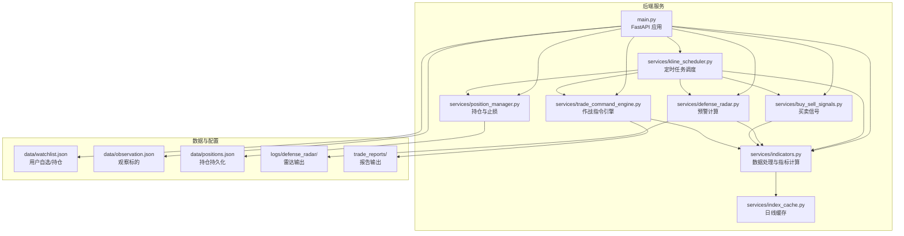
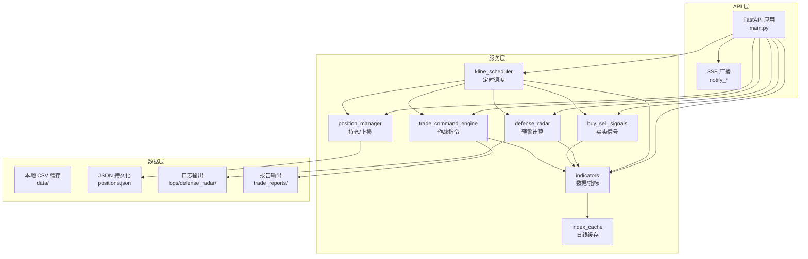
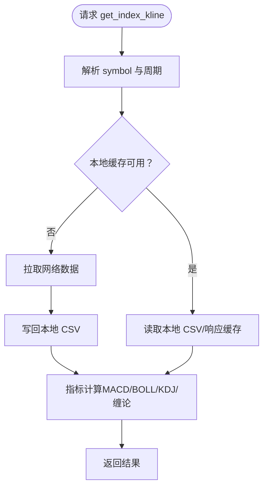
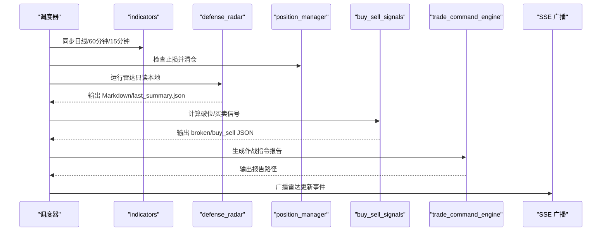
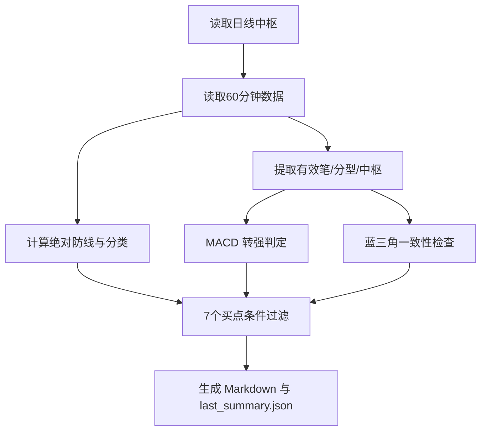
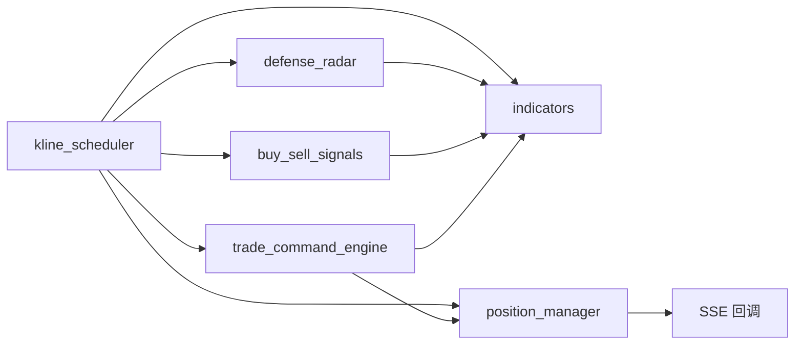
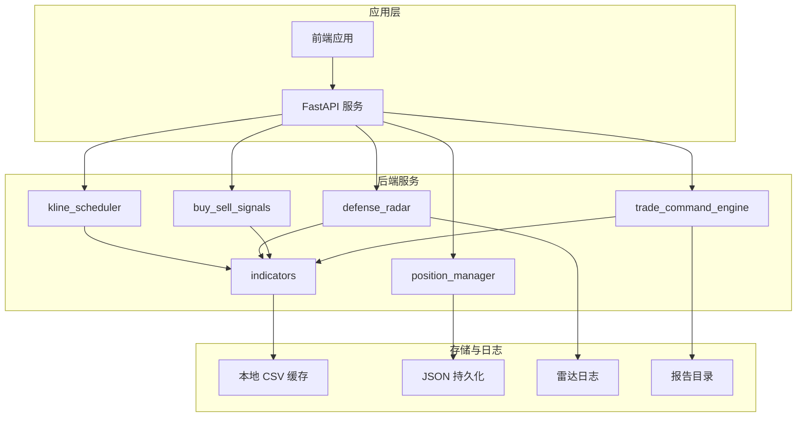

# 服务模块设计

<cite>
**本文档引用的文件**
- [backend/services/indicators.py](file://backend/services/indicators.py)
- [backend/services/kline_scheduler.py](file://backend/services/kline_scheduler.py)
- [backend/services/defense_radar.py](file://backend/services/defense_radar.py)
- [backend/services/position_manager.py](file://backend/services/position_manager.py)
- [backend/services/index_cache.py](file://backend/services/index_cache.py)
- [backend/services/buy_sell_signals.py](file://backend/services/buy_sell_signals.py)
- [backend/services/trade_command_engine.py](file://backend/services/trade_command_engine.py)
- [backend/main.py](file://backend/main.py)
- [backend/run_defense_radar.py](file://backend/run_defense_radar.py)
- [backend/run_trade_command.py](file://backend/run_trade_command.py)
- [backend/update_radar.py](file://backend/update_radar.py)
- [backend/requirements.txt](file://backend/requirements.txt)
- [backend/data/watchlist.json](file://backend/data/watchlist.json)
- [backend/data/observation.json](file://backend/data/observation.json)
</cite>

## 目录
1. [简介](#简介)
2. [项目结构](#项目结构)
3. [核心组件](#核心组件)
4. [架构总览](#架构总览)
5. [详细组件分析](#详细组件分析)
6. [依赖关系分析](#依赖关系分析)
7. [性能考量](#性能考量)
8. [故障排查指南](#故障排查指南)
9. [结论](#结论)
10. [附录](#附录)

## 简介
本文件面向后端服务模块，系统化阐述其分层架构设计与实现细节，涵盖数据处理层、业务逻辑层与定时任务层。重点说明以下服务模块的职责边界与协作关系：
- indicators 服务：负责 K 线数据获取、缓存与技术指标计算（MACD、布林带、KDJ、缠论中枢与笔/分型等）
- kline_scheduler 服务：负责定时任务调度与批量数据同步，驱动雷达与信号计算
- defense_radar 服务：负责“双防线”预警计算与结果输出
- position_manager 服务：负责持仓管理与止损监控
- buy_sell_signals 服务：负责 60 分钟买卖信号批量计算
- trade_command_engine 服务：负责无头量化报告引擎（作战指令）

同时，文档给出接口设计原则、数据流转模式、扩展性与插件化建议，并提供部署架构图与数据流图。

## 项目结构
后端采用模块化组织，核心服务位于 backend/services，API 入口在 backend/main.py，数据与配置位于 backend/data，工具脚本位于 backend 目录根部。

图表来源
- [backend/main.py:105-124](file://backend/main.py#L105-L124)
- [backend/services/indicators.py:17-25](file://backend/services/indicators.py#L17-L25)
- [backend/services/kline_scheduler.py:28-31](file://backend/services/kline_scheduler.py#L28-L31)
- [backend/services/defense_radar.py:27](file://backend/services/defense_radar.py#L27)
- [backend/services/position_manager.py:19-20](file://backend/services/position_manager.py#L19-L20)
- [backend/services/buy_sell_signals.py:24-26](file://backend/services/buy_sell_signals.py#L24-L26)
- [backend/services/trade_command_engine.py:33-34](file://backend/services/trade_command_engine.py#L33-L34)

章节来源
- [backend/main.py:105-124](file://backend/main.py#L105-L124)
- [backend/requirements.txt:1-5](file://backend/requirements.txt#L1-5)

## 核心组件
- 数据处理层（indicators 与 index_cache）
  - 提供统一的 K 线数据获取与缓存能力，支持日线、60 分钟、15 分钟多周期
  - 内置响应缓存与本地 CSV 缓存，支持 TTL 与 mtime 自动失效
  - 提供 MACD、布林带、KDJ 等技术指标与缠论中枢/笔/分型计算
- 业务逻辑层（defense_radar、buy_sell_signals、position_manager、trade_command_engine）
  - defense_radar：双防线预警计算，输出 Markdown 与 last_summary.json
  - buy_sell_signals：60 分钟买卖信号批量计算，输出 buy_sell_signals.json
  - position_manager：持仓记录、止损检查与清仓，支持 SSE 推送
  - trade_command_engine：无头量化报告引擎，集成多级别风控与状态机
- 定时任务层（kline_scheduler）
  - 周期性同步日线/60 分钟/15 分钟数据，触发雷达与信号计算
  - 提供健康状态查询、SSE 广播回调、多 worker 去重

章节来源
- [backend/services/indicators.py:176-201](file://backend/services/indicators.py#L176-L201)
- [backend/services/defense_radar.py:101-120](file://backend/services/defense_radar.py#L101-L120)
- [backend/services/buy_sell_signals.py:581-597](file://backend/services/buy_sell_signals.py#L581-L597)
- [backend/services/position_manager.py:32-46](file://backend/services/position_manager.py#L32-L46)
- [backend/services/trade_command_engine.py:1-16](file://backend/services/trade_command_engine.py#L1-L16)
- [backend/services/kline_scheduler.py:42-49](file://backend/services/kline_scheduler.py#L42-L49)

## 架构总览
后端采用“API 层 + 服务层 + 数据层”的分层设计。API 层（FastAPI）负责请求接入与 SSE 广播；服务层封装业务逻辑；数据层负责缓存与持久化。

图表来源
- [backend/main.py:91-102](file://backend/main.py#L91-L102)
- [backend/services/kline_scheduler.py:452-488](file://backend/services/kline_scheduler.py#L452-L488)
- [backend/services/indicators.py:27](file://backend/services/indicators.py#L27)
- [backend/services/defense_radar.py:96-98](file://backend/services/defense_radar.py#L96-L98)
- [backend/services/trade_command_engine.py:33-34](file://backend/services/trade_command_engine.py#L33-L34)

## 详细组件分析

### 数据处理层（indicators 与 index_cache）
- 统一符号解析与周期路由：支持 A 股/ETF、港股、指数等多源标识，自动选择新浪/AKShare/yfinance 数据源
- 本地缓存策略：
  - 日线：index_daily_*.csv、a_daily_*.csv、hk_daily_*.csv
  - 60 分钟：kline_60_*.csv
  - 15 分钟：kline_15_*.csv
  - 响应缓存：内存缓存 + TTL + mtime 失效
- 指标计算：
  - MACD、布林带、KDJ
  - 缠论：包含关系合并、分型、笔、中枢、有效笔序列
- 网络重试与容错：对易波动接口进行轻量重试，避免瞬时网络抖动导致失败

图表来源
- [backend/services/indicators.py:204-231](file://backend/services/indicators.py#L204-L231)
- [backend/services/indicators.py:149-174](file://backend/services/indicators.py#L149-L174)
- [backend/services/index_cache.py:102-123](file://backend/services/index_cache.py#L102-L123)

章节来源
- [backend/services/indicators.py:176-201](file://backend/services/indicators.py#L176-L201)
- [backend/services/index_cache.py:25-41](file://backend/services/index_cache.py#L25-L41)

### 定时任务层（kline_scheduler）
- 调度策略：
  - 主槽位：10:31/11:31/14:01/15:01（60 分钟同步 + 雷达），16:01（日线 + 60 分钟 + 雷达）
  - 15 分钟独立槽位：交易时间内每 15 分钟同步一次
- 任务编排：
  - 全量同步日线/60 分钟/15 分钟
  - 持仓止损检查
  - 雷达计算与破位/买卖信号写盘
  - 作战指令引擎（无头报告）
  - SSE 广播
- 健康监控与多进程去重：心跳、状态文件、文件锁

图表来源
- [backend/services/kline_scheduler.py:214-251](file://backend/services/kline_scheduler.py#L214-L251)
- [backend/services/kline_scheduler.py:452-488](file://backend/services/kline_scheduler.py#L452-L488)

章节来源
- [backend/services/kline_scheduler.py:42-49](file://backend/services/kline_scheduler.py#L42-L49)
- [backend/services/kline_scheduler.py:289-376](file://backend/services/kline_scheduler.py#L289-L376)

### 预警计算层（defense_radar）
- 输入：日线中枢（C-ZD/A-ZD）、60 分钟末根收盘价、60 分钟有效笔/分型/中枢
- 输出：Markdown 报告与 last_summary.json，包含 7 个买点条件与四条件扳机
- 关键逻辑：
  - 绝对防线分类（红色/一级/日线）
  - 60 分钟笔向与蓝三角一致性
  - MACD 转强判定
  - 与前端逻辑对齐的买点条件过滤

图表来源
- [backend/services/defense_radar.py:600-744](file://backend/services/defense_radar.py#L600-L744)
- [backend/services/defense_radar.py:147-165](file://backend/services/defense_radar.py#L147-L165)

章节来源
- [backend/services/defense_radar.py:101-120](file://backend/services/defense_radar.py#L101-L120)
- [backend/services/defense_radar.py:747-800](file://backend/services/defense_radar.py#L747-L800)

### 买卖信号层（buy_sell_signals）
- 输入：60 分钟 K 线与中枢/笔/分型
- 输出：buy_sell_signals.json，包含一买/二买/三买、一卖/二卖/三卖标记
- 与前端逻辑对齐的过滤条件：keepDailySupport、inCcentral、hasBottomDivInSwitch、macdBuy 等

章节来源
- [backend/services/buy_sell_signals.py:581-790](file://backend/services/buy_sell_signals.py#L581-L790)
- [backend/services/buy_sell_signals.py:34-62](file://backend/services/buy_sell_signals.py#L34-L62)

### 持仓管理层（position_manager）
- 数据持久化：backend/data/positions.json
- 功能：买入记录、止损检查、清仓与 SSE 推送
- 接口：buy、sell_all、check_stop_loss、get_holdings、get_all_positions

章节来源
- [backend/services/position_manager.py:77-185](file://backend/services/position_manager.py#L77-L185)
- [backend/services/position_manager.py:188-210](file://backend/services/position_manager.py#L188-L210)

### 作战指令引擎（trade_command_engine）
- 无头报告：独立后台脚本，不触碰前端 UI
- 三层风控：全局大盘、个股三维区间套、终极状态机
- 输出：Markdown 报告写入 trade_reports/

章节来源
- [backend/services/trade_command_engine.py:1-16](file://backend/services/trade_command_engine.py#L1-L16)
- [backend/services/trade_command_engine.py:45-72](file://backend/services/trade_command_engine.py#L45-L72)

## 依赖关系分析
- 模块耦合
  - kline_scheduler 依赖 indicators、defense_radar、position_manager、buy_sell_signals、trade_command_engine
  - defense_radar 依赖 indicators
  - buy_sell_signals 依赖 indicators 与 defense_radar（名称缓存）
  - trade_command_engine 依赖 indicators、position_manager、watchlist/observation
  - position_manager 依赖 SSE 回调
- 外部依赖
  - fastapi、uvicorn、pandas、akshare
- 数据依赖
  - watchlist.json、observation.json、positions.json
  - logs/defense_radar/last_summary.json
  - trade_reports/

图表来源
- [backend/services/kline_scheduler.py:28-31](file://backend/services/kline_scheduler.py#L28-L31)
- [backend/services/defense_radar.py:27](file://backend/services/defense_radar.py#L27)
- [backend/services/buy_sell_signals.py:24-26](file://backend/services/buy_sell_signals.py#L24-L26)
- [backend/services/trade_command_engine.py:45-72](file://backend/services/trade_command_engine.py#L45-L72)
- [backend/services/position_manager.py:22-29](file://backend/services/position_manager.py#L22-L29)

章节来源
- [backend/requirements.txt:1-5](file://backend/requirements.txt#L1-L5)
- [backend/data/watchlist.json:1-27](file://backend/data/watchlist.json#L1-L27)
- [backend/data/observation.json:1-25](file://backend/data/observation.json#L1-L25)

## 性能考量
- 缓存优化
  - 指标响应缓存：内存缓存 + TTL + mtime 失效，避免重复计算
  - 本地 CSV 缓存：严格本地优先，减少网络 IO
- 并发与线程
  - 定时调度线程独立运行，异常隔离，心跳保活
  - SSE 广播异步推送，线程安全队列
- I/O 与网络
  - 指标计算与数据读取解耦，仅在必要时访问网络
  - 15 分钟独立槽位避免重复同步
- 存储
  - JSON 持久化与日志输出分离，便于运维与审计

[本节为通用性能讨论，不直接分析具体文件]

## 故障排查指南
- 调度器健康状态
  - 通过 /api/scheduler/status 查询心跳、下次调度时间、执行次数
  - 多 worker 去重：文件锁 /tmp/kline_scheduler.lock
- 雷达与信号
  - /api/diagnosis/defense-radar/summary 优先读 last_summary.json
  - /api/broken-symbols 与 /api/buy-sell-signals 读取各自 JSON
- SSE 连接
  - /api/sse/radar-updates 提供实时事件流
- 手动触发
  - backend/run_defense_radar.py 与 backend/run_trade_command.py
  - backend/update_radar.py 用于更新并检查特定标的

章节来源
- [backend/services/kline_scheduler.py:414-449](file://backend/services/kline_scheduler.py#L414-L449)
- [backend/main.py:199-221](file://backend/main.py#L199-L221)
- [backend/main.py:229-270](file://backend/main.py#L229-L270)
- [backend/run_defense_radar.py:22-26](file://backend/run_defense_radar.py#L22-L26)
- [backend/run_trade_command.py:19-23](file://backend/run_trade_command.py#L19-L23)
- [backend/update_radar.py:6-46](file://backend/update_radar.py#L6-L46)

## 结论
该服务模块采用清晰的分层架构与模块化设计，通过缓存与定时任务实现高效的数据处理与业务计算。indicators 服务提供统一的数据与指标能力，kline_scheduler 作为中枢调度器协调各业务模块，defense_radar、buy_sell_signals、position_manager、trade_command_engine 各司其职，配合 SSE 实时推送与 JSON 持久化，形成闭环的数据流与可观测性。建议在扩展时遵循“单一职责、明确边界、可插拔”的原则，持续优化缓存与并发模型。

[本节为总结性内容，不直接分析具体文件]

## 附录

### 接口设计原则
- 明确职责：每个服务只负责自身领域内的数据与业务
- 一致的输入输出：统一的 K 线与指标结构，便于跨服务复用
- 只读优先：雷达与信号计算默认只读本地缓存，避免对上游造成压力
- 可观测性：健康状态、日志、SSE 广播、JSON 输出

### 数据流转模式
- 定时任务触发 → 同步日线/60 分钟/15 分钟 → 雷达/信号/止损 → 输出 JSON/Mardown/SSE

### 扩展性与插件化建议
- 指标扩展：在 indicators 中新增计算函数，保持输入输出结构一致
- 业务扩展：新增服务模块遵循现有依赖注入与回调机制
- 缓存扩展：支持更多周期与数据源的本地缓存策略
- 部署扩展：多实例部署时依赖文件锁与状态文件，确保幂等

### 部署架构图

图表来源
- [backend/main.py:105-124](file://backend/main.py#L105-L124)
- [backend/services/kline_scheduler.py:452-488](file://backend/services/kline_scheduler.py#L452-L488)
- [backend/services/defense_radar.py:96-98](file://backend/services/defense_radar.py#L96-L98)
- [backend/services/trade_command_engine.py:33-34](file://backend/services/trade_command_engine.py#L33-L34)