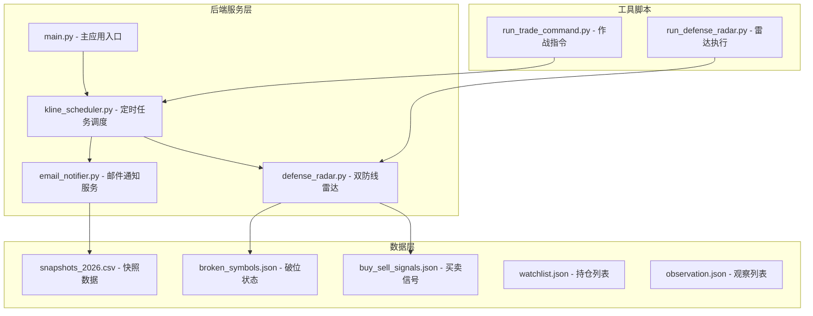
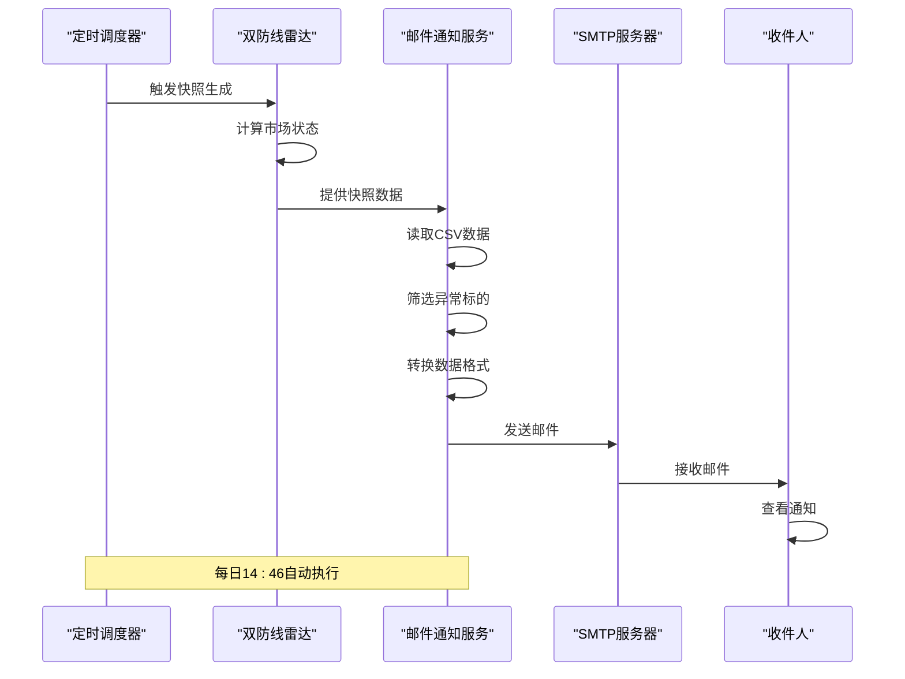
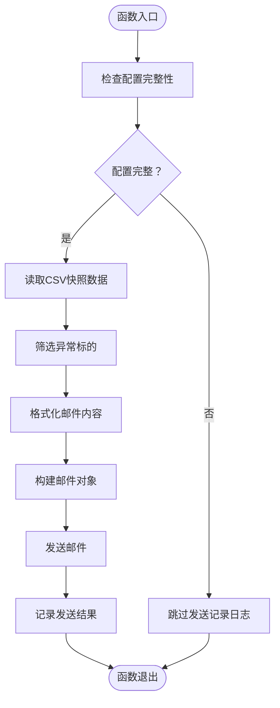
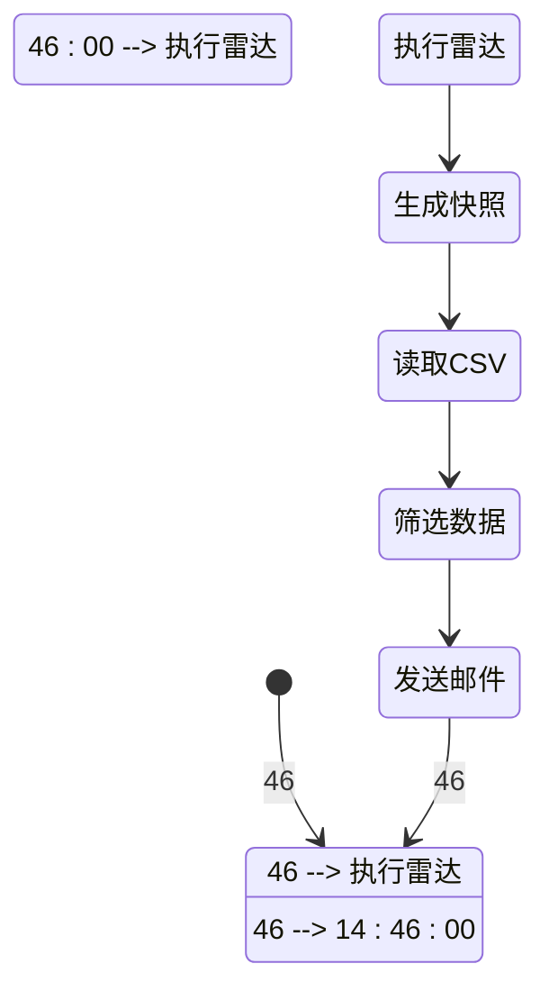
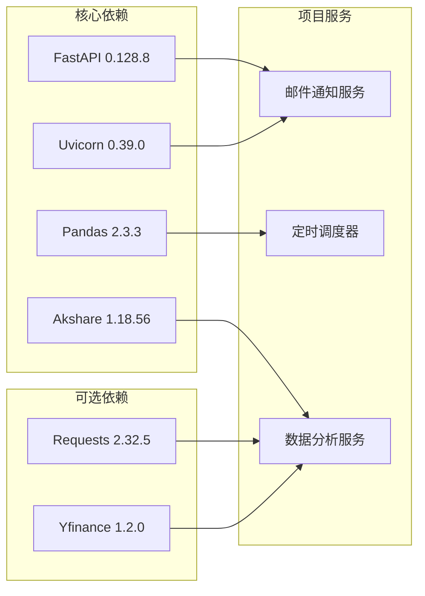
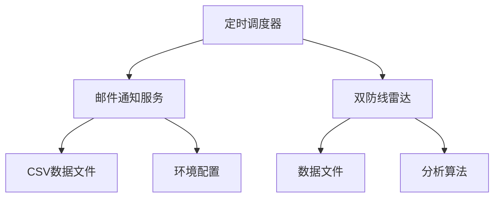

# 邮件通知服务

<cite>
**本文档引用的文件**
- [email_notifier.py](file://backend/services/email_notifier.py)
- [kline_scheduler.py](file://backend/services/kline_scheduler.py)
- [snapshots_2026.csv](file://logs/snapshots_2026.csv)
- [run_defense_radar.py](file://backend/run_defense_radar.py)
- [run_trade_command.py](file://backend/run_trade_command.py)
- [requirements.txt](file://backend/requirements.txt)
- [main.py](file://backend/main.py)
- [defense_radar.py](file://backend/services/defense_radar.py)
- [broken_symbols.json](file://logs/defense_radar/broken_symbols.json)
- [buy_sell_signals.json](file://logs/defense_radar/buy_sell_signals.json)
- [watchlist.json](file://backend/data/watchlist.json)
- [observation.json](file://backend/data/observation.json)
</cite>

## 目录
1. [简介](#简介)
2. [项目结构](#项目结构)
3. [核心组件](#核心组件)
4. [架构概览](#架构概览)
5. [详细组件分析](#详细组件分析)
6. [依赖关系分析](#依赖关系分析)
7. [性能考虑](#性能考虑)
8. [故障排除指南](#故障排除指南)
9. [结论](#结论)

## 简介

邮件通知服务是金融分析系统中的重要组成部分，负责在每日14:46收盘后发送快照异动提醒邮件。该服务基于Python开发，采用SMTP协议进行邮件传输，能够自动读取最新的市场快照数据，筛选出具有异常交易行为的标的，并以简洁明了的方式发送给指定的收件人。

该服务的核心功能包括：
- 自动读取CSV格式的市场快照数据
- 筛选非"持仓"和"观望"状态的异常标的
- 将交易动作转换为简化的字母标识
- 通过SMTP协议发送邮件通知
- 支持多种邮件服务商配置

## 项目结构

该项目采用模块化设计，主要分为以下几个层次：

**图表来源**
- [main.py:1-607](file://backend/main.py#L1-607)
- [kline_scheduler.py:1-518](file://backend/services/kline_scheduler.py#L1-518)
- [email_notifier.py:1-192](file://backend/services/email_notifier.py#L1-192)

**章节来源**
- [main.py:1-607](file://backend/main.py#L1-607)
- [requirements.txt:1-8](file://backend/requirements.txt#L1-8)

## 核心组件

### 邮件通知服务核心功能

邮件通知服务的核心功能围绕着`send_snapshot_alert`函数展开，该函数负责完整的邮件发送流程：

1. **配置验证**：检查必要的环境变量是否已正确设置
2. **数据读取**：从CSV文件中读取最新的市场快照数据
3. **数据筛选**：过滤掉"持仓"和"观望"状态的标的
4. **数据转换**：将复杂的交易动作转换为简化的字母标识
5. **邮件发送**：通过SMTP协议发送邮件通知

### 关键配置参数

服务支持以下环境变量配置：

| 环境变量 | 默认值 | 描述 |
|---------|--------|------|
| EMAIL_SENDER | 必填 | 发件人邮箱地址 |
| EMAIL_PASSWORD | 必填 | 邮箱授权码（非登录密码） |
| EMAIL_RECIPIENT | 必填 | 收件人邮箱地址 |
| EMAIL_SMTP_HOST | smtp.qq.com | SMTP服务器地址 |
| EMAIL_SMTP_PORT | 465 | SMTP服务器端口 |

### 数据处理流程

服务采用CSV文件作为数据源，主要处理以下字段：

- **时间**：记录数据生成的时间戳
- **实际交易动作**：标的的当前交易状态
- **代码**：股票或ETF的代码
- **名称**：标的的名称

**章节来源**
- [email_notifier.py:1-192](file://backend/services/email_notifier.py#L1-192)

## 架构概览

邮件通知服务在整个系统架构中扮演着关键的通信角色，它与多个组件协同工作：

**图表来源**
- [kline_scheduler.py:360-367](file://backend/services/kline_scheduler.py#L360-367)
- [email_notifier.py:125-192](file://backend/services/email_notifier.py#L125-192)

### 系统集成点

邮件通知服务与以下系统组件紧密集成：

1. **定时调度器**：在每天14:46自动触发
2. **双防线雷达**：提供市场状态分析结果
3. **CSV数据存储**：存储快照数据
4. **SMTP服务**：负责邮件传输

**章节来源**
- [kline_scheduler.py:360-367](file://backend/services/kline_scheduler.py#L360-367)

## 详细组件分析

### 邮件通知服务实现

#### 核心函数分析

**图表来源**
- [email_notifier.py:125-192](file://backend/services/email_notifier.py#L125-192)

#### 数据处理算法

服务实现了高效的CSV数据处理算法：

1. **时间戳识别**：自动识别CSV文件中的最新时间戳
2. **数据筛选**：过滤掉不需要的通知类型
3. **格式转换**：将复杂的状态信息转换为简化的标识符

#### 错误处理机制

服务具备完善的错误处理能力：

- **配置错误**：优雅地跳过发送并记录警告
- **文件读取错误**：捕获异常并记录详细信息
- **网络传输错误**：处理SMTP连接和认证问题

**章节来源**
- [email_notifier.py:1-192](file://backend/services/email_notifier.py#L1-192)

### 定时调度集成

#### 执行时机控制

邮件通知服务在系统中的执行时机经过精心设计：

**图表来源**
- [kline_scheduler.py:360-367](file://backend/services/kline_scheduler.py#L360-367)

#### 调度器集成细节

调度器在14:46槽位执行时，会自动触发邮件通知：

1. **时间检测**：检查当前时间是否为14:46
2. **数据准备**：确保快照数据已生成
3. **邮件发送**：调用邮件通知服务
4. **异常处理**：即使邮件发送失败也不影响其他任务

**章节来源**
- [kline_scheduler.py:360-367](file://backend/services/kline_scheduler.py#L360-367)

### 数据源分析

#### CSV文件结构

快照数据采用标准的CSV格式，包含以下关键字段：

| 字段名 | 类型 | 描述 |
|--------|------|------|
| 时间 | 字符串 | 数据生成时间戳 |
| 实际交易动作 | 字符串 | 标的的当前交易状态 |
| 代码 | 字符串 | 标的代码 |
| 名称 | 字符串 | 标的名称 |
| 现价 | 数值 | 当前价格 |
| 其他指标 | 多个数值字段 | 技术分析指标 |

#### 数据质量保证

服务具备以下数据质量保证机制：

- **时间戳验证**：确保读取到最新批次的数据
- **字段完整性检查**：验证必需字段的存在性
- **数据格式标准化**：统一处理不同格式的数据

**章节来源**
- [snapshots_2026.csv:1-200](file://logs/snapshots_2026.csv#L1-200)

## 依赖关系分析

### 外部依赖

项目对外部依赖进行了严格的版本控制：

**图表来源**
- [requirements.txt:1-8](file://backend/requirements.txt#L1-8)

### 内部模块依赖

服务之间的依赖关系清晰明确：

**图表来源**
- [email_notifier.py:1-192](file://backend/services/email_notifier.py#L1-192)
- [kline_scheduler.py:1-518](file://backend/services/kline_scheduler.py#L1-518)

**章节来源**
- [requirements.txt:1-8](file://backend/requirements.txt#L1-8)

## 性能考虑

### 内存使用优化

邮件通知服务在设计时充分考虑了内存使用效率：

- **流式处理**：CSV文件采用逐行读取方式，避免一次性加载整个文件
- **数据缓存**：只保留必要的数据结构，及时释放不需要的内存
- **批量处理**：对于大量数据采用分批处理策略

### 网络性能优化

SMTP连接采用了多项优化措施：

- **连接复用**：在单次执行中复用SMTP连接
- **超时控制**：设置合理的网络超时时间
- **重试机制**：在网络不稳定时自动重试

### 并发处理能力

服务支持多线程环境下的并发执行：

- **线程安全**：所有共享资源都进行了适当的同步保护
- **异步处理**：在可能的情况下使用异步I/O操作
- **资源管理**：确保网络连接和文件句柄得到正确管理

## 故障排除指南

### 常见配置问题

#### SMTP认证失败

**症状**：邮件发送过程中出现认证错误

**解决方案**：
1. 验证邮箱授权码的正确性
2. 检查SMTP服务器地址和端口配置
3. 确认邮箱服务商支持SMTP服务

#### 邮件发送超时

**症状**：邮件发送过程长时间无响应

**解决方案**：
1. 检查网络连接状态
2. 调整SMTP超时参数
3. 验证防火墙设置

### 数据处理问题

#### CSV文件读取失败

**症状**：无法读取快照数据文件

**解决方案**：
1. 检查文件路径和权限
2. 验证CSV文件格式的完整性
3. 确认文件编码格式为UTF-8-SIG

#### 数据筛选异常

**症状**：邮件内容不符合预期

**解决方案**：
1. 检查交易动作字段的值
2. 验证数据过滤逻辑
3. 确认字符编码处理

### 系统集成问题

#### 调度器执行失败

**症状**：邮件通知服务未按预期执行

**解决方案**：
1. 检查定时调度器的日志
2. 验证快照数据的生成状态
3. 确认环境变量配置正确

**章节来源**
- [email_notifier.py:180-191](file://backend/services/email_notifier.py#L180-191)
- [kline_scheduler.py:360-367](file://backend/services/kline_scheduler.py#L360-367)

## 结论

邮件通知服务作为金融分析系统的重要组成部分，展现了良好的设计原则和实现质量。该服务通过以下特点确保了系统的稳定性和可靠性：

1. **模块化设计**：清晰的功能分离和职责划分
2. **健壮的错误处理**：完善的异常处理和恢复机制
3. **高效的性能表现**：优化的内存使用和网络通信
4. **灵活的配置管理**：支持多种部署场景和环境需求

该服务的成功实施为整个金融分析系统提供了重要的通信保障，确保了关键市场信息能够及时准确地传达给相关人员。通过持续的监控和维护，该服务将继续为系统的稳定运行提供可靠支持。