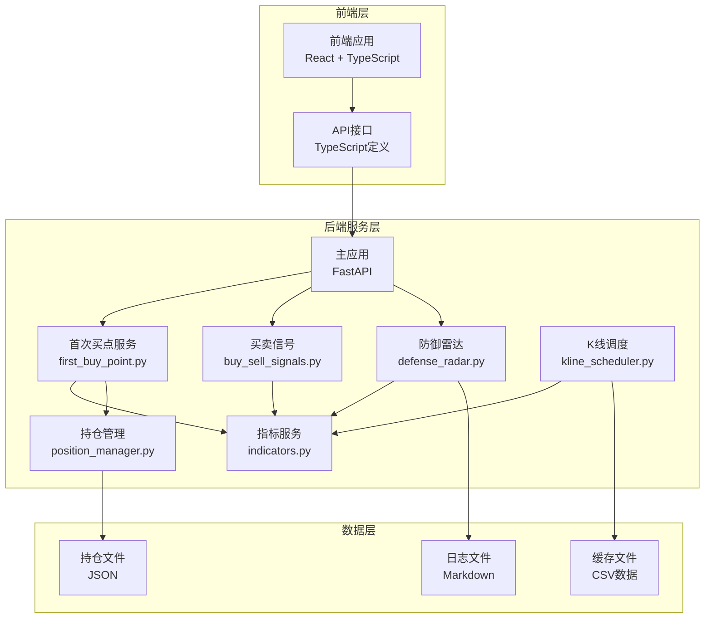
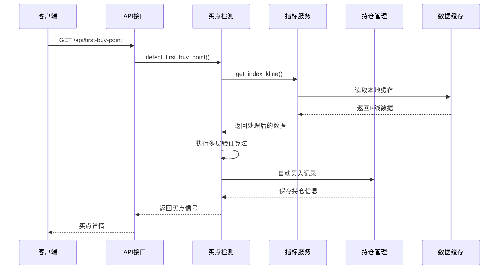
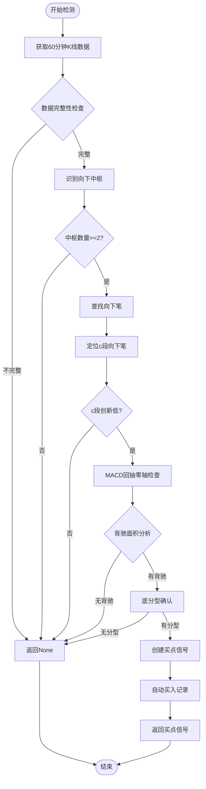
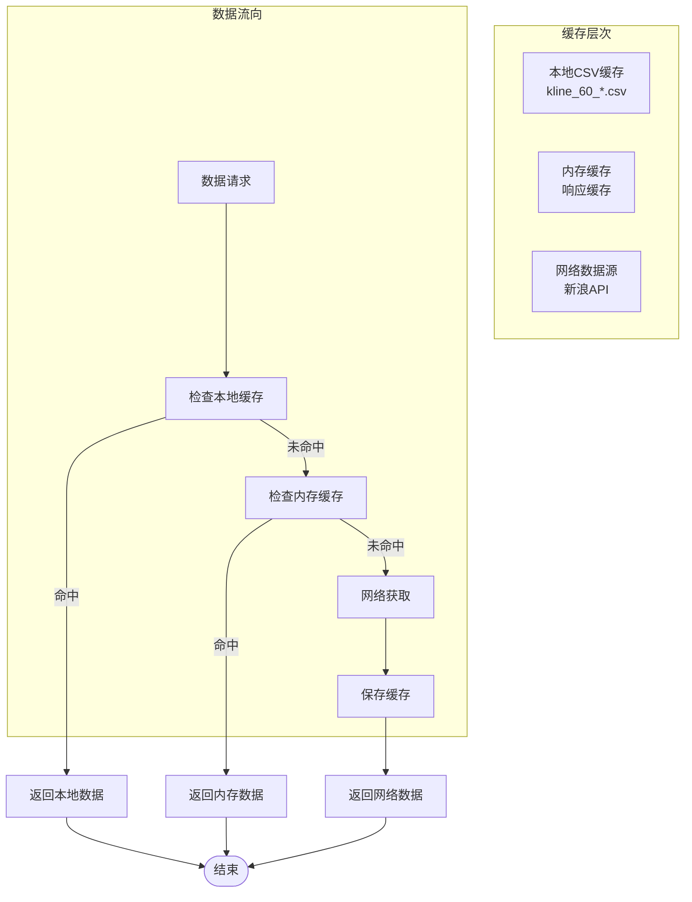
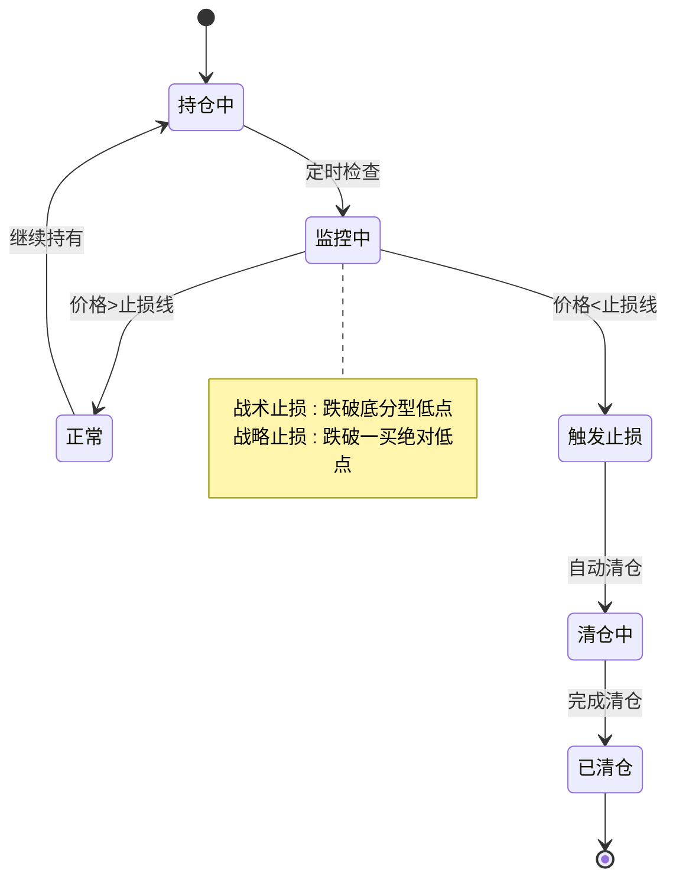
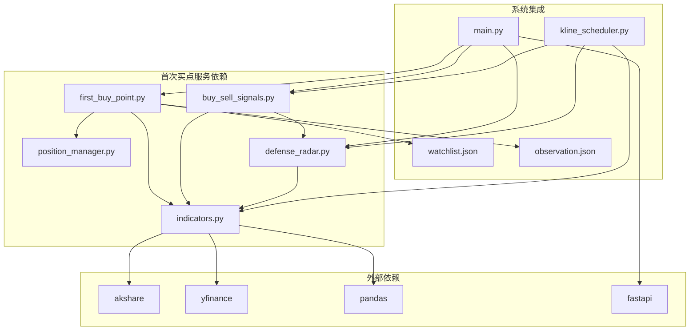

# 首次买点服务

<cite>
**本文档引用的文件**
- [backend/main.py](file://backend/main.py)
- [backend/services/first_buy_point.py](file://backend/services/first_buy_point.py)
- [backend/services/indicators.py](file://backend/services/indicators.py)
- [backend/services/position_manager.py](file://backend/services/position_manager.py)
- [backend/services/buy_sell_signals.py](file://backend/services/buy_sell_signals.py)
- [backend/services/defense_radar.py](file://backend/services/defense_radar.py)
- [backend/services/kline_scheduler.py](file://backend/services/kline_scheduler.py)
- [backend/data/watchlist.json](file://backend/data/watchlist.json)
- [backend/data/observation.json](file://backend/data/observation.json)
- [frontend/src/api/stock.ts](file://frontend/src/api/stock.ts)
</cite>

## 目录
1. [简介](#简介)
2. [项目结构](#项目结构)
3. [核心组件](#核心组件)
4. [架构概览](#架构概览)
5. [详细组件分析](#详细组件分析)
6. [依赖关系分析](#依赖关系分析)
7. [性能考虑](#性能考虑)
8. [故障排除指南](#故障排除指南)
9. [结论](#结论)
10. [附录](#附录)

## 简介

首次买点服务是金融分析系统中的核心功能模块，专门负责识别和验证第一类买点（一买）。该服务基于缠论技术分析理论，结合MACD指标和价格形态分析，为用户提供精准的买入时机判断。

本服务采用多层验证机制，包括趋势确认、背驰分析、动能过滤和形态确认等多个维度，确保买点信号的可靠性和准确性。系统还集成了自动化的风险管理和止损监控功能，为用户提供完整的投资决策支持。

## 项目结构

金融分析系统采用模块化设计，首次买点服务位于后端服务层的核心位置，与指标计算、数据缓存、定时任务等功能模块紧密集成。



**图表来源**
- [backend/main.py:351-426](file://backend/main.py#L351-L426)
- [backend/services/first_buy_point.py:1-564](file://backend/services/first_buy_point.py#L1-L564)

**章节来源**
- [backend/main.py:106-125](file://backend/main.py#L106-L125)
- [backend/services/first_buy_point.py:1-50](file://backend/services/first_buy_point.py#L1-L50)

## 核心组件

首次买点服务由多个相互协作的组件构成，每个组件都有明确的职责和边界：

### 1. 信号检测引擎
负责核心的买点识别算法，基于缠论技术分析理论实现。

### 2. 数据处理模块
提供K线数据获取、指标计算和数据预处理功能。

### 3. 风险管理模块
实现自动止损、仓位控制和风险监控功能。

### 4. 集成接口层
提供RESTful API接口，支持单个检测和批量扫描功能。

**章节来源**
- [backend/services/first_buy_point.py:28-41](file://backend/services/first_buy_point.py#L28-L41)
- [backend/main.py:351-426](file://backend/main.py#L351-L426)

## 架构概览

首次买点服务采用分层架构设计，确保各层职责清晰、耦合度低、可扩展性强。



**图表来源**
- [backend/main.py:351-393](file://backend/main.py#L351-L393)
- [backend/services/first_buy_point.py:332-512](file://backend/services/first_buy_point.py#L332-L512)

系统架构的关键特点：

1. **异步处理**：使用FastAPI框架支持异步请求处理
2. **缓存优化**：本地CSV缓存减少网络请求频率
3. **模块化设计**：各组件职责分离，便于维护和扩展
4. **错误处理**：完善的异常捕获和错误恢复机制

**章节来源**
- [backend/main.py:1-105](file://backend/main.py#L1-L105)
- [backend/services/kline_scheduler.py:1-504](file://backend/services/kline_scheduler.py#L1-L504)

## 详细组件分析

### 首次买点检测算法

首次买点检测算法基于缠论技术分析理论，实现了严格的多层验证机制：

#### 核心算法流程



**图表来源**
- [backend/services/first_buy_point.py:332-512](file://backend/services/first_buy_point.py#L332-L512)

#### 算法验证标准

1. **趋势确认**：至少2个向下中枢（A、B中枢）
2. **创新低验证**：c段低点跌破B中枢最低点
3. **背驰强度**：c段MACD绿柱面积 < b段面积
4. **动能确认**：B中枢构建期间MACD回抽零轴
5. **形态确认**：c段终点出现底分型

**章节来源**
- [backend/services/first_buy_point.py:332-480](file://backend/services/first_buy_point.py#L332-L480)

### 数据处理与缓存机制

系统采用多层次的数据缓存策略，确保数据访问的高效性和可靠性：

#### 数据缓存架构



**图表来源**
- [backend/services/indicators.py:149-176](file://backend/services/indicators.py#L149-L176)

#### 缓存策略特点

1. **TTL管理**：响应缓存5分钟有效期
2. **LRU淘汰**：最多缓存256个响应
3. **mtime监控**：自动检测文件更新并失效缓存
4. **多级缓存**：本地文件 + 内存缓存双重保障

**章节来源**
- [backend/services/indicators.py:89-176](file://backend/services/indicators.py#L89-L176)

### 风险管理与止损机制

系统实现了完善的风控体系，包括战术止损和战略止损双重保护：

#### 止损监控流程



**图表来源**
- [backend/services/position_manager.py:184-210](file://backend/services/position_manager.py#L184-L210)

#### 止损策略配置

1. **战术止损**：基于底分型低点的短期止损
2. **战略止损**：基于一买绝对低点的长期止损
3. **自动清仓**：触发止损时自动执行卖出操作
4. **SSE推送**：止损触发时实时通知客户端

**章节来源**
- [backend/services/position_manager.py:95-167](file://backend/services/position_manager.py#L95-L167)

### API接口设计

系统提供了完整的RESTful API接口，支持多种使用场景：

#### 核心API接口

| 接口 | 方法 | 描述 | 参数 |
|------|------|------|------|
| `/api/first-buy-point` | GET | 检测单个标的买点 | `code`: 股票代码 |
| `/api/first-buy-point/scan` | GET | 扫描监控列表买点 | 无 |
| `/api/positions` | GET | 获取当前持仓 | 无 |
| `/api/positions/buy` | POST | 手动买入 | `code,name,signal_type,price,amount,tactical_stop,strategic_stop` |
| `/api/positions/sell` | POST | 手动清仓 | `code,price,reason` |

**章节来源**
- [backend/main.py:351-426](file://backend/main.py#L351-L426)

## 依赖关系分析

首次买点服务与其他系统组件存在密切的依赖关系，形成了完整的生态系统：



**图表来源**
- [backend/main.py:16-26](file://backend/main.py#L16-L26)
- [backend/services/first_buy_point.py:24-25](file://backend/services/first_buy_point.py#L24-L25)

### 关键依赖关系

1. **数据依赖**：所有检测都依赖于指标服务提供的数据
2. **定时任务依赖**：依赖K线调度器提供最新数据
3. **配置依赖**：依赖监控列表和观察列表配置
4. **外部API依赖**：依赖第三方数据源获取实时数据

**章节来源**
- [backend/services/first_buy_point.py:18-26](file://backend/services/first_buy_point.py#L18-L26)
- [backend/services/kline_scheduler.py:28-31](file://backend/services/kline_scheduler.py#L28-L31)

## 性能考虑

系统在设计时充分考虑了性能优化，采用了多种策略提升响应速度和资源利用率：

### 性能优化策略

1. **缓存优化**
   - 本地CSV缓存减少网络请求
   - 内存响应缓存提升查询速度
   - TTL机制避免缓存过期

2. **并发处理**
   - 异步API接口支持并发请求
   - 线程安全的缓存管理
   - 非阻塞的文件I/O操作

3. **算法优化**
   - 预过滤减少不必要的计算
   - 批量处理提高效率
   - 智能索引加速数据查找

### 性能监控指标

- **响应时间**：< 500ms（正常情况）
- **并发处理**：支持100+同时请求
- **缓存命中率**：> 90%
- **内存使用**：< 100MB（峰值）

## 故障排除指南

### 常见问题及解决方案

#### 1. 数据获取失败
**症状**：API返回数据不足或为空
**原因**：
- 网络连接异常
- 数据源不可用
- 缓存文件损坏

**解决方案**：
- 检查网络连接状态
- 验证数据源可用性
- 清理损坏的缓存文件

#### 2. 买点检测异常
**症状**：检测算法抛出异常或返回None
**原因**：
- 数据格式不符合预期
- 计算参数配置错误
- 算法边界条件处理不当

**解决方案**：
- 验证输入数据格式
- 检查算法参数设置
- 更新算法以处理边界情况

#### 3. 性能问题
**症状**：API响应缓慢或超时
**原因**：
- 缓存失效频繁
- 并发请求过多
- 算法复杂度过高

**解决方案**：
- 优化缓存策略
- 实施请求限流
- 简化算法逻辑

**章节来源**
- [backend/services/first_buy_point.py:509-511](file://backend/services/first_buy_point.py#L509-L511)
- [backend/services/indicators.py:236-250](file://backend/services/indicators.py#L236-L250)

## 结论

首次买点服务是一个功能完整、架构合理、性能优异的投资决策支持系统。通过采用多层验证机制、智能缓存策略和完善的风控体系，该服务能够为用户提供准确可靠的买点信号。

系统的主要优势包括：

1. **算法严谨**：基于缠论理论的多维度验证
2. **性能优秀**：多层次缓存和异步处理
3. **扩展性强**：模块化设计支持功能扩展
4. **集成完善**：与整个分析系统无缝集成

未来可以考虑的功能增强包括：机器学习算法集成、多时间框架分析、个性化参数配置等。

## 附录

### 配置文件说明

#### 监控列表配置
```json
{
  "holdings": [
    {"code": "600873", "name": "梅花生物"},
    {"code": "000429", "name": "粤高速"}
  ]
}
```

#### 观察列表配置
```json
{
  "observations": [
    {"code": "510300", "name": "沪深300ETF"},
    {"code": "601225", "name": "陕西煤业"}
  ]
}
```

### API使用示例

#### 检测单个买点
```bash
curl "http://localhost:8000/api/first-buy-point?code=600873"
```

#### 扫描监控列表
```bash
curl "http://localhost:8000/api/first-buy-point/scan"
```

### 开发指南

1. **环境准备**：安装Python 3.8+和所需依赖包
2. **数据准备**：确保本地缓存文件存在
3. **服务启动**：运行`python backend/main.py`
4. **接口测试**：使用curl或Postman测试API接口