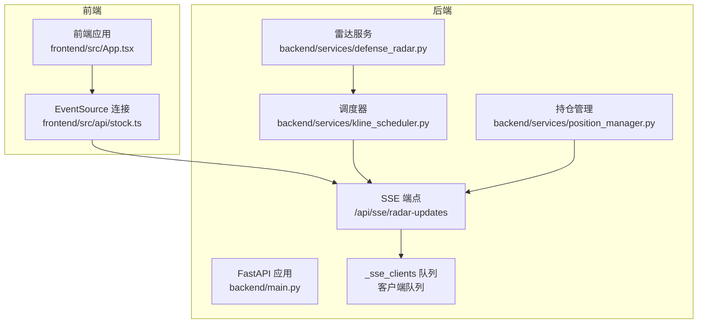
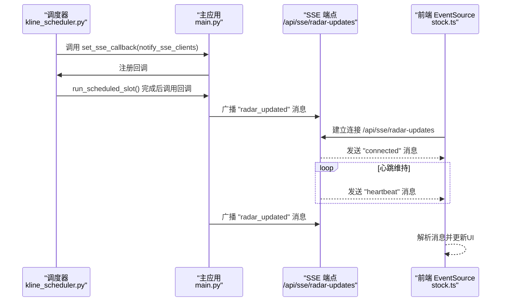
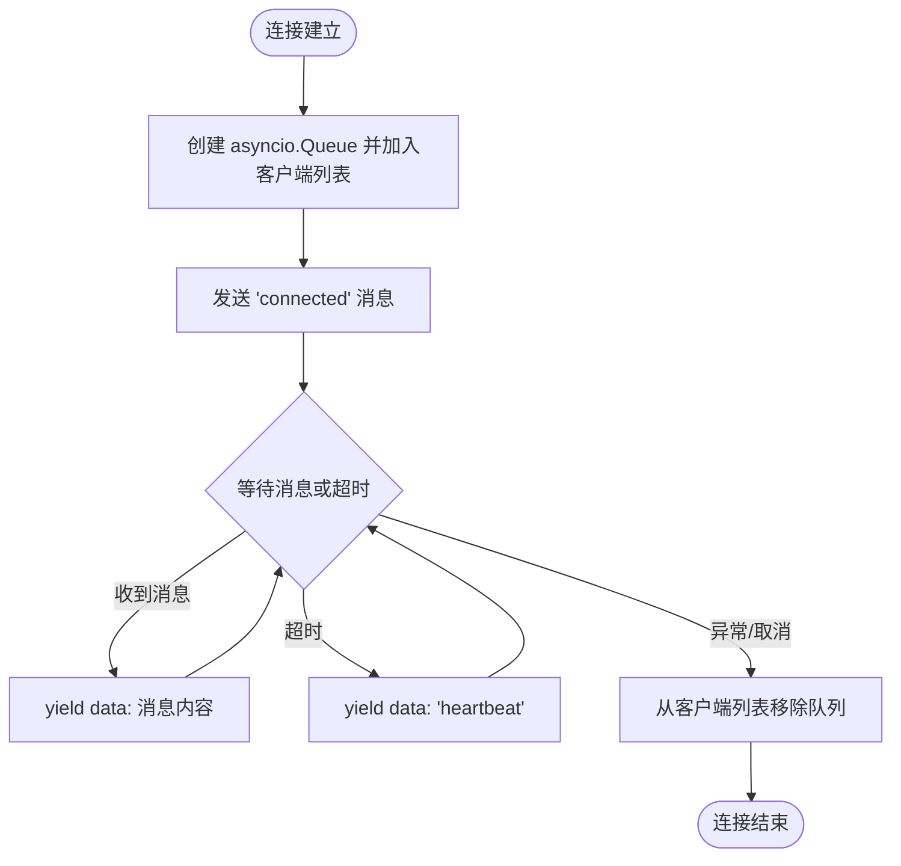
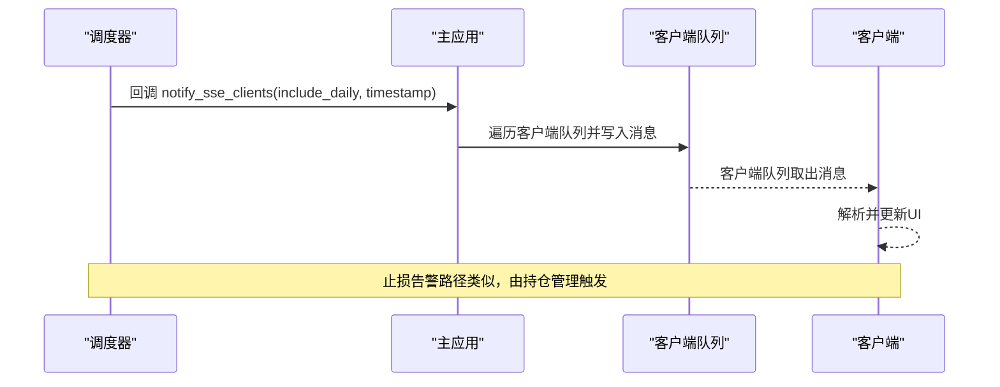
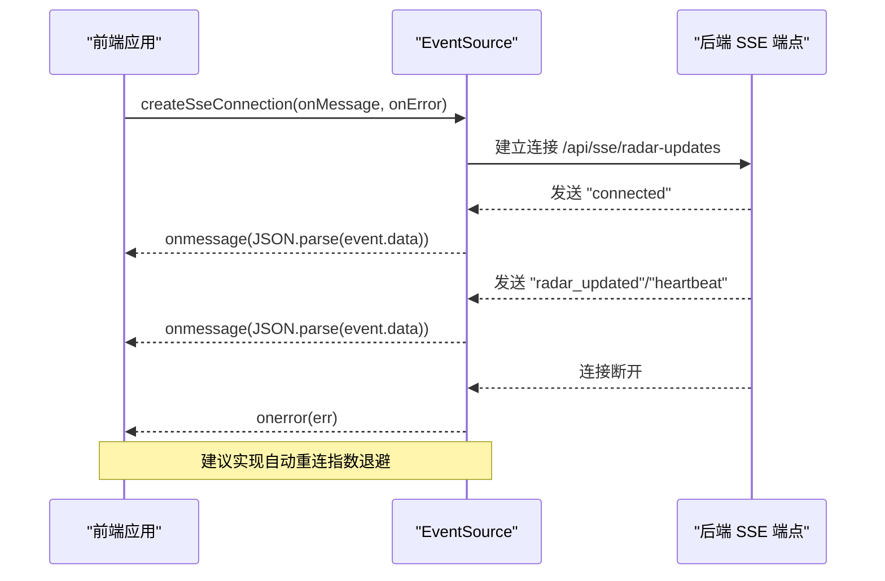
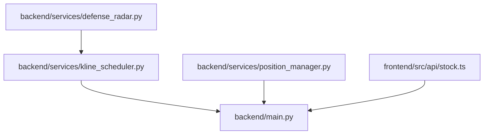

# 实时推送系统

<cite>
**本文档引用的文件**
- [backend/main.py](file://backend/main.py)
- [frontend/src/api/stock.ts](file://frontend/src/api/stock.ts)
- [backend/services/kline_scheduler.py](file://backend/services/kline_scheduler.py)
- [backend/services/position_manager.py](file://backend/services/position_manager.py)
- [backend/services/defense_radar.py](file://backend/services/defense_radar.py)
- [backend/run_defense_radar.py](file://backend/run_defense_radar.py)
- [backend/update_radar.py](file://backend/update_radar.py)
</cite>

## 目录
1. [简介](#简介)
2. [项目结构](#项目结构)
3. [核心组件](#核心组件)
4. [架构总览](#架构总览)
5. [详细组件分析](#详细组件分析)
6. [依赖分析](#依赖分析)
7. [性能考虑](#性能考虑)
8. [故障排查指南](#故障排查指南)
9. [结论](#结论)
10. [附录](#附录)

## 简介
本项目采用基于 Server-Sent Events (SSE) 的实时推送架构，为金融分析前端提供两类实时消息：
- 雷达数据更新通知：当后台定时任务完成一次完整的K线同步与分析后，向所有已连接的客户端广播“雷达数据已更新”消息。
- 止损告警推送：当持仓管理模块检测到某只股票触发止损条件时，自动清仓并向所有客户端推送止损告警消息。

该系统通过 FastAPI 提供 SSE 端点，使用 asyncio 队列实现客户端连接管理与广播机制，并通过后台调度器在固定时间点触发数据更新，确保前端能够及时获得最新市场状态。

## 项目结构
后端采用 FastAPI 构建，SSE 相关逻辑集中在主应用文件中，同时通过服务模块提供调度与业务能力：
- backend/main.py：FastAPI 应用入口，定义 SSE 端点、客户端队列管理、消息广播与应用生命周期钩子。
- backend/services/kline_scheduler.py：后台调度器，负责在固定时间点执行K线同步、雷达分析、止损检查与广播。
- backend/services/position_manager.py：持仓管理与止损监控，触发清仓时通过回调向 SSE 广播告警。
- backend/services/defense_radar.py：双防线雷达计算与摘要生成，为前端提供实时状态数据。
- frontend/src/api/stock.ts：前端 API 层，封装 SSE 连接与消息处理。

图表来源
- [backend/main.py:213-252](file://backend/main.py#L213-L252)
- [backend/services/kline_scheduler.py:95-104](file://backend/services/kline_scheduler.py#L95-L104)
- [backend/services/position_manager.py:22-30](file://backend/services/position_manager.py#L22-L30)
- [frontend/src/api/stock.ts:448-466](file://frontend/src/api/stock.ts#L448-L466)

章节来源
- [backend/main.py:213-252](file://backend/main.py#L213-L252)
- [frontend/src/api/stock.ts:448-466](file://frontend/src/api/stock.ts#L448-L466)

## 核心组件
- SSE 端点与客户端队列
  - 后端维护一个全局的客户端队列列表，每个新连接都会创建一个 asyncio.Queue，并将其加入队列列表。
  - SSE 事件生成器在连接建立时发送“connected”消息，随后持续监听队列消息；若30秒内无消息，则发送“heartbeat”以维持连接。
  - 当连接断开或异常时，清理队列并移除客户端。
- 消息广播
  - 雷达更新广播：调度器在完成一次槽位任务后，调用回调函数向所有客户端广播“radar_updated”消息。
  - 止损告警广播：持仓管理在检测到止损触发并清仓后，调用回调函数向所有客户端广播“stop_loss_triggered”消息。
- 应用生命周期
  - 应用启动时设置 SSE 广播回调与调度器；应用关闭时安全停止调度器。

章节来源
- [backend/main.py:24-71](file://backend/main.py#L24-L71)
- [backend/main.py:213-252](file://backend/main.py#L213-L252)
- [backend/services/kline_scheduler.py:95-104](file://backend/services/kline_scheduler.py#L95-L104)
- [backend/services/position_manager.py:22-30](file://backend/services/position_manager.py#L22-L30)

## 架构总览
SSE 实时推送系统由以下关键路径构成：
- 定时任务触发：调度器在固定时间点执行 K 线同步、雷达分析、止损检查与状态写盘。
- 广播触发：调度完成后通过回调函数向 SSE 客户端广播“radar_updated”消息。
- 客户端连接：前端通过 EventSource 建立到 SSE 端点的连接，接收“connected”、“radar_updated”和“heartbeat”消息。
- 止损告警：持仓管理在检测到止损后，调用回调函数广播“stop_loss_triggered”消息。

图表来源
- [backend/services/kline_scheduler.py:249-256](file://backend/services/kline_scheduler.py#L249-L256)
- [backend/main.py:28-38](file://backend/main.py#L28-L38)
- [backend/main.py:213-252](file://backend/main.py#L213-L252)
- [frontend/src/api/stock.ts:448-466](file://frontend/src/api/stock.ts#L448-L466)

## 详细组件分析

### SSE 端点与客户端队列管理
- 连接建立
  - 每个新连接创建一个 asyncio.Queue，并将队列加入全局客户端列表。
  - 事件生成器在首次迭代时发送“connected”消息，告知客户端连接成功。
- 心跳与断线处理
  - 使用 asyncio.wait_for 等待队列消息，超时则发送“heartbeat”消息以维持连接。
  - 捕获异常与取消错误，确保在连接取消或异常时清理客户端。
- 资源清理
  - 连接断开时从全局客户端列表移除队列，防止内存泄漏。

图表来源
- [backend/main.py:213-252](file://backend/main.py#L213-L252)

章节来源
- [backend/main.py:213-252](file://backend/main.py#L213-L252)

### 消息广播机制
- 雷达更新广播
  - 调度器在完成一次槽位任务后，调用回调函数，构造“radar_updated”消息并调用通用发送函数。
  - 通用发送函数遍历所有客户端队列，异步写入消息；对写入失败的客户端进行清理。
- 止损告警广播
  - 持仓管理在检测到止损并清仓后，构造“stop_loss_triggered”消息并调用通用发送函数。
  - 消息包含股票代码、触发原因、当前价格与时间戳等字段。

图表来源
- [backend/services/kline_scheduler.py:249-256](file://backend/services/kline_scheduler.py#L249-L256)
- [backend/main.py:28-71](file://backend/main.py#L28-L71)

章节来源
- [backend/main.py:28-71](file://backend/main.py#L28-L71)
- [backend/services/kline_scheduler.py:249-256](file://backend/services/kline_scheduler.py#L249-L256)
- [backend/services/position_manager.py:139-145](file://backend/services/position_manager.py#L139-L145)

### 客户端侧 SSE 处理逻辑
- EventSource 连接
  - 前端通过 createSseConnection 创建 EventSource，指向后端 SSE 端点。
  - onmessage 回调解析 event.data 为 JSON 并调用传入的处理函数。
  - 可选的 onError 回调用于处理连接错误。
- 错误处理与重连策略
  - 前端未实现自动重连逻辑；建议在 onError 中实现指数退避重连策略，以提升稳定性。

图表来源
- [frontend/src/api/stock.ts:448-466](file://frontend/src/api/stock.ts#L448-L466)

章节来源
- [frontend/src/api/stock.ts:448-466](file://frontend/src/api/stock.ts#L448-L466)

### 实时消息类型与格式
- 雷达数据更新通知
  - 类型：radar_updated
  - 字段：timestamp（ISO 时间）、include_daily（是否包含日线同步）、message（提示文本）
- 止损告警推送
  - 类型：stop_loss_triggered
  - 字段：code（股票代码）、reason（触发原因）、price（当前价格）、timestamp（告警时间）、message（告警文本）
- 心跳与连接确认
  - 类型：heartbeat、connected
  - 用途：维持连接活性与确认连接建立

章节来源
- [backend/main.py:32-51](file://backend/main.py#L32-L51)
- [backend/main.py:224-235](file://backend/main.py#L224-L235)

### SSE 连接生命周期管理
- 建立连接：客户端发起连接，后端返回“connected”消息。
- 心跳保持：后端在无消息时发送“heartbeat”，前端保持连接活跃。
- 断线重连：当前前端未实现自动重连，建议在 onError 中实现指数退避重连。
- 资源清理：连接断开或异常时，后端清理客户端队列并移除引用。

章节来源
- [backend/main.py:213-252](file://backend/main.py#L213-L252)
- [frontend/src/api/stock.ts:448-466](file://frontend/src/api/stock.ts#L448-L466)

### 系统状态变更与雷达摘要
- 雷达摘要生成：调度器在完成一次槽位任务后，运行双防线雷达并写入 last_summary.json，供前端读取。
- 前端状态读取：前端通过 GET /api/diagnosis/defense-radar/summary 获取摘要，用于控制标签页显示与状态提示。

章节来源
- [backend/services/kline_scheduler.py:221-240](file://backend/services/kline_scheduler.py#L221-L240)
- [backend/services/defense_radar.py:147-166](file://backend/services/defense_radar.py#L147-L166)
- [frontend/src/api/stock.ts:249-276](file://frontend/src/api/stock.ts#L249-L276)

## 依赖分析
- 组件耦合
  - 主应用与调度器通过回调函数解耦：调度器仅依赖回调接口，主应用负责具体广播实现。
  - 主应用与持仓管理通过回调函数解耦：持仓管理在触发清仓时仅依赖回调接口。
- 外部依赖
  - FastAPI 提供 SSE 端点与生命周期管理。
  - asyncio.Queue 提供线程安全的消息队列。
  - 前端 EventSource 提供标准的 SSE 客户端能力。

图表来源
- [backend/main.py:80-91](file://backend/main.py#L80-L91)
- [backend/services/kline_scheduler.py:95-104](file://backend/services/kline_scheduler.py#L95-L104)
- [backend/services/position_manager.py:22-30](file://backend/services/position_manager.py#L22-L30)

章节来源
- [backend/main.py:80-91](file://backend/main.py#L80-L91)
- [backend/services/kline_scheduler.py:95-104](file://backend/services/kline_scheduler.py#L95-L104)
- [backend/services/position_manager.py:22-30](file://backend/services/position_manager.py#L22-L30)

## 性能考虑
- 并发连接管理
  - 使用 asyncio.Queue 实现线程安全的消息队列，避免锁竞争。
  - 对写入失败的客户端进行清理，减少无效广播。
- 心跳与超时
  - 30秒超时发送心跳，平衡连接活性与资源消耗。
- 广播效率
  - 广播采用异步写入，避免阻塞主线程。
- 前端优化建议
  - 实现指数退避重连，降低频繁重连带来的压力。
  - 对消息进行去重与节流，避免 UI 频繁更新。

## 故障排查指南
- SSE 连接异常
  - 检查后端日志中“SSE 客户端异常”与“SSE: 客户端队列写入失败”的记录。
  - 确认前端 EventSource 是否正确处理 onerror 事件。
- 广播失败
  - 检查回调函数是否正确注册（lifespan 中设置）。
  - 确认调度器是否正常执行槽位任务并调用回调。
- 止损告警未推送
  - 检查持仓管理模块是否正确调用回调函数。
  - 确认回调函数是否正确广播“stop_loss_triggered”消息。

章节来源
- [backend/main.py:54-71](file://backend/main.py#L54-L71)
- [backend/main.py:80-91](file://backend/main.py#L80-L91)
- [backend/services/position_manager.py:139-145](file://backend/services/position_manager.py#L139-L145)

## 结论
本系统通过 FastAPI + asyncio 的 SSE 实现实时推送，具备清晰的组件边界与良好的扩展性。调度器与业务模块通过回调函数解耦，前端通过 EventSource 实现简单可靠的消息订阅。建议后续增强前端自动重连与消息去重机制，进一步提升用户体验与系统稳定性。

## 附录
- 雷达数据更新脚本
  - 后台脚本用于手动触发雷达更新与诊断，便于排障与验证。
- 雷达摘要生成流程
  - 调度器在完成槽位任务后生成摘要并写入 last_summary.json，前端读取以更新 UI。

章节来源
- [backend/run_defense_radar.py:22-26](file://backend/run_defense_radar.py#L22-L26)
- [backend/update_radar.py:9-40](file://backend/update_radar.py#L9-L40)
- [backend/services/kline_scheduler.py:221-240](file://backend/services/kline_scheduler.py#L221-L240)