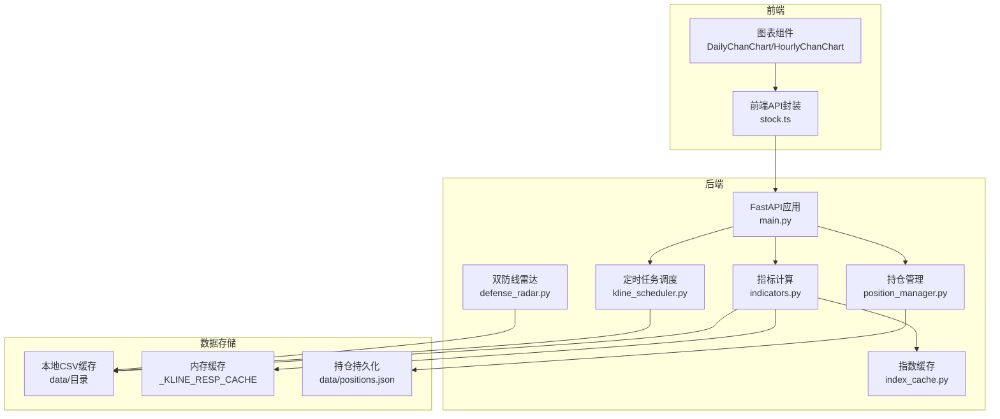
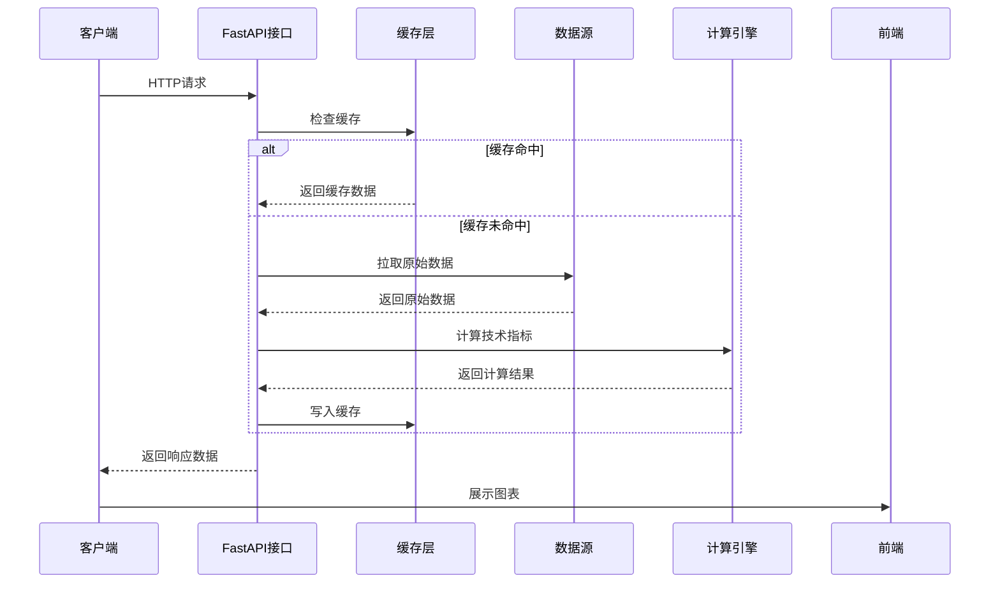
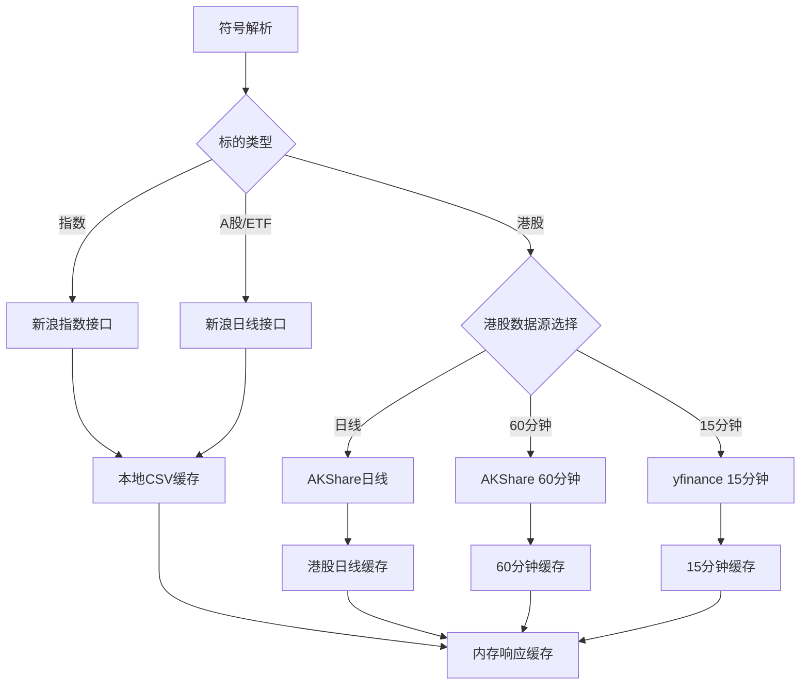
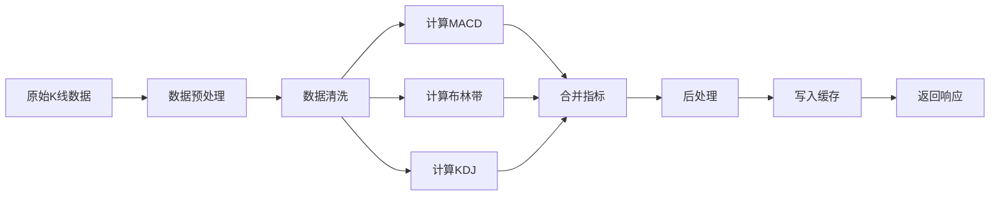
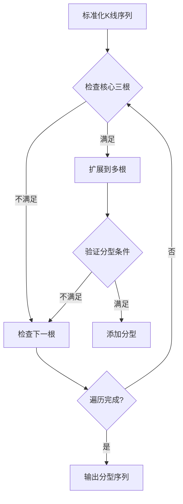
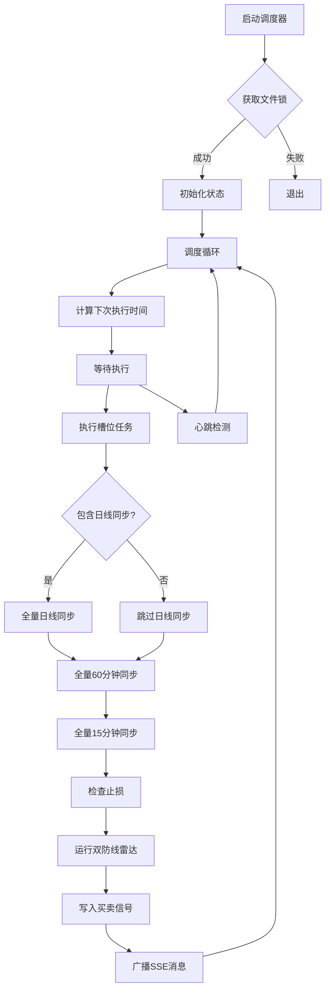
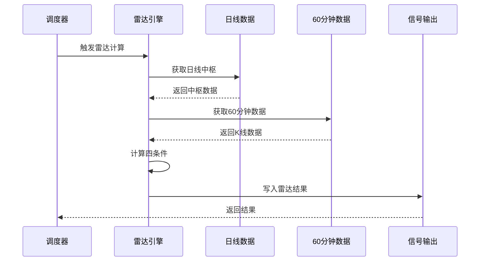
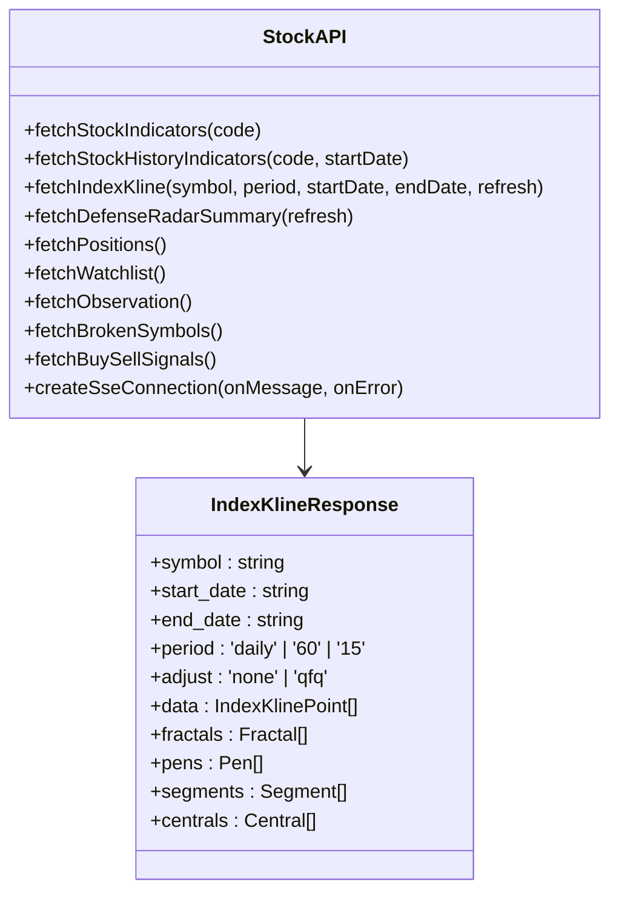
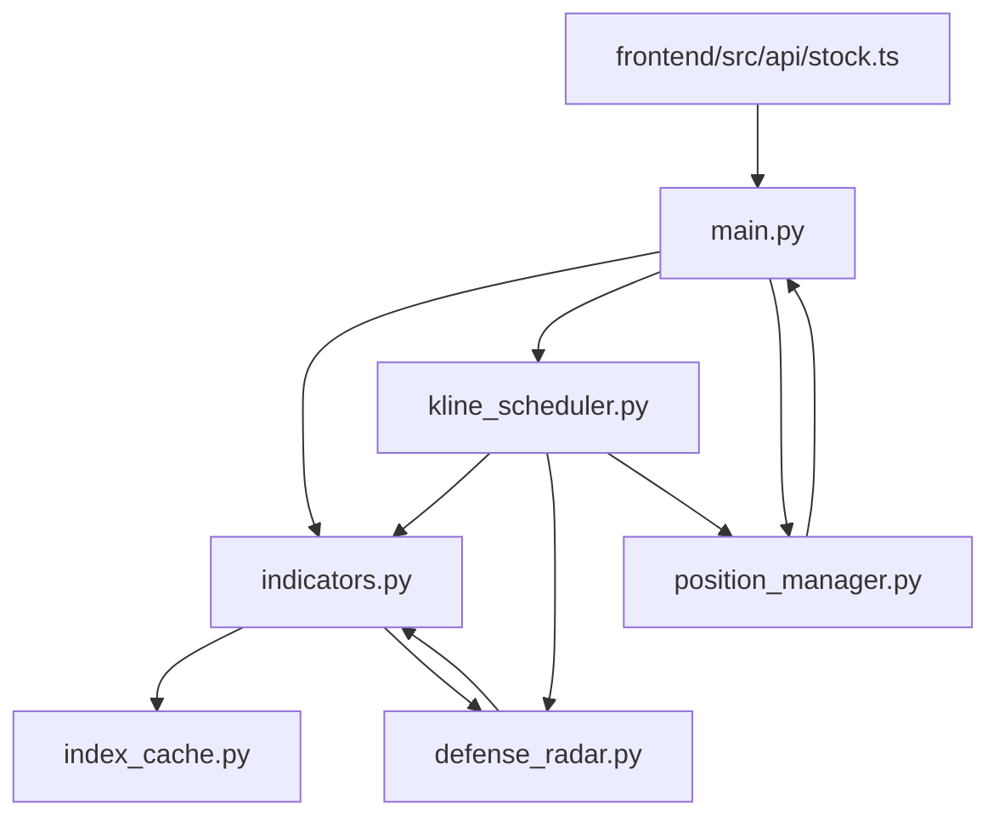

# 数据流设计

<cite>
**本文档引用的文件**
- [backend/main.py](file://backend/main.py)
- [backend/services/kline_scheduler.py](file://backend/services/kline_scheduler.py)
- [backend/services/index_cache.py](file://backend/services/index_cache.py)
- [backend/services/indicators.py](file://backend/services/indicators.py)
- [backend/services/defense_radar.py](file://backend/services/defense_radar.py)
- [backend/services/position_manager.py](file://backend/services/position_manager.py)
- [frontend/src/api/stock.ts](file://frontend/src/api/stock.ts)
- [backend/data/watchlist.json](file://backend/data/watchlist.json)
- [backend/data/observation.json](file://backend/data/observation.json)
- [backend/tests/fixtures/meihua2test/a_daily_qfq_889999.csv](file://backend/tests/fixtures/meihua2test/a_daily_qfq_889999.csv)
- [backend/tests/fixtures/meihua2test/kline_60_889999.csv](file://backend/tests/fixtures/meihua2test/kline_60_889999.csv)
</cite>

## 目录
1. [简介](#简介)
2. [项目结构](#项目结构)
3. [核心组件](#核心组件)
4. [架构总览](#架构总览)
5. [详细组件分析](#详细组件分析)
6. [依赖关系分析](#依赖关系分析)
7. [性能考虑](#性能考虑)
8. [故障排查指南](#故障排查指南)
9. [结论](#结论)

## 简介

本文件为金融分析系统的数据流设计文档，全面描述从外部数据源到最终用户展示的完整数据流程。系统采用 AkShare 作为主要数据源，结合本地缓存、内存缓存和前端展示的多层次架构，实现高效、可靠的数据处理与可视化。

## 项目结构

项目采用前后端分离架构，后端提供 RESTful API 和定时任务，前端负责数据展示和交互。

**图表来源**
- [backend/main.py:1-514](file://backend/main.py#L1-L514)
- [backend/services/kline_scheduler.py:1-492](file://backend/services/kline_scheduler.py#L1-L492)
- [backend/services/indicators.py:1-1947](file://backend/services/indicators.py#L1-L1947)

**章节来源**
- [backend/main.py:1-514](file://backend/main.py#L1-L514)
- [frontend/src/api/stock.ts:1-468](file://frontend/src/api/stock.ts#L1-L468)

## 核心组件

### 后端服务组件

1. **FastAPI 应用层**
   - 提供 RESTful API 接口
   - 管理 SSE 实时推送
   - 生命周期管理（启动/关闭）

2. **定时任务调度器**
   - 周期性数据同步
   - K线数据刷新
   - 雷达计算和信号生成

3. **指标计算引擎**
   - K线数据获取和缓存
   - 技术指标计算（MACD、布林带、KDJ）
   - 缠论分型/笔/线段/中枢分析

4. **数据缓存层**
   - 本地 CSV 文件缓存
   - 内存响应缓存
   - 文件锁去重机制

5. **业务逻辑组件**
   - 双防线雷达分析
   - 持仓管理和止损监控
   - 用户观察列表管理

**章节来源**
- [backend/main.py:110-514](file://backend/main.py#L110-L514)
- [backend/services/kline_scheduler.py:1-492](file://backend/services/kline_scheduler.py#L1-L492)
- [backend/services/indicators.py:1644-1947](file://backend/services/indicators.py#L1644-L1947)

## 架构总览

系统采用分层架构，从底层数据源到顶层展示的完整数据流如下：

**图表来源**
- [backend/services/indicators.py:1644-1947](file://backend/services/indicators.py#L1644-L1947)
- [backend/main.py:110-168](file://backend/main.py#L110-L168)

## 详细组件分析

### K线数据获取与缓存策略

#### 数据源策略

系统针对不同标的采用差异化数据源策略：

**图表来源**
- [backend/services/indicators.py:204-232](file://backend/services/indicators.py#L204-L232)
- [backend/services/index_cache.py:1-201](file://backend/services/index_cache.py#L1-L201)

#### 缓存层次结构

系统采用三层缓存机制：

1. **本地文件缓存**（CSV文件）
   - 日线：`index_daily_*.csv`、`a_daily_qfq_*.csv`、`a_daily_nq_*.csv`、`hk_daily_*.csv`
   - 60分钟：`kline_60_*.csv`
   - 15分钟：`kline_15_*.csv`

2. **内存响应缓存**
   - TTL：300秒
   - 最大容量：256项
   - 按符号+周期维度隔离

3. **本地CSV文件缓存**
   - 严格本地优先策略
   - mtime对比触发缓存失效

**章节来源**
- [backend/services/indicators.py:88-91](file://backend/services/indicators.py#L88-L91)
- [backend/services/indicators.py:121-147](file://backend/services/indicators.py#L121-L147)
- [backend/services/index_cache.py:1-201](file://backend/services/index_cache.py#L1-L201)

### 技术指标计算流程

#### 指标计算管道

**图表来源**
- [backend/services/indicators.py:657-672](file://backend/services/indicators.py#L657-L672)
- [backend/services/indicators.py:1644-1947](file://backend/services/indicators.py#L1644-L1947)

#### 指标计算细节

1. **MACD计算**
   - 短期EMA：12日
   - 长期EMA：26日
   - DEA：9日指数平滑

2. **布林带计算**
   - MA：20日移动平均
   - 标准差：20日标准差
   - 上轨：MA + 2×标准差
   - 下轨：MA - 2×标准差

3. **KDJ计算**
   - 周期：9日
   - K值：RSV的指数平滑
   - D值：K的指数平滑
   - J值：3K - 2D

**章节来源**
- [backend/services/indicators.py:657-689](file://backend/services/indicators.py#L657-L689)

### 缠论分析算法

#### 分型识别算法

**图表来源**
- [backend/services/indicators.py:836-931](file://backend/services/indicators.py#L836-L931)

#### 笔和线段生成

系统实现完整的缠论分析流程：

1. **分型识别**：基于核心三根K线的极值关系
2. **笔生成**：相邻分型交替配对，间隔至少1根K线
3. **线段生成**：连续交替笔的组合，满足价域重叠条件
4. **中枢识别**：三笔端点价域的重叠区间

**章节来源**
- [backend/services/indicators.py:991-1041](file://backend/services/indicators.py#L991-L1041)
- [backend/services/indicators.py:1209-1319](file://backend/services/indicators.py#L1209-L1319)

### 定时任务调度系统

#### 调度策略

**图表来源**
- [backend/services/kline_scheduler.py:286-358](file://backend/services/kline_scheduler.py#L286-L358)
- [backend/services/kline_scheduler.py:448-492](file://backend/services/kline_scheduler.py#L448-L492)

#### 执行槽位配置

系统设置多个执行槽位以平衡数据新鲜度和系统负载：

| 时间 | 包含日线 | 功能 |
|------|----------|------|
| 10:31 | 否 | 全量60分钟同步 + 雷达计算 |
| 11:31 | 否 | 全量60分钟同步 + 雷达计算 |
| 14:01 | 否 | 全量60分钟同步 + 雷达计算 |
| 15:01 | 否 | 全量60分钟同步 + 雷达计算 |
| 16:01 | 是 | 全量日线 + 60分钟 + 雷达计算 |

**章节来源**
- [backend/services/kline_scheduler.py:39-46](file://backend/services/kline_scheduler.py#L39-L46)
- [backend/services/kline_scheduler.py:211-256](file://backend/services/kline_scheduler.py#L211-L256)

### 双防线雷达系统

#### 雷达分析流程

**图表来源**
- [backend/services/defense_radar.py:747-800](file://backend/services/defense_radar.py#L747-L800)

#### 雷达触发条件

系统定义严格的触发条件：

1. **绝对防线条件**：现价在MIN(C-ZD, A-ZD) ±1%缓冲带内
2. **笔向条件**：60分钟有效笔最后一笔向下
3. **动能条件**：MACD柱状图面积递减或绿柱缩短
4. **形态条件**：合并后末三根严格底分型且K3确认

**章节来源**
- [backend/services/defense_radar.py:196-226](file://backend/services/defense_radar.py#L196-L226)
- [backend/services/defense_radar.py:342-376](file://backend/services/defense_radar.py#L342-L376)

### 前端数据展示

#### API接口设计

前端通过统一的API接口获取数据：

**图表来源**
- [frontend/src/api/stock.ts:185-215](file://frontend/src/api/stock.ts#L185-L215)

**章节来源**
- [frontend/src/api/stock.ts:1-468](file://frontend/src/api/stock.ts#L1-L468)

## 依赖关系分析

### 组件依赖图

**图表来源**
- [backend/main.py:14-19](file://backend/main.py#L14-L19)
- [backend/services/indicators.py:17-25](file://backend/services/indicators.py#L17-L25)

### 数据依赖关系

系统的关键数据依赖关系：

1. **数据源依赖**
   - 新浪接口：日线、60分钟、15分钟数据
   - AKShare：港股日线、60分钟数据
   - yfinance：港股15分钟数据

2. **缓存依赖**
   - 本地CSV缓存依赖文件系统
   - 内存缓存依赖进程内存
   - 文件锁依赖操作系统

3. **业务依赖**
   - 雷达系统依赖定时任务调度
   - 指标计算依赖缠论分析
   - 前端展示依赖API接口

**章节来源**
- [backend/services/indicators.py:17-25](file://backend/services/indicators.py#L17-L25)
- [backend/services/kline_scheduler.py:28-31](file://backend/services/kline_scheduler.py#L28-L31)

## 性能考虑

### 缓存优化策略

1. **多级缓存架构**
   - 本地文件缓存：持久化存储，适合大数据量
   - 内存缓存：快速访问，TTL控制
   - 响应缓存：避免重复计算

2. **缓存失效机制**
   - mtime对比：文件修改时间触发失效
   - TTL过期：时间限制确保数据新鲜度
   - 手动清理：支持强制刷新

3. **并发控制**
   - 文件锁：多进程去重
   - 线程安全：内存缓存的线程安全设计
   - 心跳检测：监控调度器健康状态

### 性能监控指标

系统内置性能监控：

- 缓存命中率统计
- 数据处理耗时记录
- 内存使用情况监控
- 网络请求成功率

**章节来源**
- [backend/services/indicators.py:1670-1682](file://backend/services/indicators.py#L1670-L1682)
- [backend/services/kline_scheduler.py:410-445](file://backend/services/kline_scheduler.py#L410-L445)

## 故障排查指南

### 常见问题诊断

#### 数据获取失败

1. **网络连接问题**
   - 检查网络代理设置
   - 验证API接口可达性
   - 查看重试机制是否正常工作

2. **数据格式异常**
   - 检查返回数据结构
   - 验证必需字段完整性
   - 查看数据类型转换

#### 缓存相关问题

1. **缓存不更新**
   - 检查文件mtime变化
   - 验证缓存失效逻辑
   - 查看TTL设置

2. **内存缓存溢出**
   - 监控缓存项数量
   - 检查TTL过期机制
   - 查看清理策略

#### 定时任务问题

1. **任务未执行**
   - 检查文件锁状态
   - 验证调度时间配置
   - 查看心跳检测结果

2. **任务执行失败**
   - 检查异常处理日志
   - 验证重试机制
   - 查看资源占用情况

**章节来源**
- [backend/services/indicators.py:234-248](file://backend/services/indicators.py#L234-L248)
- [backend/services/kline_scheduler.py:375-407](file://backend/services/kline_scheduler.py#L375-L407)

## 结论

本金融分析系统通过分层架构和多级缓存策略，实现了高效、可靠的数据处理流程。系统的主要优势包括：

1. **多层次缓存**：从本地文件到内存缓存的完整缓存体系
2. **智能调度**：基于业务需求的定时任务调度机制
3. **实时监控**：完善的性能监控和故障排查能力
4. **扩展性强**：模块化设计支持功能扩展和性能优化

系统能够满足金融分析场景对数据准确性、实时性和可靠性的严格要求，为用户提供高质量的分析工具和可视化界面。