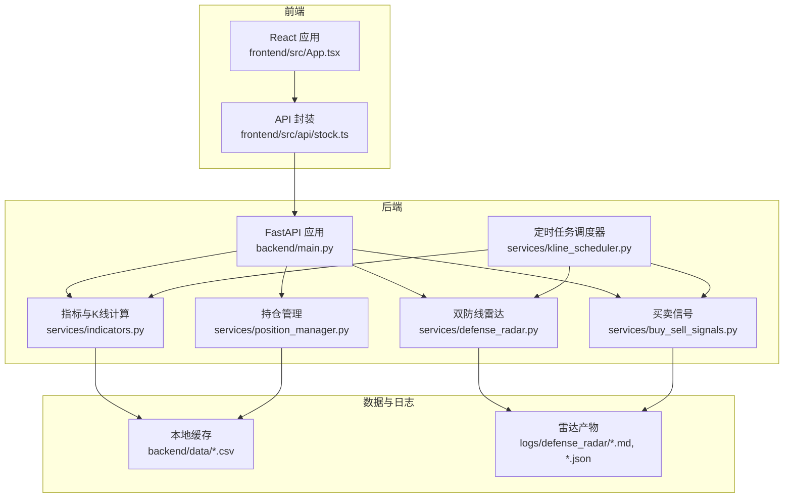
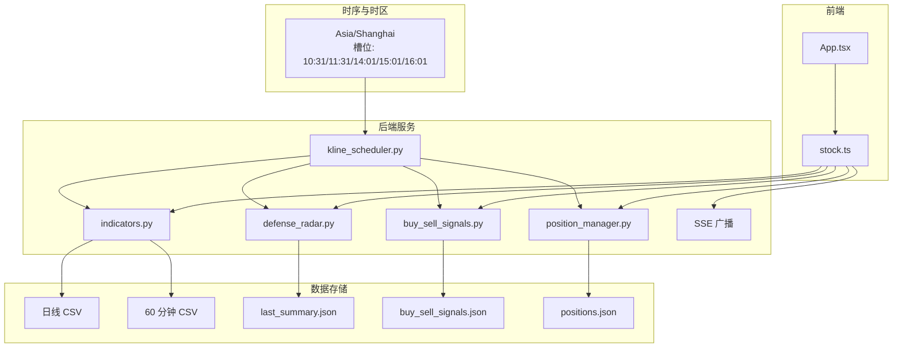
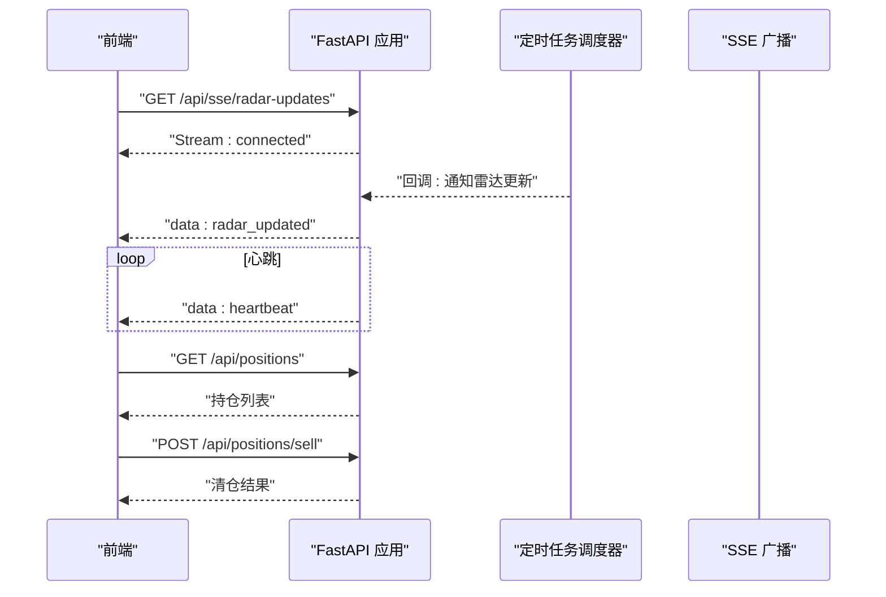
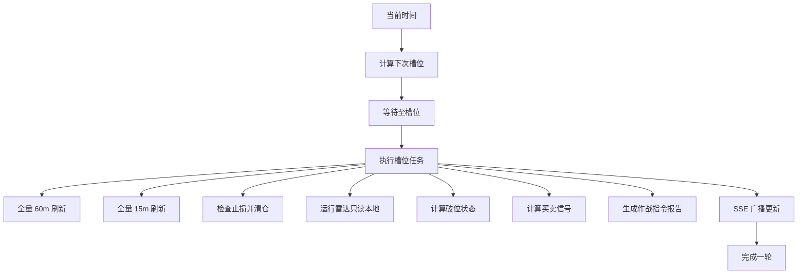
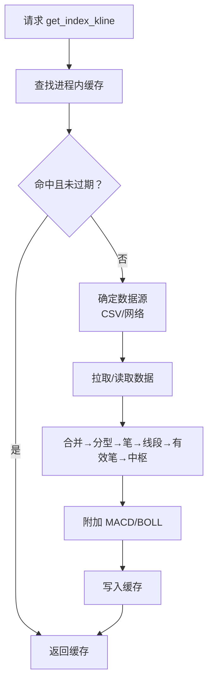
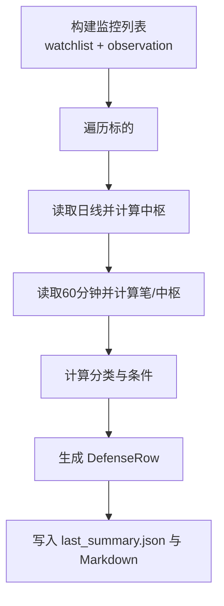
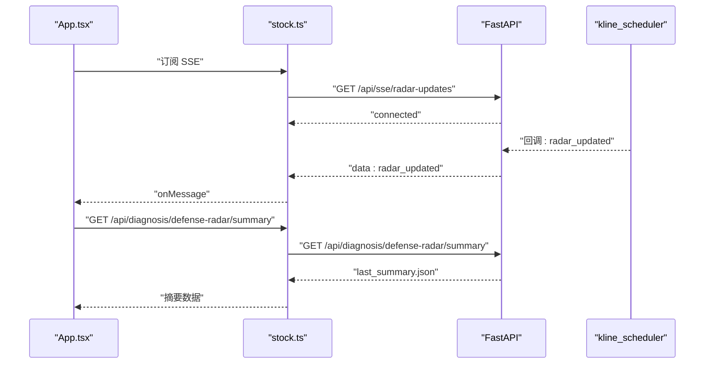
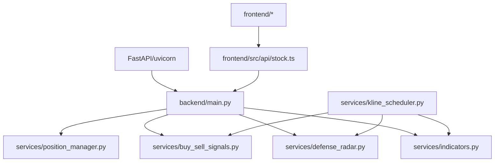

# 架构设计

<cite>
**本文引用的文件**
- [backend/main.py](file://backend/main.py)
- [backend/services/kline_scheduler.py](file://backend/services/kline_scheduler.py)
- [backend/services/indicators.py](file://backend/services/indicators.py)
- [backend/services/defense_radar.py](file://backend/services/defense_radar.py)
- [backend/services/position_manager.py](file://backend/services/position_manager.py)
- [backend/services/buy_sell_signals.py](file://backend/services/buy_sell_signals.py)
- [backend/run_defense_radar.py](file://backend/run_defense_radar.py)
- [backend/run_trade_command.py](file://backend/run_trade_command.py)
- [backend/update_radar.py](file://backend/update_radar.py)
- [backend/update_radar_local.py](file://backend/update_radar_local.py)
- [backend/requirements.txt](file://backend/requirements.txt)
- [frontend/src/api/stock.ts](file://frontend/src/api/stock.ts)
- [frontend/src/App.tsx](file://frontend/src/App.tsx)
- [frontend/package.json](file://frontend/package.json)
- [README.md](file://README.md)
</cite>

## 目录
1. [简介](#简介)
2. [项目结构](#项目结构)
3. [核心组件](#核心组件)
4. [架构总览](#架构总览)
5. [详细组件分析](#详细组件分析)
6. [依赖关系分析](#依赖关系分析)
7. [性能考量](#性能考量)
8. [故障排查指南](#故障排查指南)
9. [结论](#结论)
10. [附录](#附录)

## 简介
本系统是一个前后端分离的金融分析平台，采用微服务化的后端与 React 前端协作，围绕“缠论可视化 + 双防线雷达”两大核心能力构建。后端基于 FastAPI 提供 REST API 与 SSE 实时推送，内置定时任务调度系统，负责本地优先的数据缓存、K 线与缠论计算、雷达与买卖信号的批量计算与落盘，以及持仓止损监控。前端通过 HTTP 与 SSE 与后端交互，实现日 K/60 分钟图、中枢与买卖信号的可视化展示。

## 项目结构
系统采用清晰的前后端分离结构：
- 后端（Python/FastAPI）：提供 REST API、SSE、定时任务与数据处理服务，位于 backend/ 目录。
- 前端（React/TypeScript）：提供可视化界面与交互逻辑，位于 frontend/ 目录。
- 数据与日志：后端在 backend/data/ 与 logs/defense_radar/ 内持久化本地缓存与雷达产物。
- 文档与脚本：README.md 提供整体说明，restart_services.sh 等脚本用于快速启动。

**图表来源**
- [backend/main.py:1-514](file://backend/main.py#L1-L514)
- [backend/services/kline_scheduler.py:1-492](file://backend/services/kline_scheduler.py#L1-L492)
- [backend/services/indicators.py:1-800](file://backend/services/indicators.py#L1-L800)
- [backend/services/defense_radar.py:1-800](file://backend/services/defense_radar.py#L1-L800)
- [backend/services/position_manager.py:1-210](file://backend/services/position_manager.py#L1-L210)
- [backend/services/buy_sell_signals.py:1-800](file://backend/services/buy_sell_signals.py#L1-L800)
- [frontend/src/App.tsx:1-800](file://frontend/src/App.tsx#L1-L800)
- [frontend/src/api/stock.ts:1-468](file://frontend/src/api/stock.ts#L1-L468)

**章节来源**
- [README.md:216-244](file://README.md#L216-L244)

## 核心组件
- FastAPI 应用与生命周期：通过 lifespan 钩子启动/关闭定时任务与 SSE 回调，暴露 REST API 与 SSE 端点。
- 定时任务调度器：基于独立线程的槽位调度，按北京时间在固定时刻执行全量/增量同步、雷达计算、买卖信号计算与止损检查。
- 指标与 K 线计算：本地优先的 CSV 缓存 + 进程内响应缓存 + mtime 失效机制，支持日线与 60 分钟 K 线的缠论计算。
- 双防线雷达：基于日线中枢与 60 分钟现价的“绝对防线”分类与四条件扳机，生成摘要与 Markdown 报告。
- 买卖信号：基于 60 分钟缠论与技术指标的批量计算，产出 buy_sell_signals.json。
- 持仓管理：记录与清仓、止损检查与 SSE 告警。
- 前端应用：React + ECharts，通过 HTTP 与 SSE 获取数据，驱动可视化与交互。

**章节来源**
- [backend/main.py:80-92](file://backend/main.py#L80-L92)
- [backend/services/kline_scheduler.py:448-492](file://backend/services/kline_scheduler.py#L448-L492)
- [backend/services/indicators.py:149-174](file://backend/services/indicators.py#L149-L174)
- [backend/services/defense_radar.py:147-166](file://backend/services/defense_radar.py#L147-L166)
- [backend/services/buy_sell_signals.py:1-800](file://backend/services/buy_sell_signals.py#L1-L800)
- [backend/services/position_manager.py:1-210](file://backend/services/position_manager.py#L1-L210)
- [frontend/src/App.tsx:1-800](file://frontend/src/App.tsx#L1-L800)
- [frontend/src/api/stock.ts:1-468](file://frontend/src/api/stock.ts#L1-L468)

## 架构总览
系统采用“本地优先 + 定时批处理 + 实时推送”的混合架构：
- 数据流：定时任务在固定时刻拉取/刷新本地 CSV，随后由指标与雷达模块进行计算与落盘；前端通过 REST API 与 SSE 获取数据。
- 通信机制：HTTP REST API 用于请求数据；SSE 用于实时推送雷达更新与止损告警。
- 缓存策略：进程内响应缓存 + 本地 CSV mtime 失效，兼顾性能与一致性。
- 可扩展性：模块化服务与独立线程，便于横向扩展与故障隔离。

**图表来源**
- [backend/services/kline_scheduler.py:39-46](file://backend/services/kline_scheduler.py#L39-L46)
- [backend/services/kline_scheduler.py:131-248](file://backend/services/kline_scheduler.py#L131-L248)
- [backend/services/indicators.py:93-118](file://backend/services/indicators.py#L93-L118)
- [backend/services/defense_radar.py:122-166](file://backend/services/defense_radar.py#L122-L166)
- [backend/services/buy_sell_signals.py:34-62](file://backend/services/buy_sell_signals.py#L34-L62)
- [backend/services/position_manager.py:19-21](file://backend/services/position_manager.py#L19-L21)
- [frontend/src/App.tsx:598-750](file://frontend/src/App.tsx#L598-L750)
- [frontend/src/api/stock.ts:448-466](file://frontend/src/api/stock.ts#L448-L466)

## 详细组件分析

### FastAPI 应用与 SSE 实时推送
- 生命周期钩子：在 lifespan 中设置 SSE 回调与定时任务，优雅关闭时清理资源。
- SSE 端点：/api/sse/radar-updates 提供事件流，客户端连接后持续接收雷达更新与心跳。
- 股票名称缓存：从 last_summary.json 与 watchlist 预加载，减少 IO。
- 其他 API：指标查询、K 线、雷达摘要、持仓管理、破位与买卖信号等。

**图表来源**
- [backend/main.py:28-71](file://backend/main.py#L28-L71)
- [backend/main.py:213-252](file://backend/main.py#L213-L252)
- [backend/main.py:390-447](file://backend/main.py#L390-L447)
- [backend/services/kline_scheduler.py:249-256](file://backend/services/kline_scheduler.py#L249-L256)

**章节来源**
- [backend/main.py:80-92](file://backend/main.py#L80-L92)
- [backend/main.py:213-252](file://backend/main.py#L213-L252)
- [backend/main.py:390-447](file://backend/main.py#L390-L447)

### 定时任务调度器（kline_scheduler）
- 槽位设计：10:31/11:31/14:01/15:01（仅 60 分钟刷新）与 16:01（日线+60 分钟刷新）。
- 同步范围：上证指数 + 雷达监控池 + observation.json。
- 任务链：全量 60 分钟刷新 → 全量 15 分钟刷新 → 持仓止损检查 → 雷达计算 → 破位状态 → 买卖信号 → 作战指令报告。
- 健康检查：状态文件与心跳，支持多 worker 去重。

**图表来源**
- [backend/services/kline_scheduler.py:211-256](file://backend/services/kline_scheduler.py#L211-L256)
- [backend/services/kline_scheduler.py:131-248](file://backend/services/kline_scheduler.py#L131-L248)
- [backend/services/kline_scheduler.py:410-445](file://backend/services/kline_scheduler.py#L410-L445)

**章节来源**
- [backend/services/kline_scheduler.py:39-46](file://backend/services/kline_scheduler.py#L39-L46)
- [backend/services/kline_scheduler.py:122-129](file://backend/services/kline_scheduler.py#L122-L129)
- [backend/services/kline_scheduler.py:211-256](file://backend/services/kline_scheduler.py#L211-L256)

### 指标与 K 线计算（indicators）
- 本地优先：日线 CSV（指数/股票/港股）与 60 分钟 CSV。
- 进程内响应缓存：按 (symbol, period, start_date, end_date) 缓存，TTL 300 秒；按本地 CSV mtime 失效。
- 计算流程：合并包含关系 → 分型 → 笔 → 线段 → 有效笔 → 中枢（最多 3 段）；附加 MACD、BOLL。
- 港股日线：无本地 CSV，仅 TTL 失效。
- 60 分钟刷新：顺带刷新日线 CSV，避免当日日线滞后。

**图表来源**
- [backend/services/indicators.py:149-174](file://backend/services/indicators.py#L149-L174)
- [backend/services/indicators.py:93-118](file://backend/services/indicators.py#L93-L118)
- [backend/services/indicators.py:176-187](file://backend/services/indicators.py#L176-L187)

**章节来源**
- [backend/services/indicators.py:149-174](file://backend/services/indicators.py#L149-L174)
- [backend/services/indicators.py:93-118](file://backend/services/indicators.py#L93-L118)

### 双防线雷达（defense_radar）
- 扫描范围：与前端 CHART_TABS 一致（不含上证指数），含观察池。
- 数据口径：日线中枢（A-ZD/C-ZD）与 60 分钟现价（末根收盘）。
- 分类逻辑：基于绝对防线的“一级/终极/红色”三档分类。
- 四条件扳机：伏击带、末笔向下、MACD 转强、蓝三角严格底分型。
- 产物：Markdown 报告与 last_summary.json（symbols[] + generated_at）。

**图表来源**
- [backend/services/defense_radar.py:418-429](file://backend/services/defense_radar.py#L418-L429)
- [backend/services/defense_radar.py:600-744](file://backend/services/defense_radar.py#L600-L744)
- [backend/services/defense_radar.py:147-166](file://backend/services/defense_radar.py#L147-L166)

**章节来源**
- [backend/services/defense_radar.py:147-166](file://backend/services/defense_radar.py#L147-L166)
- [backend/services/defense_radar.py:600-744](file://backend/services/defense_radar.py#L600-L744)

### 买卖信号（buy_sell_signals）
- 输入：60 分钟 K 线（只读本地）。
- 输出：buy_sell_signals.json（buy_codes/sell_codes/details）。
- 信号覆盖：一买（复用 first_buy_point）、二买、三买、一卖、二卖、三卖。
- 过滤与失效检查：与前端 computeHourlyBuySellState 逻辑对齐，含时间窗口与止损失效检查。

**章节来源**
- [backend/services/buy_sell_signals.py:1-800](file://backend/services/buy_sell_signals.py#L1-L800)

### 持仓管理（position_manager）
- 功能：记录买入、清仓、止损检查与 SSE 告警。
- 数据持久化：backend/data/positions.json。
- 回调：set_sse_callback 注入，触发止损时推送告警。

**章节来源**
- [backend/services/position_manager.py:1-210](file://backend/services/position_manager.py#L1-L210)

### 前端通信与交互（App.tsx 与 stock.ts）
- API 基址：http://127.0.0.1:8000。
- SSE 连接：EventSource 订阅 /api/sse/radar-updates，接收雷达更新与止损告警。
- Tab 显隐：依据 last_summary.json 的 has_alert 与 pen_60m 控制。
- 数据加载：按需请求日线/60 分钟 K 线，使用 no-store 禁用缓存。

**图表来源**
- [frontend/src/api/stock.ts:448-466](file://frontend/src/api/stock.ts#L448-L466)
- [frontend/src/App.tsx:598-750](file://frontend/src/App.tsx#L598-L750)
- [backend/main.py:171-180](file://backend/main.py#L171-L180)

**章节来源**
- [frontend/src/api/stock.ts:115-130](file://frontend/src/api/stock.ts#L115-L130)
- [frontend/src/api/stock.ts:448-466](file://frontend/src/api/stock.ts#L448-L466)
- [frontend/src/App.tsx:598-750](file://frontend/src/App.tsx#L598-L750)

## 依赖关系分析
- 后端依赖：FastAPI、uvicorn、pandas、akshare、requests、yfinance、zoneinfo。
- 前端依赖：React、TypeScript、Vite、ECharts、echarts-for-react。
- 模块耦合：indicators 为核心数据层，defense_radar 与 buy_sell_signals 依赖其结果；kline_scheduler 作为编排者协调各模块；position_manager 与 SSE 独立但通过回调集成。

**图表来源**
- [backend/requirements.txt:1-5](file://backend/requirements.txt#L1-L5)
- [frontend/package.json:12-31](file://frontend/package.json#L12-L31)
- [backend/main.py:14-19](file://backend/main.py#L14-L19)
- [backend/services/kline_scheduler.py:28-31](file://backend/services/kline_scheduler.py#L28-L31)

**章节来源**
- [backend/requirements.txt:1-5](file://backend/requirements.txt#L1-L5)
- [frontend/package.json:12-31](file://frontend/package.json#L12-L31)

## 性能考量
- 本地优先与响应缓存：通过 CSV 与进程内缓存降低网络依赖，提升响应速度。
- mtime 失效：确保缓存与数据源一致性，避免过期计算。
- 定时批处理：集中刷新与计算，减少实时请求压力。
- SSE 心跳：维持连接活性，降低连接抖动成本。
- 前端懒加载：按需请求 K 线，避免冗余数据传输。

[本节为通用指导，无需具体文件引用]

## 故障排查指南
- 摘要 404：后端未重启或旧进程无新路由。
- Tab 不显示：摘要请求失败或未写入 last_summary.json。
- 60m 报错“本地缓存不存在”：未跑定时任务或从未对该 symbol refresh=true。
- 中枢长时间不变：本地 CSV 未更新或仅命中 TTL 内缓存（港股日线）。
- 手动执行雷达：使用 run_defense_radar.py（默认只读本地）或 --refresh 强制拉网。

**章节来源**
- [README.md:255-263](file://README.md#L255-L263)
- [backend/run_defense_radar.py:1-31](file://backend/run_defense_radar.py#L1-L31)

## 结论
本系统通过“本地优先 + 定时批处理 + 实时推送”的架构实现了高性能、可扩展的金融分析平台。后端以模块化服务为核心，前端以可视化与交互为主，二者通过 REST API 与 SSE 紧密协作。本地缓存与响应缓存策略有效平衡了性能与一致性，定时任务确保数据新鲜度，SSE 实时推送提升了用户体验。该架构适合中小规模团队在本地或私有化环境中部署与演进。

[本节为总结，无需具体文件引用]

## 附录
- 技术栈与版本兼容：后端 Python 3.9+、FastAPI、uvicorn、pandas、akshare；前端 React、TypeScript、Vite、ECharts。
- 基础设施要求：单机部署即可满足日常需求；可按需扩展数据库与消息中间件。
- 可扩展性：模块解耦良好，支持多实例与负载均衡；SSE 广播与文件锁保障多进程一致性。
- 安全性：本地开发默认 CORS 允许任意来源；生产环境建议限制来源并启用 HTTPS。
- 监控与灾备：利用定时任务状态文件与日志目录进行健康检查；雷达产物与缓存文件定期备份。

**章节来源**
- [README.md:7-14](file://README.md#L7-L14)
- [backend/services/kline_scheduler.py:410-445](file://backend/services/kline_scheduler.py#L410-L445)