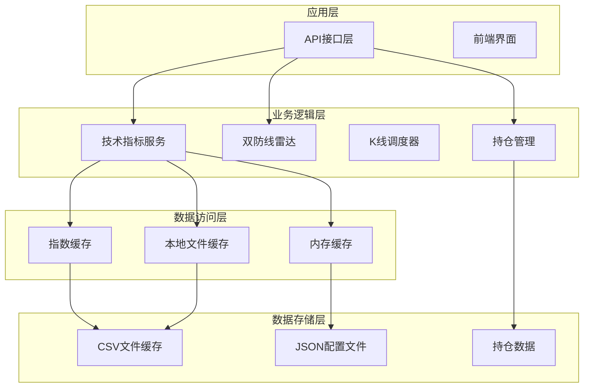
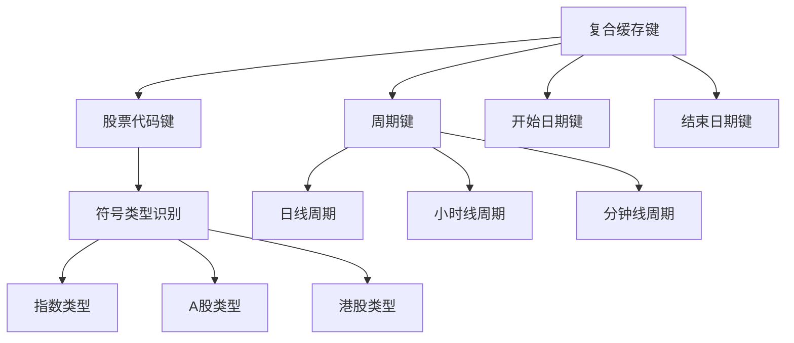
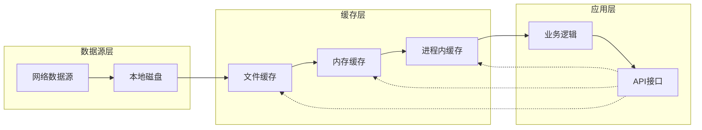
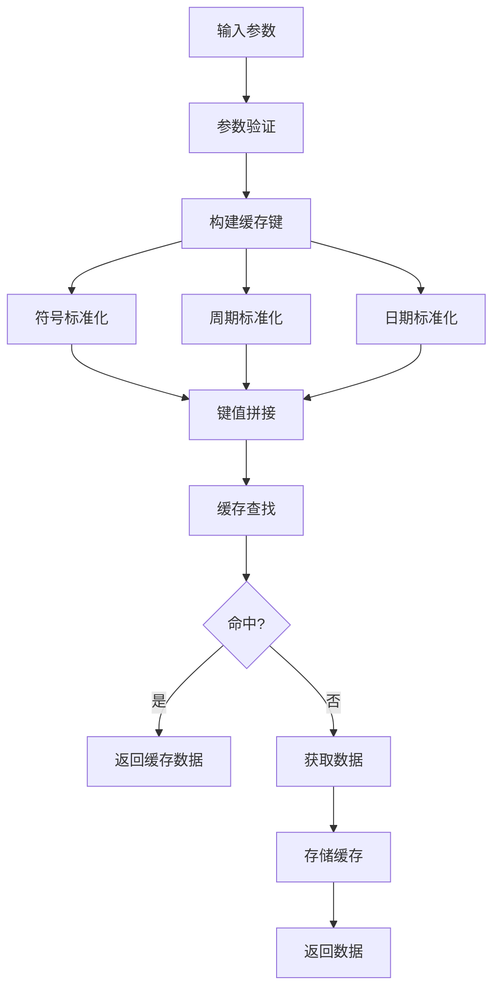
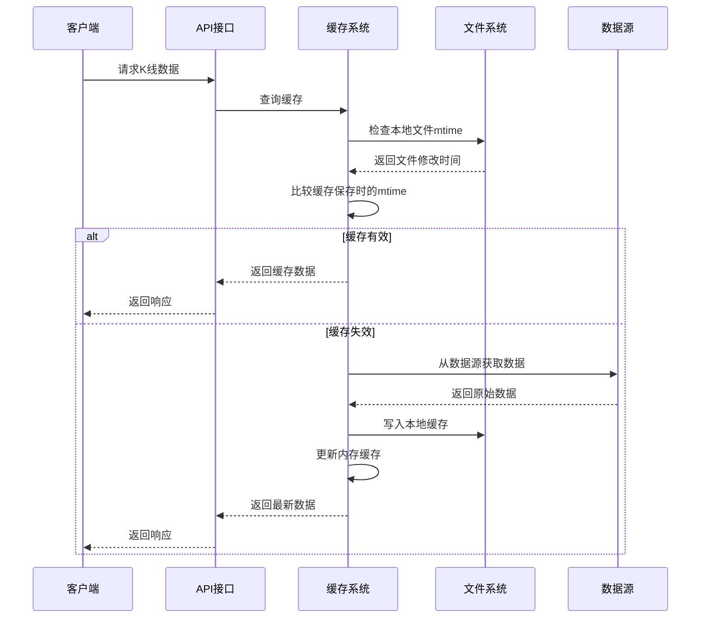
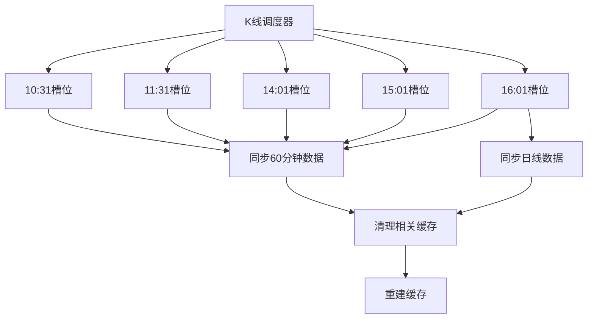
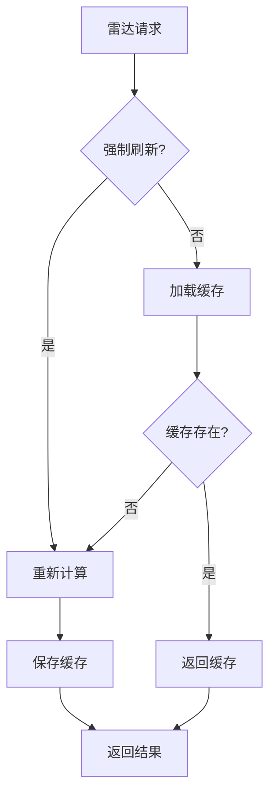
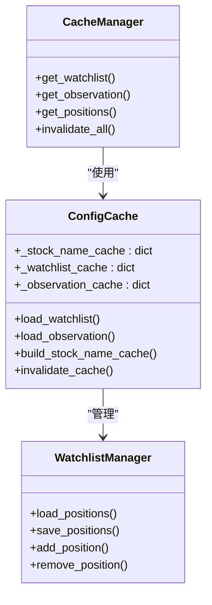
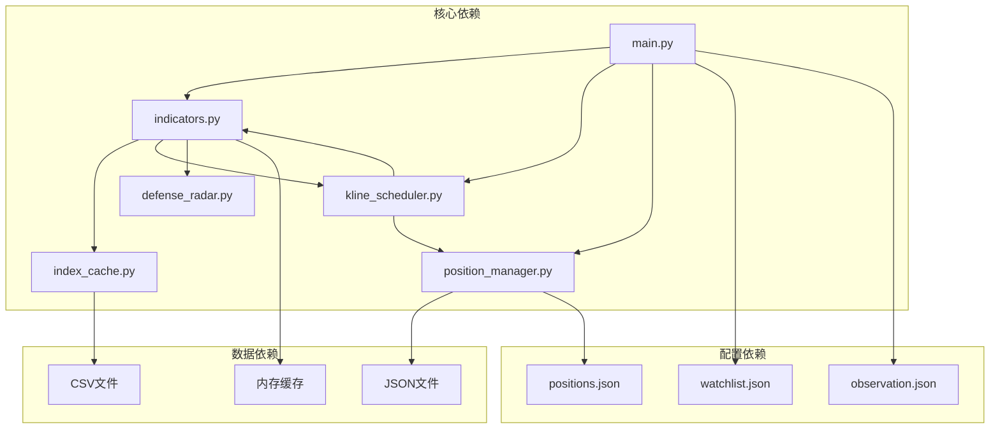
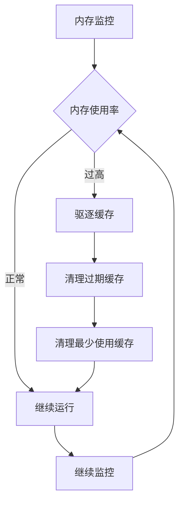

# 缓存策略设计

<cite>
**本文档引用的文件**
- [backend/main.py](file://backend/main.py)
- [backend/services/index_cache.py](file://backend/services/index_cache.py)
- [backend/services/kline_scheduler.py](file://backend/services/kline_scheduler.py)
- [backend/services/indicators.py](file://backend/services/indicators.py)
- [backend/services/defense_radar.py](file://backend/services/defense_radar.py)
- [backend/services/position_manager.py](file://backend/services/position_manager.py)
- [backend/data/watchlist.json](file://backend/data/watchlist.json)
- [backend/data/observation.json](file://backend/data/observation.json)
</cite>

## 目录
1. [简介](#简介)
2. [项目结构](#项目结构)
3. [核心组件](#核心组件)
4. [架构概览](#架构概览)
5. [详细组件分析](#详细组件分析)
6. [依赖关系分析](#依赖关系分析)
7. [性能考虑](#性能考虑)
8. [故障排查指南](#故障排查指南)
9. [结论](#结论)
10. [附录](#附录)

## 简介

本文件为金融分析系统设计的全面缓存策略文档，涵盖多层次缓存架构的设计理念与实现细节。系统采用"进程内缓存 + 本地文件缓存 + 内存缓存"的协同工作机制，针对不同数据类型的特性制定差异化的缓存策略，包括K线数据的短期缓存、技术指标的长期缓存和配置数据的静态缓存。

系统的核心目标是在保证数据一致性的同时最大化缓存命中率，通过智能的缓存失效机制和版本控制确保分析结果的准确性。文档详细说明了缓存键的设计策略、缓存清理策略、性能监控机制以及故障恢复方案。

## 项目结构

金融分析系统采用模块化架构，主要分为以下层次：

**图表来源**
- [backend/main.py:110-186](file://backend/main.py#L110-L186)
- [backend/services/indicators.py:1644-1947](file://backend/services/indicators.py#L1644-L1947)

**章节来源**
- [backend/main.py:1-514](file://backend/main.py#L1-L514)
- [backend/services/index_cache.py:1-201](file://backend/services/index_cache.py#L1-L201)

## 核心组件

### 多层次缓存架构

系统实现了三层缓存架构，每层都有明确的职责分工：

1. **进程内缓存**：存储临时计算结果和中间状态
2. **本地文件缓存**：持久化存储原始数据和计算结果
3. **内存缓存**：存储高频访问的响应数据

### 缓存键设计策略

缓存键采用复合键设计，确保唯一性和精确匹配：

**图表来源**
- [backend/services/indicators.py:1662-1668](file://backend/services/indicators.py#L1662-L1668)

**章节来源**
- [backend/services/indicators.py:88-91](file://backend/services/indicators.py#L88-L91)
- [backend/services/indicators.py:1662-1668](file://backend/services/indicators.py#L1662-L1668)

## 架构概览

系统缓存架构采用"数据源优先 + 智能失效"的设计原则：

**图表来源**
- [backend/services/kline_scheduler.py:131-144](file://backend/services/kline_scheduler.py#L131-L144)
- [backend/services/indicators.py:1654-1661](file://backend/services/indicators.py#L1654-L1661)

## 详细组件分析

### 指数K线缓存系统

指数K线缓存系统是整个缓存架构的核心组件，负责处理不同周期的K线数据缓存。

#### 缓存策略设计

系统针对不同数据类型制定了差异化的缓存策略：

| 数据类型 | 缓存层级 | TTL策略 | 失效机制 |
|---------|---------|---------|----------|
| K线数据 | 本地文件 + 内存缓存 | 300秒 | mtime比对 + 周期隔离 |
| 技术指标 | 内存缓存 | 300秒 | 周期变更触发 |
| 配置数据 | 进程内缓存 | 静态不变 | 文件变更监听 |

#### 缓存键生成算法

**图表来源**
- [backend/services/indicators.py:1662-1683](file://backend/services/indicators.py#L1662-L1683)

#### 缓存失效机制

系统实现了智能的缓存失效机制，基于文件修改时间和周期隔离：

**图表来源**
- [backend/services/indicators.py:1670-1683](file://backend/services/indicators.py#L1670-L1683)
- [backend/services/indicators.py:121-138](file://backend/services/indicators.py#L121-L138)

**章节来源**
- [backend/services/indicators.py:1644-1947](file://backend/services/indicators.py#L1644-L1947)
- [backend/services/index_cache.py:102-124](file://backend/services/index_cache.py#L102-L124)

### K线调度器缓存协调

K线调度器负责协调不同周期数据的缓存更新，确保数据的一致性：

#### 调度策略

**图表来源**
- [backend/services/kline_scheduler.py:40-46](file://backend/services/kline_scheduler.py#L40-L46)
- [backend/services/kline_scheduler.py:211-226](file://backend/services/kline_scheduler.py#L211-L226)

#### 缓存一致性保证

调度器通过以下机制保证缓存一致性：

1. **时间槽位同步**：固定时间点批量更新缓存
2. **周期隔离**：不同周期的数据独立更新
3. **增量更新**：仅更新发生变化的数据
4. **一致性检查**：更新后验证缓存有效性

**章节来源**
- [backend/services/kline_scheduler.py:131-176](file://backend/services/kline_scheduler.py#L131-L176)
- [backend/services/kline_scheduler.py:286-358](file://backend/services/kline_scheduler.py#L286-L358)

### 双防线雷达缓存策略

双防线雷达作为重要的分析组件，采用了特殊的缓存策略：

#### 缓存特点

| 特点 | 描述 | 实现方式 |
|------|------|----------|
| 本地优先 | 仅读取本地缓存 | 默认refresh=False |
| 实时性 | 支持强制刷新 | refresh=True |
| 性能优化 | 缓存计算结果 | last_summary.json |
| 数据隔离 | 梅花2test独立处理 | 特殊代码处理 |

#### 缓存流程

**图表来源**
- [backend/services/defense_radar.py:147-165](file://backend/services/defense_radar.py#L147-L165)

**章节来源**
- [backend/services/defense_radar.py:147-165](file://backend/services/defense_radar.py#L147-L165)

### 配置数据缓存

系统中的配置数据采用静态缓存策略：

#### 缓存类型

| 配置文件 | 缓存策略 | 更新机制 |
|----------|----------|----------|
| watchlist.json | 进程内缓存 | 文件变更监听 |
| observation.json | 进程内缓存 | 文件变更监听 |
| positions.json | 文件持久化 | 自动保存 |

#### 缓存管理

**图表来源**
- [backend/main.py:255-317](file://backend/main.py#L255-L317)
- [backend/services/position_manager.py:51-75](file://backend/services/position_manager.py#L51-L75)

**章节来源**
- [backend/main.py:255-317](file://backend/main.py#L255-L317)
- [backend/services/position_manager.py:51-75](file://backend/services/position_manager.py#L51-L75)

## 依赖关系分析

系统缓存组件之间的依赖关系如下：

**图表来源**
- [backend/services/indicators.py:17-25](file://backend/services/indicators.py#L17-L25)
- [backend/services/kline_scheduler.py:28-31](file://backend/services/kline_scheduler.py#L28-L31)

**章节来源**
- [backend/services/indicators.py:17-25](file://backend/services/indicators.py#L17-L25)
- [backend/services/kline_scheduler.py:28-31](file://backend/services/kline_scheduler.py#L28-L31)

## 性能考虑

### 缓存命中率优化

系统通过以下策略优化缓存命中率：

1. **智能缓存键设计**：确保键的唯一性和精确匹配
2. **TTL策略**：合理设置缓存有效期
3. **预热机制**：在业务高峰期前预加载热点数据
4. **缓存分层**：根据访问频率设置不同的缓存层级

### 内存使用控制

系统实现了多重内存保护机制：

**图表来源**
- [backend/services/indicators.py:170-174](file://backend/services/indicators.py#L170-L174)

### 性能监控

系统提供了完整的性能监控机制：

| 监控指标 | 实现方式 | 阈值设置 |
|----------|----------|----------|
| 缓存命中率 | 日志统计 | >80% |
| 响应时间 | 性能计时 | <500ms |
| 内存使用 | 进程监控 | <80% |
| 缓存大小 | 统计监控 | <1GB |

**章节来源**
- [backend/services/indicators.py:1918-1945](file://backend/services/indicators.py#L1918-L1945)

## 故障排查指南

### 常见缓存问题

#### 缓存不一致问题

**症状**：不同周期数据不匹配
**解决方案**：
1. 检查调度器是否正常运行
2. 验证文件修改时间戳
3. 手动触发缓存清理

#### 缓存失效问题

**症状**：缓存频繁失效
**解决方案**：
1. 检查TTL设置是否合理
2. 验证文件权限设置
3. 监控磁盘空间

#### 内存泄漏问题

**症状**：内存使用持续增长
**解决方案**：
1. 检查缓存清理机制
2. 验证TTL过期处理
3. 监控缓存项数量

**章节来源**
- [backend/services/kline_scheduler.py:448-492](file://backend/services/kline_scheduler.py#L448-L492)
- [backend/services/indicators.py:121-138](file://backend/services/indicators.py#L121-L138)

## 结论

本缓存策略设计文档详细阐述了金融分析系统的多层次缓存架构。通过合理的缓存分层、智能的缓存键设计和完善的缓存失效机制，系统能够在保证数据一致性的同时最大化缓存命中率。

系统的主要优势包括：
1. **多层次缓存**：从进程内到本地文件的完整缓存体系
2. **智能失效**：基于文件修改时间和周期隔离的失效机制
3. **性能优化**：针对不同数据类型的差异化缓存策略
4. **可靠性保障**：完善的监控和故障恢复机制

建议在实际部署中根据业务需求调整缓存参数，并建立定期的缓存健康检查机制。

## 附录

### 缓存策略对比表

| 缓存类型 | TTL(秒) | 失效机制 | 适用场景 | 性能影响 |
|----------|---------|----------|----------|----------|
| K线数据 | 300 | mtime比对 + 周期隔离 | 高频查询 | 高 |
| 技术指标 | 300 | 周期变更触发 | 分析计算 | 中等 |
| 配置数据 | 静态 | 文件变更监听 | 静态展示 | 低 |
| 股票名称 | 静态 | 文件变更监听 | 名称查询 | 低 |

### 缓存清理策略

系统提供了多种缓存清理策略：

1. **自动清理**：基于TTL的自动过期清理
2. **手动清理**：通过API接口强制清理特定缓存
3. **批量清理**：定期批量清理过期缓存
4. **内存保护**：当内存使用超过阈值时自动清理

### 故障恢复机制

系统具备完善的故障恢复能力：

1. **数据源降级**：网络异常时使用本地缓存
2. **缓存重建**：缓存失效时自动重建
3. **服务重启**：进程重启后自动恢复缓存状态
4. **监控告警**：缓存异常时及时告警