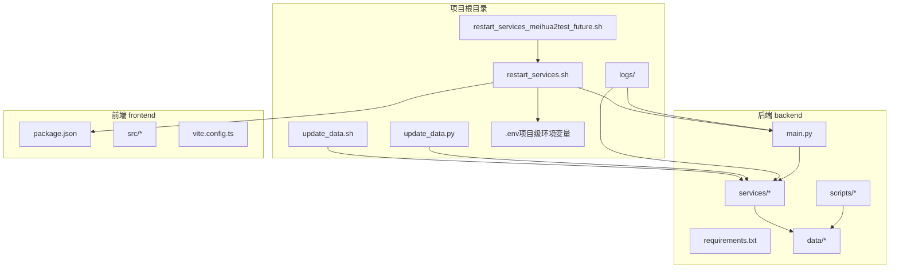
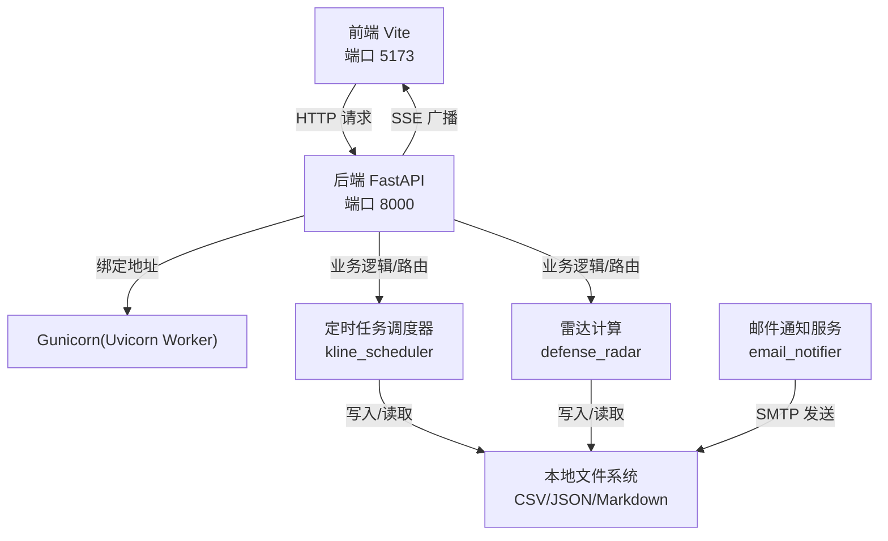
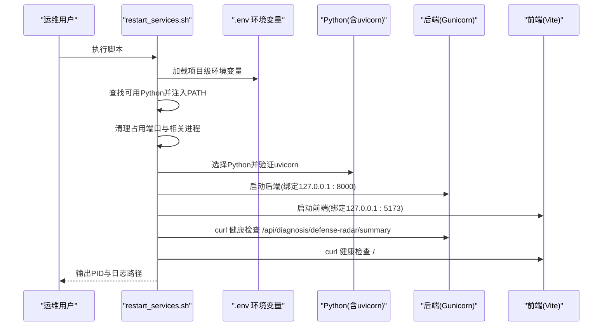
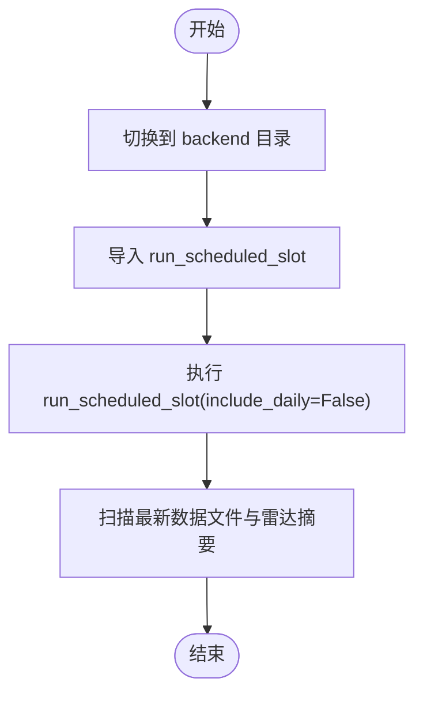
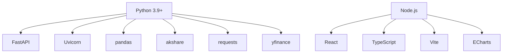

# 部署配置

<cite>
**本文引用的文件**
- [restart_services.sh](file://restart_services.sh)
- [restart_services_meihua2test_future.sh](file://restart_services_meihua2test_future.sh)
- [update_data.sh](file://update_data.sh)
- [update_data.py](file://update_data.py)
- [backend/requirements.txt](file://backend/requirements.txt)
- [backend/main.py](file://backend/main.py)
- [backend/services/kline_scheduler.py](file://backend/services/kline_scheduler.py)
- [backend/services/defense_radar.py](file://backend/services/defense_radar.py)
- [backend/services/email_notifier.py](file://backend/services/email_notifier.py)
- [backend/run_defense_radar.py](file://backend/run_defense_radar.py)
- [backend/run_trade_command.py](file://backend/run_trade_command.py)
- [frontend/package.json](file://frontend/package.json)
- [README.md](file://README.md)
- [backend/data/watchlist.json](file://backend/data/watchlist.json)
- [backend/data/observation.json](file://backend/data/observation.json)
- [backend/scripts/build_meihua2test_fixture.py](file://backend/scripts/build_meihua2test_fixture.py)
</cite>

## 更新摘要
**变更内容**
- 新增项目级环境变量加载功能，支持 `.env` 文件配置
- 改进进程管理机制，增强优雅关闭和进程清理能力
- 添加邮件通知配置验证功能，提升部署自动化程度
- 优化进程匹配模式，避免误杀其他项目进程

## 目录
1. [简介](#简介)
2. [项目结构](#项目结构)
3. [核心组件](#核心组件)
4. [架构总览](#架构总览)
5. [详细组件分析](#详细组件分析)
6. [依赖分析](#依赖分析)
7. [性能考虑](#性能考虑)
8. [故障排查指南](#故障排查指南)
9. [结论](#结论)
10. [附录](#附录)

## 简介
本文件面向运维与开发人员，提供本项目的部署配置与操作指南。内容涵盖：
- 环境与依赖要求（Python 3.9+、Node.js、系统工具）
- 部署脚本使用方法（服务重启、测试环境配置、数据更新）
- 生产环境部署流程（依赖安装、服务启动、健康检查）
- 配置文件管理（环境变量、配置文件定制）
- 监控与日志管理（日志位置、格式、分析方法）
- 性能调优建议与最佳实践
- 故障排查与常见问题解决
- 安全配置与访问控制

## 项目结构
项目采用前后端分离架构，后端为 Python FastAPI 服务，前端为 React/Vite 应用。部署相关的关键文件与目录如下：
- 重启与更新脚本：restart_services.sh、restart_services_meihua2test_future.sh、update_data.sh、update_data.py
- 后端：backend/main.py、backend/requirements.txt、backend/services/*、backend/data/*
- 前端：frontend/package.json、frontend/vite.config.ts、frontend/src/*
- 日志：logs/defense_radar/*.md、logs/defense_radar/last_summary.json、logs/backend_*.log、logs/frontend_*.log
- 测试夹具与模拟数据：backend/scripts/build_meihua2test_fixture.py、tests/fixtures/meihua2test/*

**图表来源**
- [restart_services.sh:1-183](file://restart_services.sh#L1-L183)
- [backend/main.py:1-607](file://backend/main.py#L1-L607)
- [backend/requirements.txt:1-8](file://backend/requirements.txt#L1-L8)
- [frontend/package.json:1-33](file://frontend/package.json#L1-L33)

**章节来源**
- [README.md: 项目结构与技术栈:1-269](file://README.md#L1-L269)

## 核心组件
- 后端服务（FastAPI + Gunicorn/Uvicorn）：提供指标查询、K线与缠论计算、定时任务调度、双防线雷达、SSE 实时推送等能力。
- 前端应用（React + Vite）：可视化展示日K/60分钟图、雷达摘要、Tab 显隐策略。
- 定时任务调度器（kline_scheduler）：按北京时间槽位执行日线/60分钟/15分钟同步、雷达计算、买卖信号与止损检查。
- 雷达计算（defense_radar）：基于日线中枢与60分钟K线收盘价进行"绝对防线"与"四条件扳机"判定。
- 邮件通知服务（email_notifier）：在每日14:46快照后自动发送异动标的邮件通知。

**章节来源**
- [backend/main.py: 路由与生命周期:91-104](file://backend/main.py#L91-L104)
- [backend/services/kline_scheduler.py: 定时任务与状态:448-492](file://backend/services/kline_scheduler.py#L448-L492)
- [backend/services/defense_radar.py: 雷达摘要与输出:747-800](file://backend/services/defense_radar.py#L747-L800)
- [backend/services/email_notifier.py: 邮件通知服务:1-192](file://backend/services/email_notifier.py#L1-L192)

## 架构总览
后端通过 Gunicorn + Uvicorn Worker 承载 FastAPI 应用，前端通过 Vite 提供开发与预览服务。定时任务在后端进程中独立线程运行，负责数据同步与雷达计算。SSE 用于向前端推送雷达更新。邮件通知服务在14:46自动检查并发送异动标的摘要。

**图表来源**
- [restart_services.sh: 启动后端与前端:138-144](file://restart_services.sh#L138-L144)
- [backend/main.py: SSE 端点:213-252](file://backend/main.py#L213-L252)
- [backend/services/kline_scheduler.py: 调度与写盘:131-248](file://backend/services/kline_scheduler.py#L131-L248)
- [backend/services/defense_radar.py: 输出 Markdown 与 JSON:747-800](file://backend/services/defense_radar.py#L747-L800)
- [backend/services/email_notifier.py: 邮件发送:180-188](file://backend/services/email_notifier.py#L180-L188)

## 详细组件分析

### 环境与依赖要求
- Python 版本：3.9+（推荐使用 3.9~3.13）
- 后端依赖：FastAPI、Uvicorn、pandas、akshare
- 前端依赖：React、TypeScript、Vite、ECharts
- 系统工具：lsof、curl、gunicorn、uvicorn（通过 Python 模块可用性检测）

**章节来源**
- [README.md: 技术栈与版本要求:7-14](file://README.md#L7-L14)
- [backend/requirements.txt:1-8](file://backend/requirements.txt#L1-L8)
- [frontend/package.json:1-33](file://frontend/package.json#L1-L33)

### 服务重启脚本 restart_services.sh
**更新** 新增项目级环境变量加载和改进的进程管理功能

功能概述：
- 自动查找可用的 Python（优先虚拟环境，其次系统 Python），并确保 uvicorn 可用
- **新增**：加载项目级环境变量（.env 文件），支持敏感配置集中管理
- 清理占用端口 8000/5173 的进程，以及 vite、uvicorn、gunicorn、node 相关进程
- **改进**：更精确的进程匹配模式，避免误杀其他项目进程
- **新增**：邮件通知配置验证，在环境变量缺失时给出明确提示
- 启动后端（Gunicorn + Uvicorn Worker）与前端（Vite dev server）
- 通过 curl 健康检查后端与前端
- 生成日志文件 logs/backend_*.log 与 logs/frontend_*.log

关键行为与参数：
- 端口：后端 8000、前端 5173
- 后端工作进程：2
- 日志：按启动时间命名，输出到 logs/ 目录
- 代理：HTTP/HTTPS 代理指向本地 7897 端口（Clash Verge）
- **新增**：环境变量文件：.env（位于项目根目录）

**图表来源**
- [restart_services.sh: 环境变量加载:26-33](file://restart_services.sh#L26-L33)
- [restart_services.sh: 端口清理与启动:102-144](file://restart_services.sh#L102-L144)
- [restart_services.sh: 健康检查:150-168](file://restart_services.sh#L150-L168)

**章节来源**
- [restart_services.sh: 完整实现:1-183](file://restart_services.sh#L1-L183)

### 测试环境配置脚本 restart_services_meihua2test_future.sh
功能概述：
- 为"未来 K"演示启用环境变量 MEIHUA2TEST_FUTURE_K=1
- 可选跳过夹具重建（SKIP_MEIHUA2TEST_BUILD=1）
- 通过 source 调用 restart_services.sh 完成后端/前端重启

使用场景：
- 需要对测试标的 889999 进行"未来 K"模拟时，先生成夹具并带环境变量启动

**章节来源**
- [restart_services_meihua2test_future.sh: 环境变量与夹具重建:1-24](file://restart_services_meihua2test_future.sh#L1-L24)
- [backend/scripts/build_meihua2test_fixture.py: 夹具生成逻辑:117-153](file://backend/scripts/build_meihua2test_fixture.py#L117-L153)

### 数据更新脚本 update_data.sh 与 update_data.py
功能概述：
- 手动触发 60分钟数据同步与雷达摘要生成
- 输出最新数据文件与雷达摘要文件信息
- 两个脚本等价，分别以 Bash 内嵌 Python 与纯 Python 实现

执行流程（简化）：
- 切换到 backend 目录
- 导入 run_scheduled_slot 并执行（不包含日线同步）
- 扫描最新数据文件与雷达摘要文件并输出

**图表来源**
- [update_data.sh: Python 内嵌实现:11-46](file://update_data.sh#L11-L46)
- [update_data.py: 纯 Python 实现:32-74](file://update_data.py#L32-L74)

**章节来源**
- [update_data.sh: 脚本主体:1-52](file://update_data.sh#L1-L52)
- [update_data.py: 脚本主体:1-79](file://update_data.py#L1-L79)
- [backend/services/kline_scheduler.py: run_scheduled_slot:211-226](file://backend/services/kline_scheduler.py#L211-L226)

### 生产环境部署流程
- 安装后端依赖
  - 进入 backend 目录，安装 requirements.txt
- 安装前端依赖
  - 进入 frontend 目录，安装 package.json 依赖
- **新增**：配置项目级环境变量
  - 创建 .env 文件，设置必要的环境变量（如代理、邮件通知等）
- 启动服务
  - 在项目根目录执行 restart_services.sh
- 健康检查
  - 后端：访问 http://127.0.0.1:8000/api/diagnosis/defense-radar/summary
  - 前端：访问 http://127.0.0.1:5173/

**章节来源**
- [README.md: 快速启动与端口说明:17-31](file://README.md#L17-L31)
- [restart_services.sh: 健康检查:150-168](file://restart_services.sh#L150-L168)

### 配置文件管理
**更新** 新增项目级环境变量加载和邮件通知配置验证

- 环境变量
  - **新增**：项目级环境变量（.env 文件）
    - 代理：HTTP_PROXY/HTTPS_PROXY/http_proxy/https_proxy 指向本地 7897
    - 测试环境：MEIHUA2TEST_FUTURE_K=1（用于"未来 K"演示）
    - 夹具重建开关：SKIP_MEIHUA2TEST_BUILD=1（跳过夹具重建）
    - **新增**：邮件通知配置
      - EMAIL_SENDER：发件人邮箱（如 xxx@qq.com）
      - EMAIL_PASSWORD：QQ邮箱授权码（非登录密码）
      - EMAIL_RECIPIENT：收件人邮箱
      - EMAIL_SMTP_HOST：SMTP服务器（默认 smtp.qq.com）
      - EMAIL_SMTP_PORT：SMTP端口（默认 465）
  - **新增**：CORS配置
    - CORS_ALLOWED_ORIGINS：允许跨域的来源列表，默认包含前端开发端口
- 配置文件
  - 用户自选与观察列表：backend/data/watchlist.json、backend/data/observation.json
  - 雷达摘要：logs/defense_radar/last_summary.json
  - 雷达报告：logs/defense_radar/defense_radar_YYYYMMDD_HHMMSS.md
  - 后端日志：logs/backend_*.log
  - 前端日志：logs/frontend_*.log

**章节来源**
- [restart_services.sh: 代理与环境注入:35-39](file://restart_services.sh#L35-L39)
- [restart_services_meihua2test_future.sh: 环境变量与夹具重建:11-19](file://restart_services_meihua2test_future.sh#L11-L19)
- [backend/services/email_notifier.py: 环境变量配置:4-10](file://backend/services/email_notifier.py#L4-L10)
- [backend/main.py: CORS配置:113-124](file://backend/main.py#L113-L124)
- [backend/data/watchlist.json:1-27](file://backend/data/watchlist.json#L1-L27)
- [backend/data/observation.json:1-25](file://backend/data/observation.json#L1-L25)
- [backend/services/defense_radar.py: 摘要与输出路径:96-98](file://backend/services/defense_radar.py#L96-L98)

### 监控与日志管理
**更新** 新增邮件通知日志和改进的进程管理

- 日志位置
  - 后端：logs/backend_YYYYMMDD_HHMMSS.log
  - 前端：logs/frontend_YYYYMMDD_HHMMSS.log
  - 雷达：logs/defense_radar/defense_radar_*.md、last_summary.json
  - **新增**：邮件通知日志：logs/backend_*.log 中的邮件发送记录
- 日志格式
  - 后端：INFO 级别，包含时间戳与消息
  - 雷达：Markdown 表格与 JSON 摘要
  - **新增**：邮件通知：包含发送状态和异常信息
- 分析方法
  - 后端/前端日志：grep 关键词（如 "ERROR"、"exception"、"failed"）
  - 雷达摘要：last_summary.json 中 symbols 数组与 generated_at 字段
  - **新增**：邮件通知：检查邮件发送状态和SMTP连接日志
  - 健康检查：/api/diagnosis/defense-radar/summary 与 / 健康端点

**章节来源**
- [restart_services.sh: 日志输出与命名:123-125](file://restart_services.sh#L123-L125)
- [backend/main.py: 日志配置:84-88](file://backend/main.py#L84-L88)
- [backend/services/defense_radar.py: 摘要写入:137-144](file://backend/services/defense_radar.py#L137-L144)
- [backend/services/email_notifier.py: 邮件发送日志:184-187](file://backend/services/email_notifier.py#L184-L187)

## 依赖分析
- 后端依赖
  - FastAPI、Uvicorn、pandas、akshare、requests、yfinance
  - 通过 requirements.txt 管理
- 前端依赖
  - React、TypeScript、Vite、ECharts 等
  - 通过 package.json 管理
- 运行时依赖
  - lsof、curl、gunicorn、uvicorn（通过 Python 模块可用性检测）

**图表来源**
- [backend/requirements.txt:1-8](file://backend/requirements.txt#L1-L8)
- [frontend/package.json:12-31](file://frontend/package.json#L12-L31)

**章节来源**
- [backend/requirements.txt:1-8](file://backend/requirements.txt#L1-L8)
- [frontend/package.json:1-33](file://frontend/package.json#L1-L33)

## 性能考虑
- 后端并发
  - 使用 Gunicorn + Uvicorn Worker，workers 数量可根据 CPU 核心数调整
  - 默认 2 个工作进程，建议在资源充足时适度增加
- 响应缓存
  - get_index_kline 对日线与60分钟分别维护响应缓存，并依据本地 CSV mtime 失效
  - 港股日线使用 TTL 控制（默认 300s）
- SSE 广播
  - 客户端断连自动清理，避免内存泄漏
- 定时任务
  - 主槽位与15分钟槽位合并，避免重复同步
  - 心跳与状态文件用于多 worker 去重与健康监控
- **新增**：进程管理优化
  - 更精确的进程匹配模式，减少误杀风险
  - 优雅关闭机制，支持超时处理

**章节来源**
- [restart_services.sh: 后端启动参数:139](file://restart_services.sh#L139)
- [restart_services.sh: 进程管理:65-121](file://restart_services.sh#L65-L121)
- [backend/services/kline_scheduler.py: 心跳与状态文件:61-94](file://backend/services/kline_scheduler.py#L61-L94)
- [backend/services/kline_scheduler.py: 主槽位与15分钟槽位:286-358](file://backend/services/kline_scheduler.py#L286-L358)
- [backend/main.py: SSE 客户端队列与清理:57-82](file://backend/main.py#L57-L82)

## 故障排查指南
**更新** 新增邮件通知配置和进程管理相关问题排查

常见问题与解决步骤：
- 摘要 404 或路由未生效
  - 说明后端未重启或旧进程仍在运行
  - 解决：执行 restart_services.sh 重启后端
- 有警报的 Tab 不显示
  - 可能为摘要请求失败或 last_summary.json 未生成
  - 解决：检查后端日志；必要时手动触发 POST /api/diagnosis/defense-radar
- 60m 报错"本地缓存不存在"
  - 未执行定时任务或从未对该 symbol 使用 refresh=true 预热
  - 解决：先执行 update_data.sh 或在前端使用 refresh=true 预热
- 中枢长时间不变
  - 本地 CSV 未更新或仅命中 TTL（港股日线）
  - 解决：等待定时任务写盘或手动触发数据更新
- **新增**：邮件通知未发送
  - 检查 .env 文件中的邮件配置变量是否正确设置
  - 验证 SMTP 服务器连接和认证信息
  - 查看后端日志中的邮件发送状态
- **新增**：服务启动失败或端口占用
  - 使用进程管理功能检查并清理占用端口的进程
  - 确认环境变量加载正确
  - 检查 .env 文件权限和语法

**章节来源**
- [README.md: 排障简表:255-263](file://README.md#L255-L263)
- [backend/main.py: 健康端点与摘要端点:198-200](file://backend/main.py#L198-L200)
- [restart_services.sh: 邮件配置检查:127-136](file://restart_services.sh#L127-L136)
- [restart_services.sh: 进程管理:65-121](file://restart_services.sh#L65-L121)

## 结论
本部署配置文档提供了从环境准备、脚本使用、服务启动到监控与故障排查的完整指引。通过合理配置环境变量、规范使用部署脚本与数据更新脚本，并结合日志与健康检查，可稳定地在生产环境中运行本项目。新增的项目级环境变量加载、改进的进程管理和邮件通知配置验证功能，进一步提升了部署的自动化程度和可靠性。

## 附录

### 后端路由与健康检查
- 健康检查：GET /
- 摘要端点：GET /api/diagnosis/defense-radar/summary
- 雷达触发：POST /api/diagnosis/defense-radar
- SSE 端点：GET /api/sse/radar-updates

**章节来源**
- [backend/main.py: 路由定义:198-252](file://backend/main.py#L198-L252)

### 前端开发与构建
- 开发：npm run dev（端口 5173）
- 构建：npm run build
- 预览：npm run preview

**章节来源**
- [frontend/package.json:6-10](file://frontend/package.json#L6-L10)

### 雷达与定时任务
- 手动触发雷达：python backend/run_defense_radar.py
- 作战指令引擎：python backend/run_trade_command.py
- 定时任务：kline_scheduler 按槽位执行同步与计算

**章节来源**
- [backend/run_defense_radar.py:1-31](file://backend/run_defense_radar.py#L1-L31)
- [backend/run_trade_command.py:1-24](file://backend/run_trade_command.py#L1-L24)
- [backend/services/kline_scheduler.py:1-492](file://backend/services/kline_scheduler.py#L1-L492)

### 邮件通知配置
**新增** 邮件通知服务配置说明

- 环境变量配置
  - EMAIL_SENDER：发件人邮箱（如 xxx@qq.com）
  - EMAIL_PASSWORD：QQ邮箱授权码（非登录密码）
  - EMAIL_RECIPIENT：收件人邮箱
  - EMAIL_SMTP_HOST：SMTP服务器（默认 smtp.qq.com）
  - EMAIL_SMTP_PORT：SMTP端口（默认 465）
- 功能特性
  - 每日14:46自动检查并发送异动标的摘要
  - 支持自定义SMTP服务器和端口
  - 包含详细的发送状态日志
- 配置验证
  - 启动时自动检查环境变量完整性
  - 缺少配置时提供清晰的配置指导

**章节来源**
- [backend/services/email_notifier.py: 环境变量配置:4-10](file://backend/services/email_notifier.py#L4-L10)
- [backend/services/email_notifier.py: 配置检查:33-41](file://backend/services/email_notifier.py#L33-L41)
- [restart_services.sh: 邮件配置检查:127-136](file://restart_services.sh#L127-L136)