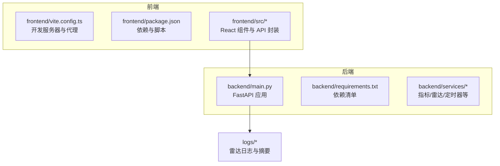
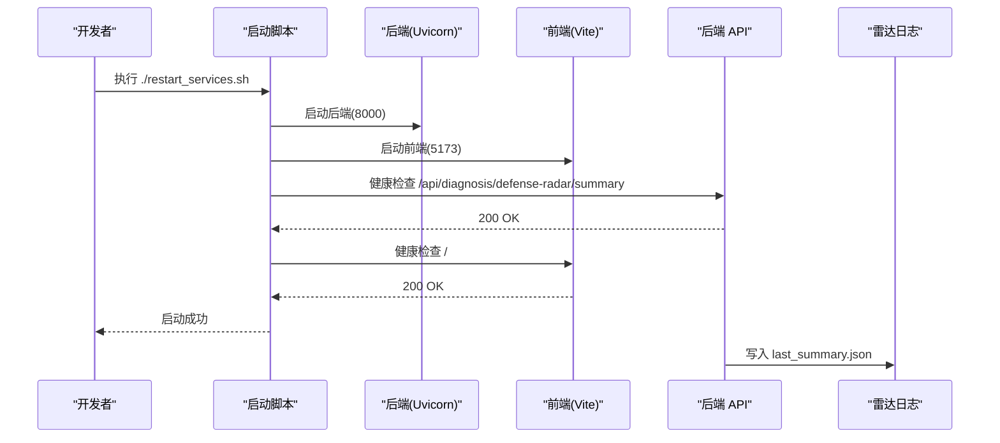
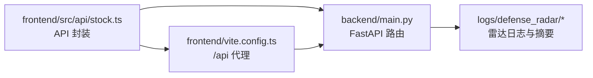

# 快速开始

<cite>
**本文引用的文件**
- [README.md](file://README.md)
- [backend/requirements.txt](file://backend/requirements.txt)
- [frontend/package.json](file://frontend/package.json)
- [backend/main.py](file://backend/main.py)
- [frontend/vite.config.ts](file://frontend/vite.config.ts)
- [restart_services.sh](file://restart_services.sh)
- [frontend/src/api/stock.ts](file://frontend/src/api/stock.ts)
- [frontend/src/App.tsx](file://frontend/src/App.tsx)
- [backend/update_radar.py](file://backend/update_radar.py)
</cite>

## 目录
1. [简介](#简介)
2. [项目结构](#项目结构)
3. [核心组件](#核心组件)
4. [架构总览](#架构总览)
5. [详细组件分析](#详细组件分析)
6. [依赖分析](#依赖分析)
7. [性能考虑](#性能考虑)
8. [故障排查指南](#故障排查指南)
9. [结论](#结论)
10. [附录](#附录)

## 简介
本指南面向新手开发者，帮助你在最短时间内成功运行金融分析系统。系统采用前后端分离架构：后端基于 Python 3.9+ 与 FastAPI 提供 K 线、技术指标与“双防线雷达”等接口；前端基于 React + TypeScript + Vite 提供可视化图表与交互界面。你将学会环境准备、依赖安装、启动流程、首次验证以及常见问题的解决方法，并通过基本示例快速体验核心功能。

## 项目结构
项目采用模块化组织，后端负责数据与业务逻辑，前端负责可视化与交互，日志与中间产物存放于 logs 目录。

图表来源
- [backend/main.py:1-514](file://backend/main.py#L1-L514)
- [frontend/vite.config.ts:1-22](file://frontend/vite.config.ts#L1-L22)
- [frontend/package.json:1-33](file://frontend/package.json#L1-L33)
- [backend/requirements.txt:1-5](file://backend/requirements.txt#L1-L5)

章节来源
- [README.md:17-30](file://README.md#L17-L30)
- [README.md:216-244](file://README.md#L216-L244)

## 核心组件
- 后端应用（FastAPI）
  - 生命周期：使用 lifespan 在启动时初始化定时任务，在关闭时清理资源。
  - 接口：提供 K 线、指标、雷达摘要、雷达诊断、健康检查等接口。
  - CORS：本地开发允许任意来源。
- 前端应用（React + Vite）
  - 代理：将 /api 与 /ws 请求转发到后端 127.0.0.1:8000。
  - 组件：日 K 图、60 分钟图、雷达简讯、Tab 显隐策略等。
- 启动脚本
  - 自动清理端口占用，选择合适的 Python 与 uvicorn，分别启动后端与前端，并进行健康检查。

章节来源
- [backend/main.py:80-107](file://backend/main.py#L80-L107)
- [backend/main.py:140-210](file://backend/main.py#L140-L210)
- [frontend/vite.config.ts:7-21](file://frontend/vite.config.ts#L7-L21)
- [restart_services.sh:54-126](file://restart_services.sh#L54-L126)

## 架构总览
后端通过定时任务维护 K 线缓存与雷达摘要，前端通过 API 获取数据并渲染图表。SSE 实时推送雷达更新与止损告警。

图表来源
- [restart_services.sh:82-111](file://restart_services.sh#L82-L111)
- [backend/main.py:171-181](file://backend/main.py#L171-L181)

章节来源
- [README.md:17-30](file://README.md#L17-L30)

## 详细组件分析

### 环境准备与依赖安装
- Python 3.9+
  - 后端使用 Python 3.9+，启动脚本会尝试多种候选路径（如系统自带 python3、~/.local/bin、~/Library/Python/x.y/bin 等），并优先使用项目虚拟环境。
- Node.js
  - 前端使用 Vite，需要 Node.js 环境（版本由 package.json 的引擎约束决定）。
- 依赖安装
  - 后端：在 backend 目录安装 requirements.txt 中的依赖。
  - 前端：在 frontend 目录安装 package.json 中的依赖。
- 端口
  - 后端默认 8000，前端默认 5173。启动脚本会先清理占用端口，再启动服务。

章节来源
- [README.md:17-30](file://README.md#L17-L30)
- [backend/requirements.txt:1-5](file://backend/requirements.txt#L1-L5)
- [frontend/package.json:1-33](file://frontend/package.json#L1-L33)
- [restart_services.sh:10-11](file://restart_services.sh#L10-L11)
- [restart_services.sh:54-87](file://restart_services.sh#L54-L87)

### 后端启动流程
- 启动方式
  - 使用 gunicorn + uvicorn 工作进程启动 FastAPI 应用，绑定 127.0.0.1:8000。
  - 启动时设置超时与访问日志输出。
- 关闭与清理
  - lifespan 在关闭时停止定时任务。
- 健康检查
  - 提供根路径 / 健康检查接口，供启动脚本验证。

章节来源
- [backend/main.py:80-91](file://backend/main.py#L80-L91)
- [backend/main.py:208-210](file://backend/main.py#L208-L210)
- [restart_services.sh:82](file://restart_services.sh#L82)

### 前端启动流程
- 启动方式
  - 使用 npm run dev 启动 Vite 开发服务器，监听 127.0.0.1:5173。
- 代理配置
  - 将 /api 与 /ws 请求转发到后端 127.0.0.1:8000。
- 首次访问
  - 启动脚本会检查前端根路径返回码，确认前端正常启动。

章节来源
- [frontend/vite.config.ts:7-21](file://frontend/vite.config.ts#L7-L21)
- [restart_services.sh:86](file://restart_services.sh#L86)
- [restart_services.sh:106-109](file://restart_services.sh#L106-L109)

### 首次运行验证
- 后端 API 文档
  - 访问 http://127.0.0.1:8000/docs 查看接口文档。
- 雷达摘要
  - 启动脚本会请求 /api/diagnosis/defense-radar/summary，确认后端可用。
- 前端界面
  - 访问 http://127.0.0.1:5173，查看日 K 与 60 分钟图、雷达简讯与 Tab 显隐。

章节来源
- [README.md:26-27](file://README.md#L26-L27)
- [restart_services.sh:99-108](file://restart_services.sh#L99-L108)

### 常见安装问题与解决方案
- 端口占用
  - 启动脚本会先清理 8000 与 5173 端口，若仍有占用，可手动终止对应进程或更换端口。
- 依赖冲突
  - 后端建议使用虚拟环境安装 requirements.txt；前端建议使用 npm ci 或 npm install。
- 后端路由未更新
  - 修改后端路由后需重启后端，否则可能仍加载旧路由。
- 60 分钟 K 线报错“本地缓存不存在”
  - 需先运行定时任务或使用 refresh=true 预热本地 CSV。
- 雷达摘要 404
  - 可能是旧进程无新路由，需重启后端。

章节来源
- [README.md:29](file://README.md#L29)
- [README.md:255-263](file://README.md#L255-L263)

### 基本使用示例
- 获取 K 线与指标
  - 在后端接口文档中选择 /api/index/kline 与 /api/stock/indicators，填写参数并测试。
- 手动触发雷达
  - 使用 /api/diagnosis/defense-radar 接口手动运行雷达，生成雷达日志与摘要。
- 查看雷达摘要
  - 使用 /api/diagnosis/defense-radar/summary 获取摘要，前端据此控制 Tab 显隐。

章节来源
- [backend/main.py:140-168](file://backend/main.py#L140-L168)
- [backend/main.py:171-205](file://backend/main.py#L171-L205)
- [frontend/src/api/stock.ts:185-215](file://frontend/src/api/stock.ts#L185-L215)
- [frontend/src/api/stock.ts:249-276](file://frontend/src/api/stock.ts#L249-L276)

## 依赖分析
后端与前端的依赖关系如下：

图表来源
- [frontend/src/api/stock.ts:115-116](file://frontend/src/api/stock.ts#L115-L116)
- [frontend/vite.config.ts:8-18](file://frontend/vite.config.ts#L8-L18)
- [backend/main.py:171-181](file://backend/main.py#L171-L181)

章节来源
- [frontend/src/api/stock.ts:115-116](file://frontend/src/api/stock.ts#L115-L116)
- [frontend/vite.config.ts:8-18](file://frontend/vite.config.ts#L8-L18)
- [backend/main.py:171-181](file://backend/main.py#L171-L181)

## 性能考虑
- 后端响应缓存与 mtime 失效
  - 日线与 60 分钟 K 线在 refresh=false 时，依据本地 CSV 的 mtime 决定是否丢弃缓存并重算，减少重复计算。
- 定时任务
  - 在指定时间点刷新 K 线与雷达，避免频繁轮询。
- 前端懒加载
  - 首屏仅加载必要数据，切换 Tab 时按需请求 60 分钟 K 线。

章节来源
- [README.md:101-108](file://README.md#L101-L108)
- [README.md:115-121](file://README.md#L115-L121)
- [frontend/src/App.tsx:185-194](file://frontend/src/App.tsx#L185-L194)

## 故障排查指南
- 启动失败
  - 检查后端日志与前端日志路径，确认端口是否被占用。
- 雷达摘要 404
  - 重启后端，确保新路由生效。
- 60 分钟 K 线报错“本地缓存不存在”
  - 先运行定时任务或使用 refresh=true 预热本地 CSV。
- 中枢长时间不变
  - 等待定时任务写盘后，下一次读盘 + mtime 机制或 TTL 生效。

章节来源
- [restart_services.sh:56-75](file://restart_services.sh#L56-L75)
- [README.md:255-263](file://README.md#L255-L263)

## 结论
通过本快速开始指南，你可以完成环境准备、依赖安装与前后端启动，并在本地验证后端 API 文档与前端界面。遇到常见问题时，可参考故障排查章节进行定位与修复。建议在首次运行后，先手动触发一次雷达，确保 logs/defense_radar 目录中有摘要文件，以便前端正确显示 Tab 与雷达简讯。

## 附录
- 启动与验证命令
  - 在项目根目录执行 ./restart_services.sh，等待后端与前端启动成功。
  - 访问 http://127.0.0.1:8000/docs 与 http://127.0.0.1:5173。
- 手动运行雷达
  - 使用 /api/diagnosis/defense-radar 接口或后端脚本运行雷达，生成雷达日志与摘要。

章节来源
- [README.md:17-30](file://README.md#L17-L30)
- [backend/update_radar.py:1-47](file://backend/update_radar.py#L1-L47)