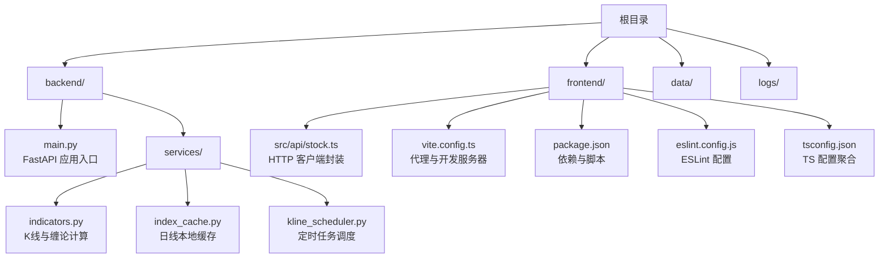
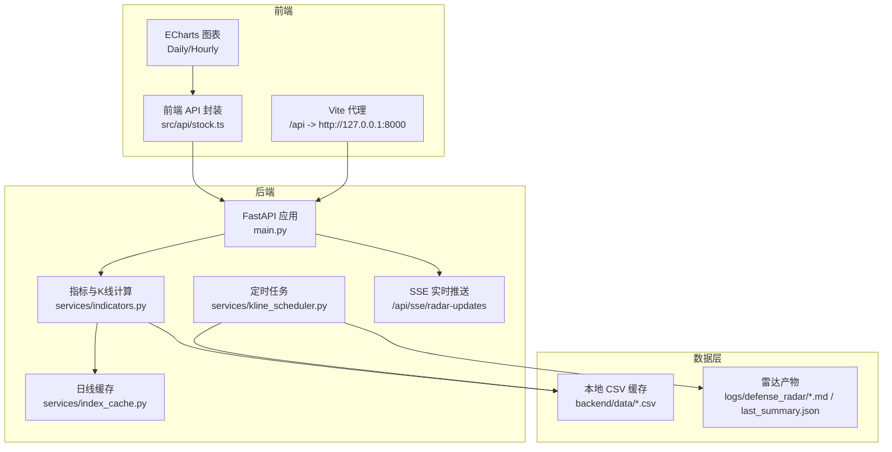
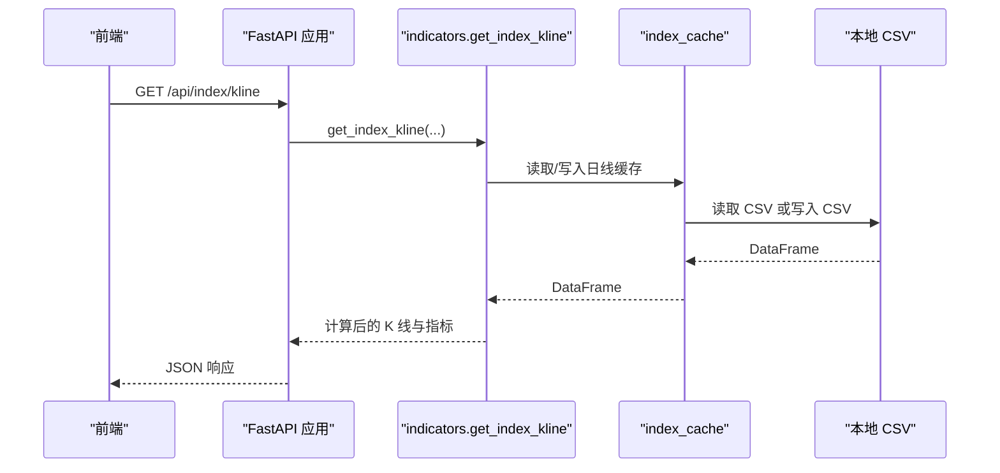
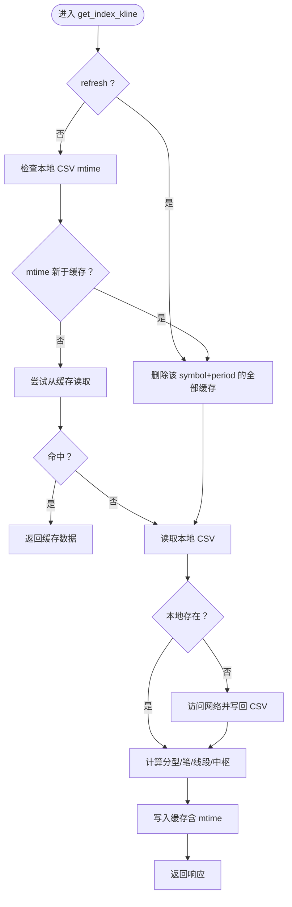
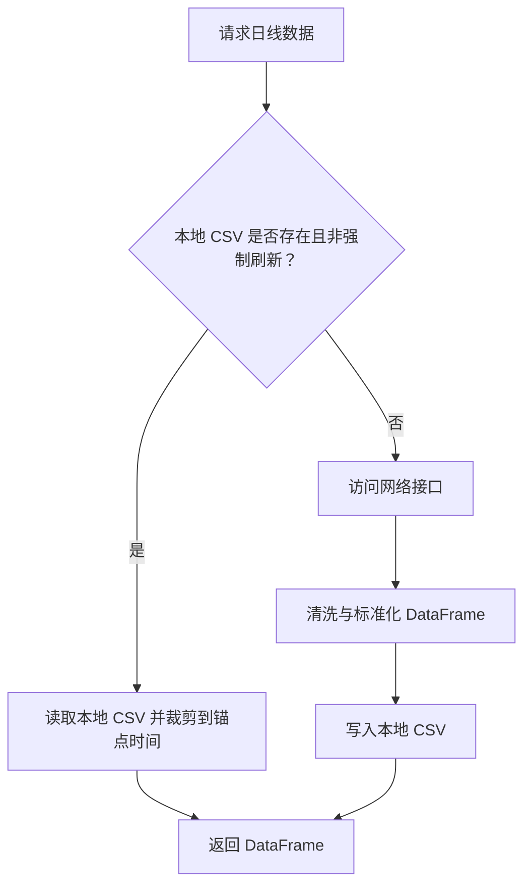
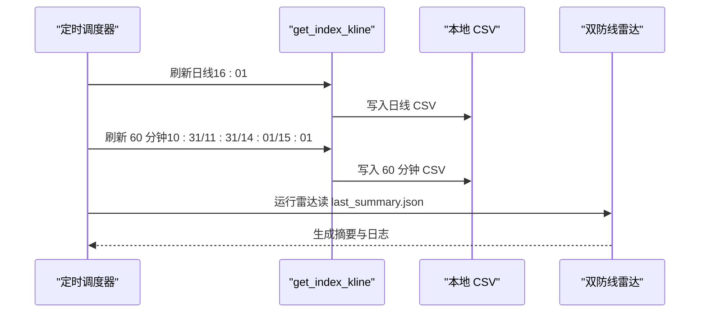
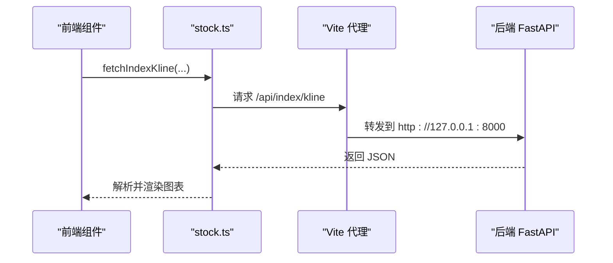
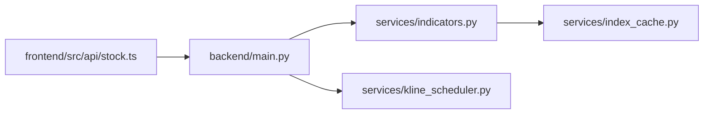

# 技术栈

<cite>
**本文引用的文件**
- [backend/main.py](file://backend/main.py)
- [backend/requirements.txt](file://backend/requirements.txt)
- [backend/services/indicators.py](file://backend/services/indicators.py)
- [backend/services/index_cache.py](file://backend/services/index_cache.py)
- [backend/services/kline_scheduler.py](file://backend/services/kline_scheduler.py)
- [frontend/package.json](file://frontend/package.json)
- [frontend/vite.config.ts](file://frontend/vite.config.ts)
- [frontend/src/api/stock.ts](file://frontend/src/api/stock.ts)
- [frontend/eslint.config.js](file://frontend/eslint.config.js)
- [frontend/tsconfig.json](file://frontend/tsconfig.json)
- [README.md](file://README.md)
</cite>

## 目录
1. [简介](#简介)
2. [项目结构](#项目结构)
3. [核心组件](#核心组件)
4. [架构总览](#架构总览)
5. [详细组件分析](#详细组件分析)
6. [依赖关系分析](#依赖关系分析)
7. [性能考量](#性能考量)
8. [故障排查指南](#故障排查指南)
9. [结论](#结论)
10. [附录](#附录)

## 简介
本技术栈文档面向金融分析系统，聚焦后端与前端技术栈选择、版本要求、协作关系与数据流。系统采用本地优先的数据策略：后端通过 FastAPI 提供 API，结合 pandas 与 akshare 进行数据处理与缓存，前端使用 React + TypeScript + Vite 构建可视化界面，并通过 ECharts 展示缠论与技术指标。数据库与存储采用本地 CSV 文件与进程内缓存相结合的方式，构建稳定、可维护且易于排障的架构。

## 项目结构
项目采用前后端分离的目录组织，后端位于 backend，前端位于 frontend，日志与中间产物位于 logs 与 data 目录。

**图表来源**
- [backend/main.py:1-514](file://backend/main.py#L1-L514)
- [backend/services/indicators.py:1-200](file://backend/services/indicators.py#L1-L200)
- [backend/services/index_cache.py:1-200](file://backend/services/index_cache.py#L1-L200)
- [backend/services/kline_scheduler.py:1-200](file://backend/services/kline_scheduler.py#L1-L200)
- [frontend/src/api/stock.ts:1-468](file://frontend/src/api/stock.ts#L1-L468)
- [frontend/vite.config.ts:1-22](file://frontend/vite.config.ts#L1-L22)
- [frontend/package.json:1-33](file://frontend/package.json#L1-L33)
- [frontend/eslint.config.js:1-24](file://frontend/eslint.config.js#L1-L24)
- [frontend/tsconfig.json:1-8](file://frontend/tsconfig.json#L1-L8)

**章节来源**
- [README.md:216-244](file://README.md#L216-L244)

## 核心组件
- 后端技术栈
  - Python 3.9+：满足类型注解、async/await、pathlib 等特性需求，保证与 FastAPI、pandas、akshare 的兼容性。
  - FastAPI：高性能异步 Web 框架，提供 OpenAPI 文档与自动校验，支撑指标查询、K线计算、雷达摘要与 SSE 实时推送。
  - uvicorn：ASGI 服务器，承载 FastAPI 应用，支持多进程部署。
  - pandas：数据处理与缓存键管理，提供高效的时间序列与数值计算能力。
  - akshare：部分场景的数据抓取（如港股日线），补充新浪接口覆盖不足。
- 前端技术栈
  - React 19：组件化 UI 构建，配合 TypeScript 提升类型安全与可维护性。
  - TypeScript ~5.9：强类型语言，保障 API 类型定义与调用一致性。
  - Vite 7：快速开发与构建工具，内置代理配置，便于联调后端。
  - ECharts 6 + echarts-for-react：专业图表库，适配缠论与技术指标可视化。
- 数据与存储
  - 本地 CSV：日线与 60 分钟 K 线缓存，作为“权威数据源”。
  - 进程内缓存：K线响应缓存与股票名称缓存，提升查询性能与降低重复计算。
- 构建与开发环境
  - Node.js + npm：前端依赖管理与脚本执行。
  - ESLint + TypeScript ESLint：代码质量与风格约束，配合 React Hooks 与 React Refresh 插件。
  - TypeScript 配置：通过 tsconfig.json 聚合 app 与 node 配置，确保编译一致性。

**章节来源**
- [README.md:7-14](file://README.md#L7-L14)
- [backend/requirements.txt:1-5](file://backend/requirements.txt#L1-L5)
- [frontend/package.json:1-33](file://frontend/package.json#L1-L33)

## 架构总览
系统采用“本地优先”的数据架构：后端定时任务拉取并写入本地 CSV，前端通过 API 获取数据并渲染图表；同时通过 SSE 实时推送雷达更新与止损告警。

**图表来源**
- [backend/main.py:110-252](file://backend/main.py#L110-L252)
- [backend/services/indicators.py:1-200](file://backend/services/indicators.py#L1-L200)
- [backend/services/index_cache.py:1-200](file://backend/services/index_cache.py#L1-L200)
- [backend/services/kline_scheduler.py:1-200](file://backend/services/kline_scheduler.py#L1-L200)
- [frontend/src/api/stock.ts:114-466](file://frontend/src/api/stock.ts#L114-L466)
- [frontend/vite.config.ts:7-21](file://frontend/vite.config.ts#L7-L21)

## 详细组件分析

### 后端应用与生命周期（FastAPI）
- 生命周期管理：通过 lifespan 钩子在应用启动时初始化定时任务与 SSE 回调，在关闭时清理资源。
- 跨域配置：允许任意来源，便于本地开发与调试。
- SSE 客户端队列：维护异步队列，线程回调通过事件循环安全投递消息，断开连接自动清理。
- 股票名称缓存：从 watchlist 与 last_summary.json 构建名称映射，减少重复 IO。

**图表来源**
- [backend/main.py:110-168](file://backend/main.py#L110-L168)
- [backend/services/indicators.py:1-200](file://backend/services/indicators.py#L1-L200)
- [backend/services/index_cache.py:102-152](file://backend/services/index_cache.py#L102-L152)

**章节来源**
- [backend/main.py:80-92](file://backend/main.py#L80-L92)
- [backend/main.py:213-252](file://backend/main.py#L213-L252)
- [backend/main.py:255-317](file://backend/main.py#L255-L317)

### K 线与缠论计算（indicators）
- 响应缓存：进程内缓存，键为 (symbol, period, start_date, end_date)，TTL 300 秒，最大条目 256，避免内存膨胀。
- mtime 失效：针对日线与 60 分钟分别依据本地 CSV 的修改时间进行失效，确保数据新鲜度。
- 本地 CSV 优先：默认只读本地 CSV，仅在 refresh=true 或文件缺失时访问网络。
- 特殊标的：对 889999（测试标的）放宽 end_ts，支持“未来 K”模拟。

**图表来源**
- [backend/services/indicators.py:121-174](file://backend/services/indicators.py#L121-L174)
- [backend/services/indicators.py:93-118](file://backend/services/indicators.py#L93-L118)

**章节来源**
- [backend/services/indicators.py:1-200](file://backend/services/indicators.py#L1-L200)

### 日线本地缓存（index_cache）
- 数据源策略：A 股/ETF 使用新浪接口（scale=240），指数同样使用新浪；港股使用 akshare。
- 锚点时间：自 2024-12-01 起缓存，保证历史一致性。
- 严格本地优先：默认只读本地 CSV，仅在 force_refresh 或本地不存在时访问网络并写回。

**图表来源**
- [backend/services/index_cache.py:102-152](file://backend/services/index_cache.py#L102-L152)

**章节来源**
- [backend/services/index_cache.py:1-200](file://backend/services/index_cache.py#L1-L200)

### 定时任务调度（kline_scheduler）
- 时区与时序：使用 Asia/Shanghai 时区，独立线程按槽位唤醒执行。
- 槽位策略：
  - 10:31 / 11:31 / 14:01 / 15:01：全量 60 分钟刷新 + 雷达。
  - 16:01：全量日线刷新 + 60 分钟刷新 + 雷达。
- 产物：写入本地 CSV 与 logs/defense_radar/last_summary.json，供前端读取。

**图表来源**
- [backend/services/kline_scheduler.py:39-46](file://backend/services/kline_scheduler.py#L39-L46)
- [backend/services/kline_scheduler.py:131-160](file://backend/services/kline_scheduler.py#L131-L160)

**章节来源**
- [backend/services/kline_scheduler.py:1-200](file://backend/services/kline_scheduler.py#L1-L200)

### 前端 API 封装与代理（stock.ts + vite.config.ts）
- API 封装：统一的 fetchWithRetry、参数构造与错误处理，支持 no-store 缓存策略。
- SSE 连接：EventSource 连接后端 /api/sse/radar-updates，接收雷达更新与止损告警。
- 代理配置：将 /api 与 /ws 代理到后端 127.0.0.1:8000，便于本地联调。

**图表来源**
- [frontend/src/api/stock.ts:185-215](file://frontend/src/api/stock.ts#L185-L215)
- [frontend/vite.config.ts:8-18](file://frontend/vite.config.ts#L8-L18)

**章节来源**
- [frontend/src/api/stock.ts:114-466](file://frontend/src/api/stock.ts#L114-L466)
- [frontend/vite.config.ts:1-22](file://frontend/vite.config.ts#L1-L22)

### 开发环境与构建工具
- 依赖与脚本：dev/build/lint/preview，统一通过 npm 管理。
- ESLint 配置：基于 @eslint/js、typescript-eslint、react-hooks、react-refresh，覆盖 TSX 文件。
- TypeScript 配置：通过 tsconfig.json 聚合 app 与 node 配置，确保编译一致性。

**章节来源**
- [frontend/package.json:6-11](file://frontend/package.json#L6-L11)
- [frontend/eslint.config.js:1-24](file://frontend/eslint.config.js#L1-L24)
- [frontend/tsconfig.json:1-8](file://frontend/tsconfig.json#L1-L8)

## 依赖关系分析
后端依赖关系清晰：main.py 作为入口，调用各服务模块；indicators 依赖 index_cache 与本地 CSV；kline_scheduler 调用 indicators 与雷达模块，产出 CSV 与日志；前端通过 stock.ts 与后端交互。

**图表来源**
- [backend/main.py:14-19](file://backend/main.py#L14-L19)
- [backend/services/indicators.py:17-25](file://backend/services/indicators.py#L17-L25)
- [backend/services/index_cache.py:1-16](file://backend/services/index_cache.py#L1-L16)
- [backend/services/kline_scheduler.py:28-31](file://backend/services/kline_scheduler.py#L28-L31)
- [frontend/src/api/stock.ts:1-17](file://frontend/src/api/stock.ts#L1-L17)

**章节来源**
- [backend/main.py:1-514](file://backend/main.py#L1-L514)
- [backend/services/indicators.py:1-200](file://backend/services/indicators.py#L1-L200)
- [backend/services/index_cache.py:1-200](file://backend/services/index_cache.py#L1-L200)
- [backend/services/kline_scheduler.py:1-200](file://backend/services/kline_scheduler.py#L1-L200)
- [frontend/src/api/stock.ts:1-468](file://frontend/src/api/stock.ts#L1-L468)

## 性能考量
- 进程内响应缓存：通过 TTL 与最大条目限制，平衡内存占用与吞吐。
- mtime 失效：仅在对应周期的本地 CSV 更新时触发重算，避免不必要的重复计算。
- 严格本地优先：减少网络抖动与延迟，提高稳定性。
- SSE 实时推送：仅在有变更时推送，降低前端轮询成本。
- 前端缓存策略：API 请求使用 no-store，确保与后端缓存策略一致，避免陈旧数据。

[本节为通用性能建议，不直接分析具体文件]

## 故障排查指南
- 摘要 404：后端未重启或旧进程无新路由，需重启后端。
- 有警报的 Tab 不显示：摘要请求失败或未写入 last_summary.json，检查后端定时任务与日志。
- 60m 报错“本地缓存不存在”：未跑过定时任务或从未对该 symbol refresh=true，先执行定时任务或手动刷新。
- 中枢长时间不变：本地 CSV 未更新或仅命中 TTL 内缓存（港股日线），等待定时任务或强制刷新。

**章节来源**
- [README.md:255-263](file://README.md#L255-L263)

## 结论
该技术栈围绕“本地优先”展开：后端通过 FastAPI + pandas + akshare 实现高性能数据处理与缓存，前端以 React + TypeScript + Vite + ECharts 构建可视化界面。定时任务确保数据新鲜度，SSE 提供实时推送，整体架构简洁、可维护且易于扩展。

[本节为总结性内容，不直接分析具体文件]

## 附录
- 版本与兼容性
  - Python 3.9+：满足类型注解与异步特性。
  - FastAPI、uvicorn：Web 框架与 ASGI 服务器。
  - pandas、akshare：数据处理与抓取。
  - React 19、TypeScript ~5.9、Vite 7、ECharts 6：前端生态。
- 数据流概览
  - 定时任务写入本地 CSV 与雷达摘要，前端通过 API 读取并渲染图表，SSE 实时推送更新。

**章节来源**
- [README.md:7-14](file://README.md#L7-L14)
- [README.md:33-64](file://README.md#L33-L64)