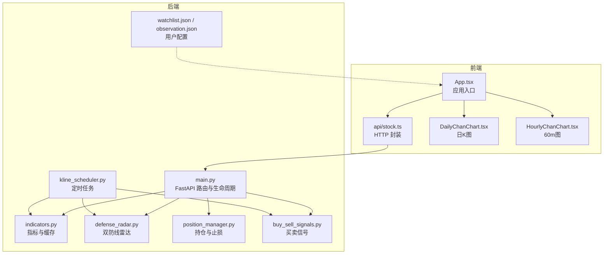
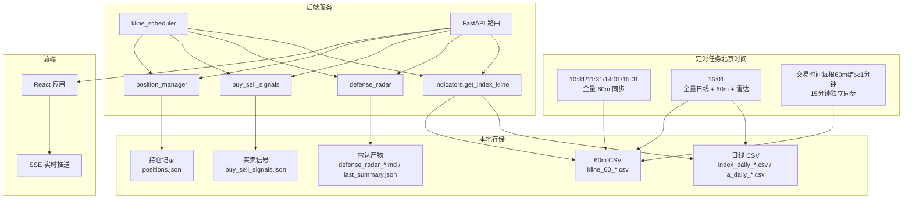
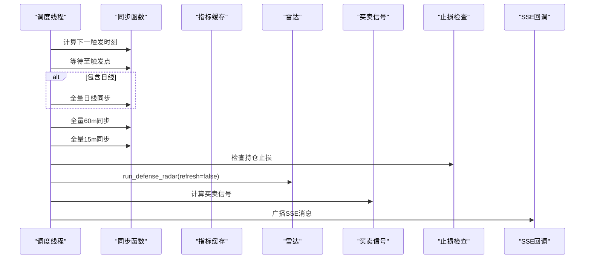
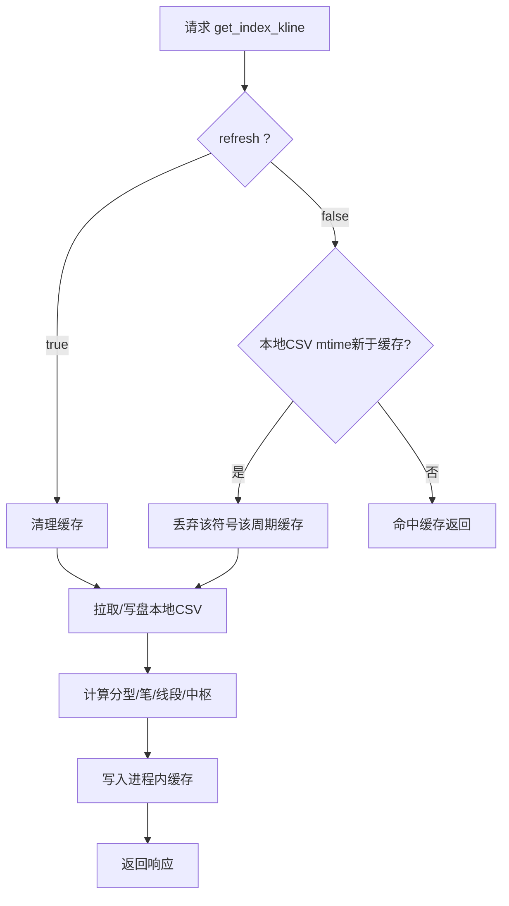
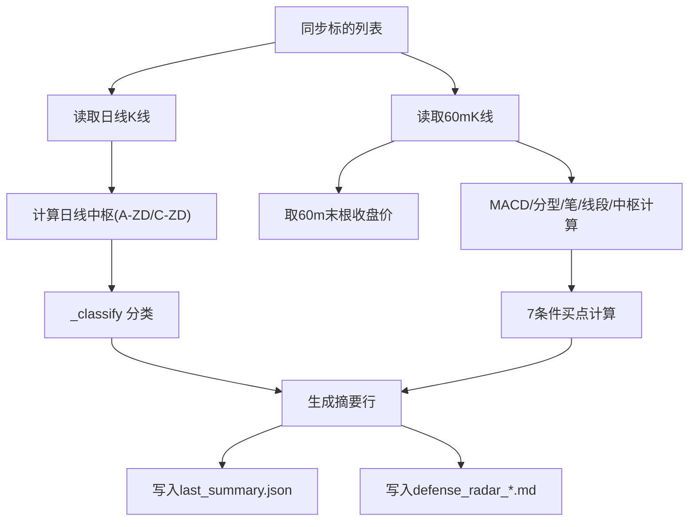
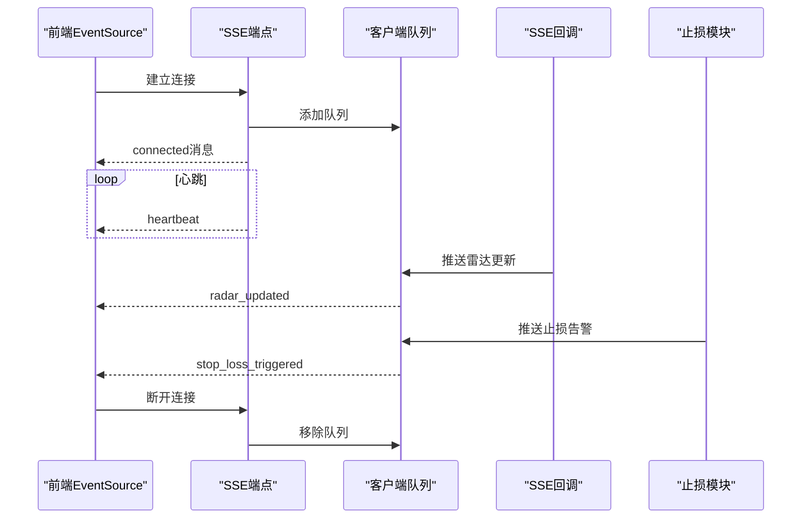
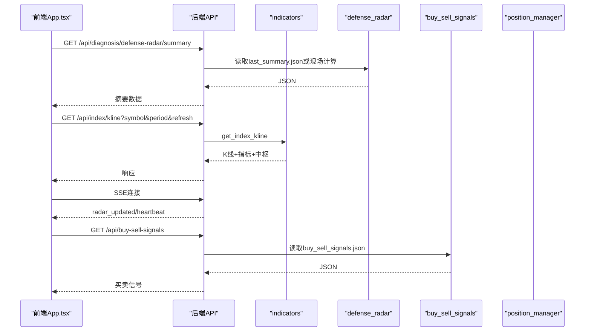
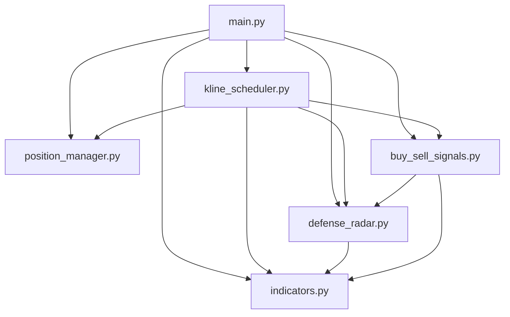

# 架构概览

<cite>
**本文引用的文件**
- [backend/main.py](file://backend/main.py)
- [backend/services/kline_scheduler.py](file://backend/services/kline_scheduler.py)
- [backend/services/indicators.py](file://backend/services/indicators.py)
- [backend/services/defense_radar.py](file://backend/services/defense_radar.py)
- [backend/services/position_manager.py](file://backend/services/position_manager.py)
- [backend/services/buy_sell_signals.py](file://backend/services/buy_sell_signals.py)
- [backend/run_defense_radar.py](file://backend/run_defense_radar.py)
- [backend/run_trade_command.py](file://backend/run_trade_command.py)
- [backend/data/watchlist.json](file://backend/data/watchlist.json)
- [backend/data/observation.json](file://backend/data/observation.json)
- [frontend/src/App.tsx](file://frontend/src/App.tsx)
- [frontend/src/api/stock.ts](file://frontend/src/api/stock.ts)
- [frontend/src/DailyChanChart.tsx](file://frontend/src/DailyChanChart.tsx)
- [frontend/src/HourlyChanChart.tsx](file://frontend/src/HourlyChanChart.tsx)
- [README.md](file://README.md)
</cite>

## 目录
1. [简介](#简介)
2. [项目结构](#项目结构)
3. [核心组件](#核心组件)
4. [架构总览](#架构总览)
5. [详细组件分析](#详细组件分析)
6. [依赖关系分析](#依赖关系分析)
7. [性能考量](#性能考量)
8. [故障排查指南](#故障排查指南)
9. [结论](#结论)
10. [附录](#附录)

## 简介
本系统采用前后端分离的微服务架构，后端以 FastAPI 提供 REST API，负责数据获取、缓存、计算与定时任务；前端以 React + ECharts 提供可视化与交互。系统围绕“本地优先”的数据策略，通过进程内响应缓存与本地 CSV 文件实现高效的数据流转，并以 SSE 实现实时推送。定时任务基于北京时间 Asia/Shanghai 的槽位策略，确保日线与 60 分钟数据的同步与雷达计算。

## 项目结构
- 后端
  - 路由与生命周期：backend/main.py
  - 定时任务：services/kline_scheduler.py
  - 指标与缓存：services/indicators.py
  - 雷达与摘要：services/defense_radar.py
  - 持仓与止损：services/position_manager.py
  - 买卖信号：services/buy_sell_signals.py
  - 命令行工具：run_defense_radar.py、run_trade_command.py
  - 用户配置：backend/data/watchlist.json、observation.json
- 前端
  - 应用入口与路由：frontend/src/App.tsx
  - API 封装：frontend/src/api/stock.ts
  - 图表组件：DailyChanChart.tsx、HourlyChanChart.tsx

**图表来源**
- [backend/main.py:1-514](file://backend/main.py#L1-L514)
- [backend/services/kline_scheduler.py:1-492](file://backend/services/kline_scheduler.py#L1-L492)
- [backend/services/indicators.py:1-200](file://backend/services/indicators.py#L1-L200)
- [backend/services/defense_radar.py:1-800](file://backend/services/defense_radar.py#L1-L800)
- [backend/services/position_manager.py:1-210](file://backend/services/position_manager.py#L1-L210)
- [backend/services/buy_sell_signals.py:1-200](file://backend/services/buy_sell_signals.py#L1-L200)
- [frontend/src/App.tsx:1-800](file://frontend/src/App.tsx#L1-L800)
- [frontend/src/api/stock.ts:1-468](file://frontend/src/api/stock.ts#L1-L468)

**章节来源**
- [README.md:216-244](file://README.md#L216-L244)

## 核心组件
- FastAPI 应用与生命周期
  - 使用 lifespan 在启动时初始化定时任务与 SSE 回调，在关闭时优雅退出。
  - 提供指标查询、K 线、雷达摘要、持仓管理、观察与自选列表等接口。
- 定时任务调度器（kline_scheduler）
  - 北京时间 Asia/Shanghai，独立线程按槽位执行：10:31/11:31/14:01/15:01 全量 60m 同步；16:01 全量日线 + 60m + 雷达。
  - 支持 15 分钟独立同步槽位，交易时间内每根 60m K 结束后 1 分钟触发。
  - 多 worker 去重，文件锁保障唯一调度实例。
- 指标与缓存（indicators）
  - 进程内响应缓存 + 本地 CSV mtime 失效机制，日线与 60m 缓存互不干扰。
  - 支持 refresh 参数：true 时强制拉网并写盘，false 时优先读本地并按 mtime 触发重算。
- 双防线雷达（defense_radar）
  - 基于日线中枢与 60m 现价计算，产出 Markdown 与 last_summary.json，供前端快速读取。
  - 与前端日线 A-ZD/C-ZD 一致，摘要包含“有警报”与“60m 末笔方向”等关键字段。
- 持仓与止损（position_manager）
  - 记录一买/二买持仓，定时检查战术止损与战略止损，触发清仓并通过 SSE 推送告警。
- 买卖信号（buy_sell_signals）
  - 定时批量计算 watchlist + observation 的买卖信号，写入 buy_sell_signals.json，前端直接读取。
- 前端（React + ECharts）
  - App.tsx 统一管理 Tab、雷达摘要、K 线数据与 SSE 连接。
  - DailyChanChart.tsx 与 HourlyChanChart.tsx 展示日 K 与 60m 图，包含中枢、分型、笔、线段与 MACD/BOLL。

**章节来源**
- [backend/main.py:80-92](file://backend/main.py#L80-L92)
- [backend/services/kline_scheduler.py:33-46](file://backend/services/kline_scheduler.py#L33-L46)
- [backend/services/indicators.py:88-174](file://backend/services/indicators.py#L88-L174)
- [backend/services/defense_radar.py:101-165](file://backend/services/defense_radar.py#L101-L165)
- [backend/services/position_manager.py:22-30](file://backend/services/position_manager.py#L22-L30)
- [backend/services/buy_sell_signals.py:24-62](file://backend/services/buy_sell_signals.py#L24-L62)
- [frontend/src/App.tsx:598-750](file://frontend/src/App.tsx#L598-L750)

## 架构总览
系统采用“后端 API + 前端可视化”的微服务模式，后端通过定时任务将数据落盘到本地 CSV，前端通过 REST API 与 SSE 获取数据与实时推送。数据流从定时任务写盘、后端缓存计算、前端渲染展示形成闭环。

**图表来源**
- [backend/services/kline_scheduler.py:114-176](file://backend/services/kline_scheduler.py#L114-L176)
- [backend/services/indicators.py:176-187](file://backend/services/indicators.py#L176-L187)
- [backend/services/defense_radar.py:747-800](file://backend/services/defense_radar.py#L747-L800)
- [backend/services/buy_sell_signals.py:34-62](file://backend/services/buy_sell_signals.py#L34-L62)
- [backend/services/position_manager.py:19-21](file://backend/services/position_manager.py#L19-L21)
- [backend/main.py:213-252](file://backend/main.py#L213-L252)

## 详细组件分析

### 定时任务调度系统（kline_scheduler）
- 调度策略
  - 北京时间 Asia/Shanghai，独立线程按槽位 sleep 到下一触发点。
  - 主槽位：10:31/11:31/14:01/15:01 全量 60m 同步；16:01 全量日线 + 60m + 雷达。
  - 15 分钟槽位：交易时间内每根 60m K 结束后 1 分钟触发，独立同步 15m。
- 任务内容
  - 同步标的：上证指数 + 雷达监控池 + observation。
  - 执行顺序：日线（可选）→ 60m → 15m → 持仓止损检查 → 雷达计算 → 买卖信号 → 作战指令报告。
  - 多 worker 去重：文件锁，仅一个进程启动调度器。
- 健康状态
  - 状态文件 /tmp/kline_scheduler_status.json，包含心跳、下次调度、槽位计数等。
  - get_scheduler_status 支持多 worker 读取共享状态。

**图表来源**
- [backend/services/kline_scheduler.py:211-256](file://backend/services/kline_scheduler.py#L211-L256)
- [backend/services/kline_scheduler.py:448-492](file://backend/services/kline_scheduler.py#L448-L492)

**章节来源**
- [backend/services/kline_scheduler.py:39-46](file://backend/services/kline_scheduler.py#L39-L46)
- [backend/services/kline_scheduler.py:122-128](file://backend/services/kline_scheduler.py#L122-L128)
- [backend/services/kline_scheduler.py:211-256](file://backend/services/kline_scheduler.py#L211-L256)
- [backend/services/kline_scheduler.py:410-445](file://backend/services/kline_scheduler.py#L410-L445)

### 数据获取与缓存（indicators）
- 数据源与落盘
  - 日线：指数与 A 股/ETF 本地 CSV；港股日线无本地 CSV，仅 TTL 缓存。
  - 60m/15m：kline_60_*.csv 与 kline_15_*.csv。
- 缓存机制
  - 进程内响应缓存，键为 (symbol, period, start_date, end_date)。
  - refresh=false 时，若本地 CSV mtime 新于缓存记录，则丢弃该符号该周期下全部缓存并重算。
  - refresh=true 时，清除该符号该周期下全部缓存并完整计算。
- 复权与调整
  - 指数/ETF 无复权；A 股/港股按规则标注复权类型。

**图表来源**
- [backend/services/indicators.py:121-174](file://backend/services/indicators.py#L121-L174)
- [backend/services/indicators.py:176-187](file://backend/services/indicators.py#L176-L187)

**章节来源**
- [backend/services/indicators.py:88-174](file://backend/services/indicators.py#L88-L174)
- [backend/services/indicators.py:176-187](file://backend/services/indicators.py#L176-L187)

### 双防线雷达（defense_radar）
- 输入
  - 日线：中枢 A-ZD/C-ZD（按时间排序取首段与末段下沿）。
  - 60m：现价取末根收盘。
- 输出
  - logs/defense_radar/defense_radar_*.md 表格。
  - last_summary.json：generated_at + symbols[]，包含 alert、has_alert、pen_60m、full_trigger 等字段。
- 与前端对齐
  - 摘要字段与前端 tab 显隐逻辑一致；摘要生成时间与 md 同步。

**图表来源**
- [backend/services/defense_radar.py:418-428](file://backend/services/defense_radar.py#L418-L428)
- [backend/services/defense_radar.py:600-744](file://backend/services/defense_radar.py#L600-L744)
- [backend/services/defense_radar.py:747-800](file://backend/services/defense_radar.py#L747-L800)

**章节来源**
- [backend/services/defense_radar.py:101-165](file://backend/services/defense_radar.py#L101-L165)
- [backend/services/defense_radar.py:418-428](file://backend/services/defense_radar.py#L418-L428)
- [backend/services/defense_radar.py:747-800](file://backend/services/defense_radar.py#L747-L800)

### 实时数据推送（SSE）
- SSE 端点
  - /api/sse/radar-updates：客户端连接后持续推送雷达更新与止损告警。
- 客户端管理
  - 维护客户端队列，心跳保活，断开清理。
- 广播机制
  - 定时任务完成后通过回调广播“雷达更新”消息；止损触发时推送“止损告警”。

**图表来源**
- [backend/main.py:213-252](file://backend/main.py#L213-L252)
- [backend/main.py:28-71](file://backend/main.py#L28-L71)
- [backend/services/position_manager.py:139-145](file://backend/services/position_manager.py#L139-L145)

**章节来源**
- [backend/main.py:213-252](file://backend/main.py#L213-L252)
- [backend/main.py:28-71](file://backend/main.py#L28-L71)
- [backend/services/position_manager.py:22-30](file://backend/services/position_manager.py#L22-L30)

### 组件间通信与接口设计
- 后端 API
  - GET /api/index/kline：核心接口，支持 daily/60/15 周期与 refresh 控制。
  - GET /api/diagnosis/defense-radar/summary：优先读 last_summary.json。
  - GET /api/sse/radar-updates：SSE 实时推送。
  - 持仓管理：GET /api/positions、POST /api/positions/buy、POST /api/positions/sell、GET /api/positions/history。
  - 用户配置：GET /api/watchlist、GET /api/observation。
  - 买卖信号与破位状态：GET /api/buy-sell-signals、GET /api/broken-symbols。
- 前端调用
  - api/stock.ts 统一封装 fetchWithRetry、Base URL 与 SSE 连接。
  - App.tsx 管理雷达摘要、K 线数据与 SSE 连接生命周期。

**图表来源**
- [backend/main.py:110-186](file://backend/main.py#L110-L186)
- [backend/main.py:183-206](file://backend/main.py#L183-L206)
- [backend/main.py:213-252](file://backend/main.py#L213-L252)
- [backend/main.py:481-513](file://backend/main.py#L481-L513)
- [frontend/src/api/stock.ts:117-130](file://frontend/src/api/stock.ts#L117-L130)
- [frontend/src/api/stock.ts:448-466](file://frontend/src/api/stock.ts#L448-L466)

**章节来源**
- [backend/main.py:110-186](file://backend/main.py#L110-L186)
- [backend/main.py:183-206](file://backend/main.py#L183-L206)
- [backend/main.py:213-252](file://backend/main.py#L213-L252)
- [backend/main.py:481-513](file://backend/main.py#L481-L513)
- [frontend/src/api/stock.ts:117-130](file://frontend/src/api/stock.ts#L117-L130)
- [frontend/src/api/stock.ts:448-466](file://frontend/src/api/stock.ts#L448-L466)

## 依赖关系分析
- 后端模块耦合
  - main.py 依赖 kline_scheduler、defense_radar、position_manager、indicators 等模块。
  - kline_scheduler 依赖 indicators.get_index_kline、defense_radar.run_defense_radar、buy_sell_signals.*、position_manager.check_stop_loss。
  - defense_radar 依赖 indicators.get_index_kline 与前端对齐的中枢与笔向逻辑。
  - buy_sell_signals 依赖 defense_radar 输出目录与 watchlist/observation。
- 前后端依赖
  - 前端通过 api/stock.ts 调用后端接口，SSE 与后端回调解耦。

**图表来源**
- [backend/main.py:14-20](file://backend/main.py#L14-L20)
- [backend/services/kline_scheduler.py:28-31](file://backend/services/kline_scheduler.py#L28-L31)

**章节来源**
- [backend/main.py:14-20](file://backend/main.py#L14-L20)
- [backend/services/kline_scheduler.py:28-31](file://backend/services/kline_scheduler.py#L28-L31)

## 性能考量
- 缓存策略
  - 进程内响应缓存 + 本地 CSV mtime 失效，显著降低重复计算与网络请求。
  - refresh=true 时强制写盘，适合排障与预热；日常使用 refresh=false。
- 并发与异步
  - SSE 使用 asyncio.Queue 与线程安全写入，心跳保活避免连接中断。
  - 定时任务独立线程，多 worker 去重，避免重复执行。
- I/O 优化
  - 本地 CSV 顺序读取与 pandas 解析，减少网络抖动影响。
  - 15 分钟独立同步避免与主槽位重复同步 15m。

[本节为通用指导，无需具体文件分析]

## 故障排查指南
- 摘要 404 或无数据
  - 确认后端已重启并加载新路由；检查 last_summary.json 是否生成。
- 60m 报错“本地缓存不存在”
  - 未执行定时任务或从未对该 symbol 使用 refresh=true 预热；先执行一次 refresh=true 或等待定时任务。
- 中枢长时间不变
  - 本地 CSV 未更新；或仅命中 TTL 内缓存（港股日线）。
- SSE 连接异常
  - 检查 /api/sse/radar-updates 是否可达；确认回调已设置；查看后端日志。

**章节来源**
- [README.md:255-263](file://README.md#L255-L263)

## 结论
本系统通过“本地优先 + 定时同步 + SSE 实时推送”的架构，实现了金融数据的高效获取、缓存与展示。定时任务以北京时间为基准，确保日线与 60 分钟数据的同步与雷达计算；后端以 FastAPI 提供稳定接口，前端以 React+ECharts 构建直观可视化界面。缓存与文件落盘策略降低了对外部网络的依赖，提升了系统稳定性与响应速度。

## 附录
- 命令行工具
  - 手动运行雷达：python backend/run_defense_radar.py [--refresh]
  - 作战指令引擎：python backend/run_trade_command.py

**章节来源**
- [backend/run_defense_radar.py:22-26](file://backend/run_defense_radar.py#L22-L26)
- [backend/run_trade_command.py:21-23](file://backend/run_trade_command.py#L21-L23)