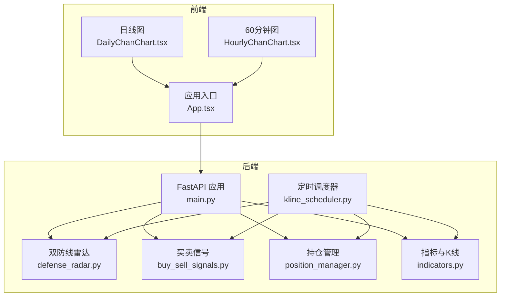
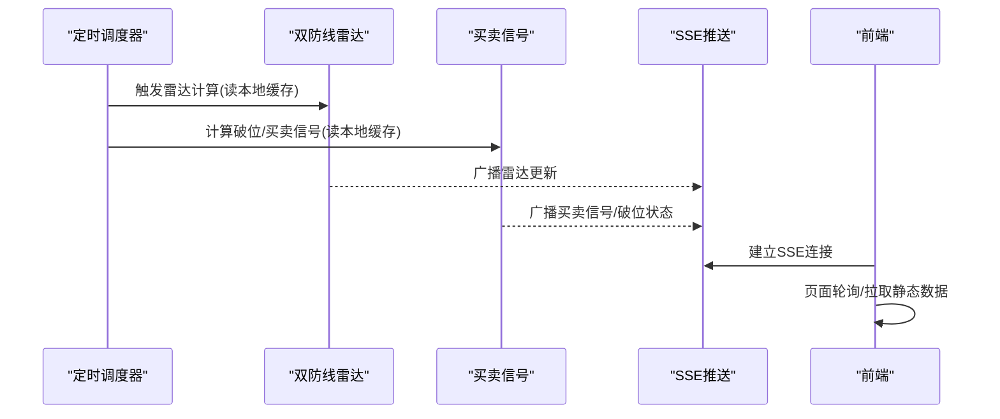
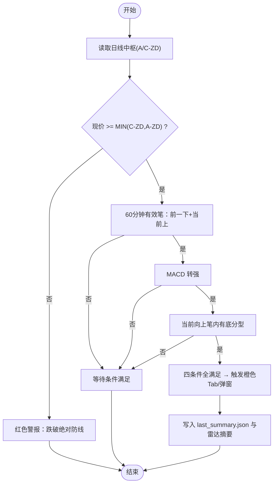
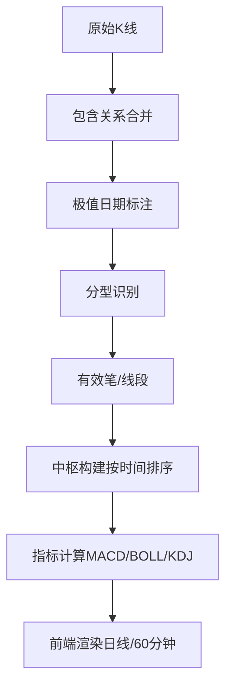
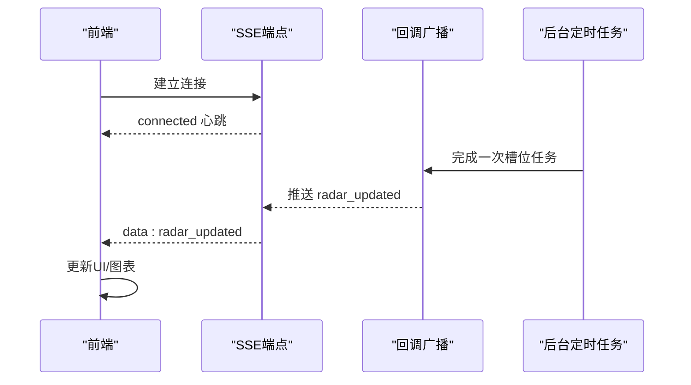
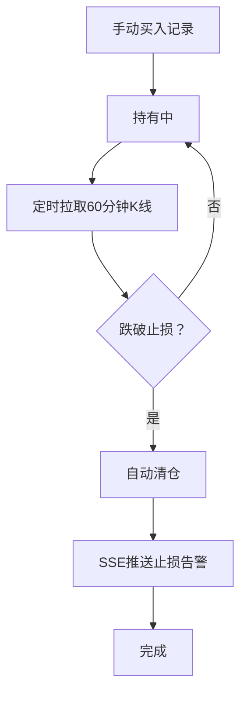
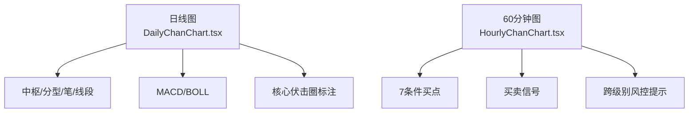
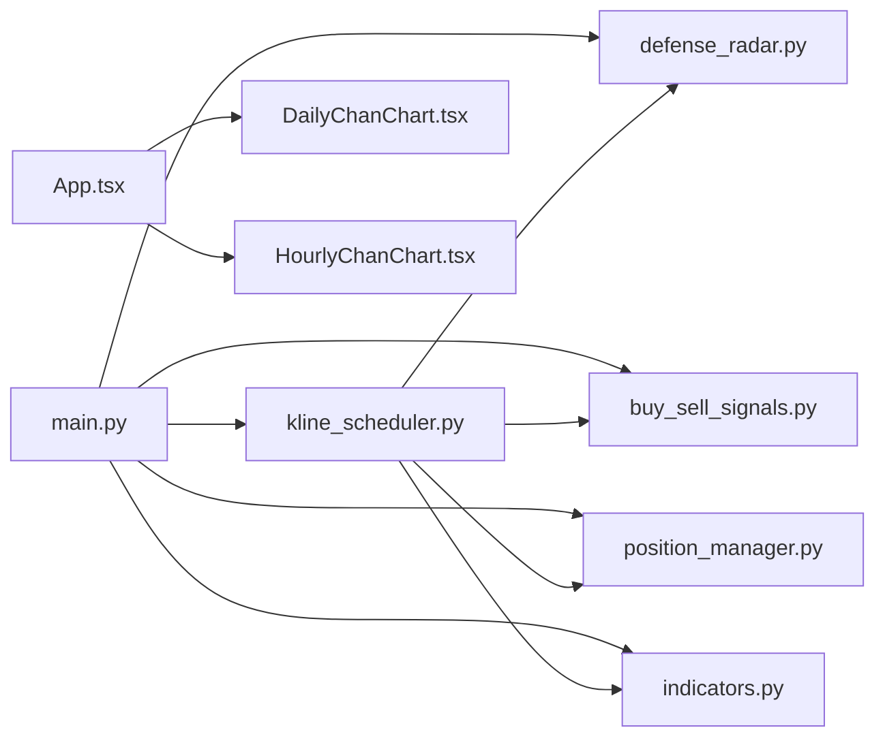

# 核心功能

<cite>
**本文引用的文件**
- [backend/main.py](file://backend/main.py)
- [backend/run_defense_radar.py](file://backend/run_defense_radar.py)
- [backend/services/defense_radar.py](file://backend/services/defense_radar.py)
- [backend/services/buy_sell_signals.py](file://backend/services/buy_sell_signals.py)
- [backend/services/position_manager.py](file://backend/services/position_manager.py)
- [backend/services/indicators.py](file://backend/services/indicators.py)
- [backend/services/kline_scheduler.py](file://backend/services/kline_scheduler.py)
- [frontend/src/DailyChanChart.tsx](file://frontend/src/DailyChanChart.tsx)
- [frontend/src/HourlyChanChart.tsx](file://frontend/src/HourlyChanChart.tsx)
- [frontend/src/App.tsx](file://frontend/src/App.tsx)
</cite>

## 目录
1. [简介](#简介)
2. [项目结构](#项目结构)
3. [核心组件](#核心组件)
4. [架构总览](#架构总览)
5. [详细组件分析](#详细组件分析)
6. [依赖关系分析](#依赖关系分析)
7. [性能考量](#性能考量)
8. [故障排查指南](#故障排查指南)
9. [结论](#结论)
10. [附录](#附录)

## 简介
本文件面向金融分析系统的使用者与开发者，系统性梳理并讲解以下核心能力：
- 缠论可视化分析：K线合并、分型识别、笔与线段计算、中枢构建与展示
- 双防线雷达预警：黄金伏击圈理论与四条件触发机制
- 实时数据推送：基于 Server-Sent Events 的增量更新通道
- 持仓管理：手动记录、止损监控与自动清仓
- 图表展示：日K线与60分钟图的专业可视化
- 使用场景与价值：如何结合上述能力提升投资决策质量

## 项目结构
后端采用 FastAPI 提供 REST API 与 SSE，定时任务由独立线程驱动；前端基于 React + ECharts 构建专业图表。

**图示来源**
- [backend/main.py](file://backend/main.py)
- [backend/services/kline_scheduler.py](file://backend/services/kline_scheduler.py)
- [backend/services/defense_radar.py](file://backend/services/defense_radar.py)
- [backend/services/buy_sell_signals.py](file://backend/services/buy_sell_signals.py)
- [backend/services/position_manager.py](file://backend/services/position_manager.py)
- [backend/services/indicators.py](file://backend/services/indicators.py)
- [frontend/src/App.tsx](file://frontend/src/App.tsx)
- [frontend/src/DailyChanChart.tsx](file://frontend/src/DailyChanChart.tsx)
- [frontend/src/HourlyChanChart.tsx](file://frontend/src/HourlyChanChart.tsx)

**章节来源**
- [backend/main.py](file://backend/main.py)
- [backend/services/kline_scheduler.py](file://backend/services/kline_scheduler.py)
- [frontend/src/App.tsx](file://frontend/src/App.tsx)

## 核心组件
- 双防线雷达与黄金伏击圈：基于日线中枢与60分钟现价的联动预警，包含四条件触发与7条件买点过滤
- 缠论可视化：K线包含关系合并、分型识别、笔/线段/中枢构建与前端渲染
- 实时推送：SSE 端点持续推送雷达更新与止损告警
- 持仓管理：手动记录、止损阈值设定、定时检查与自动清仓
- 图表展示：日K线与60分钟图，集成中枢、分型、笔、线段、MACD与买卖信号

**章节来源**
- [backend/services/defense_radar.py](file://backend/services/defense_radar.py)
- [backend/services/indicators.py](file://backend/services/indicators.py)
- [backend/main.py](file://backend/main.py)
- [backend/services/position_manager.py](file://backend/services/position_manager.py)
- [frontend/src/DailyChanChart.tsx](file://frontend/src/DailyChanChart.tsx)
- [frontend/src/HourlyChanChart.tsx](file://frontend/src/HourlyChanChart.tsx)

## 架构总览
后端通过定时任务统一拉取/更新日线与60分钟K线，计算中枢与缠论要素，生成雷达与买卖信号；前端通过 REST API 与 SSE 获取数据与实时更新。

**图示来源**
- [backend/services/kline_scheduler.py](file://backend/services/kline_scheduler.py)
- [backend/services/defense_radar.py](file://backend/services/defense_radar.py)
- [backend/services/buy_sell_signals.py](file://backend/services/buy_sell_signals.py)
- [backend/main.py](file://backend/main.py)

## 详细组件分析

### 双防线雷达与黄金伏击圈
- 理论基础
  - 绝对防线：取日线 A 中枢下沿与 C 中枢下沿的较大值，构成核心伏击圈基准线
  - 伏击圈：基准线上浮 3%，在此区间内视为“核心伏击圈”
  - 一级警报：现价处于绝对防线与缓冲带之间，提示进入伏击圈
- 四条件触发（串联）
  - 条件1：现价在绝对防线之上（keepDailySupport）
  - 条件2：60分钟有效笔为“前一下笔、当前上笔”（切换向下为向上）
  - 条件3：MACD 转强（柱值上升或水上漂）
  - 条件4：当前向上笔内存在底分型（蓝三角）
- 7条件买点（与前端对齐）
  - inC 中枢：现价在 C 中枢内
  - hasBottomDivInSwitch：底背驰点落在当前向上笔内
  - bollBuy：BOLL 站回中轨
- 输出
  - 生成雷达摘要 Markdown 与 last_summary.json，供前端秒读
  - SSE 推送“雷达已更新”事件

**图示来源**
- [backend/services/defense_radar.py](file://backend/services/defense_radar.py)
- [backend/services/kline_scheduler.py](file://backend/services/kline_scheduler.py)

**章节来源**
- [backend/services/defense_radar.py](file://backend/services/defense_radar.py)
- [backend/services/kline_scheduler.py](file://backend/services/kline_scheduler.py)
- [backend/main.py](file://backend/main.py)
- [frontend/src/DailyChanChart.tsx](file://frontend/src/DailyChanChart.tsx)
- [frontend/src/HourlyChanChart.tsx](file://frontend/src/HourlyChanChart.tsx)

### 缠论可视化分析（K线合并、分型、笔/线段/中枢）
- K线包含关系合并
  - 根据包含关系合并相邻K线，得到标准化序列，并维护极值对应的实际日期
- 分型识别
  - 顶/底分型与合并K线日期对齐，确保与前端图示一致
- 笔与线段
  - 基于标准化K线推导有效笔与线段折线
- 中枢
  - 按时间排序中枢，取 A 中枢与 C 中枢，用于日线图的“核心伏击圈”与前端标注
- 指标扩展
  - 计算 MACD、布林（BOLL）、KDJ 等，供图表与买卖信号过滤使用

**图示来源**
- [backend/services/indicators.py](file://backend/services/indicators.py)
- [frontend/src/DailyChanChart.tsx](file://frontend/src/DailyChanChart.tsx)
- [frontend/src/HourlyChanChart.tsx](file://frontend/src/HourlyChanChart.tsx)

**章节来源**
- [backend/services/indicators.py](file://backend/services/indicators.py)
- [frontend/src/DailyChanChart.tsx](file://frontend/src/DailyChanChart.tsx)
- [frontend/src/HourlyChanChart.tsx](file://frontend/src/HourlyChanChart.tsx)

### 实时数据推送（Server-Sent Events）
- SSE 端点
  - /api/sse/radar-updates：建立连接后持续推送“雷达已更新”与心跳
- 广播机制
  - 后台定时任务完成后调用回调，向所有订阅队列写入消息
  - 断线清理，保持连接健壮
- 前端接入
  - 建立 EventSource 连接，监听“radar_updated”事件，更新雷达摘要与图表

**图示来源**
- [backend/main.py](file://backend/main.py)
- [backend/services/kline_scheduler.py](file://backend/services/kline_scheduler.py)

**章节来源**
- [backend/main.py](file://backend/main.py)
- [backend/services/kline_scheduler.py](file://backend/services/kline_scheduler.py)
- [frontend/src/App.tsx](file://frontend/src/App.tsx)

### 持仓管理与自动止损
- 手动记录
  - 提供买入接口，记录代码、名称、信号类型、买入价、金额、战术/战略止损线
- 定时检查
  - 每次槽位任务拉取60分钟K线，计算最新价格并检查止损
- 自动清仓与告警
  - 触发后自动清仓并推送 SSE 止损告警

**图示来源**
- [backend/services/position_manager.py](file://backend/services/position_manager.py)
- [backend/services/kline_scheduler.py](file://backend/services/kline_scheduler.py)
- [backend/main.py](file://backend/main.py)

**章节来源**
- [backend/services/position_manager.py](file://backend/services/position_manager.py)
- [backend/services/kline_scheduler.py](file://backend/services/kline_scheduler.py)
- [backend/main.py](file://backend/main.py)

### 图表展示（日K线与60分钟图）
- 日线图
  - 展示中枢（A/B/C）、分型、笔、线段、MACD、BOLL
  - 核心伏击圈（绝对防线向上3%）与现价对比
- 60分钟图
  - 与日线联动，展示7条件买点与买卖信号
  - 跨级别风控：若现价脱离核心伏击圈，给出高乖离警告与仓位建议
- 前端交互
  - Tooltip 丰富，支持中枢区间提示、MACD 面积与背驰提示
  - 支持数据缩放、图例滚动与坐标轴联动

**图示来源**
- [frontend/src/DailyChanChart.tsx](file://frontend/src/DailyChanChart.tsx)
- [frontend/src/HourlyChanChart.tsx](file://frontend/src/HourlyChanChart.tsx)

**章节来源**
- [frontend/src/DailyChanChart.tsx](file://frontend/src/DailyChanChart.tsx)
- [frontend/src/HourlyChanChart.tsx](file://frontend/src/HourlyChanChart.tsx)

### 买卖信号批量计算
- 范围
  - 覆盖 watchlist 与 observation 中的标的
- 信号类别
  - 买：一买（复用）、二买、三买
  - 卖：一卖、二卖、三卖
- 过滤与一致性
  - 与前端 computeHourlyBuySellState 逻辑对齐，包含 keepDailySupport、inCCentral、macdBuy 等过滤条件
- 输出
  - buy_sell_signals.json，前端刷新后直接读取

**章节来源**
- [backend/services/buy_sell_signals.py](file://backend/services/buy_sell_signals.py)
- [backend/services/kline_scheduler.py](file://backend/services/kline_scheduler.py)

## 依赖关系分析
- 后端
  - main.py 依赖 defense_radar、buy_sell_signals、position_manager、indicators、kline_scheduler
  - defense_radar 依赖 indicators 的 K 线与中枢计算
  - kline_scheduler 统一调度日线/60分钟/15分钟同步、雷达、买卖信号、止损检查与 SSE 广播
- 前端
  - App.tsx 组织图表与数据流，DailyChanChart.tsx/HourlyChanChart.tsx 负责可视化
  - 与后端 API/SSE 交互

**图示来源**
- [backend/main.py](file://backend/main.py)
- [backend/services/defense_radar.py](file://backend/services/defense_radar.py)
- [backend/services/buy_sell_signals.py](file://backend/services/buy_sell_signals.py)
- [backend/services/position_manager.py](file://backend/services/position_manager.py)
- [backend/services/indicators.py](file://backend/services/indicators.py)
- [backend/services/kline_scheduler.py](file://backend/services/kline_scheduler.py)
- [frontend/src/App.tsx](file://frontend/src/App.tsx)
- [frontend/src/DailyChanChart.tsx](file://frontend/src/DailyChanChart.tsx)
- [frontend/src/HourlyChanChart.tsx](file://frontend/src/HourlyChanChart.tsx)

**章节来源**
- [backend/main.py](file://backend/main.py)
- [backend/services/kline_scheduler.py](file://backend/services/kline_scheduler.py)
- [frontend/src/App.tsx](file://frontend/src/App.tsx)

## 性能考量
- 响应缓存与本地 CSV
  - 指标模块对日线/60分钟/15分钟响应做内存缓存，本地 CSV 更新后触发对应缓存失效与重算
- 定时任务节拍
  - 10:31/11:31/14:01/15:01（60分钟+雷达），16:01（日线+60分钟+雷达），减少网络抖动影响
- SSE 广播
  - 仅在任务完成后推送，避免频繁写队列
- 前端渲染
  - ECharts SVG 渲染，支持大数据量缩放与联动

**章节来源**
- [backend/services/indicators.py](file://backend/services/indicators.py)
- [backend/services/kline_scheduler.py](file://backend/services/kline_scheduler.py)
- [backend/main.py](file://backend/main.py)

## 故障排查指南
- 雷达/买卖信号为空
  - 确认定时任务是否执行成功，查看 logs/defense_radar 下的摘要与 last_summary.json
  - 手动触发后端雷达：POST /api/diagnosis/defense-radar
- SSE 无更新
  - 检查 /api/sse/radar-updates 是否有连接与心跳
  - 查看后台定时任务日志与心跳文件
- 持仓止损未触发
  - 确认定时任务是否拉取到最新60分钟K线
  - 检查 position_manager 的 JSON 文件是否存在与可写
- 图表异常
  - 检查后端 K 线缓存是否完整覆盖请求区间
  - 前端 ECharts 配置与数据格式是否正确

**章节来源**
- [backend/run_defense_radar.py](file://backend/run_defense_radar.py)
- [backend/main.py](file://backend/main.py)
- [backend/services/kline_scheduler.py](file://backend/services/kline_scheduler.py)
- [backend/services/position_manager.py](file://backend/services/position_manager.py)

## 结论
本系统通过“定时任务统一更新 + 后端 API/SSE + 前端专业图表”的架构，实现了从缠论可视化到双防线雷达预警、实时推送与持仓风控的闭环。用户可基于日线中枢与60分钟信号进行跨级别联动决策，结合实时推送与自动止损，显著提升交易纪律与风险控制水平。

## 附录

### 使用场景与价值
- 缠论可视化
  - 场景：识别中枢、笔与线段转折，辅助趋势判断
  - 价值：统一分型与中枢标准，降低主观偏差
- 双防线雷达
  - 场景：捕捉核心伏击圈内的买点机会
  - 价值：四条件串联过滤，提高信号质量
- 实时推送
  - 场景：盘中跟随雷达与买卖信号变化
  - 价值：减少人工监控成本，提升响应速度
- 持仓管理
  - 场景：记录与风控一体化
  - 价值：自动止损与告警，保护本金
- 图表展示
  - 场景：日线与60分钟图联动分析
  - 价值：丰富的技术指标与信号标注，提升决策效率

### 关键接口与配置说明（路径指引）
- 后端接口
  - 获取指标：GET /api/stock/indicators?code=...
  - 获取历史指标：GET /api/stock/history-indicators?code=...&start_date=...
  - 获取指数K线：GET /api/index/kline?symbol=...&period=...&start_date=...
  - 雷达摘要：GET /api/diagnosis/defense-radar/summary?refresh=false
  - 手动触发雷达：POST /api/diagnosis/defense-radar?refresh=false
  - SSE 雷达更新：GET /api/sse/radar-updates
  - 一买检测：GET /api/first-buy-point?code=...
  - 一买扫描：GET /api/first-buy-point/scan
  - 持仓相关：GET /api/positions, POST /api/positions/buy, POST /api/positions/sell, GET /api/positions/history
  - 观察/自选：GET /api/watchlist, GET /api/observation
  - 破位状态：GET /api/broken-symbols
  - 买卖信号：GET /api/buy-sell-signals
- 前端
  - 图表组件：DailyChanChart.tsx、HourlyChanChart.tsx
  - 应用入口：App.tsx
- 配置与文件
  - 雷达输出目录：logs/defense_radar/
  - 持仓数据：data/positions.json
  - 观察/自选：backend/data/observation.json, backend/data/watchlist.json
  - 定时任务状态：/tmp/kline_scheduler_status.json
  - 定时任务锁：/tmp/kline_scheduler.lock

**章节来源**
- [backend/main.py](file://backend/main.py)
- [frontend/src/App.tsx](file://frontend/src/App.tsx)
- [frontend/src/DailyChanChart.tsx](file://frontend/src/DailyChanChart.tsx)
- [frontend/src/HourlyChanChart.tsx](file://frontend/src/HourlyChanChart.tsx)