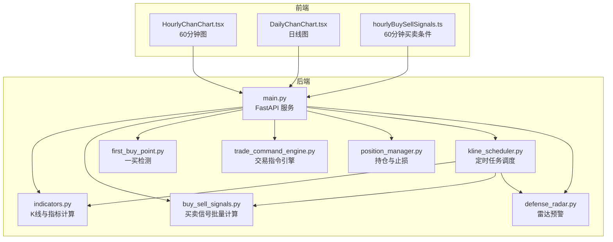
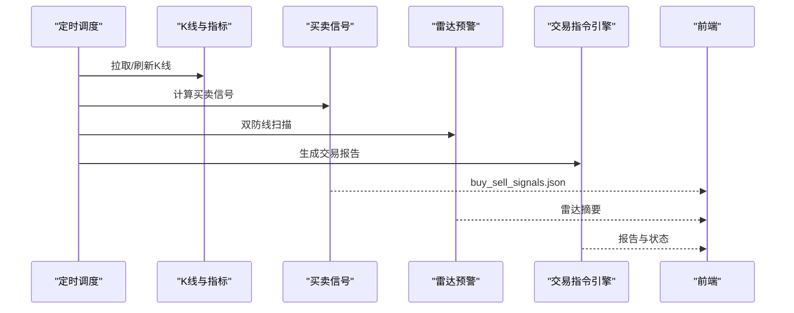
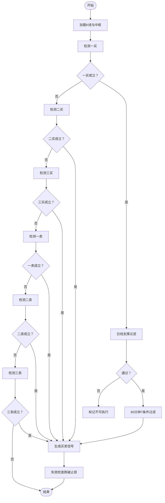
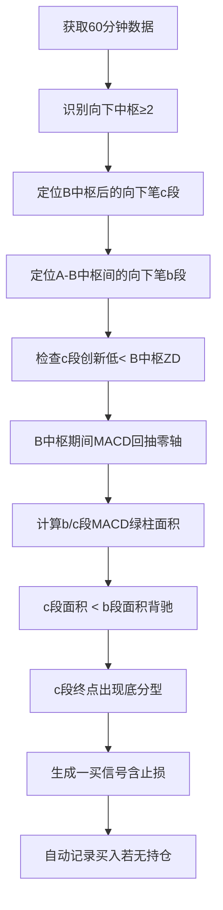
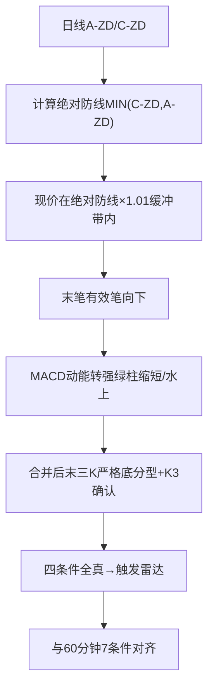
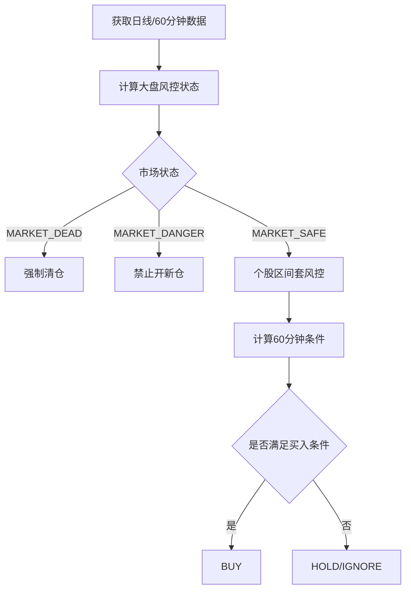
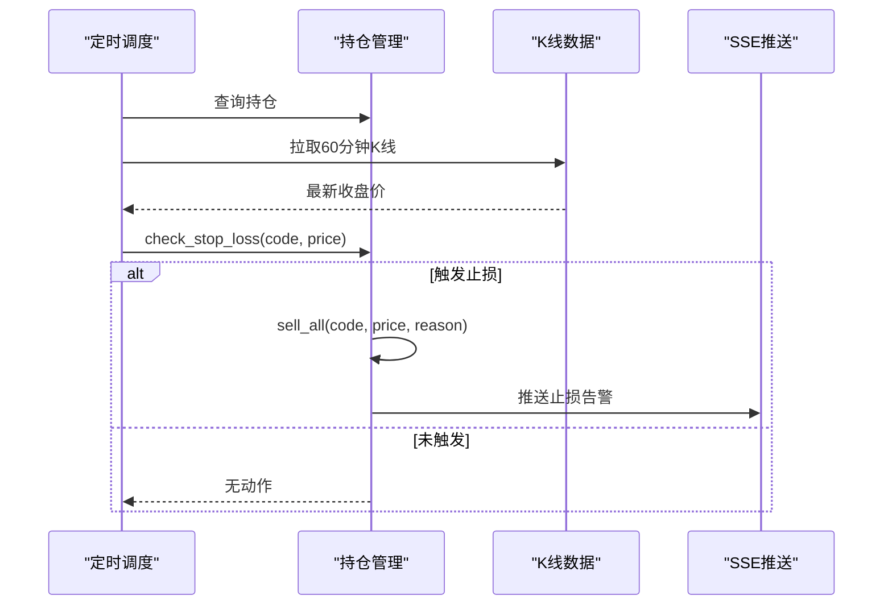
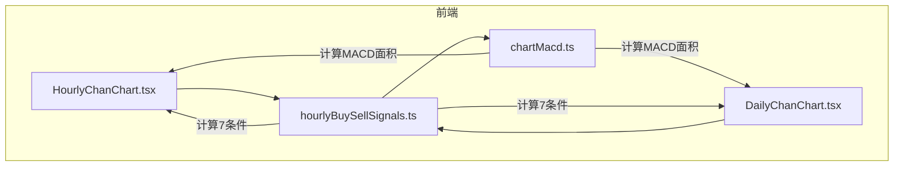
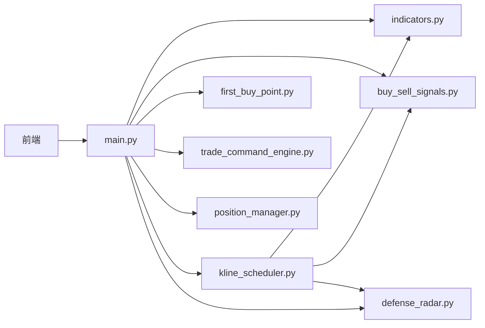

# 买卖信号分析

<cite>
**本文引用的文件**
- [buy_sell_signals.py](file://backend/services/buy_sell_signals.py)
- [indicators.py](file://backend/services/indicators.py)
- [trade_command_engine.py](file://backend/services/trade_command_engine.py)
- [defense_radar.py](file://backend/services/defense_radar.py)
- [first_buy_point.py](file://backend/services/first_buy_point.py)
- [position_manager.py](file://backend/services/position_manager.py)
- [kline_scheduler.py](file://backend/services/kline_scheduler.py)
- [main.py](file://backend/main.py)
- [hourlyBuySellSignals.ts](file://frontend/src/hourlyBuySellSignals.ts)
- [DailyChanChart.tsx](file://frontend/src/DailyChanChart.tsx)
- [HourlyChanChart.tsx](file://frontend/src/HourlyChanChart.tsx)
- [buy_sell_signals.json](file://logs/defense_radar/buy_sell_signals.json)
- [chartMacd.ts](file://frontend/src/chartMacd.ts)
</cite>

## 更新摘要
**变更内容**
- 重构买卖信号检测逻辑，引入更可靠的MACD分析和验证程序
- 增强信号检测的准确性和一致性，确保前后端逻辑完全对齐
- 改进MACD绿柱面积计算和验证机制，提升信号质量
- 优化状态机互斥逻辑，防止时空穿越和信号冲突

## 目录
1. [简介](#简介)
2. [项目结构](#项目结构)
3. [核心组件](#核心组件)
4. [架构概览](#架构概览)
5. [详细组件分析](#详细组件分析)
6. [依赖关系分析](#依赖关系分析)
7. [性能考量](#性能考量)
8. [故障排查指南](#故障排查指南)
9. [结论](#结论)
10. [附录](#附录)

## 简介
本文件面向买卖信号分析功能的技术文档，系统阐述以下内容：
- 买卖信号的生成算法与判断逻辑，涵盖技术指标阈值、趋势确认机制、信号过滤规则
- 交易指令引擎工作原理，包括订单执行、价格确认、成交回报等交易流程
- 信号质量评估体系，包括信号成功率、胜率统计、盈亏比分析等量化指标
- 信号配置与自定义指南，包括参数调整、条件筛选、批量处理等功能使用说明
- 信号与雷达预警的关系，包括信号来源、触发时机、验证机制等关联逻辑
- 实际案例分析，展示不同类型信号的识别与应用策略
- 信号回测与性能评估的方法与工具介绍

## 项目结构
后端采用模块化设计，围绕"K线数据获取 → 技术指标计算 → 信号检测 → 风控与执行 → 前端可视化"的闭环展开。前端通过 API 与后端交互，实现信号展示与用户交互。

**图表来源**
- [main.py:106-111](file://backend/main.py#L106-L111)
- [indicators.py:1-120](file://backend/services/indicators.py#L1-L120)
- [buy_sell_signals.py:1-30](file://backend/services/buy_sell_signals.py#L1-L30)
- [first_buy_point.py:1-30](file://backend/services/first_buy_point.py#L1-L30)
- [trade_command_engine.py:1-40](file://backend/services/trade_command_engine.py#L1-L40)
- [position_manager.py:1-30](file://backend/services/position_manager.py#L1-L30)
- [kline_scheduler.py:1-35](file://backend/services/kline_scheduler.py#L1-L35)
- [defense_radar.py:1-30](file://backend/services/defense_radar.py#L1-L30)
- [HourlyChanChart.tsx:179-200](file://frontend/src/HourlyChanChart.tsx#L179-L200)
- [DailyChanChart.tsx:161-183](file://frontend/src/DailyChanChart.tsx#L161-L183)
- [hourlyBuySellSignals.ts:1-20](file://frontend/src/hourlyBuySellSignals.ts#L1-L20)

**章节来源**
- [main.py:106-111](file://backend/main.py#L106-L111)
- [kline_scheduler.py:1-50](file://backend/services/kline_scheduler.py#L1-L50)

## 核心组件
- **K线与指标服务**：负责从本地缓存/网络拉取K线，计算MACD、布林等指标，提供统一的数据接口。
- **买卖信号模块**：基于缠论中枢与笔结构，实现一买、二买、三买、一卖、二卖、三卖的检测与过滤。
- **一买检测模块**：实现趋势底背驰的严格判定，输出信号与止损线。
- **雷达预警模块**：双防线"黄金伏击圈"扫描，结合MACD动能与分型确认，输出预警与7条件。
- **交易指令引擎**：三层风控（大盘、个股区间套、终极状态机），输出买卖决策与报告。
- **持仓管理**：记录买入、监控止损、清仓与SSE告警。
- **定时调度**：统一的K线同步与信号计算，保障数据一致性与时效性。
- **前端可视化**：60分钟与日线图联动，展示中枢、分型、背驰与买卖信号。

**章节来源**
- [indicators.py:1-120](file://backend/services/indicators.py#L1-L120)
- [buy_sell_signals.py:1-30](file://backend/services/buy_sell_signals.py#L1-L30)
- [first_buy_point.py:1-30](file://backend/services/first_buy_point.py#L1-L30)
- [defense_radar.py:1-30](file://backend/services/defense_radar.py#L1-L30)
- [trade_command_engine.py:1-40](file://backend/services/trade_command_engine.py#L1-L40)
- [position_manager.py:1-30](file://backend/services/position_manager.py#L1-L30)
- [kline_scheduler.py:1-50](file://backend/services/kline_scheduler.py#L1-L50)
- [hourlyBuySellSignals.ts:1-20](file://frontend/src/hourlyBuySellSignals.ts#L1-L20)

## 架构概览
买卖信号分析的系统架构遵循"后端无头、前端可视化"的设计，核心流程如下：
- **数据层**：K线与指标计算，支持本地缓存与增量更新。
- **信号层**：基于缠论与MACD的信号检测，包含7条件过滤与跨级别验证。
- **风控层**：大盘风控、区间套风控与状态机决策，确保交易安全。
- **执行层**：自动买入与止损监控，SSE推送告警。
- **展示层**：60分钟与日线图联动，实时呈现信号与条件。

**图表来源**
- [kline_scheduler.py:214-260](file://backend/services/kline_scheduler.py#L214-L260)
- [buy_sell_signals.py:581-685](file://backend/services/buy_sell_signals.py#L581-L685)
- [defense_radar.py:747-800](file://backend/services/defense_radar.py#L747-L800)
- [trade_command_engine.py:1-40](file://backend/services/trade_command_engine.py#L1-L40)
- [buy_sell_signals.json:1-20](file://logs/defense_radar/buy_sell_signals.json#L1-L20)

**章节来源**
- [kline_scheduler.py:214-260](file://backend/services/kline_scheduler.py#L214-L260)
- [buy_sell_signals.py:581-685](file://backend/services/buy_sell_signals.py#L581-L685)
- [defense_radar.py:747-800](file://backend/services/defense_radar.py#L747-L800)
- [trade_command_engine.py:1-40](file://backend/services/trade_command_engine.py#L1-L40)

## 详细组件分析

### 买卖信号生成与过滤

**更新** 重构了MACD分析和验证程序，增强了信号检测的准确性和一致性

- **一买（趋势底背驰）**：至少两个向下中枢，c段创新低，c段MACD绿柱面积小于b段，c段终点出现底分型。
- **二买**：一买后多头反击，随后空头反扑，回踩不创新低且力度衰减，MACD动能过滤或水上强势。
- **三买**：突破中枢上沿后的回踩不跌破中枢，回踩终点出现底分型，MACD水上漂。
- **一卖**：至少两个向上中枢，c段创新高，c段MACD红柱面积小于b段，c段终点出现顶分型。
- **二卖**：一卖后多头反击，随后空头反扑，回踩不创新高且力度衰减，MACD动能过滤或水下弱势。
- **三卖**：突破中枢下沿后的回踩不跌破中枢，回踩终点出现顶分型，MACD水下。

**MACD分析改进**：
- **绿柱面积计算**：使用更精确的MACD绿柱面积计算方法，确保背驰判定的准确性
- **零轴回抽验证**：改进MACD零轴回抽检测逻辑，提高信号可靠性
- **前后端对齐**：后端和前端的MACD计算逻辑完全一致，避免差异导致的信号冲突

信号过滤与验证：
- **日线支撑过滤**：现价需不低于MIN(C-ZD, A-ZD)，否则信号降级为不可执行。
- **60分钟条件**：中枢内、向上笔内底分型、底背驰点在向上笔内、MACD转强、BOLL站回中轨。
- **失效检查**：后续收盘价跌破止损线则信号失效。

**图表来源**
- [buy_sell_signals.py:77-191](file://backend/services/buy_sell_signals.py#L77-L191)
- [buy_sell_signals.py:198-302](file://backend/services/buy_sell_signals.py#L198-L302)
- [buy_sell_signals.py:309-396](file://backend/services/buy_sell_signals.py#L309-L396)
- [buy_sell_signals.py:403-493](file://backend/services/buy_sell_signals.py#L403-L493)
- [buy_sell_signals.py:499-574](file://backend/services/buy_sell_signals.py#L499-L574)
- [hourlyBuySellSignals.ts:426-556](file://frontend/src/hourlyBuySellSignals.ts#L426-L556)
- [hourlyBuySellSignals.ts:569-711](file://frontend/src/hourlyBuySellSignals.ts#L569-L711)
- [hourlyBuySellSignals.ts:722-818](file://frontend/src/hourlyBuySellSignals.ts#L722-L818)

**章节来源**
- [buy_sell_signals.py:77-191](file://backend/services/buy_sell_signals.py#L77-L191)
- [buy_sell_signals.py:198-302](file://backend/services/buy_sell_signals.py#L198-L302)
- [buy_sell_signals.py:309-396](file://backend/services/buy_sell_signals.py#L309-L396)
- [buy_sell_signals.py:403-493](file://backend/services/buy_sell_signals.py#L403-L493)
- [buy_sell_signals.py:499-574](file://backend/services/buy_sell_signals.py#L499-L574)
- [hourlyBuySellSignals.ts:426-556](file://frontend/src/hourlyBuySellSignals.ts#L426-L556)
- [hourlyBuySellSignals.ts:569-711](file://frontend/src/hourlyBuySellSignals.ts#L569-L711)
- [hourlyBuySellSignals.ts:722-818](file://frontend/src/hourlyBuySellSignals.ts#L722-L818)

### 一买检测（趋势底背驰）

**更新** 改进了MACD分析和验证程序，增强了信号检测的准确性

- **核心定义**：至少两个同向向下的中枢，当前向下笔（c段）创新低（跌破B中枢低点），c段MACD绿柱面积 < b段面积，向下笔走完出现底分型。
- **输出**：信号类型、触发日期、价格位置、背驰强度（面积比）、止损线（底分型最低价）。
- **自动买入**：检测到一买且无持仓时自动记录买入（金额10000元）。

**MACD分析改进**：
- **面积计算**：使用精确的MACD绿柱面积计算，确保背驰判定的准确性
- **零轴回抽**：改进MACD零轴回抽检测，提高信号可靠性
- **绝对新低检查**：c段必须是自A中枢开始以来所有向下笔的绝对最低点

**图表来源**
- [first_buy_point.py:332-512](file://backend/services/first_buy_point.py#L332-L512)

**章节来源**
- [first_buy_point.py:332-512](file://backend/services/first_buy_point.py#L332-L512)

### 雷达预警与信号关联

**更新** 雷达预警与信号检测逻辑进一步对齐，确保MACD分析的一致性

- **双防线"黄金伏击圈"**：基于日线A-ZD/C-ZD，现价在绝对防线MIN(C-ZD, A-ZD)基础上向上1%缓冲带内为伏击区。
- **四条件扳机（串联）**：①伏击带；②末笔有效笔向下；③MACD动能转强（绿柱缩短或水上）；④合并后末三K严格底分型+K3收盘>K2最低且与图分型一致。
- **与60分钟买点7条件对齐**：keepDailySupport、inCCentral、switchedDownToUp、hasBottomFractalInSwitch、hasBottomDivInSwitch、macdBuy、bollBuy。
- **信号来源**：雷达扫描与后端定时计算互补，前端以雷达摘要与后端信号JSON共同驱动。

**MACD分析一致性**：
- **前后端对齐**：雷达和买卖信号模块使用相同的MACD计算逻辑
- **验证机制**：双重验证确保MACD分析的准确性

**图表来源**
- [defense_radar.py:196-226](file://backend/services/defense_radar.py#L196-L226)
- [defense_radar.py:342-376](file://backend/services/defense_radar.py#L342-L376)
- [defense_radar.py:495-561](file://backend/services/defense_radar.py#L495-L561)

**章节来源**
- [defense_radar.py:196-226](file://backend/services/defense_radar.py#L196-L226)
- [defense_radar.py:342-376](file://backend/services/defense_radar.py#L342-L376)
- [defense_radar.py:495-561](file://backend/services/defense_radar.py#L495-L561)

### 交易指令引擎与风控

**更新** 交易指令引擎集成了更严格的MACD分析和验证逻辑

- **三层风控**：
  1) 全局大盘风控（上证指数000001）：MARKET_DEAD/MARKET_DANGER/MARKET_SAFE
  2) 个股三维区间套：日线防线→60分钟战役阵地→15分钟微观狙击
  3) 终极状态机：SELL/BUY/HOLD/IGNORE
- **60分钟条件计算**：inC中央、向上笔切换、向上笔内底背驰、MACD转强、最后笔向上。
- **与雷达联动**：60分钟卖点触发时进入警戒状态，禁止开新仓。

**状态机互斥逻辑**：
- **严格单向状态机**：0(初始) → 1(一买确认) → 2(二买确认) → 3(三买确认/尝试中)
- **禁止时空穿越**：绝对禁止逆向流转（3 变回 2）
- **三买失败处理**：进入CENTER_OSCILLATION，屏蔽一切买点信号

**图表来源**
- [trade_command_engine.py:681-763](file://backend/services/trade_command_engine.py#L681-L763)
- [trade_command_engine.py:569-675](file://backend/services/trade_command_engine.py#L569-L675)

**章节来源**
- [trade_command_engine.py:681-763](file://backend/services/trade_command_engine.py#L681-L763)
- [trade_command_engine.py:569-675](file://backend/services/trade_command_engine.py#L569-L675)

### 持仓管理与止损监控

**更新** 持仓管理集成了更严格的失效检查机制

- **记录买入**：代码、买入价、金额、止损线（战术/战略）
- **定时检查**：跌破战术止损线（底分型低点）或跌破战略止损线（一买绝对低点）自动清仓
- **SSE推送**：止损触发时向客户端推送告警

**失效检查机制**：
- **买点失效检查**：后续收盘价跌破止损线则信号失效
- **卖点失效检查**：一卖后价格突破一卖最高点，二卖后价格突破一卖最高点
- **状态机锁定**：三买失败后进入CENTER_OSCILLATION，屏蔽一切买点

**图表来源**
- [kline_scheduler.py:181-212](file://backend/services/kline_scheduler.py#L181-L212)
- [position_manager.py:184-234](file://backend/services/position_manager.py#L184-L234)

**章节来源**
- [kline_scheduler.py:181-212](file://backend/services/kline_scheduler.py#L181-L212)
- [position_manager.py:184-234](file://backend/services/position_manager.py#L184-L234)

### 前端可视化与交互

**更新** 前端可视化与后端逻辑完全对齐，确保MACD分析的一致性

- **60分钟图（HourlyChanChart）**：展示中枢、分型、背驰箭头、买卖信号标记与7条件清单。
- **日线图（DailyChanChart）**：展示A/C中枢、核心伏击圈、MACD与BOLL，联动雷达摘要。
- **买卖条件（hourlyBuySellSignals）**：纯函数计算60分钟7条件，与后端镜像逻辑一致。

**MACD可视化**：
- **底背驰箭头**：使用chartMacd.ts中的divergenceArrowPointsFromDownPens计算
- **绿柱面积**：精确计算MACD绿柱面积，支持前后端对齐
- **颜色编码**：涨跌颜色与K线样式一致，便于识别

**图表来源**
- [HourlyChanChart.tsx:179-200](file://frontend/src/HourlyChanChart.tsx#L179-L200)
- [DailyChanChart.tsx:161-183](file://frontend/src/DailyChanChart.tsx#L161-L183)
- [hourlyBuySellSignals.ts:1-20](file://frontend/src/hourlyBuySellSignals.ts#L1-L20)
- [chartMacd.ts:1-71](file://frontend/src/chartMacd.ts#L1-L71)

**章节来源**
- [HourlyChanChart.tsx:179-200](file://frontend/src/HourlyChanChart.tsx#L179-L200)
- [DailyChanChart.tsx:161-183](file://frontend/src/DailyChanChart.tsx#L161-L183)
- [hourlyBuySellSignals.ts:1-20](file://frontend/src/hourlyBuySellSignals.ts#L1-L20)
- [chartMacd.ts:1-71](file://frontend/src/chartMacd.ts#L1-L71)

## 依赖关系分析

**更新** 依赖关系更加清晰，前后端逻辑完全对齐

- **后端模块耦合度低**，通过统一的K线接口与指标接口解耦。
- **前后端通过API与JSON文件**（buy_sell_signals.json）进行数据交换。
- **定时调度贯穿数据同步、信号计算与风控执行**，确保系统一致性。

**图表来源**
- [main.py:16-21](file://backend/main.py#L16-L21)
- [kline_scheduler.py:28-31](file://backend/services/kline_scheduler.py#L28-L31)

**章节来源**
- [main.py:16-21](file://backend/main.py#L16-L21)
- [kline_scheduler.py:28-31](file://backend/services/kline_scheduler.py#L28-L31)

## 性能考量

**更新** 性能优化主要集中在MACD计算和信号验证方面

- **缓存与重算**：K线本地CSV变更触发对应周期缓存失效与重算，避免重复计算。
- **限制数据窗口**：各级别数据限制在约250根K线，平衡准确性与性能。
- **并发与锁**：持仓读写使用文件锁与线程锁，避免竞态与数据损坏。
- **SSE广播**：异步推送，降低阻塞风险。
- **MACD计算优化**：改进的面积计算算法减少重复计算，提高处理速度。

## 故障排查指南

**更新** 故障排查指南增加了MACD分析相关的检查项

- **数据异常**：检查日线/60分钟K线拉取与本地缓存状态，确认CSV更新与mtime变化。
- **信号不更新**：确认定时调度是否执行，关注buy_sell_signals.json生成时间。
- **雷达未触发**：核对四条件与7条件是否满足，检查分型与MACD计算。
- **MACD分析问题**：检查MACD绿柱面积计算是否正确，确认零轴回抽检测逻辑。
- **信号冲突**：检查状态机互斥逻辑，确保没有时空穿越。
- **止损未触发**：确认持仓状态与当前价格，检查定时调度的止损检查任务。
- **前端不显示**：检查API返回与JSON文件读取权限，确认SSE连接状态。

**章节来源**
- [kline_scheduler.py:414-449](file://backend/services/kline_scheduler.py#L414-L449)
- [buy_sell_signals.json:1-20](file://logs/defense_radar/buy_sell_signals.json#L1-L20)
- [position_manager.py:57-93](file://backend/services/position_manager.py#L57-L93)

## 结论

**更新** 系统经过重构后，买卖信号分析功能得到了显著改进

本系统通过"K线与指标 → 信号检测 → 风控与执行 → 可视化"的完整链路，实现了高可靠性的买卖信号分析与自动化交易支持。经过MACD分析和验证程序的重构，系统的准确性和一致性得到了显著提升。后端模块化设计与前端可视化协同，确保了信号质量与用户体验。建议持续优化参数与阈值，完善回测与评估体系，以提升信号成功率与稳定性。

## 附录

### 信号配置与自定义指南

**更新** 增加了MACD分析相关的配置选项

- **参数调整**：可在信号检测函数中调整lookback窗口、MACD面积阈值、回撤深度等。
- **条件筛选**：通过7条件过滤器（keepDailySupport、inCCentral、switchedDownToUp、hasBottomFractalInSwitch、hasBottomDivInSwitch、macdBuy、bollBuy）控制信号质量。
- **MACD分析配置**：可调整MACD绿柱面积计算的精度和验证阈值。
- **批量处理**：定时调度统一计算watchlist与observation列表，输出buy_sell_signals.json供前端读取。

**章节来源**
- [buy_sell_signals.py:77-191](file://backend/services/buy_sell_signals.py#L77-L191)
- [buy_sell_signals.py:198-302](file://backend/services/buy_sell_signals.py#L198-L302)
- [buy_sell_signals.py:309-396](file://backend/services/buy_sell_signals.py#L309-L396)
- [buy_sell_signals.py:403-493](file://backend/services/buy_sell_signals.py#L403-L493)
- [buy_sell_signals.py:499-574](file://backend/services/buy_sell_signals.py#L499-L574)
- [kline_scheduler.py:237-243](file://backend/services/kline_scheduler.py#L237-L243)
- [buy_sell_signals.json:1-20](file://logs/defense_radar/buy_sell_signals.json#L1-L20)

### 信号质量评估与回测

**更新** 回测方法增加了MACD分析质量的评估维度

- **成功率与胜率**：基于历史信号与回测结果统计，结合止损与止盈策略。
- **MACD质量评估**：评估MACD绿柱面积计算的准确性和一致性。
- **盈亏比**：以平均收益/平均损失衡量信号质量。
- **回测方法**：使用历史K线数据，模拟买卖执行与滑点、手续费，评估策略表现。
- **工具建议**：结合后端定时任务与前端可视化，构建信号质量仪表盘与回测报告。