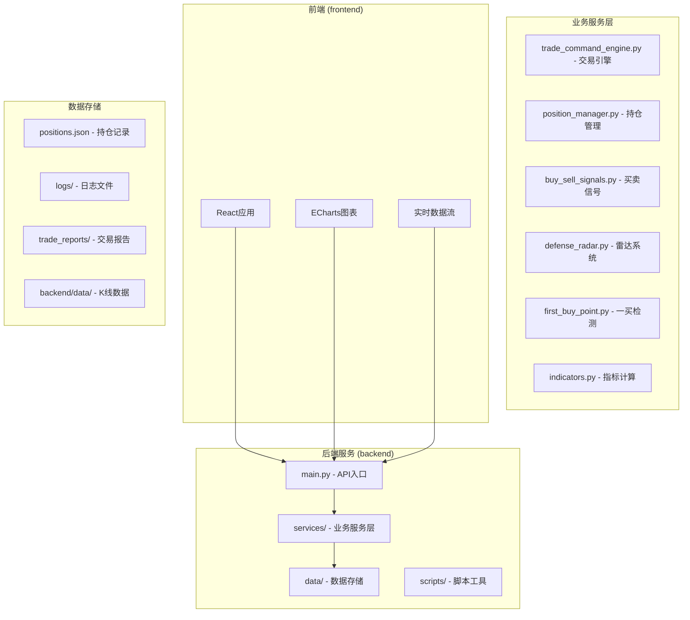
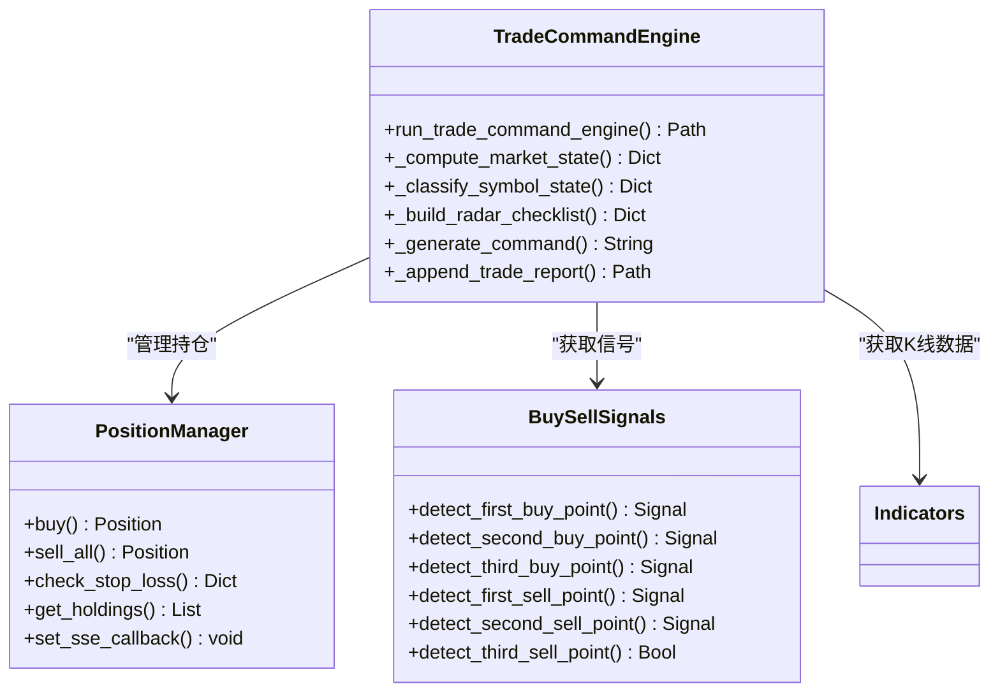
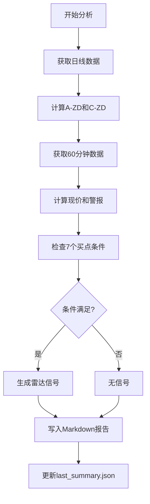
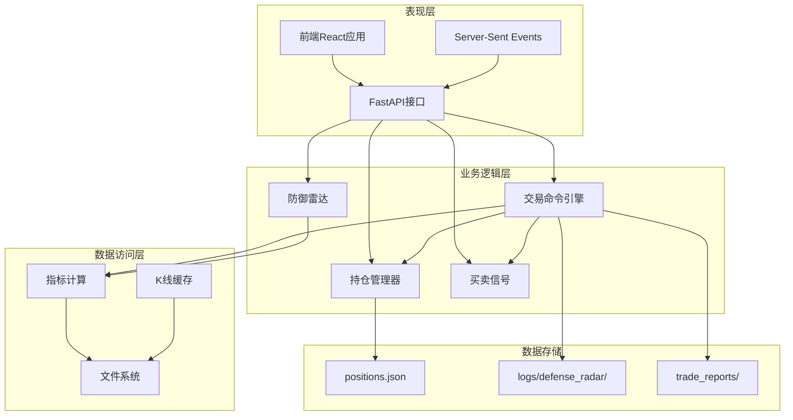
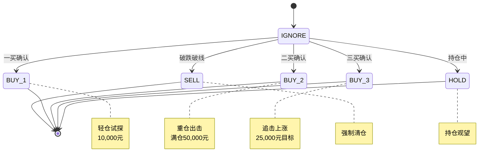
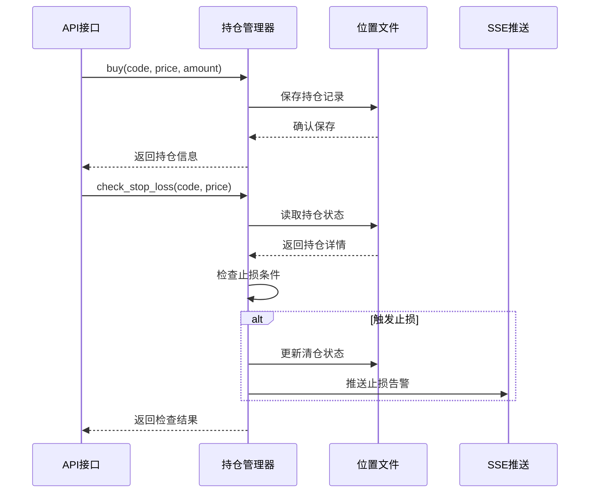
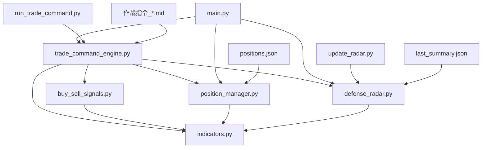
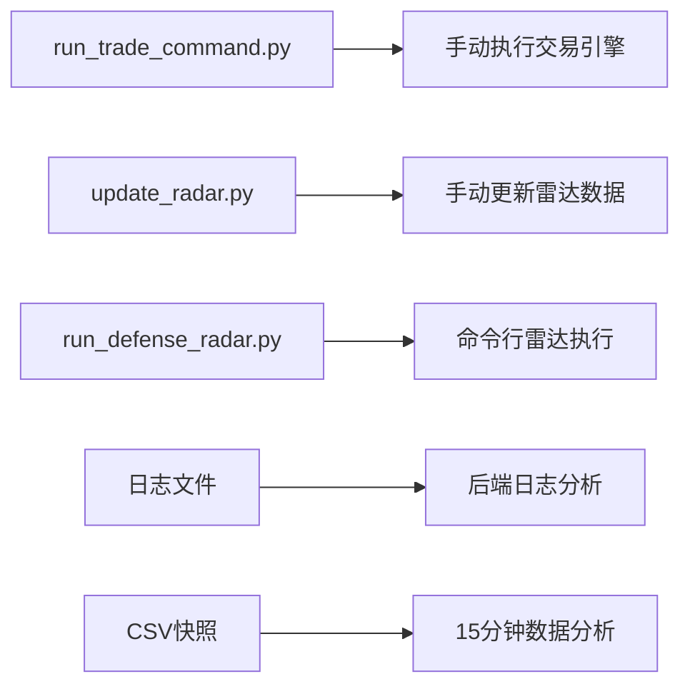

# 交易报告

<cite>
**本文档引用的文件**
- [backend/main.py](file://backend/main.py)
- [backend/services/trade_command_engine.py](file://backend/services/trade_command_engine.py)
- [backend/services/position_manager.py](file://backend/services/position_manager.py)
- [backend/services/buy_sell_signals.py](file://backend/services/buy_sell_signals.py)
- [backend/services/defense_radar.py](file://backend/services/defense_radar.py)
- [backend/services/first_buy_point.py](file://backend/services/first_buy_point.py)
- [backend/services/indicators.py](file://backend/services/indicators.py)
- [backend/run_trade_command.py](file://backend/run_trade_command.py)
- [backend/update_radar.py](file://backend/update_radar.py)
- [trade_reports/作战指令_2026-04-25.md](file://trade_reports/作战指令_2026-04-25.md)
- [data/positions.json](file://data/positions.json)
- [README.md](file://README.md)
</cite>

## 目录
1. [简介](#简介)
2. [项目结构](#项目结构)
3. [核心组件](#核心组件)
4. [架构概览](#架构概览)
5. [详细组件分析](#详细组件分析)
6. [依赖关系分析](#依赖关系分析)
7. [性能考虑](#性能考虑)
8. [故障排除指南](#故障排除指南)
9. [结论](#结论)

## 简介

这是一个基于缠论技术分析的智能交易报告系统，专注于A股、ETF和指数的自动化交易决策。系统通过三层分析框架（宏观日线、战役60分钟、微观15分钟）提供三维共振交易信号，并生成详细的作战指令报告。

系统的核心功能包括：
- **双防线雷达**：实时监控标的物的支撑位和压力位
- **三维共振分析**：日线、60分钟、15分钟多级别信号确认
- **智能交易决策**：基于缠论的买卖点识别和仓位管理
- **自动化报告生成**：生成详细的Markdown交易报告

## 项目结构

**图表来源**
- [backend/main.py:1-607](file://backend/main.py#L1-L607)
- [README.md:216-244](file://README.md#L216-L244)

**章节来源**
- [README.md:1-269](file://README.md#L1-L269)

## 核心组件

### 交易引擎 (Trade Command Engine)

交易引擎是整个系统的核心，负责执行三维共振分析和生成交易指令：

**图表来源**
- [backend/services/trade_command_engine.py:1-1789](file://backend/services/trade_command_engine.py#L1-L1789)
- [backend/services/position_manager.py:1-234](file://backend/services/position_manager.py#L1-L234)
- [backend/services/buy_sell_signals.py:1-1086](file://backend/services/buy_sell_signals.py#L1-L1086)

### 双防线雷达系统

雷达系统提供实时的市场监控和预警功能：

**图表来源**
- [backend/services/defense_radar.py:418-800](file://backend/services/defense_radar.py#L418-L800)

**章节来源**
- [backend/services/trade_command_engine.py:1-1789](file://backend/services/trade_command_engine.py#L1-L1789)
- [backend/services/defense_radar.py:1-959](file://backend/services/defense_radar.py#L1-L959)

## 架构概览

系统采用分层架构设计，确保各组件职责清晰、耦合度低：

**图表来源**
- [backend/main.py:91-104](file://backend/main.py#L91-L104)
- [backend/services/indicators.py:1-200](file://backend/services/indicators.py#L1-L200)

## 详细组件分析

### 三维共振分析系统

系统通过三个级别的分析提供全面的交易信号：

#### 宏观日线分析 (Market State)
- **防线计算**：基于日线中枢的A-ZD和C-ZD支撑位
- **市场状态**：MARKET_SAFE/MARKET_DANGER/MARKET_DEAD三级状态
- **风控阈值**：以min(A-ZD, C-ZD)为战略底线

#### 战役60分钟分析 (60分钟条件)
- **中枢状态**：C中枢内支撑/突破确认
- **笔方向**：有效笔的向上/向下转换
- **MACD条件**：买入/卖出信号确认
- **买点类型**：一买、二买、三买优先级判断

#### 微观15分钟分析 (15分钟背驰)
- **底背驰检测**：传统底背驰和趋势底背驰
- **级别对齐**：15分钟背驰与60分钟笔完成的同步验证
- **顶背驰确认**：顶部反转信号的确认

### 交易决策状态机

**图表来源**
- [backend/services/trade_command_engine.py:887-1177](file://backend/services/trade_command_engine.py#L887-L1177)

### 持仓管理系统

持仓管理器提供完整的交易生命周期管理：

**图表来源**
- [backend/services/position_manager.py:95-234](file://backend/services/position_manager.py#L95-L234)

**章节来源**
- [backend/services/trade_command_engine.py:887-1789](file://backend/services/trade_command_engine.py#L887-L1789)
- [backend/services/position_manager.py:1-234](file://backend/services/position_manager.py#L1-L234)

## 依赖关系分析

系统采用松耦合的设计，主要依赖关系如下：

**图表来源**
- [backend/main.py:16-21](file://backend/main.py#L16-L21)
- [backend/services/trade_command_engine.py:18-35](file://backend/services/trade_command_engine.py#L18-L35)

**章节来源**
- [backend/main.py:1-607](file://backend/main.py#L1-L607)
- [backend/services/trade_command_engine.py:1-1789](file://backend/services/trade_command_engine.py#L1-L1789)

## 性能考虑

### 缓存策略
- **响应缓存**：进程内缓存K线数据，避免重复计算
- **文件缓存**：本地CSV文件缓存，支持mtime失效机制
- **TTL控制**：300秒的缓存过期时间，平衡新鲜度和性能

### 内存优化
- **数据限制**：每个级别最多250根K线，确保内存使用可控
- **异步处理**：使用asyncio处理SSE推送，避免阻塞主线程
- **LRU缓存**：限制响应缓存条目数量，防止内存泄漏

### 并发处理
- **线程安全**：持仓管理使用RLock确保线程安全
- **异步SSE**：支持多个客户端同时订阅
- **非阻塞I/O**：文件读写使用fcntl锁，避免竞争条件

## 故障排除指南

### 常见问题及解决方案

| 问题类型 | 症状 | 可能原因 | 解决方案 |
|---------|------|----------|----------|
| 雷达数据异常 | 摘要404或空数据 | 后端未重启或路由未加载 | 重启后端服务，确保新路由生效 |
| 60分钟数据缺失 | "本地缓存不存在"错误 | 未执行定时任务或未refresh=true预热 | 运行定时任务或手动执行refresh=true |
| 中枢长时间不变 | 中枢未更新 | 本地CSV未更新或缓存未失效 | 等待定时任务更新或手动清理缓存 |
| 持仓记录异常 | 持仓状态不正确 | 文件锁冲突或JSON解析错误 | 检查文件权限，重启服务 |

### 调试工具

系统提供了多种调试和排障工具：

**图表来源**
- [backend/run_trade_command.py:1-24](file://backend/run_trade_command.py#L1-L24)
- [backend/update_radar.py:1-47](file://backend/update_radar.py#L1-L47)

**章节来源**
- [README.md:255-269](file://README.md#L255-L269)

## 结论

该交易报告系统通过多层次的技术分析和自动化流程，为投资者提供了全面的交易决策支持。系统的主要优势包括：

1. **多级别分析**：三维共振确保信号的可靠性和准确性
2. **自动化程度高**：从数据获取到报告生成的全流程自动化
3. **实时性强**：支持SSE实时推送和快速响应
4. **可扩展性好**：模块化设计便于功能扩展和维护

系统适用于需要技术分析和自动化交易决策的专业投资者，通过严格的风控机制和详细的交易报告，帮助用户做出更加明智的投资决策。