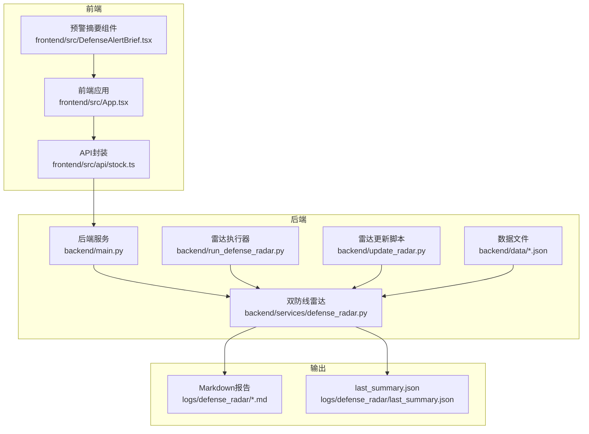
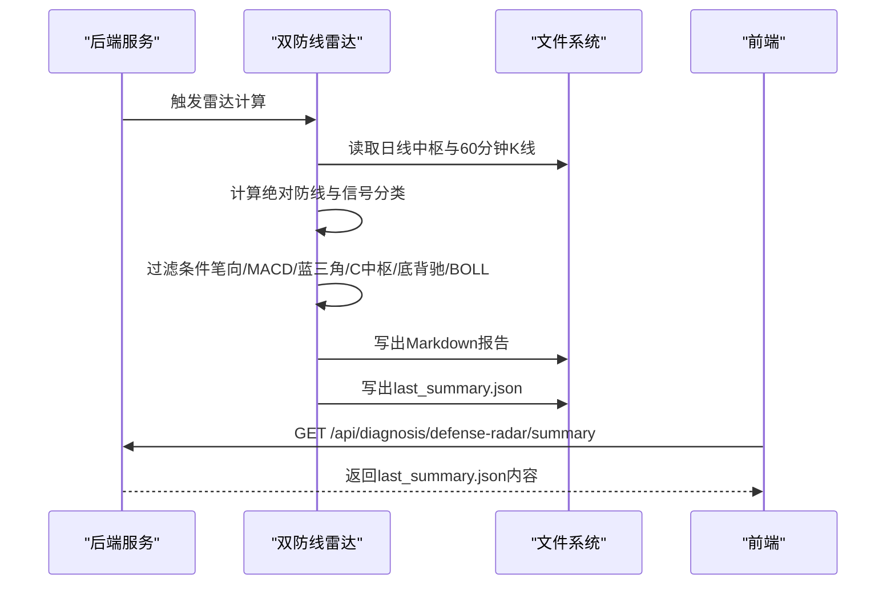
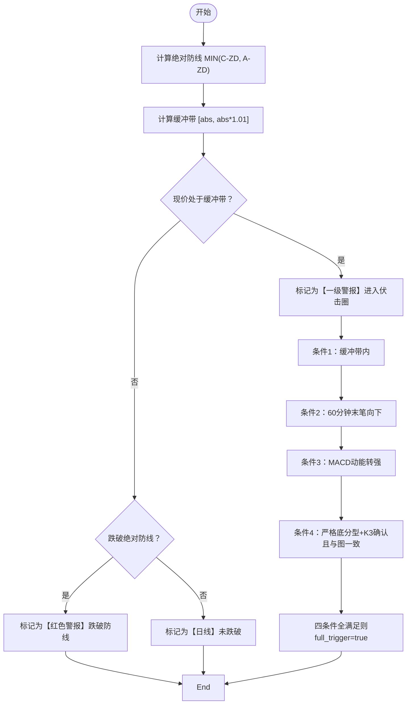
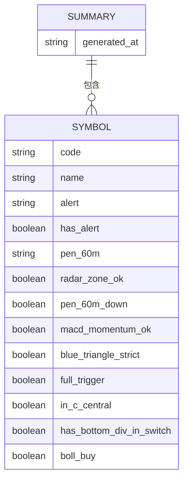
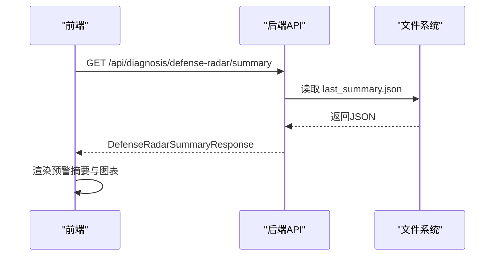
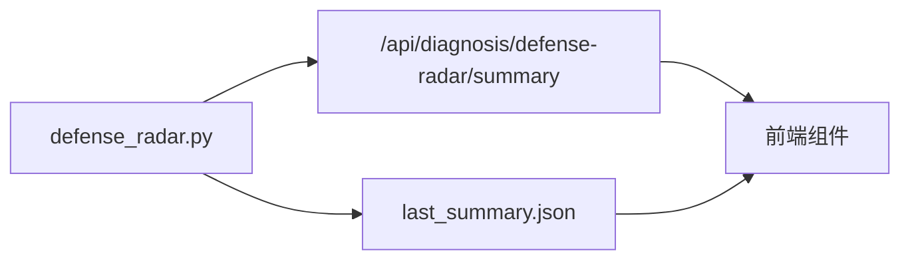

# 信号生成系统

<cite>
**本文档引用的文件**
- [backend/services/defense_radar.py](file://backend/services/defense_radar.py)
- [backend/run_defense_radar.py](file://backend/run_defense_radar.py)
- [backend/update_radar.py](file://backend/update_radar.py)
- [backend/main.py](file://backend/main.py)
- [frontend/src/DefenseAlertBrief.tsx](file://frontend/src/DefenseAlertBrief.tsx)
- [frontend/src/App.tsx](file://frontend/src/App.tsx)
- [frontend/src/api/stock.ts](file://frontend/src/api/stock.ts)
- [logs/defense_radar/last_summary.json](file://logs/defense_radar/last_summary.json)
- [logs/defense_radar/defense_radar_20260425_113237.md](file://logs/defense_radar/defense_radar_20260425_113237.md)
- [backend/data/watchlist.json](file://backend/data/watchlist.json)
- [backend/data/observation.json](file://backend/data/observation.json)
- [backend/tests/test_defense_radar_trigger.py](file://backend/tests/test_defense_radar_trigger.py)
</cite>

## 目录
1. [引言](#引言)
2. [项目结构](#项目结构)
3. [核心组件](#核心组件)
4. [架构总览](#架构总览)
5. [详细组件分析](#详细组件分析)
6. [依赖分析](#依赖分析)
7. [性能考虑](#性能考虑)
8. [故障排查指南](#故障排查指南)
9. [结论](#结论)
10. [附录](#附录)

## 引言
本文件面向信号生成系统，聚焦“双防线雷达”的预警信号生成与输出，覆盖以下目标：
- 解释不同级别预警信号的含义与触发条件，包括【一级警报】、【红色警报】等
- 描述信号分类逻辑，从绝对防线跌破到进入伏击圈再到最终触发的完整信号链
- 说明信号输出格式，包括Markdown报告结构、字段定义与数据组织方式
- 阐述信号与前端界面的对接机制，包括last_summary.json的生成与API接口的数据传递
- 提供信号解读指南与实际应用示例

## 项目结构
系统由后端服务、前端界面与数据文件构成，核心路径如下：
- 后端服务：负责雷达计算、输出Markdown与last_summary.json、提供API接口
- 前端界面：消费后端API，渲染图表与预警摘要
- 数据文件：watchlist.json与observation.json用于维护标的清单

**图表来源**
- [backend/services/defense_radar.py](file://backend/services/defense_radar.py)
- [backend/run_defense_radar.py](file://backend/run_defense_radar.py)
- [backend/update_radar.py](file://backend/update_radar.py)
- [backend/main.py](file://backend/main.py)
- [frontend/src/App.tsx](file://frontend/src/App.tsx)
- [frontend/src/api/stock.ts](file://frontend/src/api/stock.ts)
- [frontend/src/DefenseAlertBrief.tsx](file://frontend/src/DefenseAlertBrief.tsx)
- [logs/defense_radar/last_summary.json](file://logs/defense_radar/last_summary.json)
- [logs/defense_radar/defense_radar_20260425_113237.md](file://logs/defense_radar/defense_radar_20260425_113237.md)

**章节来源**
- [backend/services/defense_radar.py](file://backend/services/defense_radar.py)
- [backend/run_defense_radar.py](file://backend/run_defense_radar.py)
- [backend/update_radar.py](file://backend/update_radar.py)
- [backend/main.py](file://backend/main.py)
- [frontend/src/App.tsx](file://frontend/src/App.tsx)
- [frontend/src/api/stock.ts](file://frontend/src/api/stock.ts)
- [frontend/src/DefenseAlertBrief.tsx](file://frontend/src/DefenseAlertBrief.tsx)
- [logs/defense_radar/last_summary.json](file://logs/defense_radar/last_summary.json)
- [logs/defense_radar/defense_radar_20260425_113237.md](file://logs/defense_radar/defense_radar_20260425_113237.md)

## 核心组件
- 双防线雷达核心模块：负责中枢识别、防线计算、信号分类、条件过滤与输出
- 雷达执行器：命令行入口，支持只读本地缓存或强制刷新
- 雷达更新脚本：批量更新并打印关键指标
- API接口：提供GET /summary与POST /diagnosis/defense-radar等接口
- 前端组件：消费API，渲染预警摘要与图表

**章节来源**
- [backend/services/defense_radar.py](file://backend/services/defense_radar.py)
- [backend/run_defense_radar.py](file://backend/run_defense_radar.py)
- [backend/update_radar.py](file://backend/update_radar.py)
- [backend/main.py](file://backend/main.py)
- [frontend/src/api/stock.ts](file://frontend/src/api/stock.ts)

## 架构总览
双防线雷达的信号生成流程分为“数据准备—计算—输出—前端消费”四个阶段：
- 数据准备：日线中枢与60分钟K线由定时任务写入本地缓存，雷达只读
- 计算阶段：计算绝对防线、进入伏击圈、笔向、MACD动能、蓝三角形态、C中枢、底背驰、BOLL站回中轨等
- 输出阶段：生成Markdown表格与last_summary.json
- 前端消费：GET /api/diagnosis/defense-radar/summary获取JSON，渲染预警摘要与图表

**图表来源**
- [backend/services/defense_radar.py](file://backend/services/defense_radar.py)
- [backend/main.py](file://backend/main.py)
- [logs/defense_radar/last_summary.json](file://logs/defense_radar/last_summary.json)

**章节来源**
- [backend/services/defense_radar.py](file://backend/services/defense_radar.py)
- [backend/main.py](file://backend/main.py)

## 详细组件分析

### 信号分类与触发条件
- 绝对防线逻辑：MIN(C-ZD, A-ZD)作为绝对防线，现价在绝对防线±1%缓冲带内为“进入伏击圈”，跌破则为“红色警报”
- 信号类型：
  - “【一级警报】进入绝对防线伏击圈！”：进入缓冲带，需关注后续形态
  - “【红色警报】已跌破绝对防线...”：破位禁买
  - “【日线】未跌破绝对防线...”：未进入缓冲带，等待更优入场点
- 四条件扳机（全链路串联）：
  - 条件1：现价处于绝对防线±1%缓冲带内
  - 条件2：60分钟有效笔末笔向下
  - 条件3：MACD动能转强（柱值上升，绿柱缩短或红柱伸长）
  - 条件4：严格底分型+K3确认，且与图上分型一致
- 七条件补充（用于前端展示与综合判断）：
  - in_c_central：现价在C中枢内（ZD～ZG）
  - has_bottom_div_in_switch：底背驰点落在当前向上笔内
  - boll_buy：BOLL站回中轨

**图表来源**
- [backend/services/defense_radar.py](file://backend/services/defense_radar.py)

**章节来源**
- [backend/services/defense_radar.py](file://backend/services/defense_radar.py)
- [frontend/src/DefenseAlertBrief.tsx](file://frontend/src/DefenseAlertBrief.tsx)

### 输出格式与数据组织
- Markdown报告结构
  - 文件命名：defense_radar_YYYYMMDD_HHMMSS.md
  - 表头字段：代码、标的名称、预警信息、C-ZD价格、A-ZD价格、现价(60m末根收盘)、60分钟笔向、四条件扳机
  - 示例参考：[logs/defense_radar/defense_radar_20260425_113237.md](file://logs/defense_radar/defense_radar_20260425_113237.md)
- last_summary.json结构
  - generated_at：生成时间（ISO格式）
  - symbols：数组，每项包含code、name、alert、has_alert、pen_60m、radar_zone_ok、pen_60m_down、macd_momentum_ok、blue_triangle_strict、full_trigger、in_c_central、has_bottom_div_in_switch、boll_buy
  - 示例参考：[logs/defense_radar/last_summary.json](file://logs/defense_radar/last_summary.json)

**图表来源**
- [logs/defense_radar/last_summary.json](file://logs/defense_radar/last_summary.json)

**章节来源**
- [logs/defense_radar/defense_radar_20260425_113237.md](file://logs/defense_radar/defense_radar_20260425_113237.md)
- [logs/defense_radar/last_summary.json](file://logs/defense_radar/last_summary.json)

### 与前端的对接机制
- last_summary.json生成与API
  - 后端在生成Markdown的同时写入last_summary.json
  - GET /api/diagnosis/defense-radar/summary返回last_summary.json内容，供前端筛选Tab与显示
- 前端消费
  - fetchDefenseRadarSummary调用后端接口，解析DefenseRadarSummaryResponse
  - DefenseAlertBrief根据C-ZD/A-ZD与现价计算“核心伏击圈”状态
  - App.tsx维护CHART_TABS与雷达watchlist，确保前后端一致

**图表来源**
- [backend/main.py](file://backend/main.py)
- [frontend/src/api/stock.ts](file://frontend/src/api/stock.ts)
- [frontend/src/DefenseAlertBrief.tsx](file://frontend/src/DefenseAlertBrief.tsx)
- [logs/defense_radar/last_summary.json](file://logs/defense_radar/last_summary.json)

**章节来源**
- [backend/main.py](file://backend/main.py)
- [frontend/src/api/stock.ts](file://frontend/src/api/stock.ts)
- [frontend/src/DefenseAlertBrief.tsx](file://frontend/src/DefenseAlertBrief.tsx)
- [frontend/src/App.tsx](file://frontend/src/App.tsx)

### 雷达执行与更新
- 命令行执行
  - python backend/run_defense_radar.py：默认只读本地缓存，生成Markdown与last_summary.json
  - 支持--refresh参数进行强制刷新（排障场景）
- 批量更新
  - python backend/update_radar.py：更新雷达数据并打印关键指标，便于快速核验

**章节来源**
- [backend/run_defense_radar.py](file://backend/run_defense_radar.py)
- [backend/update_radar.py](file://backend/update_radar.py)

### 标的清单与观察列表
- watchlist.json：用户持仓/自选标的，用于前端显示与策略配置
- observation.json：观察标的，仅用于前端显示，不参与止损检查
- 两者共同决定雷达watchlist的完整集合（去重）

**章节来源**
- [backend/data/watchlist.json](file://backend/data/watchlist.json)
- [backend/data/observation.json](file://backend/data/observation.json)
- [backend/services/defense_radar.py](file://backend/services/defense_radar.py)

### 单元测试与验证
- 测试覆盖严格底分型、伏击带判断、MACD动能转强、梅菜2test夹具等关键逻辑
- 通过测试确保信号链一致性与边界条件处理正确

**章节来源**
- [backend/tests/test_defense_radar_trigger.py](file://backend/tests/test_defense_radar_trigger.py)

## 依赖分析
- 后端服务依赖
  - radar模块：负责中枢、防线、信号分类与输出
  - API路由：提供GET /summary与POST /diagnosis/defense-radar
- 前端依赖
  - API封装：统一请求后端接口
  - 组件：渲染预警摘要与图表
- 文件依赖
  - last_summary.json：前后端共享的最新雷达摘要
  - Markdown报告：历史快照与可视化输出

**图表来源**
- [backend/services/defense_radar.py](file://backend/services/defense_radar.py)
- [backend/main.py](file://backend/main.py)
- [frontend/src/api/stock.ts](file://frontend/src/api/stock.ts)

**章节来源**
- [backend/services/defense_radar.py](file://backend/services/defense_radar.py)
- [backend/main.py](file://backend/main.py)
- [frontend/src/api/stock.ts](file://frontend/src/api/stock.ts)

## 性能考虑
- 默认只读本地缓存，避免网络抖动与重复拉取
- 60分钟K线与日线中枢分别计算，减少跨周期耦合
- last_summary.json采用紧凑JSON结构，前端秒读
- 前端对API请求增加重试与缓存控制，提升稳定性

## 故障排查指南
- 现象：无法读取last_summary.json
  - 检查文件是否存在与JSON格式是否正确
  - 查看后端日志定位异常
- 现象：GET /summary返回空或字段缺失
  - 确认雷达任务是否成功执行并写入last_summary.json
  - 检查后端路由与文件权限
- 现象：前端未显示预警Tab
  - 确认has_alert字段是否为true（包含【一级警报】【终极警报】【红色警报】任一）
  - 检查CHART_TABS与watchlist是否一致
- 现象：信号与预期不符
  - 使用--refresh参数重新计算，核对中枢与形态
  - 参考单元测试用例，验证边界条件

**章节来源**
- [backend/services/defense_radar.py](file://backend/services/defense_radar.py)
- [backend/main.py](file://backend/main.py)
- [frontend/src/App.tsx](file://frontend/src/App.tsx)
- [backend/tests/test_defense_radar_trigger.py](file://backend/tests/test_defense_radar_trigger.py)

## 结论
双防线雷达通过“绝对防线±1%缓冲带”与“四条件扳机”构建了清晰的信号链，结合last_summary.json与前端API实现了高效、稳定的信号输出与展示。建议在日常使用中坚持只读本地缓存，必要时使用--refresh进行排障；前端以has_alert为Tab显隐依据，确保用户聚焦关键信号。

## 附录

### 信号解读指南
- 一级警报：进入伏击圈，需密切关注后续形态与成交量配合
- 红色警报：跌破绝对防线，视为破位禁买，建议等待趋势修复
- 日线未跌破：未进入缓冲带，保持耐心等待更优入场点
- 四条件扳机：仅当条件1~4同时满足时，full_trigger为true，前端可据此弹窗或高亮

**章节来源**
- [backend/services/defense_radar.py](file://backend/services/defense_radar.py)
- [frontend/src/DefenseAlertBrief.tsx](file://frontend/src/DefenseAlertBrief.tsx)

### 实际应用示例
- 示例1：某ETF出现“一级警报”，60分钟笔向下、MACD转强、蓝三角形态明确，但full_trigger为false，前端显示为橙色Tab提示关注
- 示例2：某个股跌破绝对防线，触发“红色警报”，前端Tab隐藏，避免误操作
- 示例3：某指数未跌破绝对防线，显示“日线未跌破”，等待更优入场点

**章节来源**
- [logs/defense_radar/defense_radar_20260425_113237.md](file://logs/defense_radar/defense_radar_20260425_113237.md)
- [logs/defense_radar/last_summary.json](file://logs/defense_radar/last_summary.json)