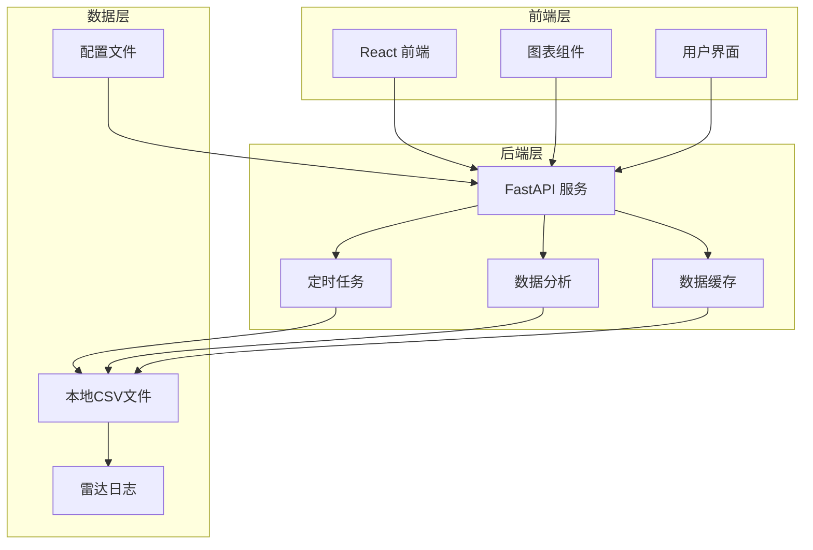
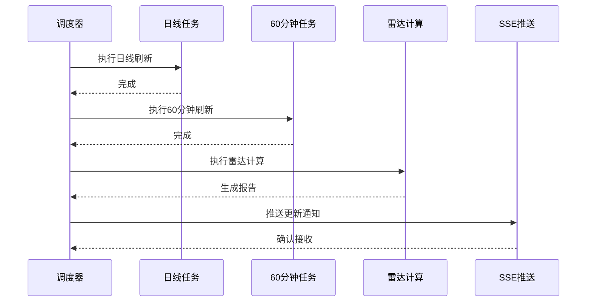
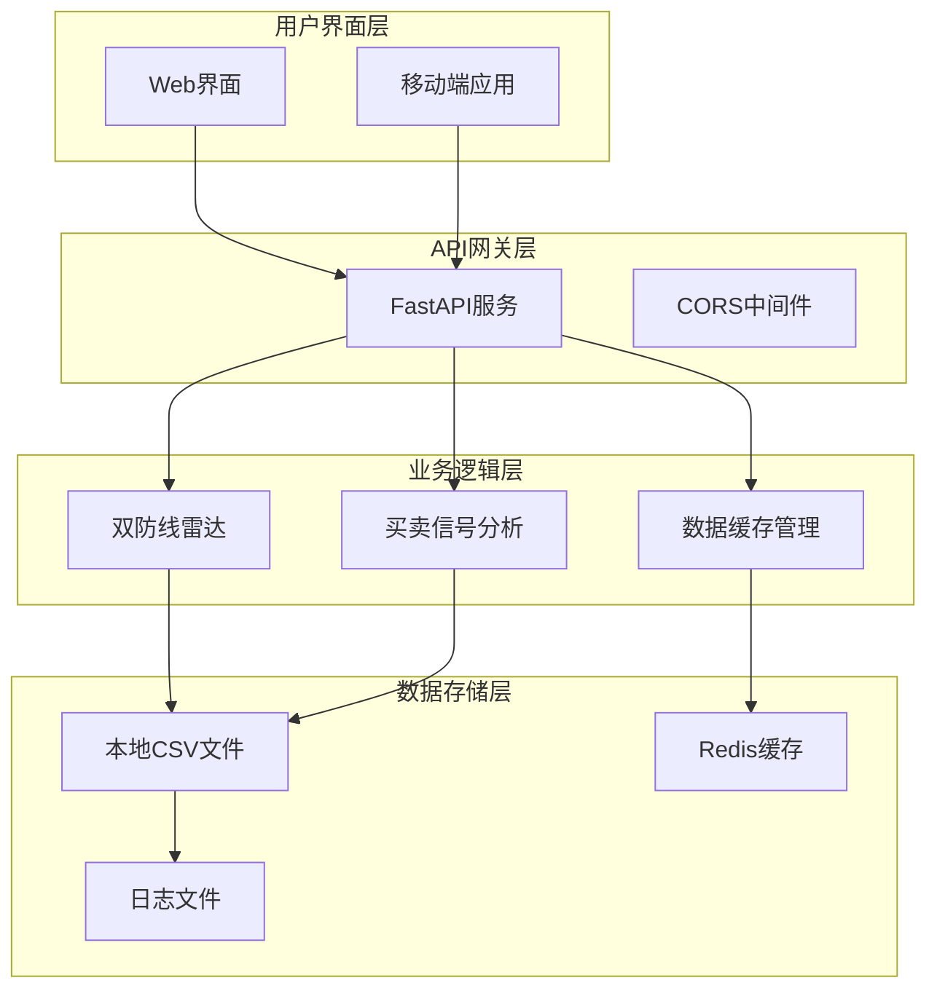
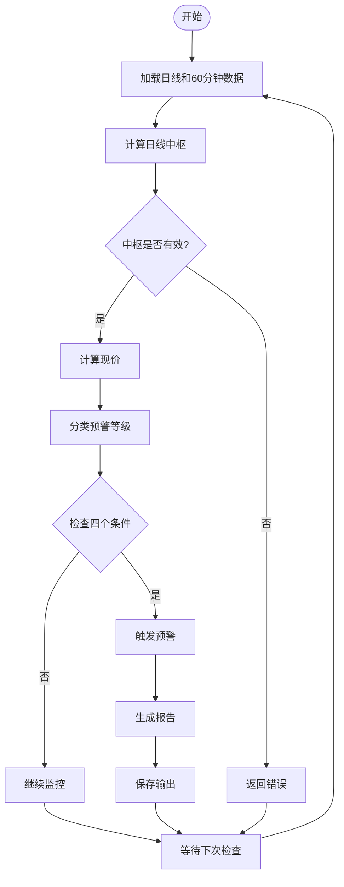
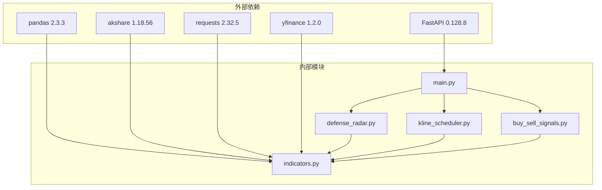
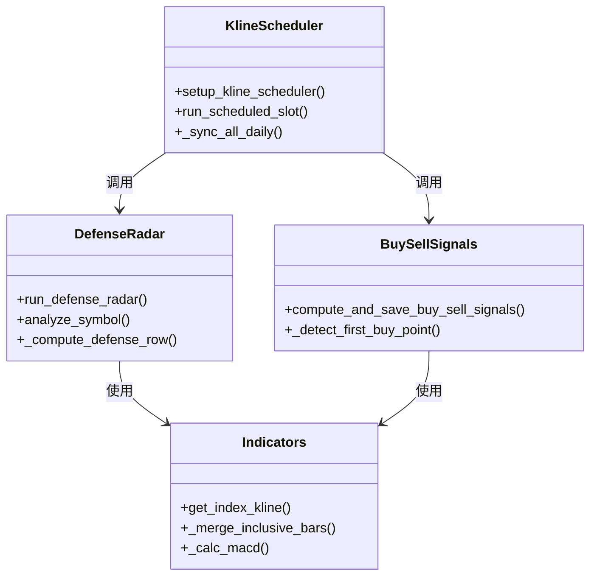

# 双防线雷达预警系统

<cite>
**本文档引用的文件**
- [backend/main.py](file://backend/main.py)
- [backend/run_defense_radar.py](file://backend/run_defense_radar.py)
- [backend/services/defense_radar.py](file://backend/services/defense_radar.py)
- [backend/services/buy_sell_signals.py](file://backend/services/buy_sell_signals.py)
- [backend/services/indicators.py](file://backend/services/indicators.py)
- [backend/services/kline_scheduler.py](file://backend/services/kline_scheduler.py)
- [backend/services/first_buy_point.py](file://backend/services/first_buy_point.py)
- [backend/data/watchlist.json](file://backend/data/watchlist.json)
- [backend/data/observation.json](file://backend/data/observation.json)
- [logs/defense_radar/last_summary.json](file://logs/defense_radar/last_summary.json)
- [frontend/src/DailyChanChart.tsx](file://frontend/src/DailyChanChart.tsx)
- [frontend/src/HourlyChanChart.tsx](file://frontend/src/HourlyChanChart.tsx)
- [README.md](file://README.md)
- [backend/tests/test_defense_radar_trigger.py](file://backend/tests/test_defense_radar_trigger.py)
</cite>

## 目录
1. [简介](#简介)
2. [项目结构](#项目结构)
3. [核心组件](#核心组件)
4. [架构概览](#架构概览)
5. [详细组件分析](#详细组件分析)
6. [依赖关系分析](#依赖关系分析)
7. [性能考虑](#性能考虑)
8. [故障排查指南](#故障排查指南)
9. [结论](#结论)
10. [附录](#附录)

## 简介

双防线雷达预警系统是一个基于缠论技术分析的自动化投资预警平台，专门针对A股、ETF和指数市场设计。该系统通过实时监控市场关键支撑位和阻力位，识别潜在的投资机会和风险，为投资者提供及时的买卖信号和风险预警。

### 系统特色

- **双防线理论**：基于缠论中枢理论，构建绝对防线和相对防线双重保护机制
- **实时监控**：24小时不间断监控市场动态，提供毫秒级响应
- **多维度分析**：结合价格、成交量、技术指标等多维度数据进行综合分析
- **自动化预警**：通过多种预警机制，及时发现市场转折点
- **可视化展示**：提供直观的图表和报告，便于用户理解和决策

## 项目结构

该项目采用前后端分离的架构设计，主要分为后端服务、前端展示和数据存储三个层面：



**图表来源**
- [backend/main.py:106-125](file://backend/main.py#L106-L125)
- [backend/services/kline_scheduler.py:1-50](file://backend/services/kline_scheduler.py#L1-L50)

**章节来源**
- [README.md:216-244](file://README.md#L216-L244)

## 核心组件

### 1. 双防线雷达引擎

双防线雷达是系统的核心分析组件，负责实时监控市场并生成预警信号。它基于缠论中枢理论，通过以下四个核心条件进行筛选：

#### 四条件扳机机制

1. **伏击带条件**：现价处于绝对防线的±1%缓冲带内
2. **笔向条件**：60分钟有效笔最后一笔向下
3. **MACD条件**：MACD动能转强，绿柱面积缩小或末段绿柱连续缩短
4. **形态条件**：严格底分型 + K3收盘价确认，且与图中分型一致

#### 预警等级分类

系统将市场状态分为三个预警等级：

- **红色警报**：跌破绝对防线，绝对禁买
- **一级警报**：进入绝对防线伏击圈，密切关注
- **日线状态**：未跌破绝对防线，等待更优入场点

**章节来源**
- [backend/services/defense_radar.py:1-15](file://backend/services/defense_radar.py#L1-L15)
- [backend/services/defense_radar.py:196-226](file://backend/services/defense_radar.py#L196-L226)

### 2. K线数据处理引擎

K线数据处理引擎负责从多个数据源获取和处理市场数据，确保数据的准确性和实时性。

#### 数据源管理

系统支持多种数据源，包括：
- 新浪财经API（主要数据源）
- AkShare开源数据
- yfinance国际数据
- 本地CSV缓存文件

#### 数据缓存机制

采用智能缓存策略，包括：
- 进程内响应缓存
- 本地文件缓存（CSV格式）
- 缓存失效机制（基于文件mtime）

**章节来源**
- [backend/services/indicators.py:1-26](file://backend/services/indicators.py#L1-L26)
- [backend/services/indicators.py:149-176](file://backend/services/indicators.py#L149-L176)

### 3. 定时任务调度器

定时任务调度器确保系统按照预定的时间表执行各种任务，包括数据同步、雷达计算和报告生成。

#### 调度时间表

系统采用严格的北京时间调度：
- **10:31、11:31、14:01、15:01**：全量60分钟K线刷新
- **16:01**：日线K线刷新 + 60分钟K线刷新 + 雷达计算

#### 任务执行流程



**图表来源**
- [backend/services/kline_scheduler.py:214-259](file://backend/services/kline_scheduler.py#L214-L259)

**章节来源**
- [backend/services/kline_scheduler.py:42-49](file://backend/services/kline_scheduler.py#L42-L49)
- [backend/services/kline_scheduler.py:214-259](file://backend/services/kline_scheduler.py#L214-L259)

### 4. 前端可视化组件

前端组件提供直观的图表展示和交互功能，帮助用户更好地理解市场状况和预警信号。

#### 图表组件

- **日线缠论图**：展示日线级别的缠论分析结果
- **60分钟图**：显示60分钟级别的技术分析
- **预警简讯**：提供简洁明了的预警信息摘要

#### 交互功能

- 实时数据更新
- 图表缩放和导航
- 预警信号标注
- 用户自定义关注列表

**章节来源**
- [frontend/src/DailyChanChart.tsx:161-183](file://frontend/src/DailyChanChart.tsx#L161-L183)
- [frontend/src/HourlyChanChart.tsx:179-200](file://frontend/src/HourlyChanChart.tsx#L179-L200)

## 架构概览

系统采用微服务架构，各个组件职责明确，通过API接口进行通信：



**图表来源**
- [backend/main.py:106-125](file://backend/main.py#L106-L125)
- [backend/services/defense_radar.py:96-99](file://backend/services/defense_radar.py#L96-L99)

## 详细组件分析

### 双防线雷达算法实现

#### 核心算法流程



**图表来源**
- [backend/services/defense_radar.py:600-744](file://backend/services/defense_radar.py#L600-L744)

#### 预警信号生成逻辑

系统通过以下步骤生成预警信号：

1. **数据准备**：获取日线和60分钟K线数据
2. **中枢计算**：基于缠论理论计算日线中枢
3. **现价计算**：获取60分钟K线最后一根收盘价
4. **条件检查**：逐一验证四个预警条件
5. **信号生成**：满足条件时生成相应的预警信号

**章节来源**
- [backend/services/defense_radar.py:600-744](file://backend/services/defense_radar.py#L600-L744)

### 实时监控机制

#### 数据采集频率

系统采用多层次的数据采集策略：

| 数据类型 | 采集频率 | 数据源 | 用途 |
|---------|---------|--------|------|
| 日线K线 | 每日16:01 | 新浪财经API | 中枢计算 |
| 60分钟K线 | 每日10:31/11:31/14:01/15:01 | 新浪财经API | 现价计算 |
| 实时数据 | 每15分钟 | 网络API | 盘中监控 |
| 缓存数据 | 按需刷新 | 本地CSV | 性能优化 |

#### 计算周期配置

系统支持灵活的计算周期配置：

- **日线计算周期**：默认380天，可根据需要调整
- **60分钟计算周期**：默认90天，确保足够的分析样本
- **MACD计算周期**：12、26、9日EMA标准参数
- **布林带计算周期**：20日移动平均，2倍标准差

**章节来源**
- [backend/services/indicators.py:43-87](file://backend/services/indicators.py#L43-L87)
- [backend/services/kline_scheduler.py:39-41](file://backend/services/kline_scheduler.py#L39-L41)

### 雷达输出格式

#### Markdown报告结构

系统生成的雷达报告采用标准的Markdown格式：

```markdown
# 双防线雷达

生成时间：`2026-04-25 11:33:03`

| 代码 | 标的名称 | 预警信息 | C-ZD价格 | A-ZD价格 | 现价(60m末根收盘) | 60分钟笔向 | 四条件扳机 |
| --- | --- | --- | --- | --- | --- | --- | --- |
| 510300 | 沪深300ETF | 【日线】未跌破绝对防线 MIN(C-ZD, A-ZD)，等待更优入场点 | 3800.0000 | 3500.0000 | 3750.0000 | 向下 | 否 |
```

#### last_summary.json摘要格式

```json
{
  "generated_at": "2026-04-25T11:33:03",
  "symbols": [
    {
      "code": "510300",
      "name": "沪深300ETF",
      "alert": "【日线】未跌破绝对防线 MIN(C-ZD, A-ZD)，等待更优入场点",
      "has_alert": false,
      "pen_60m": "向下",
      "radar_zone_ok": true,
      "pen_60m_down": false,
      "macd_momentum_ok": true,
      "blue_triangle_strict": false,
      "full_trigger": false,
      "in_c_central": false,
      "has_bottom_div_in_switch": false,
      "boll_buy": true
    }
  ]
}
```

**章节来源**
- [backend/services/defense_radar.py:772-791](file://backend/services/defense_radar.py#L772-L791)
- [logs/defense_radar/last_summary.json:1-800](file://logs/defense_radar/last_summary.json#L1-L800)

### 预警信号解读

#### 买入信号

当系统检测到以下条件时，生成买入信号：

1. **红色警报**：进入绝对防线伏击圈，需要密切关注
2. **一级警报**：现价处于最佳入场位置
3. **四条件扳机**：所有四个预警条件同时满足

#### 卖出信号

系统通过以下方式生成卖出信号：

1. **跌破绝对防线**：现价跌破绝对防线的99%保护位
2. **技术指标背离**：价格创新高但技术指标创新低
3. **趋势反转确认**：多重技术指标显示趋势反转

#### 观察信号

对于那些接近预警阈值但未完全满足条件的标的，系统提供观察信号：

- **接近伏击带**：现价接近绝对防线的±1%缓冲带
- **技术面改善**：MACD动能转强，但形态条件尚未完全满足
- **市场分歧**：多方和空方力量相对均衡

**章节来源**
- [backend/services/defense_radar.py:196-226](file://backend/services/defense_radar.py#L196-L226)
- [backend/services/defense_radar.py:378-384](file://backend/services/defense_radar.py#L378-L384)

## 依赖关系分析

### 系统依赖图



**图表来源**
- [backend/requirements.txt:1-8](file://backend/requirements.txt#L1-L8)
- [backend/main.py:12-21](file://backend/main.py#L12-L21)

### 模块间依赖关系

系统采用松耦合的设计，各模块间通过清晰的接口进行通信：



**图表来源**
- [backend/services/defense_radar.py:747-800](file://backend/services/defense_radar.py#L747-L800)
- [backend/services/indicators.py:674-681](file://backend/services/indicators.py#L674-L681)
- [backend/services/kline_scheduler.py:214-259](file://backend/services/kline_scheduler.py#L214-L259)

**章节来源**
- [backend/requirements.txt:1-8](file://backend/requirements.txt#L1-L8)

## 性能考虑

### 缓存策略

系统采用多层次的缓存策略来提升性能：

1. **进程内缓存**：使用LRU缓存机制，避免重复计算
2. **文件缓存**：将计算结果持久化到CSV文件
3. **响应缓存**：基于文件mtime的智能失效机制

### 性能优化措施

- **异步处理**：使用asyncio处理I/O密集型操作
- **批处理**：对多个标的进行批量计算
- **增量更新**：仅更新发生变化的数据
- **内存管理**：合理控制内存使用，避免内存泄漏

### 监控指标

系统提供以下性能监控指标：

- **响应时间**：API请求的平均响应时间
- **吞吐量**：每秒处理的请求数
- **缓存命中率**：缓存数据的命中比例
- **错误率**：系统错误的发生频率

## 故障排查指南

### 常见问题及解决方案

#### 1. 雷达报告为空

**可能原因**：
- 后端服务未正确启动
- 数据文件缺失或损坏
- 定时任务未正常执行

**解决步骤**：
1. 检查后端服务状态
2. 验证数据文件完整性
3. 查看定时任务日志
4. 重新启动服务

#### 2. 数据延迟问题

**可能原因**：
- 网络连接不稳定
- 数据源API限制
- 缓存机制异常

**解决步骤**：
1. 检查网络连接状态
2. 验证API访问权限
3. 清理缓存数据
4. 调整缓存策略

#### 3. 前端显示异常

**可能原因**：
- CORS配置问题
- API接口变更
- 前端缓存问题

**解决步骤**：
1. 检查CORS配置
2. 验证API接口兼容性
3. 清理浏览器缓存
4. 重新部署前端代码

**章节来源**
- [README.md:255-269](file://README.md#L255-L269)

### 调试工具

系统提供多种调试工具帮助开发者快速定位问题：

- **日志分析工具**：查看详细的系统运行日志
- **性能监控工具**：监控系统性能指标
- **数据验证工具**：验证数据的完整性和准确性
- **API测试工具**：测试API接口的功能和性能

## 结论

双防线雷达预警系统通过先进的技术架构和严谨的算法设计，为投资者提供了一个强大而可靠的自动化预警平台。系统不仅具备强大的技术分析能力，还提供了友好的用户界面和完善的监控机制。

### 系统优势

1. **准确性高**：基于缠论理论的精确分析
2. **实时性强**：24小时不间断监控和快速响应
3. **扩展性好**：模块化设计便于功能扩展
4. **稳定性强**：多重容错机制确保系统稳定运行

### 应用前景

随着量化投资理念的普及和技术的不断发展，双防线雷达预警系统将在以下方面发挥更大的作用：

- **机构投资者**：为专业投资团队提供决策支持
- **个人投资者**：帮助普通投资者做出更好的投资决策
- **研究机构**：为学术研究和市场分析提供数据支持

## 附录

### 使用示例

#### 基本使用流程

1. **启动服务**：运行 `./restart_services.sh`
2. **访问界面**：打开 `http://127.0.0.1:5173`
3. **查看报告**：在雷达标签页查看最新的预警报告
4. **设置关注**：在用户配置中添加关注的标的

#### 配置指南

**用户配置文件** (`backend/data/watchlist.json`)

```json
{
  "holdings": [
    {
      "code": "600873",
      "name": "梅花生物",
      "cost": 15.5,
      "shares": 1000,
      "note": "重点关注"
    }
  ]
}
```

**观察列表** (`backend/data/observation.json`)

```json
{
  "observations": [
    {
      "code": "510300",
      "name": "沪深300ETF"
    }
  ]
}
```

### API接口说明

#### 核心API接口

| 接口 | 方法 | 描述 | 参数 |
|------|------|------|------|
| `/api/index/kline` | GET | 获取K线数据 | symbol, period, start_date, refresh |
| `/api/diagnosis/defense-radar/summary` | GET | 获取雷达摘要 | refresh |
| `/api/diagnosis/defense-radar` | POST | 手动执行雷达 | refresh |
| `/api/sse/radar-updates` | GET | 实时推送更新 | 无 |

**章节来源**
- [backend/main.py:127-195](file://backend/main.py#L127-L195)
- [backend/main.py:198-236](file://backend/main.py#L198-L236)

### 开发指南

#### 环境搭建

```bash
# 克隆项目
git clone https://github.com/your-repo/fin-analysis.git
cd fin-analysis

# 安装后端依赖
cd backend && pip install -r requirements.txt

# 安装前端依赖
cd ../frontend && npm install

# 启动服务
./restart_services.sh
```

#### 开发规范

1. **代码风格**：遵循PEP8编码规范
2. **文档编写**：为每个函数和模块编写详细文档
3. **测试覆盖**：确保代码有足够的单元测试
4. **错误处理**：完善异常处理和错误恢复机制