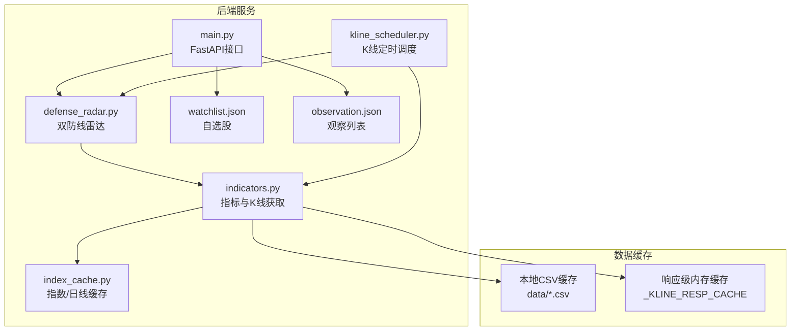
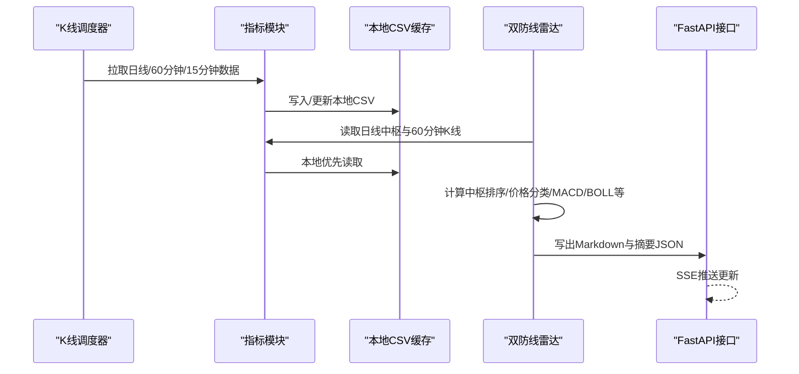
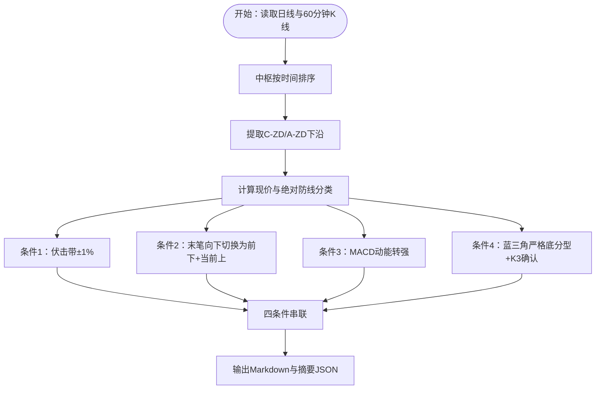
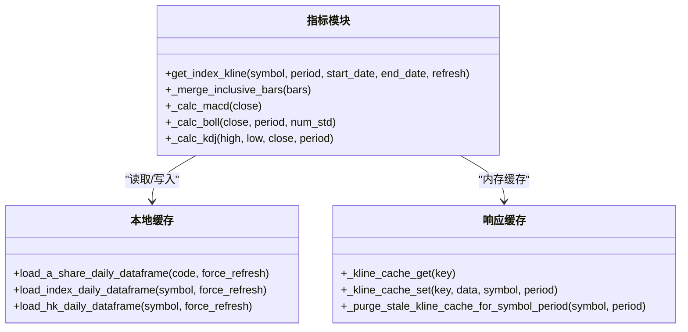
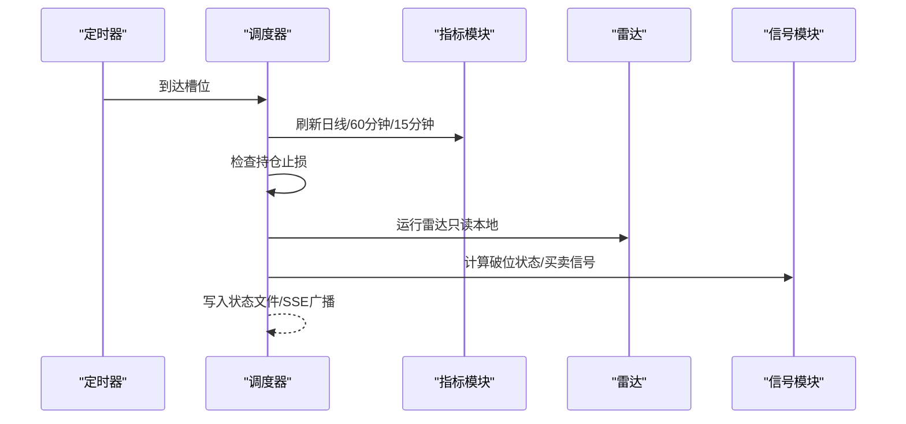
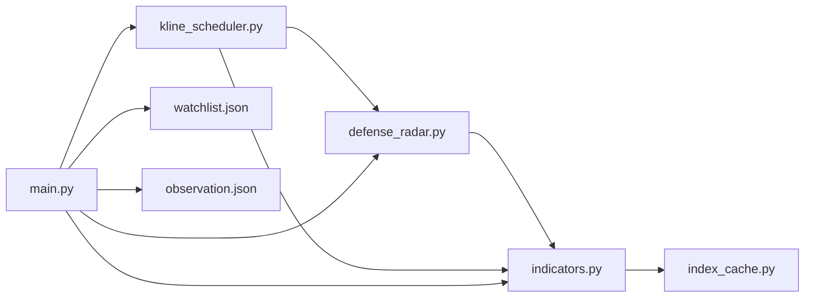

# 数据处理流水线

<cite>
**本文档引用的文件**
- [backend/services/defense_radar.py](file://backend/services/defense_radar.py)
- [backend/services/indicators.py](file://backend/services/indicators.py)
- [backend/services/kline_scheduler.py](file://backend/services/kline_scheduler.py)
- [backend/services/index_cache.py](file://backend/services/index_cache.py)
- [backend/main.py](file://backend/main.py)
- [backend/run_defense_radar.py](file://backend/run_defense_radar.py)
- [backend/update_radar.py](file://backend/update_radar.py)
- [backend/update_radar_local.py](file://backend/update_radar_local.py)
- [backend/data/watchlist.json](file://backend/data/watchlist.json)
- [backend/data/observation.json](file://backend/data/observation.json)
- [backend/tests/fixtures/meihua2test/a_daily_qfq_889999.csv](file://backend/tests/fixtures/meihua2test/a_daily_qfq_889999.csv)
- [backend/tests/fixtures/meihua2test/kline_60_889999.csv](file://backend/tests/fixtures/meihua2test/kline_60_889999.csv)
- [backend/scripts/build_meihua2test_fixture.py](file://backend/scripts/build_meihua2test_fixture.py)
</cite>

## 目录
1. [简介](#简介)
2. [项目结构](#项目结构)
3. [核心组件](#核心组件)
4. [架构总览](#架构总览)
5. [详细组件分析](#详细组件分析)
6. [依赖关系分析](#依赖关系分析)
7. [性能考虑](#性能考虑)
8. [故障排查指南](#故障排查指南)
9. [结论](#结论)
10. [附录](#附录)

## 简介
本项目围绕“双防线黄金伏击圈”雷达构建了一套完整的数据处理流水线，负责从本地缓存读取日线与60分钟K线数据，进行中枢排序、价格分类、技术指标计算与信号判定，最终输出Markdown报告与JSON摘要，供前端展示与API调用。系统采用定时任务驱动数据更新，确保数据新鲜度与一致性，并通过本地CSV缓存与响应级内存缓存实现高效读取与跨进程共享。

## 项目结构
后端以服务模块为核心，主要文件分布如下：
- 服务层：防御雷达、指标计算、K线调度、指数缓存、买卖信号等
- API入口：FastAPI应用，提供指标查询、雷达摘要、调度状态等接口
- 数据与缓存：本地CSV缓存、响应级内存缓存、观察与自选股配置
- 脚本与测试：雷达执行脚本、梅林2test数据构造脚本与样例数据

图表来源
- [backend/services/defense_radar.py:1-959](file://backend/services/defense_radar.py#L1-L959)
- [backend/services/indicators.py:1-1969](file://backend/services/indicators.py#L1-L1969)
- [backend/services/kline_scheduler.py:1-504](file://backend/services/kline_scheduler.py#L1-L504)
- [backend/services/index_cache.py:1-201](file://backend/services/index_cache.py#L1-L201)
- [backend/main.py:1-607](file://backend/main.py#L1-L607)
- [backend/data/watchlist.json:1-27](file://backend/data/watchlist.json#L1-L27)
- [backend/data/observation.json:1-24](file://backend/data/observation.json#L1-L24)

章节来源
- [backend/main.py:1-607](file://backend/main.py#L1-L607)
- [backend/services/defense_radar.py:1-959](file://backend/services/defense_radar.py#L1-L959)
- [backend/services/indicators.py:1-1969](file://backend/services/indicators.py#L1-L1969)
- [backend/services/kline_scheduler.py:1-504](file://backend/services/kline_scheduler.py#L1-L504)
- [backend/services/index_cache.py:1-201](file://backend/services/index_cache.py#L1-L201)
- [backend/data/watchlist.json:1-27](file://backend/data/watchlist.json#L1-L27)
- [backend/data/observation.json:1-24](file://backend/data/observation.json#L1-L24)

## 核心组件
- 双防线雷达（defense_radar.py）：负责扫描标的、读取日线中枢与60分钟K线、执行四条件扳机判定、生成Markdown与摘要JSON。
- 指标与K线获取（indicators.py）：封装K线数据获取、缓存策略、响应级内存缓存、MACD/BOLL/KDJ等指标计算、分型/笔/中枢构建。
- K线定时调度（kline_scheduler.py）：按北京时间设定槽位，全量刷新日线/60分钟/15分钟缓存，触发雷达与信号计算。
- 指数/日线缓存（index_cache.py）：统一管理A股/ETF/指数/港股日线本地缓存，严格本地优先策略。
- FastAPI接口（main.py）：提供雷达摘要、指标查询、调度状态、SSE推送等API。
- 配置与数据（watchlist.json、observation.json）：核心监控列表与用户自定义列表，供前端与后端共享。

章节来源
- [backend/services/defense_radar.py:1-959](file://backend/services/defense_radar.py#L1-L959)
- [backend/services/indicators.py:1-1969](file://backend/services/indicators.py#L1-L1969)
- [backend/services/kline_scheduler.py:1-504](file://backend/services/kline_scheduler.py#L1-L504)
- [backend/services/index_cache.py:1-201](file://backend/services/index_cache.py#L1-L201)
- [backend/main.py:1-607](file://backend/main.py#L1-L607)
- [backend/data/watchlist.json:1-27](file://backend/data/watchlist.json#L1-L27)
- [backend/data/observation.json:1-24](file://backend/data/observation.json#L1-L24)

## 架构总览
系统采用“定时任务驱动 + 本地缓存优先 + 响应级内存缓存”的架构模式：
- 定时任务在固定时间点拉取并写入本地CSV缓存，随后由雷达与信号模块读取本地缓存进行计算。
- 指标模块在读取本地缓存的同时维护响应级内存缓存，提升重复请求性能。
- FastAPI提供统一接口，支持SSE实时推送与前端筛选。

图表来源
- [backend/services/kline_scheduler.py:1-504](file://backend/services/kline_scheduler.py#L1-L504)
- [backend/services/indicators.py:1-1969](file://backend/services/indicators.py#L1-L1969)
- [backend/services/defense_radar.py:1-959](file://backend/services/defense_radar.py#L1-L959)
- [backend/main.py:1-607](file://backend/main.py#L1-L607)

## 详细组件分析

### 双防线雷达（defense_radar.py）
- 输入来源：日线中枢（C-ZD/A-ZD）与60分钟K线末根收盘价（现价）。
- 数据口径：默认只读本地缓存，假定前置任务已更新；仅排障时可选择刷新。
- 核心流程：
  - 读取日线数据，按时间排序中枢，提取C-ZD与A-ZD下沿。
  - 读取60分钟K线，计算现价与绝对防线分类。
  - 判定四条件扳机：伏击带±1%、末笔向下、MACD动能转强、蓝三角严格底分型+K3确认。
  - 计算60分钟买点7条件：中枢内、底背驰、BOLL站回中轨等。
  - 输出Markdown表格与last_summary.json摘要，供API与前端使用。
- 关键函数与算法：
  - 中枢排序：按起止日期升序。
  - 绝对防线分类：基于MIN(C-ZD, A-ZD)与缓冲带1%。
  - MACD动能判定：柱值导数正向或绿柱缩短。
  - 蓝三角严格底分型：合并后K线末三根严格底分型且K3收盘>K2最低。
  - 60分钟买点7条件：中枢内、底背驰点在当前向上笔内、BOLL站回中轨等。

图表来源
- [backend/services/defense_radar.py:179-744](file://backend/services/defense_radar.py#L179-L744)

章节来源
- [backend/services/defense_radar.py:1-959](file://backend/services/defense_radar.py#L1-L959)

### 指标与K线获取（indicators.py）
- 数据来源：本地CSV缓存优先；若不存在或强制刷新，则拉取网络并写回本地。
- 缓存策略：
  - 本地CSV缓存：日线与60分钟/15分钟分别存储，严格本地优先。
  - 响应级内存缓存：_KLINE_RESP_CACHE，按symbol+period+时间范围键缓存，TTL与LRU控制。
  - 本地文件mtime变更触发缓存失效，确保分型/笔/中枢重算。
- 指标计算：MACD、布林带、KDJ等，支持按需扩展。
- 数据清洗与格式转换：统一日期格式、数值类型转换、缺失值处理、包含关系合并K线等。

图表来源
- [backend/services/indicators.py:1-1969](file://backend/services/indicators.py#L1-L1969)
- [backend/services/index_cache.py:1-201](file://backend/services/index_cache.py#L1-L201)

章节来源
- [backend/services/indicators.py:1-1969](file://backend/services/indicators.py#L1-L1969)
- [backend/services/index_cache.py:1-201](file://backend/services/index_cache.py#L1-L201)

### K线定时调度（kline_scheduler.py）
- 调度槽位：10:31/11:31/14:01/15:01（60分钟+雷达），16:01（日线+60分钟+雷达）。
- 任务内容：全量刷新日线/60分钟/15分钟缓存，检查持仓止损，运行雷达，计算破位状态与买卖信号，生成作战指令报告。
- 健康监控：心跳、状态文件、多worker去重锁，支持查询调度状态。

图表来源
- [backend/services/kline_scheduler.py:1-504](file://backend/services/kline_scheduler.py#L1-L504)

章节来源
- [backend/services/kline_scheduler.py:1-504](file://backend/services/kline_scheduler.py#L1-L504)

### FastAPI接口（main.py）
- 提供雷达摘要、指标查询、调度状态、SSE推送、名称缓存等功能。
- 股票名称缓存：从last_summary.json与watchlist合并构建，减少IO。
- SSE推送：雷达更新后广播消息，前端实时接收。

章节来源
- [backend/main.py:1-607](file://backend/main.py#L1-L607)

### 配置与数据
- watchlist.json：核心监控列表，包含代码与名称。
- observation.json：观察列表，仅用于前端显示。
- 梅花2test（889999）：通过脚本构建基座（600873）+ 未来K线mock，独立于生产标的。

章节来源
- [backend/data/watchlist.json:1-27](file://backend/data/watchlist.json#L1-L27)
- [backend/data/observation.json:1-24](file://backend/data/observation.json#L1-L24)
- [backend/tests/fixtures/meihua2test/a_daily_qfq_889999.csv:1-331](file://backend/tests/fixtures/meihua2test/a_daily_qfq_889999.csv#L1-L331)
- [backend/tests/fixtures/meihua2test/kline_60_889999.csv:1-236](file://backend/tests/fixtures/meihua2test/kline_60_889999.csv#L1-L236)
- [backend/scripts/build_meihua2test_fixture.py:1-157](file://backend/scripts/build_meihua2test_fixture.py#L1-L157)

## 依赖关系分析
- defense_radar依赖indicators获取日线与60分钟数据，并依赖前端配置watchlist与observation。
- indicators依赖index_cache与本地CSV缓存，同时维护响应级内存缓存。
- kline_scheduler依赖indicators进行全量刷新，并驱动雷达与信号模块。
- main.py整合各服务并通过API暴露功能，提供SSE与名称缓存。

图表来源
- [backend/services/defense_radar.py:1-959](file://backend/services/defense_radar.py#L1-L959)
- [backend/services/indicators.py:1-1969](file://backend/services/indicators.py#L1-L1969)
- [backend/services/kline_scheduler.py:1-504](file://backend/services/kline_scheduler.py#L1-L504)
- [backend/services/index_cache.py:1-201](file://backend/services/index_cache.py#L1-L201)
- [backend/main.py:1-607](file://backend/main.py#L1-L607)
- [backend/data/watchlist.json:1-27](file://backend/data/watchlist.json#L1-L27)
- [backend/data/observation.json:1-24](file://backend/data/observation.json#L1-L24)

章节来源
- [backend/services/defense_radar.py:1-959](file://backend/services/defense_radar.py#L1-L959)
- [backend/services/indicators.py:1-1969](file://backend/services/indicators.py#L1-L1969)
- [backend/services/kline_scheduler.py:1-504](file://backend/services/kline_scheduler.py#L1-L504)
- [backend/services/index_cache.py:1-201](file://backend/services/index_cache.py#L1-L201)
- [backend/main.py:1-607](file://backend/main.py#L1-L607)

## 性能考虑
- 本地缓存优先：严格本地优先策略，避免重复网络请求，降低延迟。
- 响应级内存缓存：_KLINE_RESP_CACHE提供TTL与LRU控制，命中率高、内存占用可控。
- 缓存失效机制：本地CSV mtime变更触发缓存失效，确保分型/笔/中枢重算。
- 指标计算优化：MACD/BOLL/KDJ等指标按需计算，避免重复计算。
- SSE推送：减少轮询开销，前端实时接收更新。

## 故障排查指南
- 雷达摘要为空或异常：
  - 检查last_summary.json是否存在与可读性。
  - 使用update_radar_local.py强制只读本地缓存重新计算摘要。
- 数据异常或缺失：
  - 使用update_radar.py或run_defense_radar.py的--refresh参数临时拉取网络数据验证。
  - 检查本地CSV是否生成与时间范围是否正确。
- 调度器异常：
  - 查询调度状态接口，确认心跳与下次执行时间。
  - 检查多worker去重锁文件与状态文件。
- 名称缓存问题：
  - 清理名称缓存，系统会在下次请求时重新加载。

章节来源
- [backend/update_radar.py:1-47](file://backend/update_radar.py#L1-L47)
- [backend/update_radar_local.py:1-57](file://backend/update_radar_local.py#L1-L57)
- [backend/run_defense_radar.py:1-31](file://backend/run_defense_radar.py#L1-L31)
- [backend/main.py:1-607](file://backend/main.py#L1-L607)
- [backend/services/kline_scheduler.py:1-504](file://backend/services/kline_scheduler.py#L1-L504)

## 结论
本数据处理流水线通过严格的本地缓存优先与响应级内存缓存策略，实现了高效、稳定的日线与60分钟K线数据处理与分析。定时调度确保数据新鲜度，雷达与信号模块提供可靠的决策依据，FastAPI接口与SSE推送保障前端体验。整体架构清晰、职责分离明确，具备良好的可维护性与扩展性。

## 附录
- 双防线雷达执行脚本：run_defense_radar.py
- 雷达摘要更新脚本：update_radar.py、update_radar_local.py
- 梅花2test数据构造脚本：build_meihua2test_fixture.py

章节来源
- [backend/run_defense_radar.py:1-31](file://backend/run_defense_radar.py#L1-L31)
- [backend/update_radar.py:1-47](file://backend/update_radar.py#L1-L47)
- [backend/update_radar_local.py:1-57](file://backend/update_radar_local.py#L1-L57)
- [backend/scripts/build_meihua2test_fixture.py:1-157](file://backend/scripts/build_meihua2test_fixture.py#L1-L157)