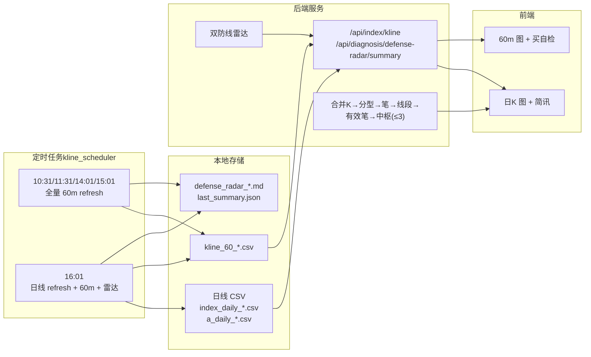
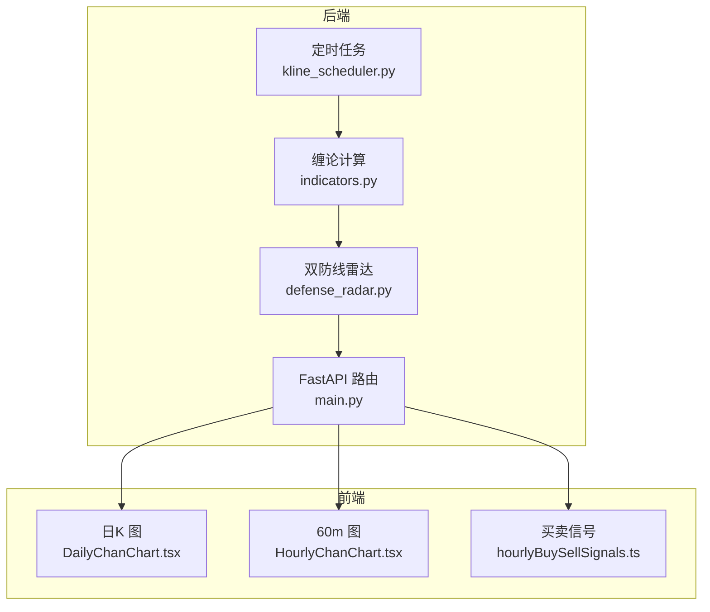
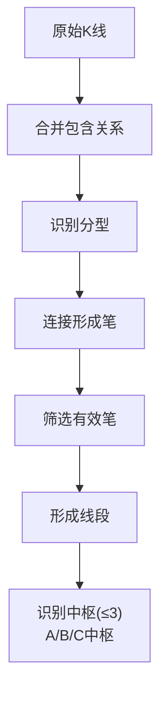
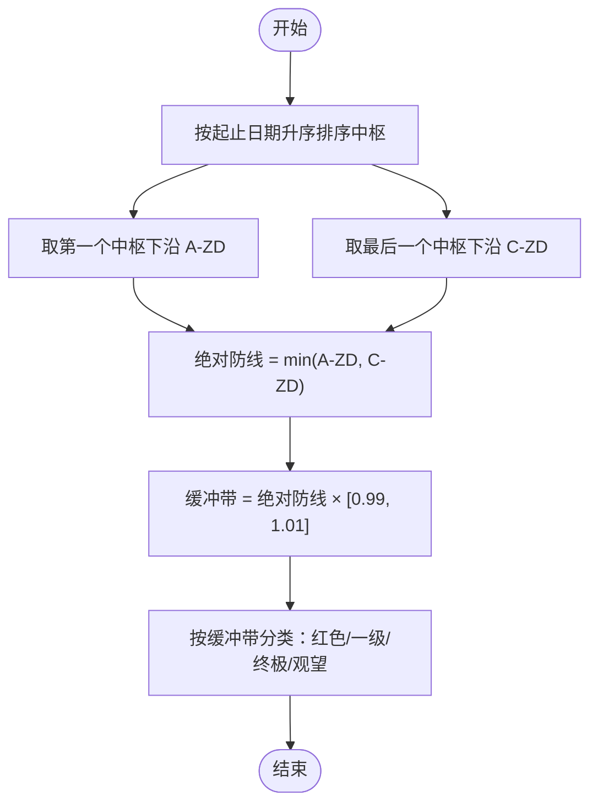
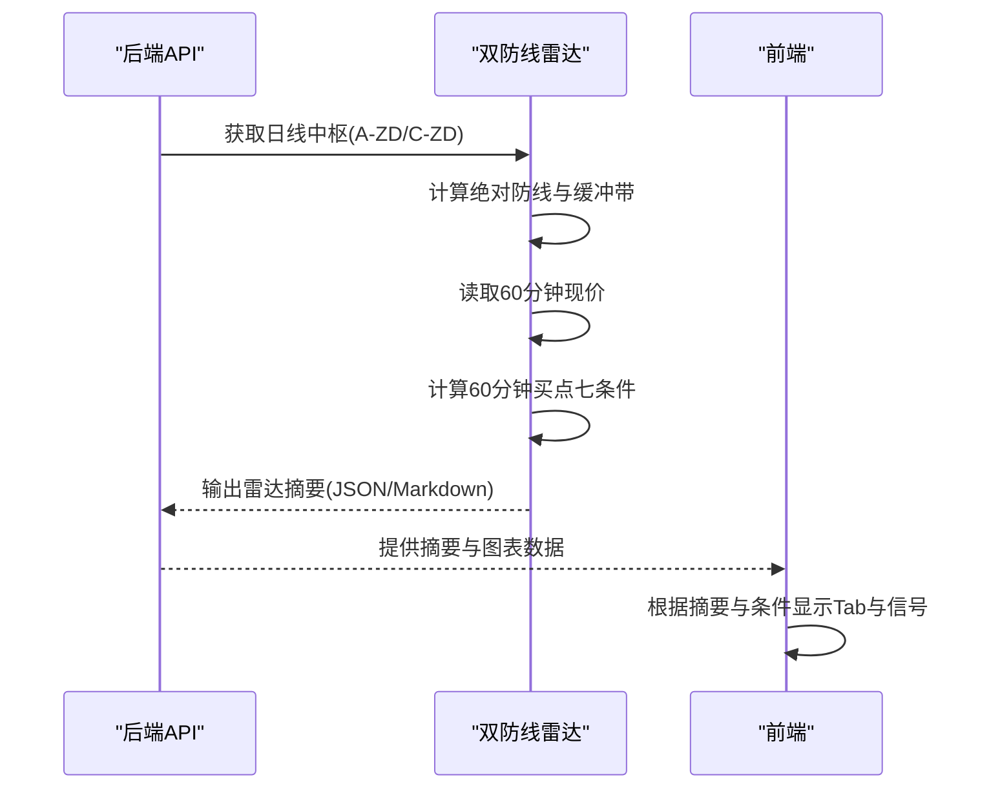
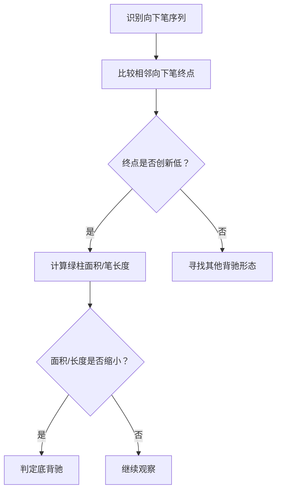
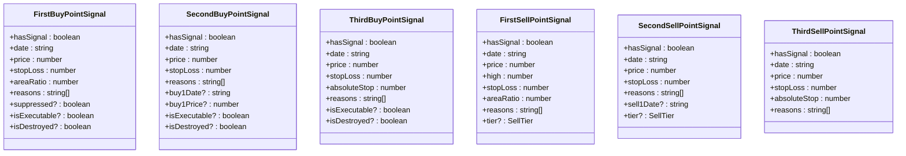
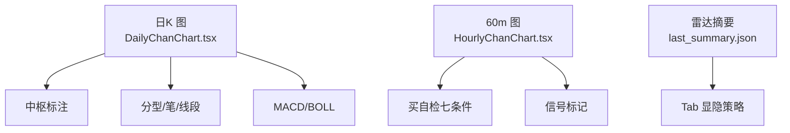

# 缠论理论基础

<cite>
**本文档引用的文件**
- [backend/services/defense_radar.py](file://backend/services/defense_radar.py)
- [backend/services/buy_sell_signals.py](file://backend/services/buy_sell_signals.py)
- [backend/services/indicators.py](file://backend/services/indicators.py)
- [backend/main.py](file://backend/main.py)
- [frontend/src/DailyChanChart.tsx](file://frontend/src/DailyChanChart.tsx)
- [frontend/src/HourlyChanChart.tsx](file://frontend/src/HourlyChanChart.tsx)
- [frontend/src/hourlyBuySellSignals.ts](file://frontend/src/hourlyBuySellSignals.ts)
- [README.md](file://README.md)
</cite>

## 目录
1. [简介](#简介)
2. [项目结构](#项目结构)
3. [核心组件](#核心组件)
4. [架构概览](#架构概览)
5. [详细组件分析](#详细组件分析)
6. [依赖关系分析](#依赖关系分析)
7. [性能考量](#性能考量)
8. [故障排查指南](#故障排查指南)
9. [结论](#结论)
10. [附录](#附录)

## 简介
本文件面向希望深入理解并应用缠论技术分析体系的投资者与开发者，系统梳理本仓库中缠论核心概念与实现细节，包括中枢、笔、线段、级别划分等基础术语，以及 A-ZD（第一个中枢下沿）与 C-ZD（最后一个中枢下沿）的定义与计算方法。同时，结合双防线雷达系统中的绝对防线、伏击圈、缓冲带等关键概念，解释其在趋势判断、支撑阻力识别、背驰判断等核心逻辑中的作用，并提供可视化图表与实例说明，帮助读者将理论应用于实际投资决策。

## 项目结构
该项目采用前后端分离架构，后端负责 K 线缓存、缠论计算与定时同步，前端负责可视化展示与交互。核心数据流如下：

**图表来源**
- [README.md:35-64](file://README.md#L35-L64)
- [backend/main.py:106-125](file://backend/main.py#L106-L125)

**章节来源**
- [README.md:33-173](file://README.md#L33-L173)

## 核心组件
- 双防线雷达系统：基于日线中枢与 60 分钟现价，计算 A-ZD 与 C-ZD，形成绝对防线与伏击圈，输出预警信息与触发条件。
- 缠论计算引擎：在日线与 60 分钟周期上进行 K 线合并、分型识别、笔与线段构建、有效笔筛选与中枢识别。
- 买卖信号系统：在 60 分钟图上识别一买、二买、三买与一卖、二卖、三卖信号，并提供跨级别风控与失效检查。
- 前端可视化：日 K 图与 60 分钟图展示中枢、分型、笔、线段、MACD 与 BOLL，配合雷达摘要与买自检面板。

**章节来源**
- [backend/services/defense_radar.py:1-15](file://backend/services/defense_radar.py#L1-L15)
- [backend/services/indicators.py:93-118](file://backend/services/indicators.py#L93-L118)
- [backend/services/buy_sell_signals.py:1-14](file://backend/services/buy_sell_signals.py#L1-L14)

## 架构概览
后端通过定时任务在固定时间点拉取日线与 60 分钟 K 线，写入本地 CSV；随后在 60 分钟与日线同步后运行双防线雷达，生成 Markdown 报告与摘要 JSON。前端通过 API 获取 K 线与雷达摘要，渲染日 K 与 60 分钟图，并在满足条件时显示相应 Tab。

**图表来源**
- [backend/main.py:106-125](file://backend/main.py#L106-L125)
- [backend/services/indicators.py:93-118](file://backend/services/indicators.py#L93-L118)
- [backend/services/defense_radar.py:747-799](file://backend/services/defense_radar.py#L747-L799)

## 详细组件分析

### 中枢、笔、线段与级别划分
- 中枢：由连续三笔有效笔的价域满足 ZG/ZD 规则构成，按与最新收盘距离排序后取至多 3 段，分别标记为 A 中枢、B 中枢、C 中枢，其中 C 中枢为最新中枢。
- 笔：在合并包含关系后的 K 线序列上识别分型，进而连接形成笔；有效笔为符合趋势延续的笔序列。
- 线段：由有效笔进一步连接形成线段，用于刻画更大级别的波动。
- 级别划分：日线与 60 分钟共同构成双级别分析框架，日线提供宏观支撑阻力与绝对防线，60 分钟提供短期交易信号。

**图表来源**
- [backend/services/indicators.py:798-800](file://backend/services/indicators.py#L798-L800)
- [README.md:93-109](file://README.md#L93-L109)

**章节来源**
- [README.md:93-109](file://README.md#L93-L109)
- [backend/services/indicators.py:798-800](file://backend/services/indicators.py#L798-L800)

### A-ZD 与 C-ZD 的定义与计算
- A-ZD：将日线中枢按起止日期升序排列后，取第一个中枢的下沿。
- C-ZD：将日线中枢按起止日期升序排列后，取最后一个中枢的下沿。
- 绝对防线：取 A-ZD 与 C-ZD 的较小值，作为日线最低防线。
- 伏击圈与缓冲带：在绝对防线基础上设置 ±1% 的缓冲带，用于区分不同风险等级。

**图表来源**
- [backend/services/defense_radar.py:179-216](file://backend/services/defense_radar.py#L179-L216)

**章节来源**
- [backend/services/defense_radar.py:179-216](file://backend/services/defense_radar.py#L179-L216)

### 绝对防线、伏击圈与缓冲带在双防线雷达中的作用
- 绝对防线：决定是否跌破日线最低防线，直接影响是否触发红色警报与禁买状态。
- 伏击圈：在绝对防线之上设置 3% 的核心伏击区域，用于捕捉潜在买入机会。
- 缓冲带：在绝对防线附近设置 ±1% 的缓冲带，作为预警与信号过滤的第一道门槛。
- 60 分钟买点七条件：与日线绝对防线联动，要求现价在绝对防线之上，且满足 C 中枢内、有效笔切换、底分型、底背驰、MACD 转强、BOLL 站回中轨等条件。

**图表来源**
- [backend/services/defense_radar.py:600-744](file://backend/services/defense_radar.py#L600-L744)
- [backend/main.py:198-235](file://backend/main.py#L198-L235)

**章节来源**
- [backend/services/defense_radar.py:600-744](file://backend/services/defense_radar.py#L600-L744)
- [backend/main.py:198-235](file://backend/main.py#L198-L235)

### 趋势判断、支撑阻力识别与背驰判断
- 趋势判断：通过日线有效笔方向与中枢位置判断大趋势，60 分钟有效笔切换作为短期趋势反转信号。
- 支撑阻力识别：中枢上下沿作为关键支撑阻力位，C 中枢上下沿在 60 分钟图中尤为重要。
- 背驰判断：
  - 底背驰：相邻向下笔终点创新低，且绿柱面积缩小或笔长度更短。
  - 顶背驰：相邻向上笔终点创新高，且红柱面积缩小。
  - 一买/一卖：基于中枢与背驰的组合条件，结合 MACD 与分型确认。

**图表来源**
- [backend/services/defense_radar.py:459-492](file://backend/services/defense_radar.py#L459-L492)
- [frontend/src/hourlyBuySellSignals.ts:239-418](file://frontend/src/hourlyBuySellSignals.ts#L239-L418)

**章节来源**
- [backend/services/defense_radar.py:459-492](file://backend/services/defense_radar.py#L459-L492)
- [frontend/src/hourlyBuySellSignals.ts:239-418](file://frontend/src/hourlyBuySellSignals.ts#L239-L418)

### 买卖信号系统（一买/二买/三买与一卖/二卖/三卖）
- 一买（趋势底背驰/盘整背驰）：满足中枢与背驰条件，结合 MACD 与分型确认，设置止损线。
- 二买：一买后多头反击，随后空头反扑，回踩不创新低且力度衰减。
- 三买：突破中枢上沿后的回踩不跌回中枢，结合 MACD 水上漂与底分型确认。
- 一卖：镜像一买逻辑，方向向上，结合 MACD 与顶分型确认。
- 二卖/三卖：基于回撤与 MACD 状态的进一步卖出信号。

**图表来源**
- [frontend/src/hourlyBuySellSignals.ts:14-99](file://frontend/src/hourlyBuySellSignals.ts#L14-L99)

**章节来源**
- [frontend/src/hourlyBuySellSignals.ts:14-99](file://frontend/src/hourlyBuySellSignals.ts#L14-L99)
- [backend/services/buy_sell_signals.py:581-790](file://backend/services/buy_sell_signals.py#L581-L790)

### 前端可视化与交互
- 日 K 图：展示中枢框、分型、笔、线段、MACD 与 BOLL，标注 A-ZD/C-ZD 与伏击圈。
- 60 分钟图：展示买自检面板，包含七条件检查清单与信号标记，支持跨级别风控与失效检查。
- 雷达摘要：与前端 Tab 显隐策略联动，仅在满足条件时显示相应 Tab。

**图表来源**
- [frontend/src/DailyChanChart.tsx:161-820](file://frontend/src/DailyChanChart.tsx#L161-L820)
- [frontend/src/HourlyChanChart.tsx:179-1632](file://frontend/src/HourlyChanChart.tsx#L179-L1632)

**章节来源**
- [frontend/src/DailyChanChart.tsx:161-820](file://frontend/src/DailyChanChart.tsx#L161-L820)
- [frontend/src/HourlyChanChart.tsx:179-1632](file://frontend/src/HourlyChanChart.tsx#L179-L1632)

## 依赖关系分析
- 后端依赖：定时任务负责拉取与缓存 K 线；缠论计算模块负责中枢识别与技术指标；双防线雷达模块负责综合判断与输出；FastAPI 提供统一接口。
- 前端依赖：通过 API 获取 K 线与雷达摘要，渲染图表与交互面板。
- 关键耦合点：日线中枢与 60 分钟现价的联动，决定绝对防线与买点七条件的执行。

**图表来源**
- [backend/main.py:106-125](file://backend/main.py#L106-L125)
- [backend/services/indicators.py:93-118](file://backend/services/indicators.py#L93-L118)
- [backend/services/defense_radar.py:747-799](file://backend/services/defense_radar.py#L747-L799)

**章节来源**
- [backend/main.py:106-125](file://backend/main.py#L106-L125)
- [backend/services/indicators.py:93-118](file://backend/services/indicators.py#L93-L118)
- [backend/services/defense_radar.py:747-799](file://backend/services/defense_radar.py#L747-L799)

## 性能考量
- 缓存策略：进程内响应缓存 + 本地 CSV mtime 失效，减少重复计算与网络请求。
- 定时同步：固定时间点批量刷新，避免频繁拉取造成压力。
- 数据规模：中枢仅取至多 3 段，降低复杂度；K 线合并与分型识别在本地 CSV 上进行，提升速度。

**章节来源**
- [backend/services/indicators.py:93-118](file://backend/services/indicators.py#L93-L118)
- [README.md:115-121](file://README.md#L115-L121)

## 故障排查指南
- 摘要 404：后端未重启或旧进程无新路由，需重启后端。
- 有警报的 Tab 不显示：摘要请求失败或未写入 last_summary.json，检查后端日志与文件权限。
- 60m 报错「本地缓存不存在」：未跑过定时任务或从未对该 symbol refresh=true，需先执行预热。
- 中枢长时间不变：本地 CSV 未更新或仅命中 TTL 内缓存，检查定时任务与缓存 TTL。

**章节来源**
- [README.md:255-263](file://README.md#L255-L263)

## 结论
本项目将缠论核心概念与现代工程实践相结合，通过严谨的数据流设计与可视化呈现，实现了从日线中枢到 60 分钟信号的双级别分析框架。A-ZD 与 C-ZD 作为绝对防线与中枢下沿，为趋势判断与风险控制提供了清晰的量化依据；伏击圈与缓冲带则在实战中平衡了进攻与防守。结合背驰与 MACD/BOLL 等技术指标，系统能够为投资决策提供稳健的信号支持。

## 附录
- 术语速查：中枢（ZG/ZD）、笔（向上/向下）、线段、有效笔、背驰（底/顶）、MACD、BOLL。
- 实战建议：在日线绝对防线之上寻找机会，关注 C 中枢与买自检七条件；严格设置止损，避免高风险回撤。