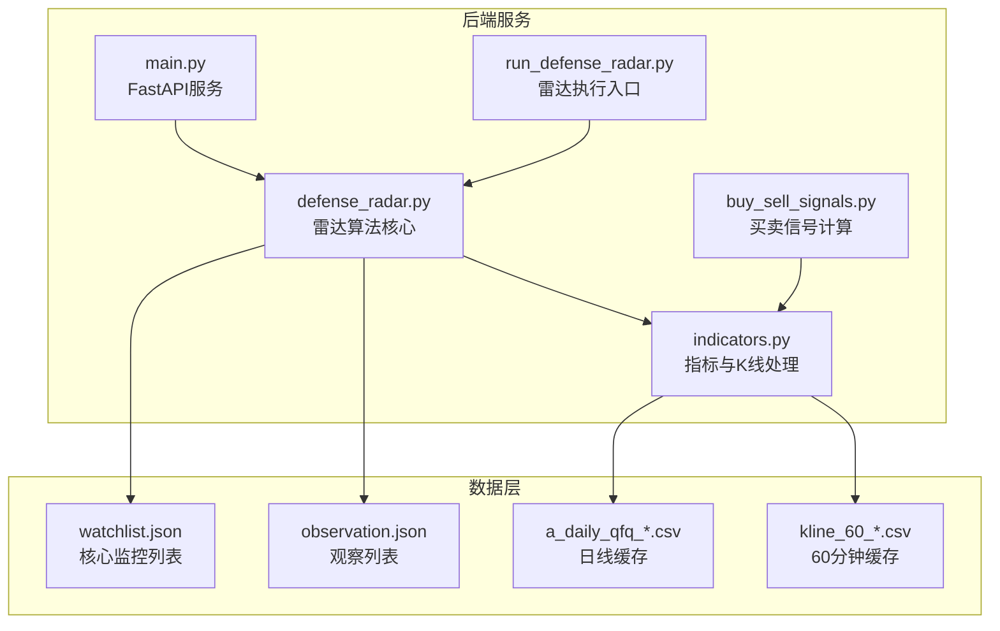
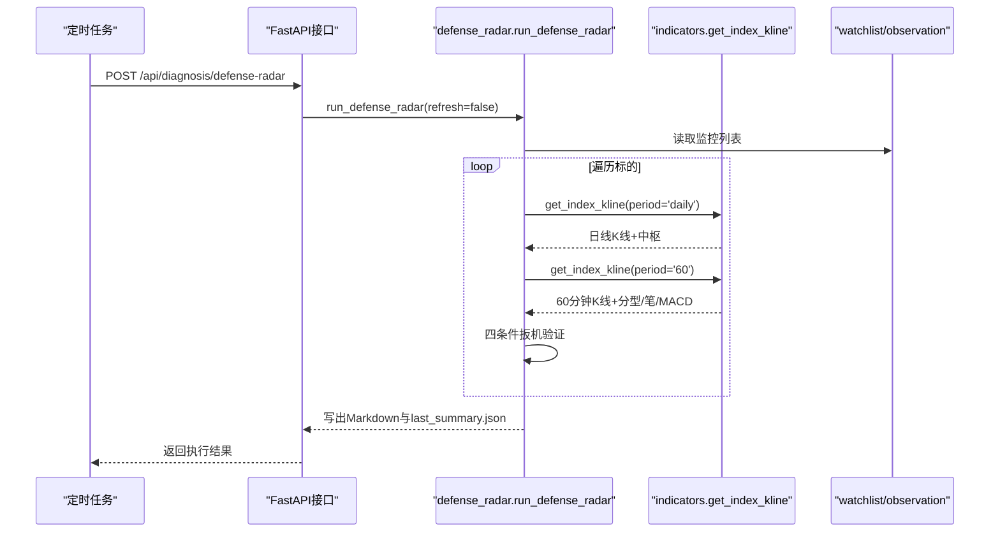
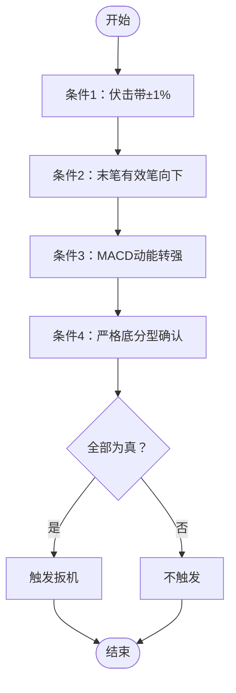
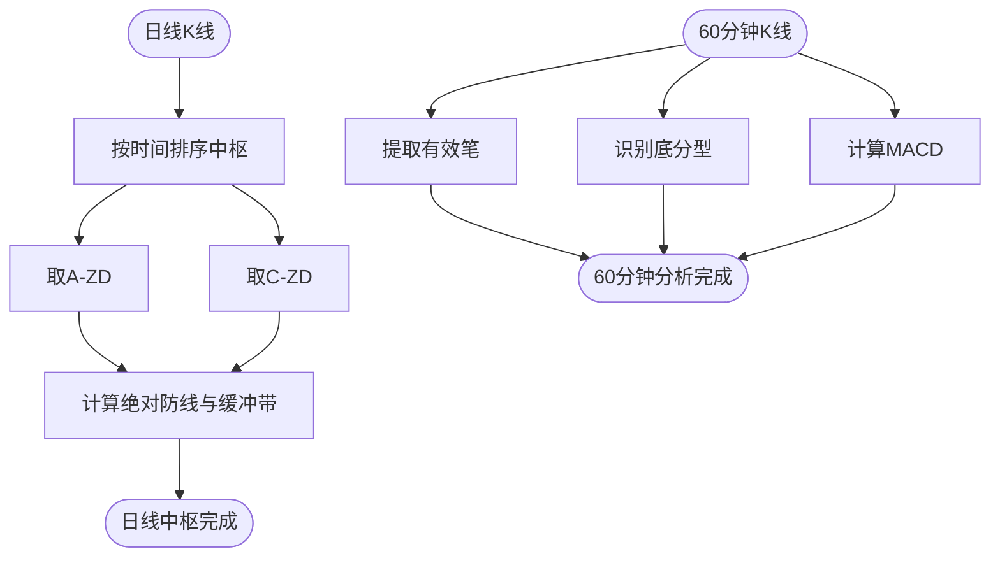
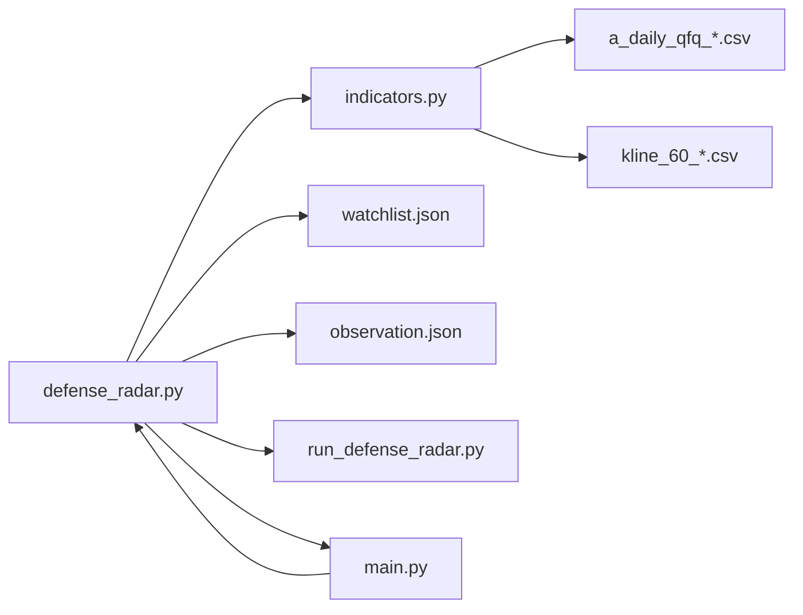

# 雷达算法实现

<cite>
**本文引用的文件**
- [defense_radar.py](file://backend/services/defense_radar.py)
- [indicators.py](file://backend/services/indicators.py)
- [buy_sell_signals.py](file://backend/services/buy_sell_signals.py)
- [run_defense_radar.py](file://backend/run_defense_radar.py)
- [test_defense_radar_trigger.py](file://backend/tests/test_defense_radar_trigger.py)
- [main.py](file://backend/main.py)
- [watchlist.json](file://backend/data/watchlist.json)
- [observation.json](file://backend/data/observation.json)
- [a_daily_qfq_000333.csv](file://backend/data/a_daily_qfq_000333.csv)
- [kline_60_600873.csv](file://backend/data/kline_60_600873.csv)
</cite>

## 目录
1. [简介](#简介)
2. [项目结构](#项目结构)
3. [核心组件](#核心组件)
4. [架构总览](#架构总览)
5. [详细组件分析](#详细组件分析)
6. [依赖关系分析](#依赖关系分析)
7. [性能考虑](#性能考虑)
8. [故障排除指南](#故障排除指南)
9. [结论](#结论)

## 简介
本技术文档针对双防线雷达算法实现进行深入解析，重点阐述四条件扳机的串联逻辑与数据处理流程。雷达系统以日线中枢为基础，结合60分钟K线分析，通过严格的四个条件组合形成触发信号，用于识别潜在的黄金伏击机会。文档涵盖：
- 四条件扳机的计算方法与判断标准
- MACD绿柱面积计算、底分型识别、背驰判断等关键技术点
- 从日线中枢到60分钟K线分析的完整数据流
- 算法优化建议与常见问题排查

## 项目结构
后端采用模块化设计，核心服务位于 `backend/services/`，包含雷达算法、指标计算、买卖信号、K线调度等模块；前端通过FastAPI提供REST接口，定时任务负责数据更新与雷达扫描。

**图表来源**
- [defense_radar.py:1-100](file://backend/services/defense_radar.py#L1-L100)
- [indicators.py:1-120](file://backend/services/indicators.py#L1-L120)
- [main.py:106-240](file://backend/main.py#L106-L240)

**章节来源**
- [defense_radar.py:1-100](file://backend/services/defense_radar.py#L1-L100)
- [indicators.py:1-120](file://backend/services/indicators.py#L1-L120)
- [main.py:106-240](file://backend/main.py#L106-L240)

## 核心组件
- 雷达算法核心：负责日线中枢计算、60分钟K线分析、四条件扳机串联与最终触发判定。
- 指标与K线处理：提供K线数据获取、MACD/BOLL/KDJ等技术指标计算、分型/笔/中枢构建等。
- 买卖信号计算：基于60分钟缠论生成买卖信号，与雷达条件对齐。
- 执行入口与API：提供命令行执行与HTTP接口，支持手动触发与定时调度。

**章节来源**
- [defense_radar.py:418-744](file://backend/services/defense_radar.py#L418-L744)
- [indicators.py:674-706](file://backend/services/indicators.py#L674-L706)
- [buy_sell_signals.py:581-790](file://backend/services/buy_sell_signals.py#L581-L790)
- [run_defense_radar.py:22-31](file://backend/run_defense_radar.py#L22-L31)

## 架构总览
雷达系统遵循“只读本地缓存”的设计原则，假定前置任务已在本地生成日线与60分钟K线缓存。雷达扫描流程如下：
1. 读取核心监控列表与观察列表，合并为完整扫描清单。
2. 对每个标的：
   - 拉取日线K线，计算中枢（C-ZD/A-ZD）。
   - 拉取60分钟K线，提取有效笔、分型、MACD等指标。
   - 依次验证四条件扳机，满足全部条件则触发。
3. 输出Markdown报告与last_summary.json，供前端读取。

**图表来源**
- [main.py:216-236](file://backend/main.py#L216-L236)
- [defense_radar.py:747-800](file://backend/services/defense_radar.py#L747-L800)
- [indicators.py:1512-1583](file://backend/services/indicators.py#L1512-L1583)

**章节来源**
- [main.py:216-236](file://backend/main.py#L216-L236)
- [defense_radar.py:747-800](file://backend/services/defense_radar.py#L747-L800)
- [indicators.py:1512-1583](file://backend/services/indicators.py#L1512-L1583)

## 详细组件分析

### 四条件扳机串联逻辑
雷达系统将四个条件以“串联”方式组合，只有全部为真时才触发扳机（Tab橙色、前端弹窗）。四个条件分别为：
1) 伏击带±1%条件（现价处于MIN(C-ZD, A-ZD)缓冲带内）
2) 末笔有效笔向下条件（有效笔序列最后一笔方向为向下）
3) MACD动能转强条件（柱状图动能向上，绿柱缩短或红柱伸长）
4) 严格底分型确认条件（末三K严格底分型且K3收盘>K2最低）

**图表来源**
- [defense_radar.py:719-725](file://backend/services/defense_radar.py#L719-L725)

**章节来源**
- [defense_radar.py:719-725](file://backend/services/defense_radar.py#L719-L725)

### 条件1：伏击带±1%（现价处于MIN(C-ZD, A-ZD)缓冲带内）
- 计算逻辑：取日线中枢的C-ZD与A-ZD的最小值作为绝对防线，现价在绝对防线与绝对防线×1.01之间即视为进入伏击圈。
- 判断标准：p >= min(C-ZD, A-ZD)且p <= min(C-ZD, A-ZD) × 1.01。
- 实现要点：使用绝对防线与缓冲带阈值进行区间判断，避免破位禁买。

**章节来源**
- [defense_radar.py:196-226](file://backend/services/defense_radar.py#L196-L226)

### 条件2：末笔有效笔向下
- 计算逻辑：从60分钟有效笔序列中取最后两笔，要求前一笔为向下、当前笔为向上，形成“前下+当前上”的切换形态。
- 判断标准：len(pens_eff) >= 2且pens_eff[-2].direction == "down"且pens_eff[-1].direction == "up"。
- 实现要点：逻辑已从“末笔向下”调整为“前下+当前上”的切换形态，提升信号质量。

**章节来源**
- [defense_radar.py:688-696](file://backend/services/defense_radar.py#L688-L696)

### 条件3：MACD动能转强
- 计算逻辑：严格基于MACD柱状图（histogram）的动能变化，当前柱值 > 前一根柱值即为转强。
- 判断标准：
  - 场景A（水下底背驰）：macd_hist < 0 且 macd_hist > prev_macd_hist（绿柱缩短）
  - 场景B（水上主升浪）：macd_hist > 0 且 macd_hist > prev_macd_hist（红柱伸长）
- 实现要点：使用macd_condition3_radar_ok函数，确保对“绿柱缩短/红柱伸长”的敏感度。

**章节来源**
- [defense_radar.py:342-371](file://backend/services/defense_radar.py#L342-L371)

### 条件4：严格底分型确认
- 计算逻辑：取60分钟K线末三根K线，严格底分型（K2的最高/最低均小于K1，K3的最高/最低均小于K1）且K3收盘价 > K2最低价。
- 判断标准：strict_low and strict_high and confirm。
- 实现要点：与图上分型对齐，确保底分型出现在当前向上笔内，避免跨笔误判。

**章节来源**
- [defense_radar.py:256-289](file://backend/services/defense_radar.py#L256-L289)

### 数据处理流程：日线中枢到60分钟分析
- 日线中枢计算：
  - 读取日线K线，按时间排序中枢，取首个中枢A-ZD与最后一个中枢C-ZD。
  - 使用绝对防线逻辑判断现价是否在缓冲带内。
- 60分钟分析：
  - 读取60分钟K线，提取有效笔、分型、MACD等指标。
  - 验证条件2（切换向下笔）、条件3（MACD动能转强）、条件4（严格底分型）。
  - 综合输出雷达结果与60分钟买点7条件中的剩余3项。

**图表来源**
- [defense_radar.py:179-226](file://backend/services/defense_radar.py#L179-L226)
- [indicators.py:853-948](file://backend/services/indicators.py#L853-L948)

**章节来源**
- [defense_radar.py:179-226](file://backend/services/defense_radar.py#L179-L226)
- [indicators.py:853-948](file://backend/services/indicators.py#L853-L948)

### 关键技术点详解

#### MACD绿柱面积计算
- 计算方法：在指定笔区间内，仅统计MACD柱值为负的部分（绿柱），将其绝对值累加，作为动能强度的近似。
- 实现要点：使用_axis_date_key对日期进行统一映射，确保与K线日期对齐；对缺失或异常值进行容错处理。

**章节来源**
- [defense_radar.py:292-316](file://backend/services/defense_radar.py#L292-L316)
- [indicators.py:1397-1418](file://backend/services/indicators.py#L1397-L1418)

#### 底分型识别
- 识别规则：核心三根K线满足底分型条件（中间最低点小于左右，最高点小于等于左右），允许向左右扩展，只要中间K线仍保持极值约束。
- 实现要点：使用_merge_inclusive_bars后的标准化K线序列，确保与实盘画线一致；分型日期采用high_date/low_date以保证极值真实出处。

**章节来源**
- [indicators.py:853-948](file://backend/services/indicators.py#L853-L948)

#### 背驰判断
- 判断依据：相邻两根向下笔，终点创新低，且绿柱面积缩小或笔长度更短，即认为出现底背驰。
- 实现要点：实时计算绿柱面积与笔长度，避免依赖不存在的背驰箭头字段，提高鲁棒性。

**章节来源**
- [defense_radar.py:459-492](file://backend/services/defense_radar.py#L459-L492)

### 算法优化建议
- 性能优化：
  - 对频繁调用的日期映射函数_axis_date_key进行缓存，减少重复解析。
  - 在MACD面积计算中，使用向量化操作（pandas）替代逐行遍历，提升计算效率。
- 稳健性增强：
  - 对缺失或异常数据进行更完善的容错处理，避免因个别字段缺失导致整体失败。
  - 在条件验证过程中加入早期退出策略，减少不必要的计算。
- 可维护性：
  - 将条件判断封装为独立函数，便于单元测试与逻辑分离。
  - 增加日志输出，便于排障与性能分析。

[本节为通用建议，不直接分析具体文件]

## 依赖关系分析
雷达算法依赖以下模块与数据：
- defense_radar.py：核心算法与条件验证
- indicators.py：K线数据获取、技术指标计算、分型/笔/中枢构建
- buy_sell_signals.py：与雷达条件对齐的60分钟买点7条件
- run_defense_radar.py：命令行执行入口
- main.py：FastAPI接口，提供POST /api/diagnosis/defense-radar
- watchlist.json/observation.json：监控标的配置
- 本地K线缓存：a_daily_qfq_*.csv与kline_60_*.csv

**图表来源**
- [defense_radar.py:418-429](file://backend/services/defense_radar.py#L418-L429)
- [indicators.py:1-120](file://backend/services/indicators.py#L1-L120)
- [main.py:106-240](file://backend/main.py#L106-L240)

**章节来源**
- [defense_radar.py:418-429](file://backend/services/defense_radar.py#L418-L429)
- [indicators.py:1-120](file://backend/services/indicators.py#L1-L120)
- [main.py:106-240](file://backend/main.py#L106-L240)

## 性能考虑
- 数据访问：雷达默认只读本地缓存，避免网络抖动影响；仅在排障时通过refresh参数强制拉取线上数据。
- 计算复杂度：中枢与分型构建涉及多次遍历，建议在数据量较大时采用分批处理与缓存策略。
- I/O优化：K线缓存文件采用CSV格式，读取时按日期范围裁剪，减少无关数据处理。

[本节为通用指导，不直接分析具体文件]

## 故障排除指南
- 数据异常：
  - 日线/60分钟K线为空：检查本地缓存是否存在，确认定时任务是否正常运行。
  - 中枢计算失败：确认日线K线是否足够长，有效笔数量是否满足条件。
- 条件误判：
  - 严格底分型误判：检查末三K线是否满足严格底分型条件，确认K3收盘价与K2最低价的关系。
  - MACD动能转强误判：核对当前与前一根MACD柱值，确保绿柱缩短或红柱伸长。
- 接口调用：
  - POST /api/diagnosis/defense-radar：确保refresh参数为false（默认），除非排障需要。
  - GET /api/diagnosis/defense-radar/summary：优先读取last_summary.json，确保文件存在且格式正确。

**章节来源**
- [main.py:216-236](file://backend/main.py#L216-L236)
- [test_defense_radar_trigger.py:1-254](file://backend/tests/test_defense_radar_trigger.py#L1-L254)

## 结论
双防线雷达算法通过严格的四条件串联，结合日线中枢与60分钟K线分析，实现了对潜在黄金伏击机会的精准识别。其核心在于：
- 伏击带±1%的缓冲带判断，确保在安全区间内寻找机会
- 有效笔切换形态的识别，提升信号质量
- MACD动能转强的严格判定，避免假突破
- 严格底分型与图上分型对齐，降低误判率

通过对指标计算、分型识别与背驰判断等关键技术点的深入解析，配合性能优化与故障排除建议，雷达系统能够在保证准确性的同时，具备良好的可维护性与扩展性。