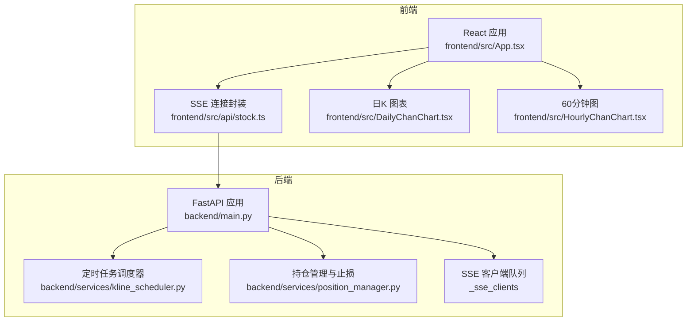
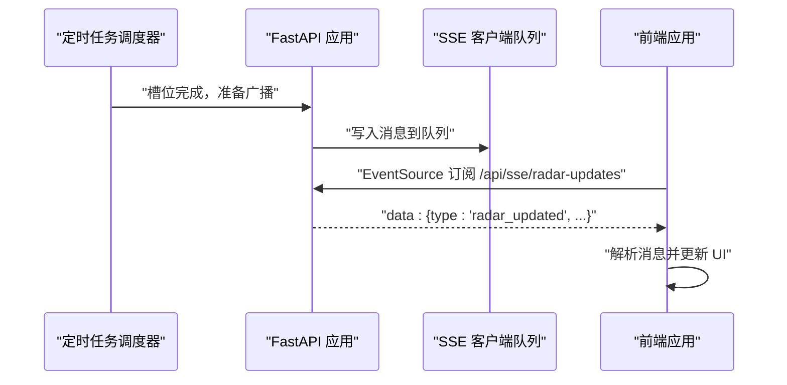
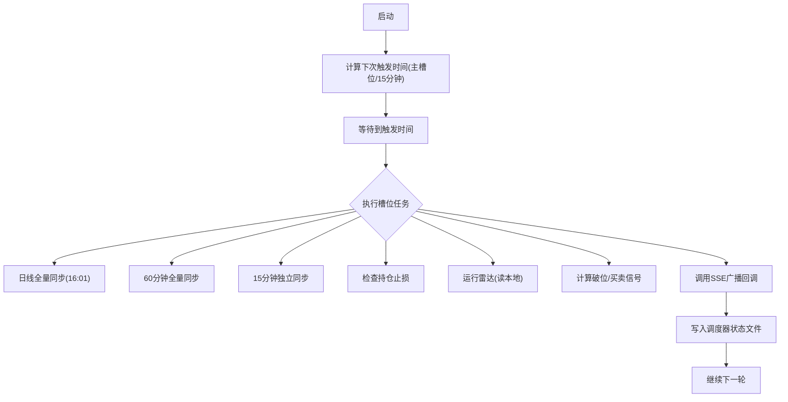
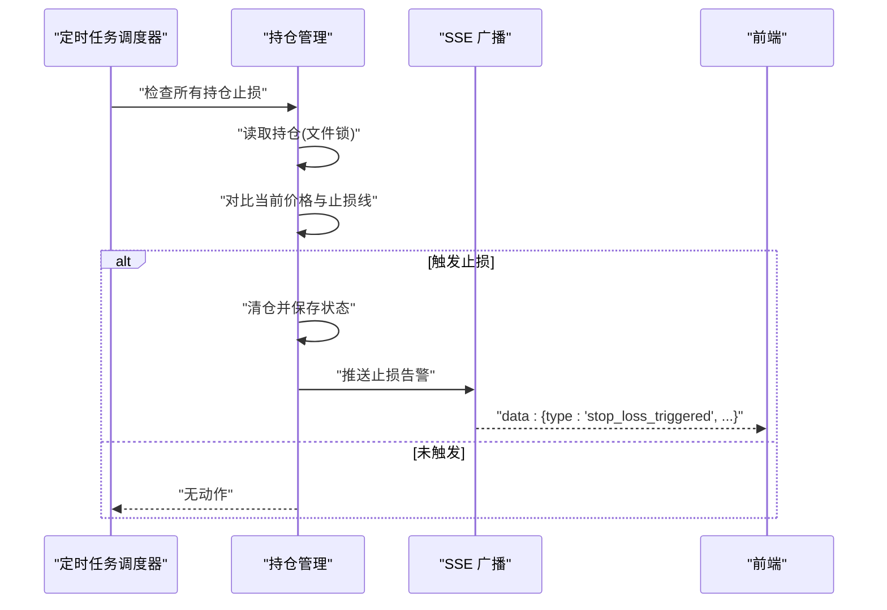
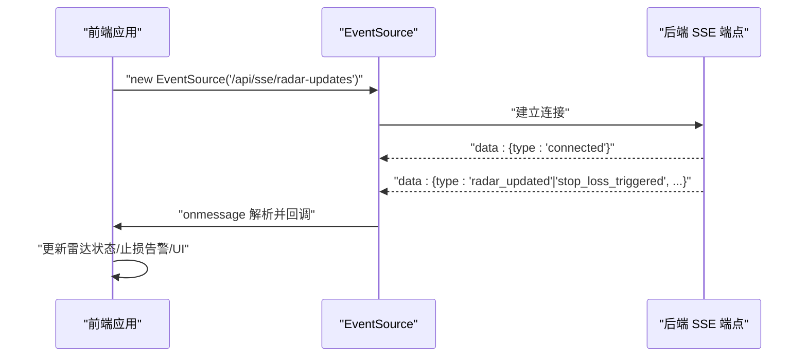
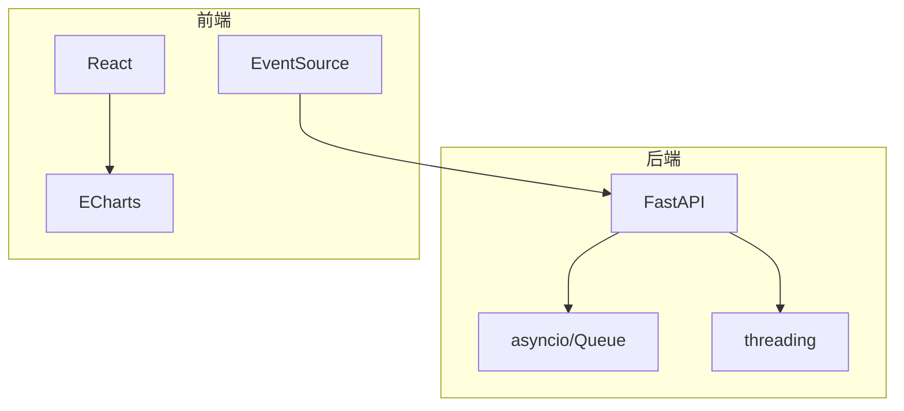

# 实时数据推送系统

<cite>
**本文引用的文件**
- [backend/main.py](file://backend/main.py)
- [backend/services/kline_scheduler.py](file://backend/services/kline_scheduler.py)
- [backend/services/position_manager.py](file://backend/services/position_manager.py)
- [backend/data/watchlist.json](file://backend/data/watchlist.json)
- [frontend/src/api/stock.ts](file://frontend/src/api/stock.ts)
- [frontend/src/App.tsx](file://frontend/src/App.tsx)
- [frontend/src/DailyChanChart.tsx](file://frontend/src/DailyChanChart.tsx)
- [frontend/src/HourlyChanChart.tsx](file://frontend/src/HourlyChanChart.tsx)
- [README.md](file://README.md)
</cite>

## 目录
1. [简介](#简介)
2. [项目结构](#项目结构)
3. [核心组件](#核心组件)
4. [架构总览](#架构总览)
5. [详细组件分析](#详细组件分析)
6. [依赖分析](#依赖分析)
7. [性能考虑](#性能考虑)
8. [故障排查指南](#故障排查指南)
9. [结论](#结论)
10. [附录](#附录)

## 简介
本项目是一个基于 Server-Sent Events (SSE) 的实时数据推送系统，用于向前端推送“双防线雷达”更新与止损告警。后端采用 FastAPI 提供 SSE 端点，定时任务负责周期性地拉取/计算 K 线与雷达数据，并在完成后通过 SSE 广播给所有在线客户端。前端使用 React + ECharts 构建可视化界面，通过 EventSource 订阅后端 SSE，实现雷达更新与止损告警的实时展示。

## 项目结构
- 后端
  - FastAPI 应用入口与生命周期管理
  - 定时任务调度器（K 线同步、雷达计算、止损检查）
  - 持仓管理与止损告警推送
  - SSE 客户端队列与消息广播
- 前端
  - React 应用与 ECharts 图表
  - SSE 连接封装与事件处理
  - K 线数据拉取与缓存策略
  - 雷达摘要与买卖信号的本地读取



**图表来源**
- [backend/main.py:243-284](file://backend/main.py#L243-L284)
- [backend/services/kline_scheduler.py:452-488](file://backend/services/kline_scheduler.py#L452-L488)
- [backend/services/position_manager.py:28-36](file://backend/services/position_manager.py#L28-L36)
- [frontend/src/api/stock.ts:480-497](file://frontend/src/api/stock.ts#L480-L497)

**章节来源**
- [README.md:216-244](file://README.md#L216-L244)

## 核心组件
- SSE 端点与客户端队列
  - 后端在启动时注册 SSE 广播回调，定时任务完成后调用回调，将消息推送到所有在线客户端队列。
  - SSE 端点为每个连接创建一个 asyncio.Queue，并在 30 秒超时内持续发送心跳，保持连接活跃。
- 定时任务调度器
  - 周期性同步日线/60 分钟/15 分钟 K 线，计算雷达摘要、破位状态与买卖信号，并在完成后广播 SSE。
- 持仓管理与止损告警
  - 定时检查持仓止损，触发后自动清仓并通过 SSE 推送止损告警。
- 前端 SSE 连接与事件处理
  - 使用 EventSource 订阅后端 SSE，解析消息并更新 UI 状态（雷达更新、止损告警）。

**章节来源**
- [backend/main.py:31-82](file://backend/main.py#L31-L82)
- [backend/main.py:243-284](file://backend/main.py#L243-L284)
- [backend/services/kline_scheduler.py:214-259](file://backend/services/kline_scheduler.py#L214-L259)
- [backend/services/position_manager.py:138-167](file://backend/services/position_manager.py#L138-L167)
- [frontend/src/api/stock.ts:480-497](file://frontend/src/api/stock.ts#L480-L497)

## 架构总览
SSE 实时推送的整体流程如下：
- 后端定时任务在槽位时间到达时执行同步与计算，完成后调用 SSE 广播回调。
- SSE 广播回调将消息写入所有在线客户端队列。
- 前端通过 EventSource 订阅 SSE 端点，接收消息并更新 UI。



**图表来源**
- [backend/services/kline_scheduler.py:252-259](file://backend/services/kline_scheduler.py#L252-L259)
- [backend/main.py:31-82](file://backend/main.py#L31-L82)
- [backend/main.py:243-284](file://backend/main.py#L243-L284)
- [frontend/src/api/stock.ts:480-497](file://frontend/src/api/stock.ts#L480-L497)

## 详细组件分析

### SSE 端点与客户端队列
- SSE 端点
  - 每个连接创建一个 asyncio.Queue，并将队列保存到全局客户端列表中。
  - 生成器在 30 秒超时内等待消息，超时则发送心跳消息，保持连接活跃。
  - 连接断开时从客户端列表移除。
- 广播机制
  - 广播回调在定时任务完成后调用，遍历客户端队列，将消息写入队列。
  - 对写入失败的客户端进行清理，移除断开的连接。

```mermaid
flowchart TD
Start(["连接建立"]) --> InitQueue["创建客户端队列"]
InitQueue --> AddToList["加入全局客户端列表"]
AddToList --> Loop{"等待消息或超时"}
Loop --> |收到消息| SendMsg["yield data: 消息"]
Loop --> |超时(30s)| SendHeartbeat["yield data: 心跳"]
SendMsg --> Loop
SendHeartbeat --> Loop
Loop --> |CancelledError/异常| Cleanup["从列表移除队列"]
Cleanup --> End(["连接结束"])
```

**图表来源**
- [backend/main.py:243-284](file://backend/main.py#L243-L284)
- [backend/main.py:31-82](file://backend/main.py#L31-L82)

**章节来源**
- [backend/main.py:243-284](file://backend/main.py#L243-L284)
- [backend/main.py:31-82](file://backend/main.py#L31-L82)

### 定时任务调度器
- 槽位与同步
  - 主槽位：10:31/11:31/14:01/15:01 执行 60 分钟全量同步；16:01 执行日线全量同步 + 60 分钟全量同步 + 雷达。
  - 15 分钟槽位：交易时间内每 15 分钟独立同步一次 60 分钟 K 线。
- 广播与状态
  - 槽位完成后调用 SSE 广播回调，传递 include_daily 与时间戳。
  - 写入调度器状态文件，供多进程读取健康状态。
- 多进程去重
  - 使用文件锁确保同一时间只有一个进程启动调度器。



**图表来源**
- [backend/services/kline_scheduler.py:289-361](file://backend/services/kline_scheduler.py#L289-L361)
- [backend/services/kline_scheduler.py:214-259](file://backend/services/kline_scheduler.py#L214-L259)
- [backend/services/kline_scheduler.py:452-488](file://backend/services/kline_scheduler.py#L452-L488)

**章节来源**
- [backend/services/kline_scheduler.py:414-449](file://backend/services/kline_scheduler.py#L414-L449)
- [backend/services/kline_scheduler.py:452-488](file://backend/services/kline_scheduler.py#L452-L488)

### 持仓管理与止损告警
- 持仓记录
  - 使用 JSON 文件持久化持仓，支持读写锁保证并发安全。
  - 提供买入、清仓、查询等功能。
- 止损检查
  - 定时任务中对每个持仓检查当前价格是否跌破战术止损或战略止损。
  - 触发后自动清仓并推送 SSE 告警。



**图表来源**
- [backend/services/kline_scheduler.py:181-212](file://backend/services/kline_scheduler.py#L181-L212)
- [backend/services/position_manager.py:138-167](file://backend/services/position_manager.py#L138-L167)
- [backend/main.py:44-54](file://backend/main.py#L44-L54)

**章节来源**
- [backend/services/position_manager.py:184-233](file://backend/services/position_manager.py#L184-L233)
- [backend/services/kline_scheduler.py:181-212](file://backend/services/kline_scheduler.py#L181-L212)

### 前端集成与事件处理
- SSE 连接
  - 前端通过 EventSource 订阅后端 SSE 端点，解析消息并调用回调。
- UI 更新
  - 雷达更新消息触发 UI 状态更新（如 Tab 显示、图表刷新）。
  - 止损告警消息触发提示与持仓状态更新。



**图表来源**
- [frontend/src/api/stock.ts:480-497](file://frontend/src/api/stock.ts#L480-L497)
- [backend/main.py:243-284](file://backend/main.py#L243-L284)

**章节来源**
- [frontend/src/api/stock.ts:480-497](file://frontend/src/api/stock.ts#L480-L497)
- [frontend/src/App.tsx:584-800](file://frontend/src/App.tsx#L584-L800)

## 依赖分析
- 后端依赖
  - FastAPI：提供路由与生命周期管理。
  - asyncio/asyncio.Queue：SSE 客户端队列与消息广播。
  - threading：定时任务工作线程与文件锁。
- 前端依赖
  - React + ECharts：图表渲染与交互。
  - EventSource：SSE 客户端连接。



**图表来源**
- [backend/main.py:12-14](file://backend/main.py#L12-L14)
- [frontend/src/api/stock.ts:480-497](file://frontend/src/api/stock.ts#L480-L497)

**章节来源**
- [backend/requirements.txt:1-8](file://backend/requirements.txt#L1-L8)
- [frontend/package.json:12-31](file://frontend/package.json#L12-L31)

## 性能考虑
- SSE 连接管理
  - 使用 asyncio.Queue 作为客户端队列，线程安全写入，避免阻塞。
  - 心跳机制（30 秒）保持连接活跃，减少连接中断。
- 定时任务
  - 多进程去重（文件锁）避免重复执行。
  - 状态文件写入与健康检查，便于监控与排障。
- 前端数据拉取
  - 使用 no-store 禁用缓存，确保雷达摘要与买卖信号及时更新。
  - K 线数据按本地 CSV mtime 失效，减少重复计算。

**章节来源**
- [backend/main.py:243-284](file://backend/main.py#L243-L284)
- [backend/services/kline_scheduler.py:452-488](file://backend/services/kline_scheduler.py#L452-L488)
- [frontend/src/api/stock.ts:199](file://frontend/src/api/stock.ts#L199)

## 故障排查指南
- SSE 连接问题
  - 检查后端 SSE 端点是否可达，确认 CORS 配置。
  - 查看后端日志，确认广播回调是否正常调用。
- 定时任务问题
  - 检查调度器状态文件与心跳时间，确认多进程去重是否生效。
  - 确认定时任务是否在预期时间执行（10:31/11:31/14:01/15:01/16:01）。
- 前端数据问题
  - 确认雷达摘要与买卖信号接口返回正确 JSON。
  - 检查 K 线本地 CSV 是否存在，必要时使用 refresh=true 预热。

**章节来源**
- [backend/main.py:113-124](file://backend/main.py#L113-L124)
- [backend/services/kline_scheduler.py:414-449](file://backend/services/kline_scheduler.py#L414-L449)
- [README.md:255-263](file://README.md#L255-L263)

## 结论
本系统通过 SSE 实现了高效的实时数据推送，结合定时任务与本地缓存策略，确保雷达更新与止损告警的及时性与稳定性。后端提供清晰的生命周期管理与广播机制，前端通过 EventSource 与 ECharts 实现直观的数据可视化。整体架构简洁、可扩展性强，适合在金融数据可视化场景中部署与维护。

## 附录
- 配置与最佳实践
  - 后端 CORS 允许任意来源（本地开发），生产环境建议限制来源。
  - SSE 心跳间隔为 30 秒，可根据网络环境调整。
  - 定时任务多进程去重使用文件锁，确保唯一实例。
  - 前端接口使用 no-store 禁用缓存，确保数据新鲜度。
- 前端集成示例（步骤）
  - 创建 EventSource 连接，监听 onmessage 事件。
  - 解析消息类型（radar_updated、stop_loss_triggered）并更新 UI。
  - 错误处理：监听 onerror，记录日志并尝试重连。

**章节来源**
- [backend/main.py:113-124](file://backend/main.py#L113-L124)
- [frontend/src/api/stock.ts:480-497](file://frontend/src/api/stock.ts#L480-L497)
- [README.md:255-263](file://README.md#L255-L263)