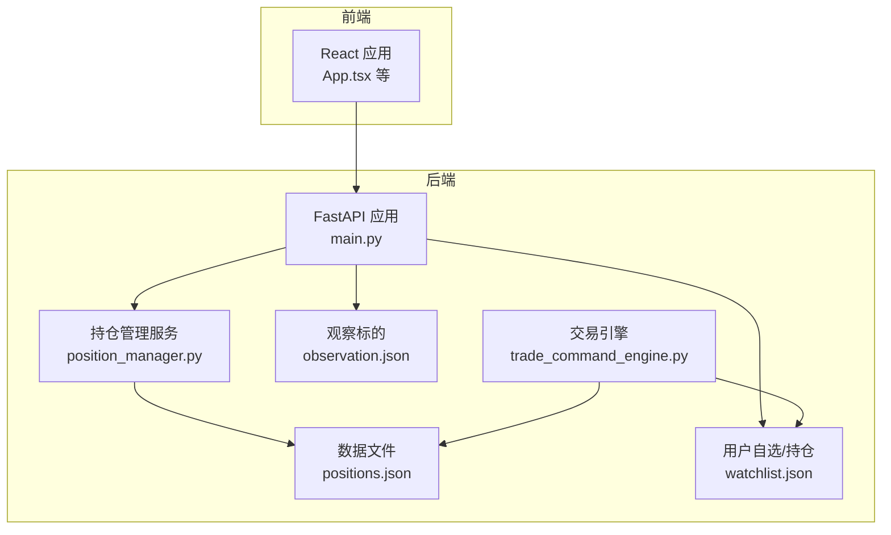
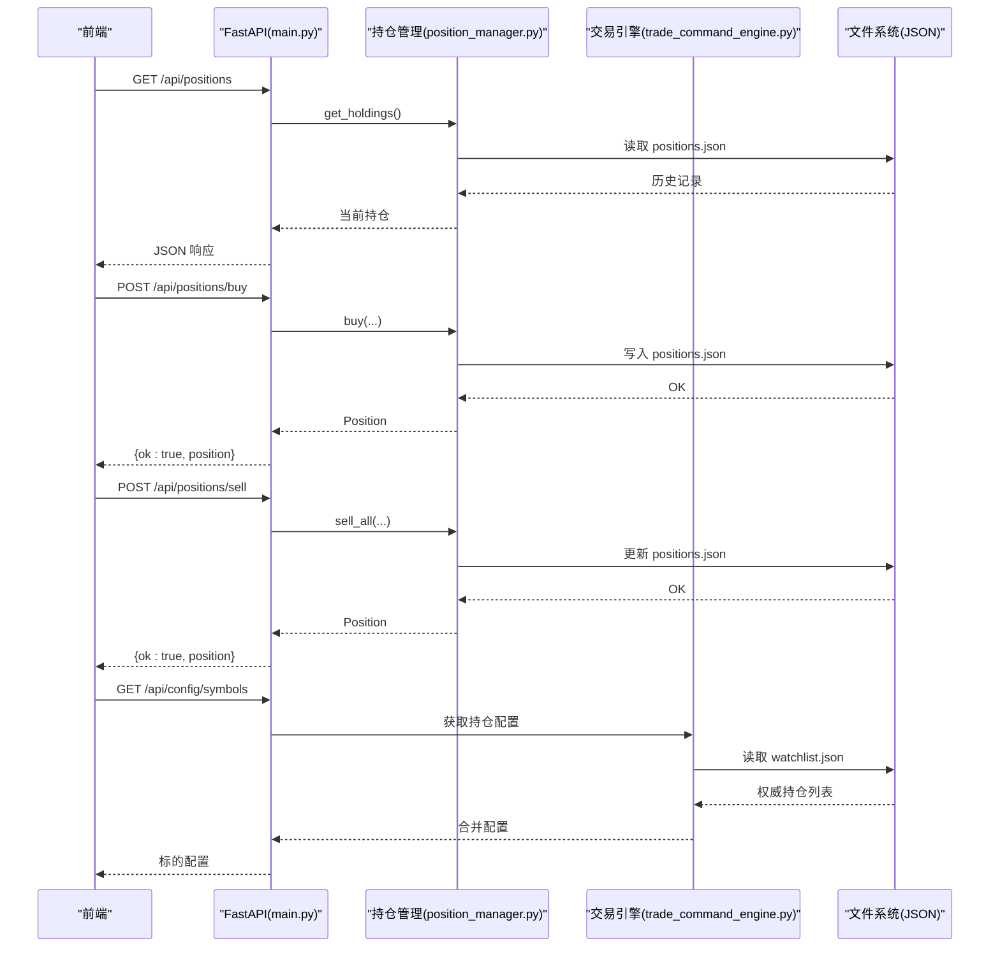
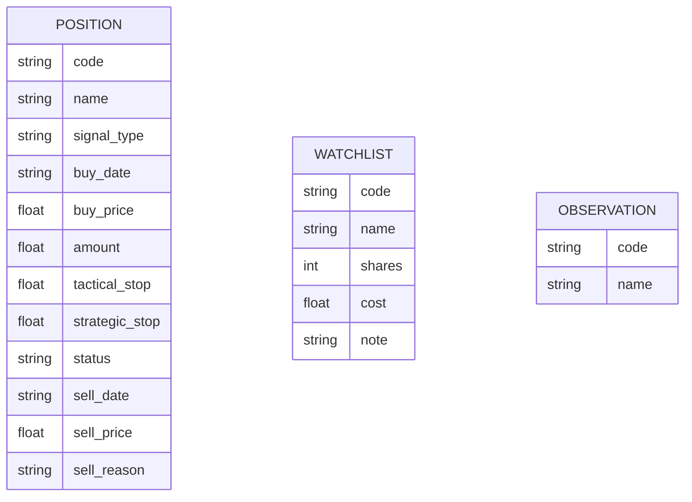
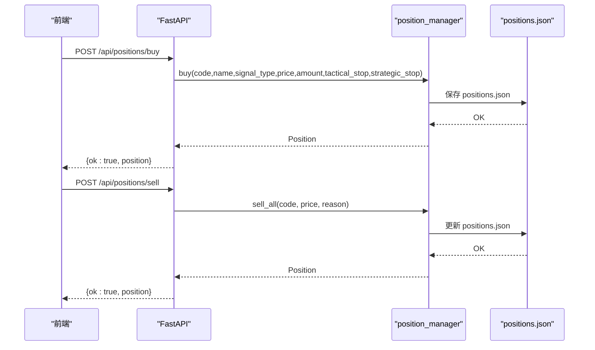
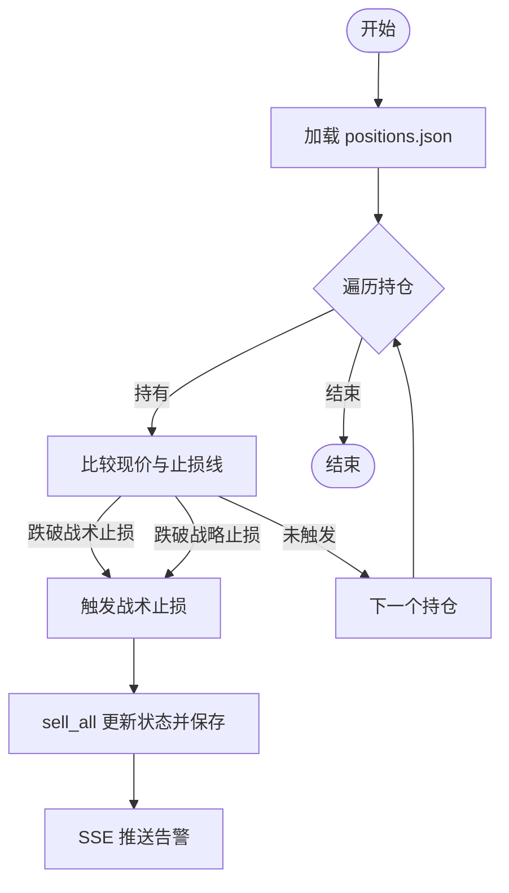
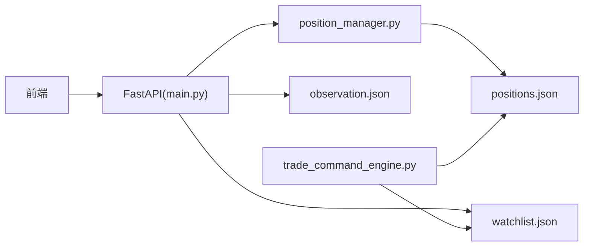

# 持仓管理功能

<cite>
**本文引用的文件**
- [positions.json](file://data/positions.json)
- [position_manager.py](file://backend/services/position_manager.py)
- [main.py](file://backend/main.py)
- [watchlist.json](file://backend/data/watchlist.json)
- [observation.json](file://backend/data/observation.json)
- [trade_command_engine.py](file://backend/services/trade_command_engine.py)
- [test_position_manager_thread_safe.py](file://backend/tests/test_position_manager_thread_safe.py)
- [README.md](file://README.md)
</cite>

## 更新摘要
**变更内容**
- 系统现在完全依赖watchlist.json作为权威持仓信息源，增强数据一致性
- positions.json仅保留为历史记录和真实交易数据的补充存储
- 金额计算采用多层优先级：positions.json > watchlist.json > 默认值
- 前端配置同步机制得到加强，消除前后端配置双源头问题

## 目录
1. [简介](#简介)
2. [项目结构](#项目结构)
3. [核心组件](#核心组件)
4. [架构概览](#架构概览)
5. [详细组件分析](#详细组件分析)
6. [依赖分析](#依赖分析)
7. [性能考虑](#性能考虑)
8. [故障排查指南](#故障排查指南)
9. [结论](#结论)
10. [附录](#附录)

## 简介
本文件面向"持仓管理功能"的使用者与维护者，系统性介绍持仓数据模型、存储结构、风险控制机制、分析与导出能力，以及与前端的集成方式。重点覆盖以下方面：
- watchlist.json 作为权威持仓信息源的数据模型与字段定义
- positions.json 的历史记录与真实交易数据补充作用
- 手动持仓记录的添加、编辑、删除流程
- 风险控制：止损策略（战术止损、战略止损）与自动清仓
- 持仓分析：收益与风险指标的计算思路
- 数据导入导出与备份策略
- 实战案例：多标的跟踪与风险管理
- 数据安全与隐私保护

## 项目结构
围绕持仓管理的关键文件与职责如下：
- 后端服务层：提供 REST API 与业务逻辑（FastAPI + Python）
- 数据层：本地 JSON 文件（positions.json、watchlist.json、observation.json）
- 前端：消费后端 API，展示持仓与风控信息

**图表来源**
- [main.py:428-486](file://backend/main.py#L428-L486)
- [position_manager.py:1-234](file://backend/services/position_manager.py#L1-L234)
- [positions.json:1-30](file://data/positions.json#L1-L30)
- [watchlist.json:1-27](file://backend/data/watchlist.json#L1-L27)
- [observation.json:1-24](file://backend/data/observation.json#L1-L24)
- [trade_command_engine.py:79-139](file://backend/services/trade_command_engine.py#L79-L139)

**章节来源**
- [main.py:428-486](file://backend/main.py#L428-L486)
- [position_manager.py:1-234](file://backend/services/position_manager.py#L1-L234)
- [positions.json:1-30](file://data/positions.json#L1-L30)
- [watchlist.json:1-27](file://backend/data/watchlist.json#L1-L27)
- [observation.json:1-24](file://backend/data/observation.json#L1-L24)
- [trade_command_engine.py:79-139](file://backend/services/trade_command_engine.py#L79-L139)

## 核心组件
- 持仓数据模型（Position）：描述单笔持仓的核心字段，包括代码、名称、信号类型、买入时间、买入价、金额、战术止损、战略止损、状态、清仓时间、清仓价与原因等。
- 持仓管理服务（position_manager.py）：提供线程安全的加载、保存、买入、清仓、查询等功能，并内置文件锁与并发保护。
- 后端 API（main.py）：对外暴露 /api/positions、/api/positions/buy、/api/positions/sell、/api/positions/history 等接口。
- 数据文件：positions.json（历史记录与真实交易数据）、watchlist.json（权威持仓信息源）、observation.json（观察标的，不参与止损）。
- 交易引擎（trade_command_engine.py）：基于watchlist.json提供金额计算和持仓识别的权威来源。

**章节来源**
- [position_manager.py:38-54](file://backend/services/position_manager.py#L38-L54)
- [main.py:428-486](file://backend/main.py#L428-L486)
- [positions.json:1-30](file://data/positions.json#L1-L30)
- [watchlist.json:1-27](file://backend/data/watchlist.json#L1-L27)
- [observation.json:1-24](file://backend/data/observation.json#L1-L24)
- [trade_command_engine.py:79-139](file://backend/services/trade_command_engine.py#L79-L139)

## 架构概览
后端通过 FastAPI 提供 REST 接口，前端通过 API 获取持仓与风控信息。系统采用watchlist.json作为权威持仓信息源，positions.json作为历史记录和真实交易数据的补充存储，服务层负责并发安全与文件锁。

**图表来源**
- [main.py:428-486](file://backend/main.py#L428-L486)
- [position_manager.py:57-167](file://backend/services/position_manager.py#L57-L167)
- [trade_command_engine.py:79-139](file://backend/services/trade_command_engine.py#L79-L139)

**章节来源**
- [main.py:428-486](file://backend/main.py#L428-L486)
- [position_manager.py:57-167](file://backend/services/position_manager.py#L57-L167)
- [trade_command_engine.py:79-139](file://backend/services/trade_command_engine.py#L79-L139)

## 详细组件分析

### 数据模型与存储结构
- positions.json：历史记录与真实交易数据的补充存储，数组形式存储 Position 记录，每条记录包含：
  - code：标的代码
  - name：标的名称
  - signal_type：信号类型（first_buy / second_buy）
  - buy_date：买入日期时间
  - buy_price：买入价
  - amount：买入金额（元）
  - tactical_stop：战术止损线（底分型低点）
  - strategic_stop：战略止损线（一买绝对低点）
  - status：持有状态（holding / sold）
  - sell_date：清仓日期时间（可空）
  - sell_price：清仓价（可空）
  - sell_reason：清仓原因（可空）

- watchlist.json：权威持仓信息源，包含用户自选/持仓列表，用于前端显示与配置同步，支持以下字段：
  - code：标的代码（必填）
  - name：标的名称（必填）
  - shares：股数（可选）
  - cost：成本价（可选）
  - note：备注（可选）

- observation.json：观察标的列表，仅用于前端显示，不参与止损检查。

**图表来源**
- [position_manager.py:38-54](file://backend/services/position_manager.py#L38-L54)
- [positions.json:1-30](file://data/positions.json#L1-L30)
- [watchlist.json:1-27](file://backend/data/watchlist.json#L1-L27)
- [observation.json:1-24](file://backend/data/observation.json#L1-L24)

**章节来源**
- [positions.json:1-30](file://data/positions.json#L1-L30)
- [position_manager.py:38-54](file://backend/services/position_manager.py#L38-L54)
- [watchlist.json:1-27](file://backend/data/watchlist.json#L1-L27)
- [observation.json:1-24](file://backend/data/observation.json#L1-L24)

### 手动持仓记录的添加、编辑、删除
- 添加（买入）：POST /api/positions/buy
  - 请求参数：code、name、signal_type、price、amount、tactical_stop、strategic_stop
  - 服务端调用 buy(...)，写入 positions.json，返回新增的 Position
- 编辑：当前实现不提供直接编辑接口。建议通过"清仓 + 新建"组合实现修改（如修改止损线、金额等）
- 删除（清仓）：POST /api/positions/sell
  - 请求参数：code、price、reason
  - 服务端调用 sell_all(...)，将对应持仓标记为 sold，并写入清仓时间、价格与原因

**图表来源**
- [main.py:450-476](file://backend/main.py#L450-L476)
- [position_manager.py:95-167](file://backend/services/position_manager.py#L95-L167)

**章节来源**
- [main.py:450-476](file://backend/main.py#L450-L476)
- [position_manager.py:95-167](file://backend/services/position_manager.py#L95-L167)

### 风险控制机制
- 止损策略
  - 战术止损：跌破底分型低点时触发
  - 战略止损：跌破一买绝对低点时触发
- 触发逻辑
  - check_stop_loss(code, current_price)：检查单个标的是否触发止损
  - check_all_stop_loss(prices)：批量检查并自动清仓触发的标的
- 清仓后行为
  - 更新 status、sell_date、sell_price、sell_reason
  - 通过 SSE 推送止损告警给前端

**图表来源**
- [position_manager.py:184-233](file://backend/services/position_manager.py#L184-L233)
- [main.py:44-54](file://backend/main.py#L44-L54)

**章节来源**
- [position_manager.py:184-233](file://backend/services/position_manager.py#L184-L233)
- [main.py:44-54](file://backend/main.py#L44-L54)

### 持仓分析功能
- 当前 API 提供：
  - 获取当前持有：GET /api/positions
  - 获取历史记录：GET /api/positions/history
- 分析指标（建议实现思路）
  - 盈亏计算：(现价 - 买入价) × 持仓份额（或按金额/单价推导）
  - 收益率：(现价/买入价 - 1) × 100%
  - 风险评估：以止损线与当前价的距离衡量风险敞口
  - 组合层面：按信号类型、时间维度统计胜率、平均盈亏比等
- 注意：以上为分析思路，具体实现需结合前端展示与后端扩展。

**章节来源**
- [main.py:428-486](file://backend/main.py#L428-L486)

### 数据导入导出与备份
- 导入/导出
  - positions.json 为纯文本 JSON，可直接复制、编辑、替换
  - watchlist.json 为权威持仓信息源，直接编辑此文件添加/删除/修改
  - 建议在导入前备份原文件，导入后通过 /api/positions/history 校验
- 备份策略
  - 建议定期复制 data/positions.json 至安全位置
  - 结合版本控制工具（如 Git）记录变更历史
- 注意事项
  - 修改 positions.json 后无需重启后端，但建议通过 /api/positions/history 核对一致性
  - watchlist.json 与 observation.json 仅影响前端显示与配置同步，不参与止损

**章节来源**
- [positions.json:1-30](file://data/positions.json#L1-L30)
- [watchlist.json:1-27](file://backend/data/watchlist.json#L1-L27)
- [observation.json:1-24](file://backend/data/observation.json#L1-L24)

### 实战案例：多标的跟踪与风险管理
- 场景：同时跟踪多只 A 股与港股 ETF，设置不同信号类型的止损线
- 步骤
  - 使用 /api/positions/buy 为每只标的录入买入信息与止损线
  - 通过 /api/positions/history 查看历史记录，确认清仓与收益情况
  - 使用 /api/positions 获取当前持有，结合前端图表观察走势
  - 当触发止损时，系统自动清仓并通过 SSE 告警
- 建议
  - 为不同策略（first_buy / second_buy）设置差异化止损线
  - 定期复盘收益与风险指标，优化止损参数

**章节来源**
- [main.py:428-486](file://backend/main.py#L428-L486)
- [position_manager.py:184-233](file://backend/services/position_manager.py#L184-L233)

### 数据安全与隐私保护
- 本地优先：数据文件位于本地，不上传云端
- 文件锁与并发安全：服务层使用文件锁与线程锁，避免并发写入损坏
- CORS 与部署：默认允许任意来源（本地开发），生产环境建议限制来源
- 建议
  - 为敏感文件设置最小权限
  - 使用版本控制记录变更，避免误删
  - 定期备份 positions.json

**章节来源**
- [position_manager.py:12-26](file://backend/services/position_manager.py#L12-L26)
- [main.py:118-124](file://backend/main.py#L118-L124)
- [README.md:266-269](file://README.md#L266-L269)

## 依赖分析
- 组件耦合
  - main.py 依赖 position_manager.py 提供的业务方法
  - position_manager.py 依赖本地 JSON 文件作为持久化介质
  - trade_command_engine.py 依赖 watchlist.json 作为权威持仓信息源
- 外部依赖
  - FastAPI、uvicorn（后端）
  - React、TypeScript（前端）
- 潜在风险
  - 单机文件存储：跨机共享需额外方案
  - 前端与后端标的配置需保持一致（通过 /api/config/symbols 同步）

**图表来源**
- [main.py:428-486](file://backend/main.py#L428-L486)
- [position_manager.py:21-22](file://backend/services/position_manager.py#L21-L22)
- [trade_command_engine.py:79-139](file://backend/services/trade_command_engine.py#L79-L139)

**章节来源**
- [main.py:428-486](file://backend/main.py#L428-L486)
- [position_manager.py:21-22](file://backend/services/position_manager.py#L21-L22)
- [trade_command_engine.py:79-139](file://backend/services/trade_command_engine.py#L79-L139)

## 性能考虑
- 文件锁与线程锁：避免并发写入冲突，保证数据一致性
- 读写分离：读取时使用共享锁，写入时使用独占锁
- 建议
  - 控制写入频率，批量更新优于频繁小更新
  - 大规模数据时考虑分片或外部数据库替代

**章节来源**
- [position_manager.py:12-26](file://backend/services/position_manager.py#L12-L26)
- [test_position_manager_thread_safe.py:121-146](file://backend/tests/test_position_manager_thread_safe.py#L121-L146)

## 故障排查指南
- 无法读取 positions.json
  - 检查文件是否存在与权限
  - 通过 /api/positions/history 核对记录数量与字段
- 并发写入异常
  - 确认使用 buy/sell 等封装方法，避免直接编辑文件
  - 查看日志中文件锁相关警告
- 止损未触发
  - 确认当前价格高于止损线
  - 检查 positions.json 中 status 是否为 holding
- 清仓后未收到 SSE 告警
  - 检查 /api/sse/radar-updates 是否正常连接
  - 查看后端日志中的 SSE 推送记录

**章节来源**
- [position_manager.py:57-93](file://backend/services/position_manager.py#L57-L93)
- [main.py:44-54](file://backend/main.py#L44-L54)
- [test_position_manager_thread_safe.py:46-120](file://backend/tests/test_position_manager_thread_safe.py#L46-L120)

## 结论
本系统通过轻量的 JSON 文件与线程安全的服务层，实现了简单可靠的持仓管理与风险控制。现在完全依赖watchlist.json作为权威持仓信息源，增强了数据一致性，建议在现有基础上扩展分析指标与可视化，完善导入导出与备份流程，以满足更复杂的投组管理需求。

## 附录
- API 参考
  - GET /api/positions：获取当前持有
  - POST /api/positions/buy：手动买入
  - POST /api/positions/sell：手动清仓
  - GET /api/positions/history：获取历史记录
  - GET /api/watchlist：获取 watchlist.json 内容
  - GET /api/observation：获取 observation.json 内容
  - GET /api/config/symbols：获取合并后的标的配置
  - GET /api/broken-symbols：获取破位状态
  - GET /api/buy-sell-signals：获取买卖信号状态
- 数据文件
  - data/positions.json：历史记录与真实交易数据
  - backend/data/watchlist.json：权威持仓信息源
  - backend/data/observation.json：观察标的

**章节来源**
- [main.py:428-486](file://backend/main.py#L428-L486)
- [positions.json:1-30](file://data/positions.json#L1-L30)
- [watchlist.json:1-27](file://backend/data/watchlist.json#L1-L27)
- [observation.json:1-24](file://backend/data/observation.json#L1-L24)