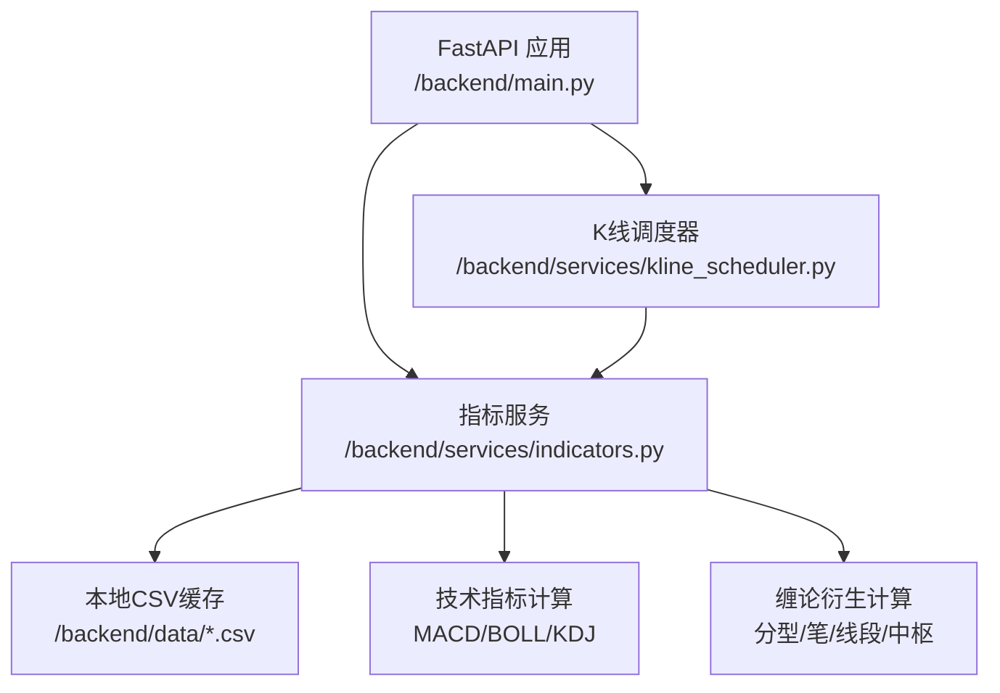
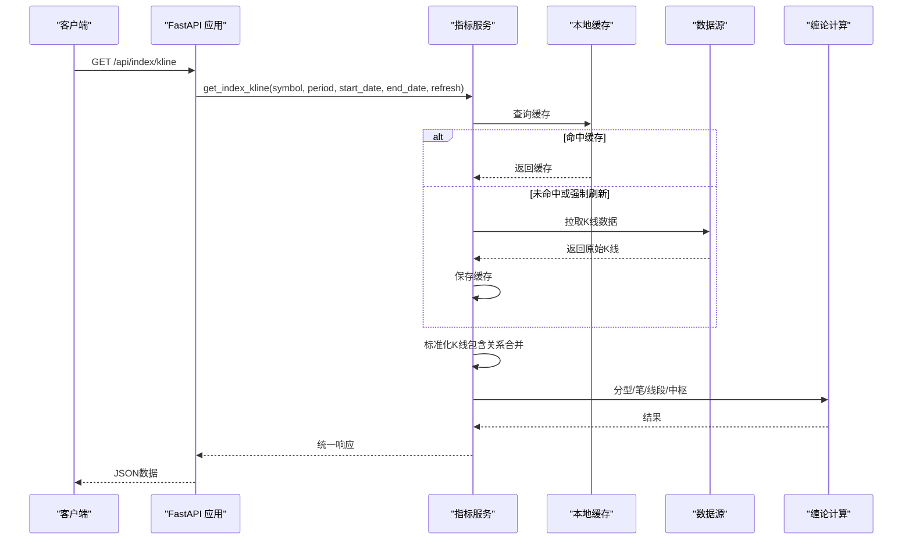
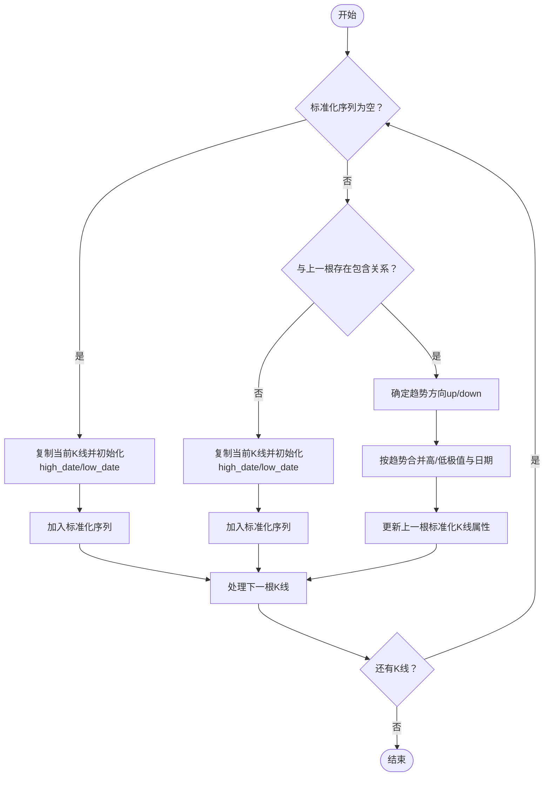
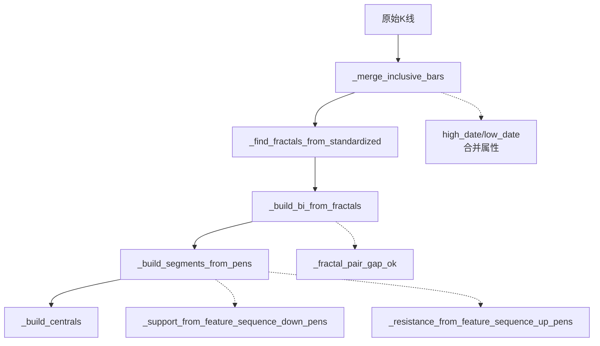
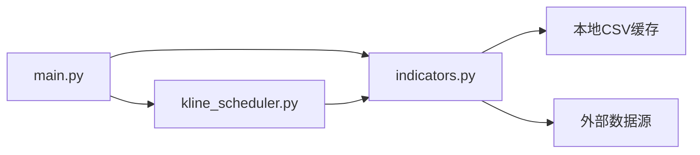

# K线数据处理与合并

<cite>
**本文引用的文件**
- [backend/services/indicators.py](file://backend/services/indicators.py)
- [backend/services/kline_scheduler.py](file://backend/services/kline_scheduler.py)
- [backend/main.py](file://backend/main.py)
- [backend/scripts/refresh_kline_258.py](file://backend/scripts/refresh_kline_258.py)
- [backend/tests/test_kline_cache_lru.py](file://backend/tests/test_kline_cache_lru.py)
</cite>

## 目录
1. [简介](#简介)
2. [项目结构](#项目结构)
3. [核心组件](#核心组件)
4. [架构总览](#架构总览)
5. [详细组件分析](#详细组件分析)
6. [依赖分析](#依赖分析)
7. [性能考虑](#性能考虑)
8. [故障排查指南](#故障排查指南)
9. [结论](#结论)
10. [附录](#附录)

## 简介
本文件围绕K线数据处理与合并功能进行系统化说明，重点涵盖：
- K线包含关系的识别与处理算法
- 极值合并规则与趋势方向判断
- 合并后K线属性的计算方法
- 数据预处理流程（清洗、格式标准化、时间轴对齐）
- 与分型、笔、线段、中枢等技术分析模块的衔接
- 算法流程图与代码片段路径，帮助开发者快速定位实现细节与性能优化点

## 项目结构
本项目采用后端服务架构，K线处理主要集中在指标服务模块中，定时任务负责数据刷新与缓存失效，API入口提供对外查询能力。

**图表来源**
- [backend/main.py:106-241](file://backend/main.py#L106-L241)
- [backend/services/indicators.py:1661-1969](file://backend/services/indicators.py#L1661-L1969)
- [backend/services/kline_scheduler.py:125-259](file://backend/services/kline_scheduler.py#L125-L259)

**章节来源**
- [backend/main.py:106-241](file://backend/main.py#L106-L241)
- [backend/services/indicators.py:1661-1969](file://backend/services/indicators.py#L1661-L1969)
- [backend/services/kline_scheduler.py:125-259](file://backend/services/kline_scheduler.py#L125-L259)

## 核心组件
- K线包含关系识别与合并
  - 包含关系判断：[backend/services/indicators.py:_has_inclusive_relation:708-711](file://backend/services/indicators.py#L708-L711)
  - 标准化K线序列生成：[backend/services/indicators.py:_merge_inclusive_bars:798-850](file://backend/services/indicators.py#L798-L850)
  - 极值贡献日期计算：[backend/services/indicators.py:_merge_contribute_extreme_dates:748-795](file://backend/services/indicators.py#L748-L795)
- 分型、笔、线段、中枢
  - 分型识别：[backend/services/indicators.py:_find_fractals_from_standardized:853-948](file://backend/services/indicators.py#L853-L948)
  - 笔生成：[backend/services/indicators.py:_build_bi_from_fractals:1008-1058](file://backend/services/indicators.py#L1008-L1058)
  - 线段构建：[backend/services/indicators.py:_build_segments_from_pens:1226-1336](file://backend/services/indicators.py#L1226-L1336)
  - 中枢构建：[backend/services/indicators.py:_build_centrals:1446-1509](file://backend/services/indicators.py#L1446-L1509)
- 数据预处理与缓存
  - K线获取与缓存：[backend/services/indicators.py:get_index_kline:1661-1969](file://backend/services/indicators.py#L1661-L1969)
  - 本地缓存LRU与TTL：[backend/services/indicators.py:缓存相关函数:149-176](file://backend/services/indicators.py#L149-L176)
  - 调度刷新：[backend/services/kline_scheduler.py:run_scheduled_slot:214-259](file://backend/services/kline_scheduler.py#L214-L259)

**章节来源**
- [backend/services/indicators.py:708-850](file://backend/services/indicators.py#L708-L850)
- [backend/services/indicators.py:853-1058](file://backend/services/indicators.py#L853-L1058)
- [backend/services/indicators.py:1226-1509](file://backend/services/indicators.py#L1226-L1509)
- [backend/services/indicators.py:1661-1969](file://backend/services/indicators.py#L1661-L1969)
- [backend/services/kline_scheduler.py:214-259](file://backend/services/kline_scheduler.py#L214-L259)

## 架构总览
K线处理链路从API入口进入，经过数据获取与缓存判断，生成标准化K线序列，再进行分型、笔、线段、中枢等高级分析，最终返回统一格式的数据。

**图表来源**
- [backend/main.py:164-195](file://backend/main.py#L164-L195)
- [backend/services/indicators.py:1661-1969](file://backend/services/indicators.py#L1661-L1969)
- [backend/services/indicators.py:798-850](file://backend/services/indicators.py#L798-L850)
- [backend/services/indicators.py:853-1058](file://backend/services/indicators.py#L853-L1058)
- [backend/services/indicators.py:1226-1509](file://backend/services/indicators.py#L1226-L1509)

## 详细组件分析

### K线包含关系识别与合并
- 包含关系判断
  - 两根K线存在包含关系的充要条件：一根K线的最高价不低于另一根最高价且最低价不高于另一根最低价，或相反。
  - 实现位置：[backend/services/indicators.py:_has_inclusive_relation:708-711](file://backend/services/indicators.py#L708-L711)
- 标准化K线序列生成
  - 遍历原始K线，若与上一根无包含关系则直接加入；否则根据趋势方向进行合并。
  - 趋势判定：基于最近两根标准化K线的高低对比，或以合并后K线收盘价与上一根收盘价比较决定。
  - 合并属性：合并最高价/最低价、成交量累加、更新日期为合并后K线的末日期；同时维护high_date/low_date指向真实极值所在的原始K线日期。
  - 实现位置：[backend/services/indicators.py:_merge_inclusive_bars:798-850](file://backend/services/indicators.py#L798-L850)
- 极值贡献日期计算
  - 根据趋势方向分别取高/低极值的最大者，并在相等时选择更早的日期（实盘习惯）。
  - 实现位置：[backend/services/indicators.py:_merge_contribute_extreme_dates:748-795](file://backend/services/indicators.py#L748-L795)

**图表来源**
- [backend/services/indicators.py:798-850](file://backend/services/indicators.py#L798-L850)

**章节来源**
- [backend/services/indicators.py:708-850](file://backend/services/indicators.py#L708-L850)
- [backend/services/indicators.py:748-795](file://backend/services/indicators.py#L748-L795)

### 分型、笔、线段与中枢
- 分型识别
  - 基于核心三根K线的极值约束，允许向左右扩展形成有效分型区间。
  - 分型日期取实际创出极值的原始K线日期（high_date/low_date）。
  - 实现位置：[backend/services/indicators.py:_find_fractals_from_standardized:853-948](file://backend/services/indicators.py#L853-L948)
- 笔生成
  - 相邻分型交替配对，且中间至少隔1根独立K线；向上笔起点为底分型最低点，终点为顶分型最高点；反之亦然。
  - 实现位置：[backend/services/indicators.py:_build_bi_from_fractals:1008-1058](file://backend/services/indicators.py#L1008-L1058)
- 线段构建
  - 三笔交替且价域重叠，向上线段以向下三笔的特征序列（向下笔合并后的底分型/支撑）破坏为终结条件；向下线段对称。
  - 实现位置：[backend/services/indicators.py:_build_segments_from_pens:1226-1336](file://backend/services/indicators.py#L1226-L1336)
- 中枢构建
  - 三笔端点价域满足ZG=min(g)>ZD=max(d)生成中枢；用收盘价首次有效离开区间裁剪可视结束日；按价格去重并排序。
  - 实现位置：[backend/services/indicators.py:_build_centrals:1446-1509](file://backend/services/indicators.py#L1446-L1509)

**图表来源**
- [backend/services/indicators.py:798-850](file://backend/services/indicators.py#L798-L850)
- [backend/services/indicators.py:853-948](file://backend/services/indicators.py#L853-L948)
- [backend/services/indicators.py:1008-1058](file://backend/services/indicators.py#L1008-L1058)
- [backend/services/indicators.py:1226-1336](file://backend/services/indicators.py#L1226-L1336)
- [backend/services/indicators.py:1446-1509](file://backend/services/indicators.py#L1446-L1509)

**章节来源**
- [backend/services/indicators.py:853-1058](file://backend/services/indicators.py#L853-L1058)
- [backend/services/indicators.py:1226-1509](file://backend/services/indicators.py#L1226-L1509)

### 数据预处理流程
- 数据清洗
  - 字段校验与缺失值剔除：确保包含date/open/high/low/close/volume等关键字段。
  - 类型转换与排序：统一时间格式、数值类型，按时间升序排列。
  - 实现位置：[backend/services/indicators.py:get_index_kline:1722-1865](file://backend/services/indicators.py#L1722-L1865)
- 格式标准化
  - 日期格式统一：日线YYYY-MM-DD，分钟线YYYY-MM-DD HH:MM。
  - 实现位置：[backend/services/indicators.py:_axis_date_key:729-746](file://backend/services/indicators.py#L729-L746)
- 时间轴对齐
  - 通过raw_date_index_map将分型/笔/线段映射回原始K线序列，避免合并后相邻导致的漏笔。
  - 实现位置：[backend/services/indicators.py:_raw_date_index_map:982-987](file://backend/services/indicators.py#L982-L987)
- 技术指标叠加
  - 在K线基础上计算MACD、BOLL、KDJ等指标，作为后续分析的辅助。
  - 实现位置：[backend/services/indicators.py:get_index_kline:1736-1801](file://backend/services/indicators.py#L1736-L1801)

**章节来源**
- [backend/services/indicators.py:729-746](file://backend/services/indicators.py#L729-L746)
- [backend/services/indicators.py:982-987](file://backend/services/indicators.py#L982-L987)
- [backend/services/indicators.py:1661-1801](file://backend/services/indicators.py#L1661-L1801)

### 与分型、笔计算等前置处理的关系
- K线包含合并是分型、笔、线段、中枢的基础，标准化后的K线序列确保后续分析的稳定性与一致性。
- 分型识别依赖标准化K线的极值与high_date/low_date，保证标注与实盘画线一致。
- 笔的生成依赖分型配对与gap校验，gap校验可选择按原始K线下标判断，避免合并后相邻导致的漏笔。
- 线段与中枢进一步依赖笔的有效性与价域重叠，三笔合并后仍需满足公共价域重叠。

**章节来源**
- [backend/services/indicators.py:853-1058](file://backend/services/indicators.py#L853-L1058)
- [backend/services/indicators.py:1226-1509](file://backend/services/indicators.py#L1226-L1509)

## 依赖分析
- 模块耦合
  - 指标服务模块是核心，K线包含合并、分型、笔、线段、中枢均在其内部实现，彼此通过函数调用串联。
  - 调度器模块通过API调用指标服务，触发数据刷新与缓存失效。
- 外部依赖
  - 数据源：akshare、yfinance、新浪接口等。
  - 缓存：本地CSV文件与内存LRU缓存。
- 循环依赖
  - 未发现循环导入；模块间通过函数调用解耦。

**图表来源**
- [backend/main.py:106-241](file://backend/main.py#L106-L241)
- [backend/services/indicators.py:1661-1969](file://backend/services/indicators.py#L1661-L1969)
- [backend/services/kline_scheduler.py:125-259](file://backend/services/kline_scheduler.py#L125-L259)

**章节来源**
- [backend/main.py:106-241](file://backend/main.py#L106-L241)
- [backend/services/indicators.py:1661-1969](file://backend/services/indicators.py#L1661-L1969)
- [backend/services/kline_scheduler.py:125-259](file://backend/services/kline_scheduler.py#L125-L259)

## 性能考虑
- 缓存策略
  - 响应级缓存：按symbol+period+时间范围键缓存，TTL默认300秒，LRU上限256项，命中后直接返回，显著降低重复计算成本。
  - 本地文件缓存：日线与60/15分钟分别缓存，mtime变化触发对应period缓存失效，避免重复计算分型/笔/中枢。
  - 实现位置：[backend/services/indicators.py:149-176](file://backend/services/indicators.py#L149-L176)
- 计算限制
  - 仅保留最近258根K线进行缠论计算，控制时间复杂度与内存占用。
  - 实现位置：[backend/services/indicators.py:1867-1870](file://backend/services/indicators.py#L1867-L1870)
- I/O优化
  - 本地CSV读取与写入，避免频繁网络请求；缓存命中时直接返回。
- 调度刷新
  - 定时任务在交易时段按槽位刷新，减少并发压力与数据陈旧风险。
  - 实现位置：[backend/services/kline_scheduler.py:214-259](file://backend/services/kline_scheduler.py#L214-L259)

**章节来源**
- [backend/services/indicators.py:149-176](file://backend/services/indicators.py#L149-L176)
- [backend/services/indicators.py:1867-1870](file://backend/services/indicators.py#L1867-L1870)
- [backend/services/kline_scheduler.py:214-259](file://backend/services/kline_scheduler.py#L214-L259)

## 故障排查指南
- 缓存相关
  - LRU淘汰与TTL过期：通过单元测试验证，超过上限时最久未访问条目淘汰；TTL过期自动清理。
  - 按symbol+period清理：确保跨周期缓存隔离。
  - 参考测试：[backend/tests/test_kline_cache_lru.py:16-92](file://backend/tests/test_kline_cache_lru.py#L16-L92)
- 数据源异常
  - 网络抖动回退：60/15分钟优先使用本地缓存兜底，失败时抛出明确异常信息。
  - 参考实现：[backend/services/indicators.py:get_index_kline:1764-1777](file://backend/services/indicators.py#L1764-L1777)
- 调度器异常
  - 工作线程保活：捕获所有异常并重启循环，确保调度持续运行。
  - 参考实现：[backend/services/kline_scheduler.py:363-377](file://backend/services/kline_scheduler.py#L363-L377)
- 数据补齐
  - 批量刷新脚本：确保日线/60分钟/15分钟均达到258根以上，便于缠论分析。
  - 参考脚本：[backend/scripts/refresh_kline_258.py:82-183](file://backend/scripts/refresh_kline_258.py#L82-L183)

**章节来源**
- [backend/tests/test_kline_cache_lru.py:16-92](file://backend/tests/test_kline_cache_lru.py#L16-L92)
- [backend/services/indicators.py:1764-1777](file://backend/services/indicators.py#L1764-L1777)
- [backend/services/kline_scheduler.py:363-377](file://backend/services/kline_scheduler.py#L363-L377)
- [backend/scripts/refresh_kline_258.py:82-183](file://backend/scripts/refresh_kline_258.py#L82-L183)

## 结论
本项目通过“包含关系合并+标准化K线序列”的基础处理，为分型、笔、线段、中枢等高级分析提供了稳定的数据基础。配合本地缓存与定时调度，实现了高性能、可扩展的K线处理流水线。建议在实际部署中：
- 关注缓存命中率与TTL设置，平衡延迟与准确性
- 在高频刷新场景下合理设置调度槽位，避免数据源限流
- 对于新接入标的，优先使用批量刷新脚本补齐K线根数

## 附录
- 代码片段路径示例
  - 包含关系判断：[backend/services/indicators.py:_has_inclusive_relation:708-711](file://backend/services/indicators.py#L708-L711)
  - 标准化K线合并：[backend/services/indicators.py:_merge_inclusive_bars:798-850](file://backend/services/indicators.py#L798-L850)
  - 极值贡献日期：[backend/services/indicators.py:_merge_contribute_extreme_dates:748-795](file://backend/services/indicators.py#L748-L795)
  - 分型识别：[backend/services/indicators.py:_find_fractals_from_standardized:853-948](file://backend/services/indicators.py#L853-L948)
  - 笔生成：[backend/services/indicators.py:_build_bi_from_fractals:1008-1058](file://backend/services/indicators.py#L1008-L1058)
  - 线段构建：[backend/services/indicators.py:_build_segments_from_pens:1226-1336](file://backend/services/indicators.py#L1226-L1336)
  - 中枢构建：[backend/services/indicators.py:_build_centrals:1446-1509](file://backend/services/indicators.py#L1446-L1509)
  - K线获取与缓存：[backend/services/indicators.py:get_index_kline:1661-1969](file://backend/services/indicators.py#L1661-L1969)
  - 调度刷新：[backend/services/kline_scheduler.py:run_scheduled_slot:214-259](file://backend/services/kline_scheduler.py#L214-L259)