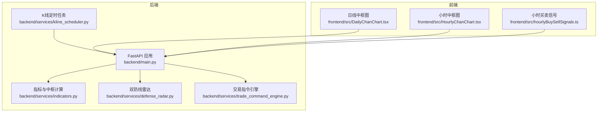
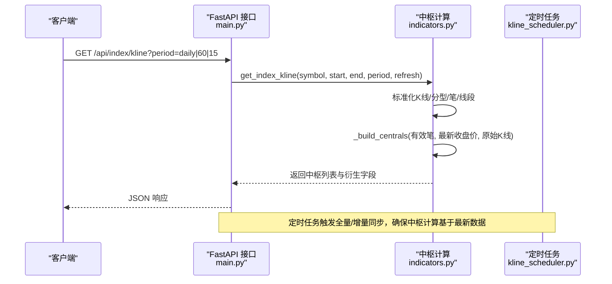
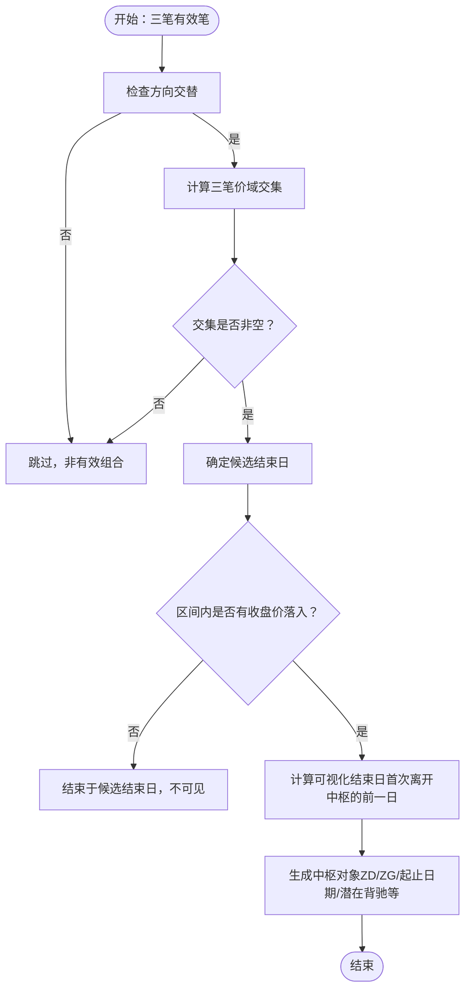
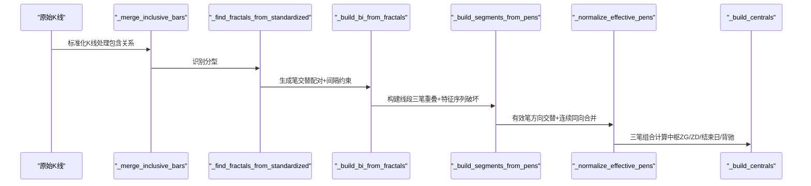
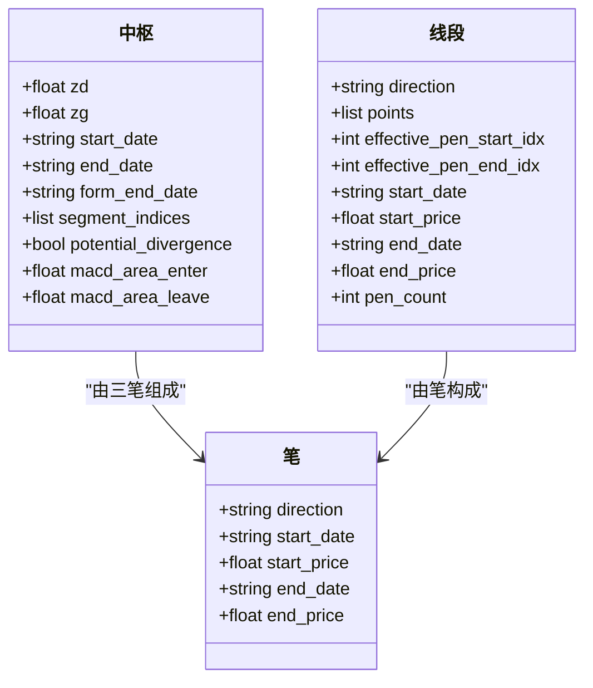
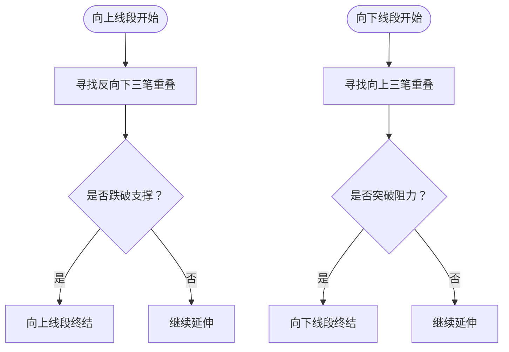
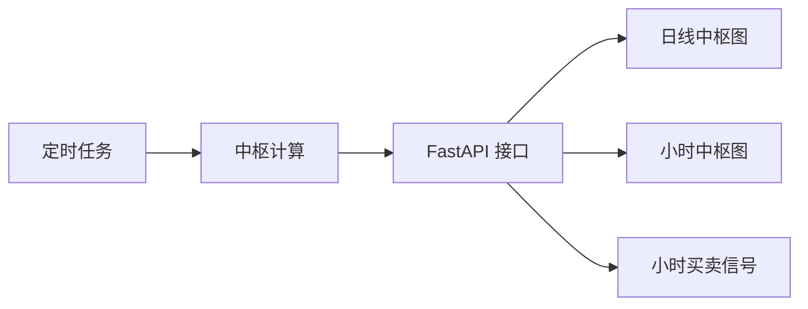

# 中枢构建算法

<cite>
**本文引用的文件**
- [main.py](file://backend/main.py)
- [kline_scheduler.py](file://backend/services/kline_scheduler.py)
- [indicators.py](file://backend/services/indicators.py)
- [trade_command_engine.py](file://backend/services/trade_command_engine.py)
- [defense_radar.py](file://backend/services/defense_radar.py)
- [DailyChanChart.tsx](file://frontend/src/DailyChanChart.tsx)
- [HourlyChanChart.tsx](file://frontend/src/HourlyChanChart.tsx)
- [hourlyBuySellSignals.ts](file://frontend/src/hourlyBuySellSignals.ts)
</cite>

## 目录
1. [简介](#简介)
2. [项目结构](#项目结构)
3. [核心组件](#核心组件)
4. [架构总览](#架构总览)
5. [详细组件分析](#详细组件分析)
6. [依赖分析](#依赖分析)
7. [性能考量](#性能考量)
8. [故障排查指南](#故障排查指南)
9. [结论](#结论)
10. [附录](#附录)

## 简介
本文件面向中枢构建算法，系统性阐述缠论中枢的定义、构成要素与计算流程，覆盖以下要点：
- 中枢的区间确定（ZD/ZG）、重叠区间的计算、中枢级别的判断标准
- 中枢构建的完整流程：线段级别的K线合并、区间交集计算、中枢形成条件验证、中枢级别的确认机制
- 关键技术点：区间重叠检测算法、中枢边界的动态调整、多级别中枢的层级关系
- 实际代码示例路径：展示如何实现中枢区间的计算、中枢级别的判断、中枢破坏和延伸的识别逻辑
- 中枢在技术分析中的作用：作为买卖点位的重要参考价值

## 项目结构
后端采用FastAPI提供接口，核心指标与中枢计算集中在indicators模块；定时任务负责全量/增量同步与中枢计算；前端通过图表组件展示中枢与相关信号。

**图表来源**
- [main.py:106-284](file://backend/main.py#L106-L284)
- [kline_scheduler.py:125-259](file://backend/services/kline_scheduler.py#L125-L259)
- [indicators.py:1661-1969](file://backend/services/indicators.py#L1661-L1969)
- [defense_radar.py:633-678](file://backend/services/defense_radar.py#L633-L678)
- [trade_command_engine.py:250-275](file://backend/services/trade_command_engine.py#L250-L275)

**章节来源**
- [main.py:106-284](file://backend/main.py#L106-L284)
- [kline_scheduler.py:125-259](file://backend/services/kline_scheduler.py#L125-L259)
- [indicators.py:1661-1969](file://backend/services/indicators.py#L1661-L1969)

## 核心组件
- K线与缓存管理：统一加载日线/60分钟/15分钟K线，维护本地CSV缓存与响应缓存，按mtime触发重算。
- 分型/笔/线段：标准化K线合并、分型识别、笔生成、线段构建。
- 中枢：基于有效笔的三笔重叠与区间交集，结合收盘价离开中枢的可视化结束日，生成中枢列表并排序。
- 多级别中枢：日线A-ZD/C-ZD与60分钟中枢联动，用于破位判断与买卖信号识别。
- 前端展示：中枢边界线、中枢对比面板、中枢破坏/延伸辅助标记。

**章节来源**
- [indicators.py:798-851](file://backend/services/indicators.py#L798-L851)
- [indicators.py:853-948](file://backend/services/indicators.py#L853-L948)
- [indicators.py:1008-1058](file://backend/services/indicators.py#L1008-L1058)
- [indicators.py:1226-1336](file://backend/services/indicators.py#L1226-L1336)
- [indicators.py:1446-1509](file://backend/services/indicators.py#L1446-L1509)
- [indicators.py:1661-1969](file://backend/services/indicators.py#L1661-L1969)

## 架构总览
中枢构建贯穿“数据获取—标准化—分型—笔—线段—中枢—展示”的链路，定时任务保障数据新鲜度，API对外提供中枢结果。

**图表来源**
- [main.py:164-195](file://backend/main.py#L164-L195)
- [indicators.py:1661-1969](file://backend/services/indicators.py#L1661-L1969)
- [kline_scheduler.py:214-259](file://backend/services/kline_scheduler.py#L214-L259)

## 详细组件分析

### 中枢定义与构成要素
- 区间确定：中枢由三笔的有效端点价域构成，ZG为三笔高点的最小值，ZD为三笔低点的最大值；当ZG ≤ ZD + ε时，不构成中枢。
- 重叠区间：三笔各自价域的交集即为中枢区间；若三笔合并后仍存在公共价域重叠（含强包含），也视为满足重叠条件。
- 可视化结束日：中枢在图上的结束日定义为“首次出现收盘价离开中枢区间”的前一日，若区间内始终未有收盘价落入则结束于候选结束日。
- 中枢级别：按中枢结束日与当前收盘价的距离进行排序，取最近的若干中枢作为可见中枢；同时依据中枢区间与当前价格位置决定颜色与提示。

**图表来源**
- [indicators.py:1446-1509](file://backend/services/indicators.py#L1446-L1509)
- [indicators.py:1365-1394](file://backend/services/indicators.py#L1365-L1394)
- [indicators.py:1067-1102](file://backend/services/indicators.py#L1067-L1102)

**章节来源**
- [indicators.py:1446-1509](file://backend/services/indicators.py#L1446-L1509)
- [indicators.py:1365-1394](file://backend/services/indicators.py#L1365-L1394)
- [indicators.py:1067-1102](file://backend/services/indicators.py#L1067-L1102)

### 中枢构建流程详解
- 线段级别的K线合并：处理包含关系，得到标准化K线序列，维护high_date/low_date以确保极值对应真实创出K线。
- 分型识别：以核心三根K线为基础，向两侧扩展，满足“中间为极值点”的约束。
- 笔生成：相邻分型交替配对，且中间至少间隔一根独立K线；向上笔起点为底分型最低点，终点为顶分型最高点；反之亦然。
- 线段构建：至少三根连续交替笔，且三笔经包含处理后仍有价域重叠；向上/向下线段分别以反向三笔重叠破坏特征序列（支撑/阻力）为终结条件。
- 中枢生成：遍历有效笔，取连续三笔，计算ZG/ZD，满足条件后确定可视化结束日，生成中枢并去重排序。

**图表来源**
- [indicators.py:798-851](file://backend/services/indicators.py#L798-L851)
- [indicators.py:853-948](file://backend/services/indicators.py#L853-L948)
- [indicators.py:1008-1058](file://backend/services/indicators.py#L1008-L1058)
- [indicators.py:1226-1336](file://backend/services/indicators.py#L1226-L1336)
- [indicators.py:1446-1509](file://backend/services/indicators.py#L1446-L1509)

**章节来源**
- [indicators.py:798-851](file://backend/services/indicators.py#L798-L851)
- [indicators.py:853-948](file://backend/services/indicators.py#L853-L948)
- [indicators.py:1008-1058](file://backend/services/indicators.py#L1008-L1058)
- [indicators.py:1226-1336](file://backend/services/indicators.py#L1226-L1336)
- [indicators.py:1446-1509](file://backend/services/indicators.py#L1446-L1509)

### 关键技术点
- 区间重叠检测算法：三笔价域交集计算；或先将三笔视为K线进行包含合并，再判断合并后是否存在公共价域重叠。
- 中枢边界的动态调整：可视化结束日依据“收盘价首次离开中枢区间”的前一日；若区间内无收盘价落入则结束于候选结束日。
- 多级别中枢的层级关系：日线中枢A-ZD/C-ZD作为绝对防线参考，60分钟中枢用于短期买卖信号与背驰识别；两者联动用于破位判断与买卖点确认。

**图表来源**
- [indicators.py:1446-1509](file://backend/services/indicators.py#L1446-L1509)
- [indicators.py:1061-1064](file://backend/services/indicators.py#L1061-L1064)
- [indicators.py:1226-1336](file://backend/services/indicators.py#L1226-L1336)

**章节来源**
- [indicators.py:1067-1102](file://backend/services/indicators.py#L1067-L1102)
- [indicators.py:1365-1394](file://backend/services/indicators.py#L1365-L1394)
- [defense_radar.py:179-209](file://backend/services/defense_radar.py#L179-L209)

### 中枢破坏与延伸识别逻辑
- 线段破坏：向上线段以“反向向下三笔重叠破坏特征序列（向下笔合并后的支撑）”为终结条件；向下线段以“向上三笔重叠破坏特征序列（向上笔合并后的阻力）”为终结条件。
- 中枢破坏：中枢形成后，若后续笔的最低价跌破支撑或最高价突破阻力，则视为破坏；结合MACD面积变化可识别潜在背驰。
- 中枢延伸：中枢结束日之后继续出现新的有效笔，且满足三笔重叠与破坏条件，可形成新的中枢或延续现有中枢。

**图表来源**
- [indicators.py:1185-1223](file://backend/services/indicators.py#L1185-L1223)
- [indicators.py:1226-1336](file://backend/services/indicators.py#L1226-L1336)

**章节来源**
- [indicators.py:1185-1223](file://backend/services/indicators.py#L1185-L1223)
- [indicators.py:1226-1336](file://backend/services/indicators.py#L1226-L1336)

### 买卖点位参考价值
- 绝对防线：日线中枢A-ZD/C-ZD构成绝对防线，现价低于绝对防线的99%视为破位禁买；在缓冲区附近可作为伏击圈参考。
- 多级别共振：日线中枢与60分钟中枢联动，结合MACD背驰、底分型确认等信号，提升买卖点可靠性。
- 前端展示：中枢边界线、中枢对比面板、中枢破坏/延伸辅助标记，直观呈现中枢状态与买卖机会。

**章节来源**
- [defense_radar.py:179-209](file://backend/services/defense_radar.py#L179-L209)
- [DailyChanChart.tsx:230-310](file://frontend/src/DailyChanChart.tsx#L230-L310)
- [HourlyChanChart.tsx:537-583](file://frontend/src/HourlyChanChart.tsx#L537-L583)
- [hourlyBuySellSignals.ts:584-662](file://frontend/src/hourlyBuySellSignals.ts#L584-L662)

## 依赖分析
- 后端依赖：FastAPI提供HTTP接口；定时任务负责全量/增量同步；中枢计算依赖K线缓存与响应缓存；前端依赖后端接口渲染中枢与信号。
- 数据流：定时任务触发K线同步，中枢计算基于最新K线；API返回中枢结果；前端展示中枢边界与买卖信号。

**图表来源**
- [kline_scheduler.py:214-259](file://backend/services/kline_scheduler.py#L214-L259)
- [indicators.py:1661-1969](file://backend/services/indicators.py#L1661-L1969)
- [main.py:164-195](file://backend/main.py#L164-L195)

**章节来源**
- [kline_scheduler.py:214-259](file://backend/services/kline_scheduler.py#L214-L259)
- [indicators.py:1661-1969](file://backend/services/indicators.py#L1661-L1969)
- [main.py:164-195](file://backend/main.py#L164-L195)

## 性能考量
- 缓存策略：K线响应缓存按周期（日线/60分钟/15分钟）分离，基于本地CSV mtime与TTL控制命中；刷新时清理对应周期缓存。
- 计算限制：中枢计算仅使用最近258根K线，避免长时间序列带来的性能压力。
- 任务调度：定时任务按槽位执行，避免重复同步；多worker去重，心跳监控保障健康状态。

**章节来源**
- [indicators.py:1661-1716](file://backend/services/indicators.py#L1661-L1716)
- [indicators.py:1867-1871](file://backend/services/indicators.py#L1867-L1871)
- [kline_scheduler.py:414-449](file://backend/services/kline_scheduler.py#L414-L449)

## 故障排查指南
- 无中枢数据：检查定时任务是否成功同步60分钟/日线数据；确认本地CSV存在且mtime较新；刷新参数是否正确。
- 破位判断异常：确认日线中枢A-ZD/C-ZD计算正常；检查60分钟中枢与MACD背驰信号；核对当前价格与中枢区间关系。
- 前端显示异常：确认API返回的中枢字段（ZD/ZG/起止日期）完整；检查前端排序与展示逻辑。

**章节来源**
- [kline_scheduler.py:214-259](file://backend/services/kline_scheduler.py#L214-L259)
- [defense_radar.py:633-678](file://backend/services/defense_radar.py#L633-L678)
- [DailyChanChart.tsx:230-310](file://frontend/src/DailyChanChart.tsx#L230-L310)

## 结论
中枢构建算法以“三笔重叠+区间交集+可视化结束日”为核心，结合线段破坏与多级别中枢联动，形成稳健的中枢识别与买卖信号体系。通过缓存与定时任务保障数据新鲜度，前端直观展示中枢状态与买卖机会，为技术分析提供可靠参考。

## 附录
- 代码示例路径（不展示具体代码，仅提供路径）：
  - 中枢区间计算与可视化结束日：[indicators.py:1446-1509](file://backend/services/indicators.py#L1446-L1509)
  - 三笔重叠检测与区间交集：[indicators.py:1067-1102](file://backend/services/indicators.py#L1067-L1102)
  - 线段破坏条件（支撑/阻力）：[indicators.py:1185-1223](file://backend/services/indicators.py#L1185-L1223)
  - 多级别中枢联动与破位判断：[defense_radar.py:179-209](file://backend/services/defense_radar.py#L179-L209)
  - 前端中枢边界与买卖信号展示：[DailyChanChart.tsx:230-310](file://frontend/src/DailyChanChart.tsx#L230-L310)、[HourlyChanChart.tsx:537-583](file://frontend/src/HourlyChanChart.tsx#L537-L583)、[hourlyBuySellSignals.ts:584-662](file://frontend/src/hourlyBuySellSignals.ts#L584-L662)