# 图表可视化组件

<cite>
**本文档引用的文件**
- [DailyChanChart.tsx](file://frontend/src/DailyChanChart.tsx)
- [HourlyChanChart.tsx](file://frontend/src/HourlyChanChart.tsx)
- [bollSeries.ts](file://frontend/src/bollSeries.ts)
- [chartMacd.ts](file://frontend/src/chartMacd.ts)
- [hourlyBuySellSignals.ts](file://frontend/src/hourlyBuySellSignals.ts)
- [priceAxisExtent.ts](file://frontend/src/priceAxisExtent.ts)
- [stock.ts](file://frontend/src/api/stock.ts)
- [App.tsx](file://frontend/src/App.tsx)
- [package.json](file://frontend/package.json)
- [App.css](file://frontend/src/App.css)
- [index.css](file://frontend/src/index.css)
</cite>

## 目录
1. [项目概述](#项目概述)
2. [项目结构](#项目结构)
3. [核心组件](#核心组件)
4. [架构概览](#架构概览)
5. [详细组件分析](#详细组件分析)
6. [依赖关系分析](#依赖关系分析)
7. [性能考量](#性能考量)
8. [故障排除指南](#故障排除指南)
9. [结论](#结论)

## 项目概述

这是一个基于 React 和 ECharts 的金融分析图表可视化系统，专门用于展示缠论技术分析图表。系统提供了日线缠论图表和60分钟缠论图表，支持技术指标叠加显示、买卖信号标记、以及丰富的用户交互功能。

该系统的核心特色包括：
- **缠论技术分析**：基于中枢、笔、线段理论的K线分析
- **多级别图表**：支持日线、60分钟、15分钟多周期分析
- **实时数据集成**：与后端API无缝集成，支持实时更新
- **买卖信号识别**：自动识别一买、二买、三买等买卖信号
- **主题定制**：支持深色主题和多种视觉效果

## 项目结构

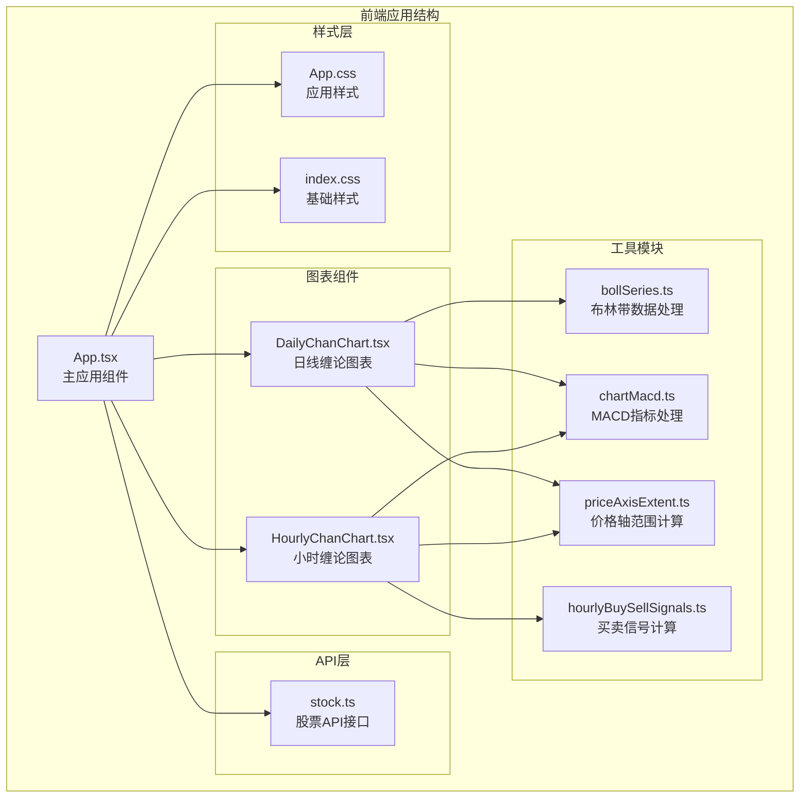

**图表来源**
- [App.tsx:584-1569](file://frontend/src/App.tsx#L584-L1569)
- [DailyChanChart.tsx:161-820](file://frontend/src/DailyChanChart.tsx#L161-L820)
- [HourlyChanChart.tsx:179-1632](file://frontend/src/HourlyChanChart.tsx#L179-L1632)

**章节来源**
- [App.tsx:1-1569](file://frontend/src/App.tsx#L1-1569)
- [package.json:1-33](file://frontend/package.json#L1-L33)

## 核心组件

### 图表组件架构

系统采用组件化设计，主要包含以下核心组件：

1. **DailyChanChart** - 日线缠论图表组件
2. **HourlyChanChart** - 小时缠论图表组件
3. **数据处理模块** - 布林带、MACD、买卖信号计算
4. **API接口层** - 与后端服务的数据交互

### 数据流架构

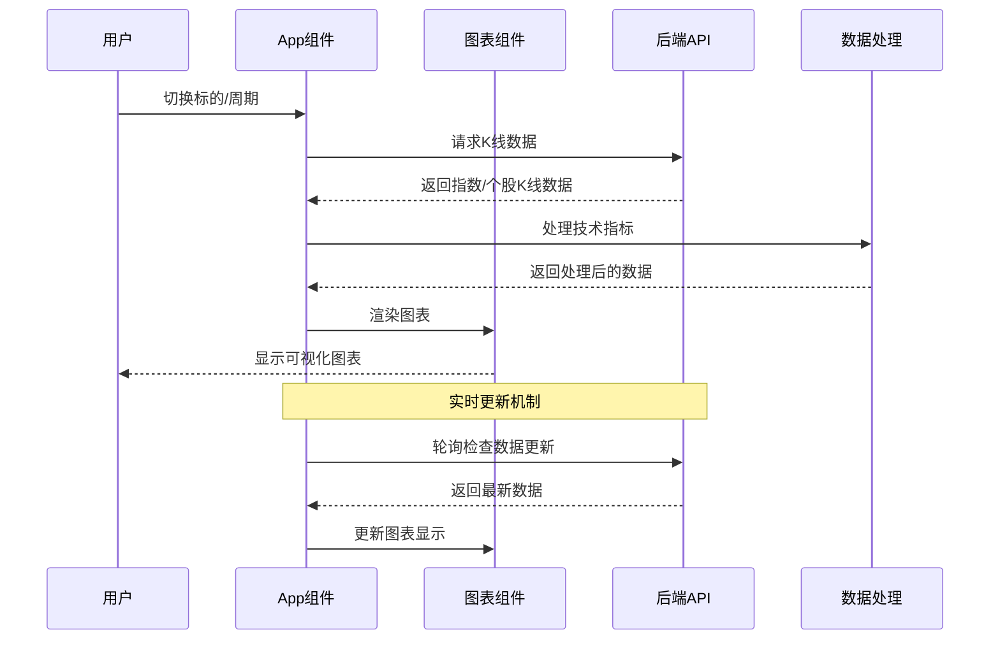

**图表来源**
- [App.tsx:1021-1177](file://frontend/src/App.tsx#L1021-L1177)
- [stock.ts:185-215](file://frontend/src/api/stock.ts#L185-L215)

**章节来源**
- [DailyChanChart.tsx:161-820](file://frontend/src/DailyChanChart.tsx#L161-L820)
- [HourlyChanChart.tsx:179-1632](file://frontend/src/HourlyChanChart.tsx#L179-L1632)

## 架构概览

### 整体架构设计

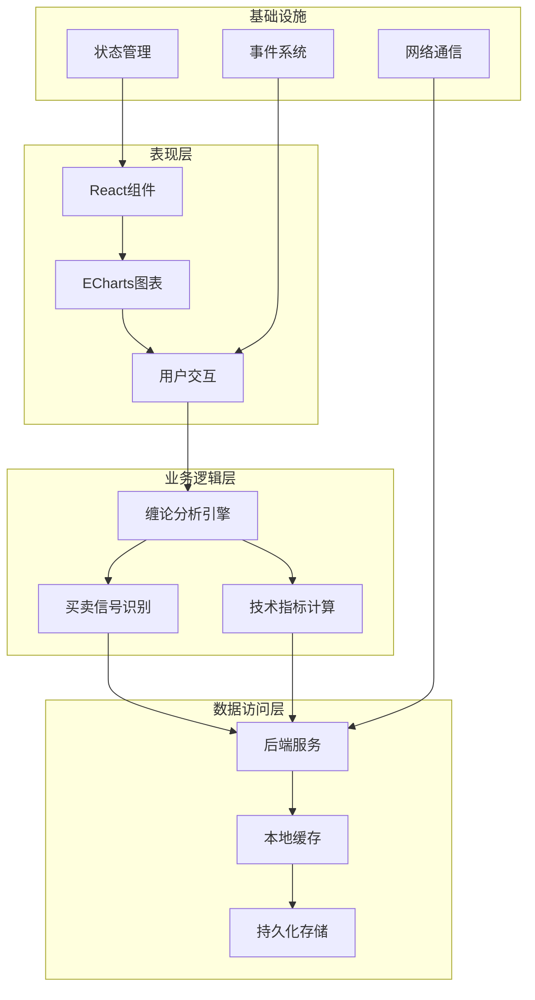

**图表来源**
- [App.tsx:584-1569](file://frontend/src/App.tsx#L584-L1569)
- [stock.ts:114-499](file://frontend/src/api/stock.ts#L114-L499)

### 组件关系图

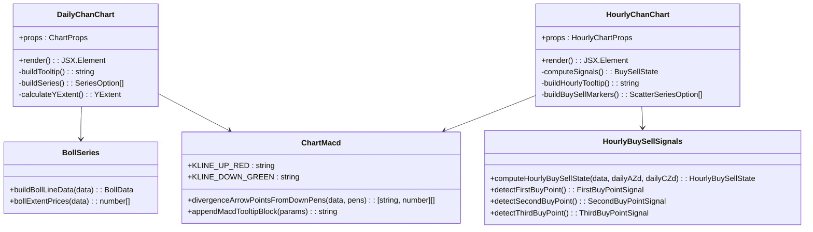

**图表来源**
- [DailyChanChart.tsx:161-820](file://frontend/src/DailyChanChart.tsx#L161-L820)
- [HourlyChanChart.tsx:179-1632](file://frontend/src/HourlyChanChart.tsx#L179-L1632)
- [bollSeries.ts:1-34](file://frontend/src/bollSeries.ts#L1-L34)
- [chartMacd.ts:1-71](file://frontend/src/chartMacd.ts#L1-L71)
- [hourlyBuySellSignals.ts:1-1676](file://frontend/src/hourlyBuySellSignals.ts#L1-L1676)

## 详细组件分析

### 日线缠论图表组件

#### 组件设计

DailyChanChart 是系统的核心图表组件，负责展示日线级别的缠论分析结果：

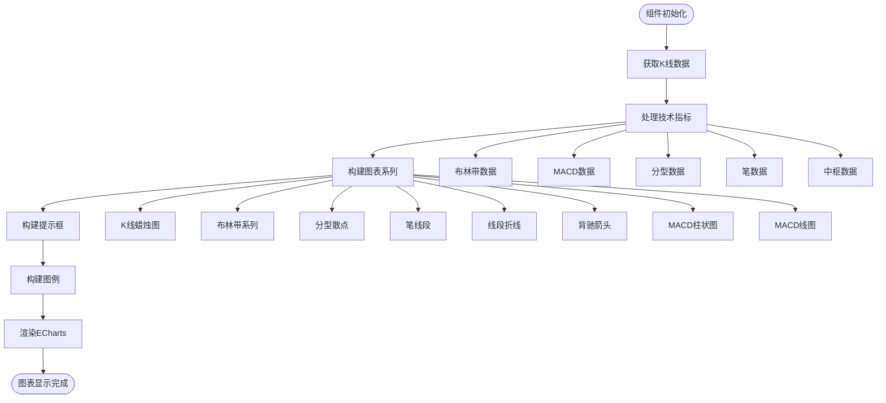

**图表来源**
- [DailyChanChart.tsx:161-820](file://frontend/src/DailyChanChart.tsx#L161-L820)

#### 关键功能实现

1. **K线图绘制**：使用ECharts candlestick类型绘制OHLC数据
2. **技术指标叠加**：布林带、MACD等指标的可视化
3. **缠论元素标注**：中枢、笔、线段的图形化表示
4. **买卖信号标记**：底背驰、顶背驰等信号的可视化
5. **交互式提示框**：鼠标悬停时显示详细的技术分析信息

#### 数据绑定机制

组件通过props接收后端返回的IndexKlineResponse数据，并进行以下处理：

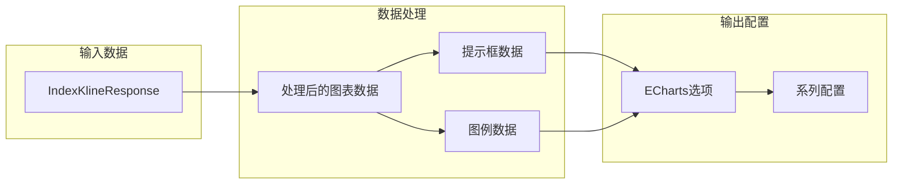

**图表来源**
- [DailyChanChart.tsx:406-735](file://frontend/src/DailyChanChart.tsx#L406-L735)

**章节来源**
- [DailyChanChart.tsx:161-820](file://frontend/src/DailyChanChart.tsx#L161-L820)

### 60分钟缠论图表组件

#### 组件特性

HourlyChanChart 专注于60分钟级别的缠论分析，具有以下特点：

1. **高级信号识别**：实现一买、二买、三买等复杂买卖信号
2. **跨级别风控**：结合日线防线进行风险控制
3. **实时更新**：支持盘中实时数据更新
4. **条件筛选**：基于7个条件的自动筛选机制

#### 买卖信号计算流程

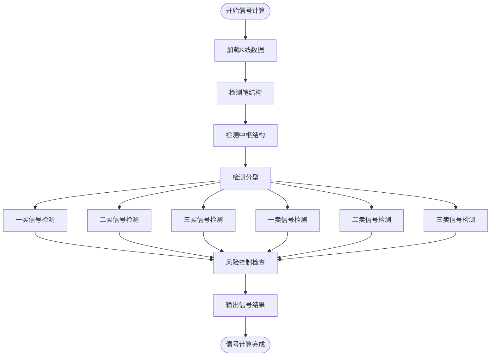

**图表来源**
- [hourlyBuySellSignals.ts:239-418](file://frontend/src/hourlyBuySellSignals.ts#L239-L418)

#### 信号类型定义

组件支持多种类型的买卖信号：

| 信号类型 | 编号 | 特征描述 | 触发条件 |
|---------|------|----------|----------|
| 一买 | FirstBuy | 趋势底背驰 | 趋势背驰+创新低+MACD绿柱面积缩小+底分型 |
| 二买 | SecondBuy | 多头反击回踩 | 一买后回踩不创新低+MACD动能衰减 |
| 三买 | ThirdBuy | 突破中枢回踩 | 突破中枢上沿+回踩不跌破中枢+MACD水上漂 |
| 一卖 | FirstSell | 趋势顶背驰 | 趋势背驰+创新高+MACD红柱面积缩小+顶分型 |
| 二卖 | SecondSell | 多头反扑回踩 | 一卖后回踩不创新高+MACD动能衰减 |
| 三卖 | ThirdSell | 突破中枢回踩 | 突破中枢上沿+回踩不跌破中枢+MACD水上漂 |

**章节来源**
- [HourlyChanChart.tsx:179-1632](file://frontend/src/HourlyChanChart.tsx#L179-L1632)
- [hourlyBuySellSignals.ts:14-148](file://frontend/src/hourlyBuySellSignals.ts#L14-L148)

### 技术指标处理模块

#### 布林带数据处理

布林带是技术分析的重要工具，系统提供了完整的布林带数据处理功能：

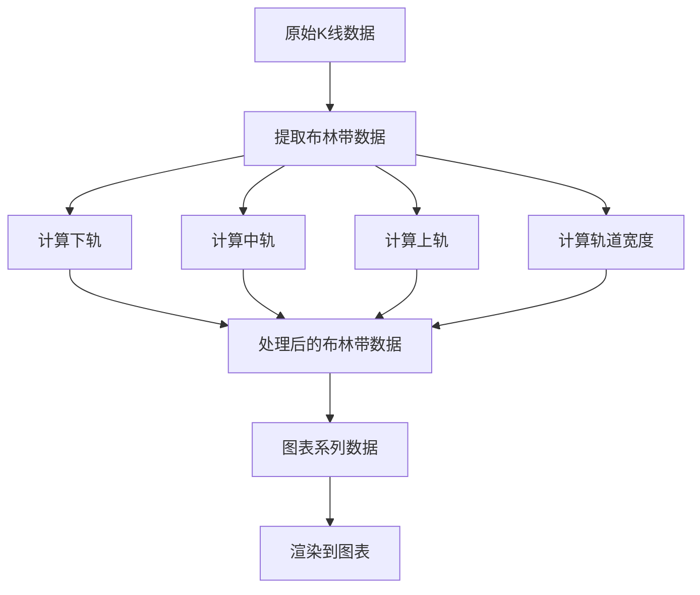

**图表来源**
- [bollSeries.ts:4-20](file://frontend/src/bollSeries.ts#L4-L20)

#### MACD指标处理

MACD是动量指标的重要组成部分，系统实现了完整的MACD处理逻辑：

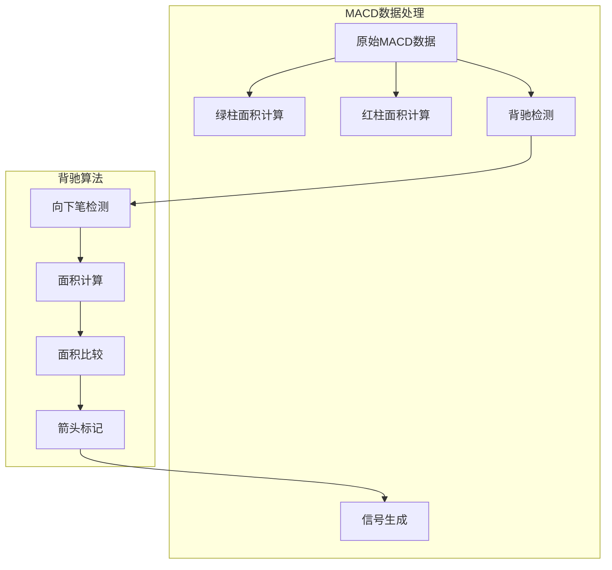

**图表来源**
- [chartMacd.ts:7-43](file://frontend/src/chartMacd.ts#L7-L43)

**章节来源**
- [bollSeries.ts:1-34](file://frontend/src/bollSeries.ts#L1-L34)
- [chartMacd.ts:1-71](file://frontend/src/chartMacd.ts#L1-L71)

### API集成与数据管理

#### 后端API接口

系统通过统一的API接口与后端服务通信：

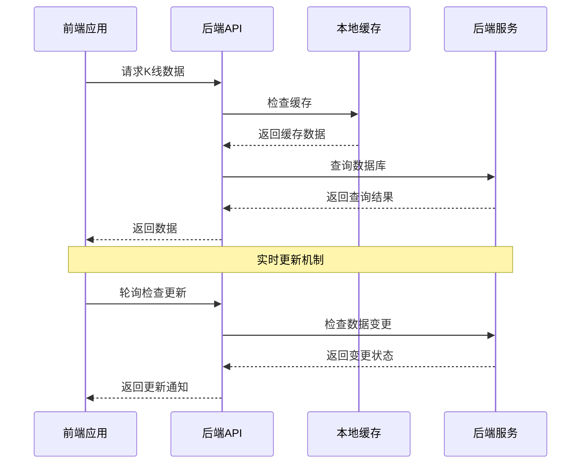

**图表来源**
- [stock.ts:185-215](file://frontend/src/api/stock.ts#L185-L215)

#### 数据状态管理

应用使用React的状态管理机制来处理图表数据：

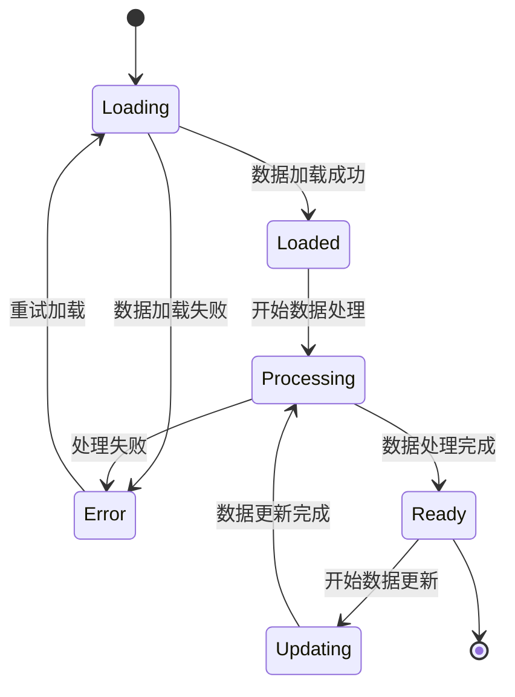

**图表来源**
- [App.tsx:584-1569](file://frontend/src/App.tsx#L584-L1569)

**章节来源**
- [stock.ts:114-499](file://frontend/src/api/stock.ts#L114-L499)
- [App.tsx:584-1569](file://frontend/src/App.tsx#L584-L1569)

## 依赖关系分析

### 外部依赖

系统使用以下关键外部依赖：

| 依赖包 | 版本 | 用途 |
|--------|------|------|
| react | ^19.2.0 | React框架核心 |
| react-dom | ^19.2.0 | DOM渲染 |
| echarts | ^6.0.0 | 图表可视化库 |
| echarts-for-react | ^3.0.6 | ECharts React封装 |

### 内部模块依赖

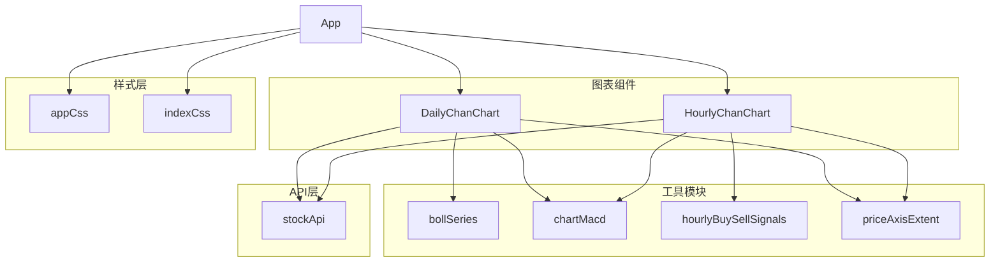

**图表来源**
- [package.json:12-17](file://frontend/package.json#L12-L17)
- [DailyChanChart.tsx:1-16](file://frontend/src/DailyChanChart.tsx#L1-L16)
- [HourlyChanChart.tsx:1-16](file://frontend/src/HourlyChanChart.tsx#L1-L16)

**章节来源**
- [package.json:1-33](file://frontend/package.json#L1-L33)

## 性能考量

### 图表渲染优化

系统采用了多种性能优化策略：

1. **虚拟滚动**：对于大量数据的图表，使用虚拟滚动减少DOM节点数量
2. **数据分页**：按需加载历史数据，避免一次性渲染过多数据
3. **缓存机制**：利用浏览器缓存和本地存储减少重复请求
4. **懒加载**：非活跃图表组件延迟加载，提升首屏性能

### 内存管理

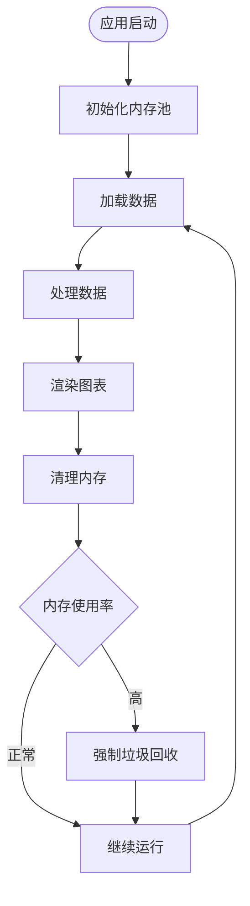

### 并发控制

系统实现了智能的并发请求控制：

- **请求队列**：限制同时进行的API请求数量
- **优先级调度**：根据用户交互优先级调整请求顺序
- **超时重试**：网络异常时自动重试机制

## 故障排除指南

### 常见问题及解决方案

#### 图表渲染问题

**问题**：图表无法正常显示
**可能原因**：
1. 数据格式不正确
2. ECharts实例初始化失败
3. 样式冲突

**解决方案**：
1. 检查数据格式是否符合IndexKlineResponse接口
2. 确认ECharts版本兼容性
3. 检查CSS样式冲突

#### 数据加载问题

**问题**：K线数据加载失败
**可能原因**：
1. 网络连接异常
2. 后端服务不可用
3. API参数错误

**解决方案**：
1. 检查网络连接状态
2. 验证后端服务运行状态
3. 确认API请求参数正确

#### 性能问题

**问题**：图表渲染缓慢
**可能原因**：
1. 数据量过大
2. 图表配置过于复杂
3. 浏览器性能不足

**解决方案**：
1. 实施数据分页加载
2. 简化图表配置
3. 优化浏览器性能

**章节来源**
- [stock.ts:117-130](file://frontend/src/api/stock.ts#L117-L130)
- [App.tsx:1033-1042](file://frontend/src/App.tsx#L1033-L1042)

## 结论

本图表可视化组件系统是一个功能完整、架构清晰的金融分析平台。通过精心设计的组件架构、完善的数据处理机制和丰富的交互功能，为用户提供了一个强大的缠论分析工具。

### 主要优势

1. **技术完整性**：完整实现了缠论理论的所有核心概念
2. **用户体验**：直观的图表界面和丰富的交互功能
3. **性能优化**：高效的渲染机制和智能的数据管理
4. **可扩展性**：模块化的架构设计便于功能扩展

### 发展方向

未来可以考虑的功能增强：
1. **移动端适配**：优化移动端的图表显示效果
2. **实时数据**：增加WebSocket支持实现实时数据更新
3. **自定义指标**：允许用户添加自定义技术指标
4. **导出功能**：支持图表数据的导出和分享

该系统为金融分析领域提供了一个优秀的开源解决方案，具有很高的实用价值和推广前景。