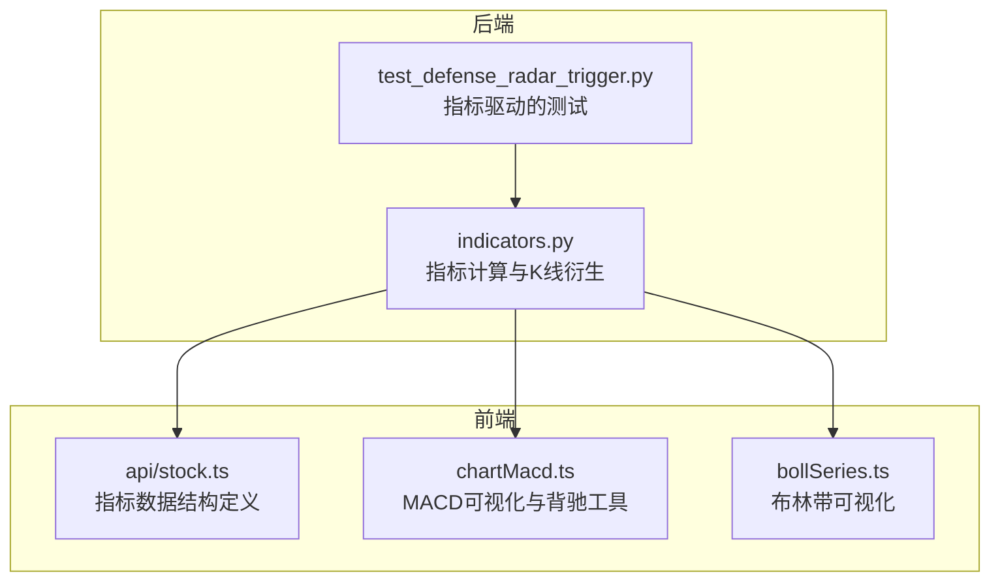
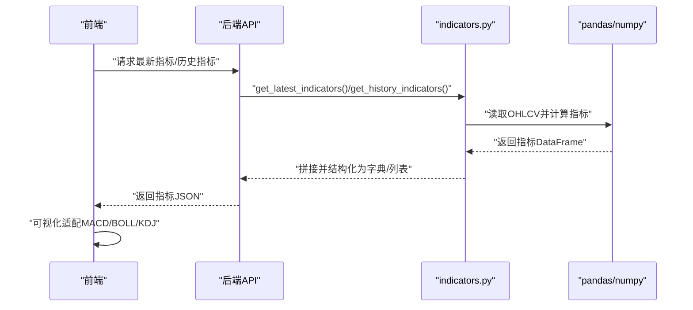
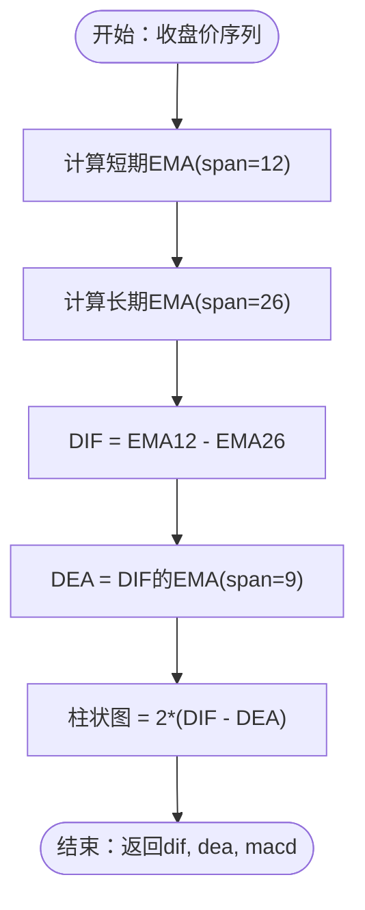
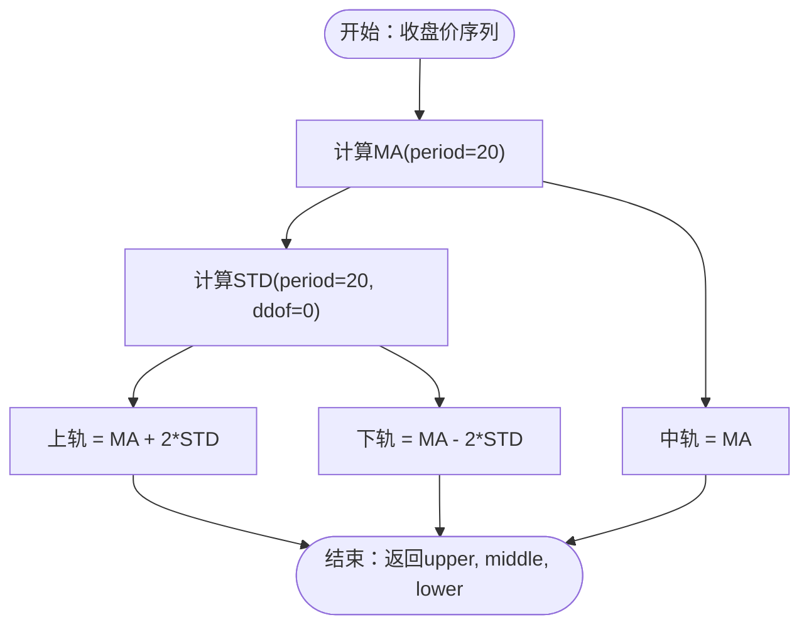
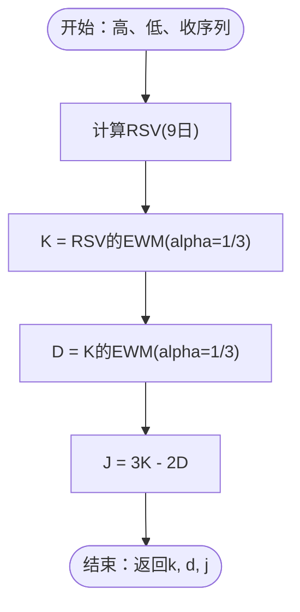
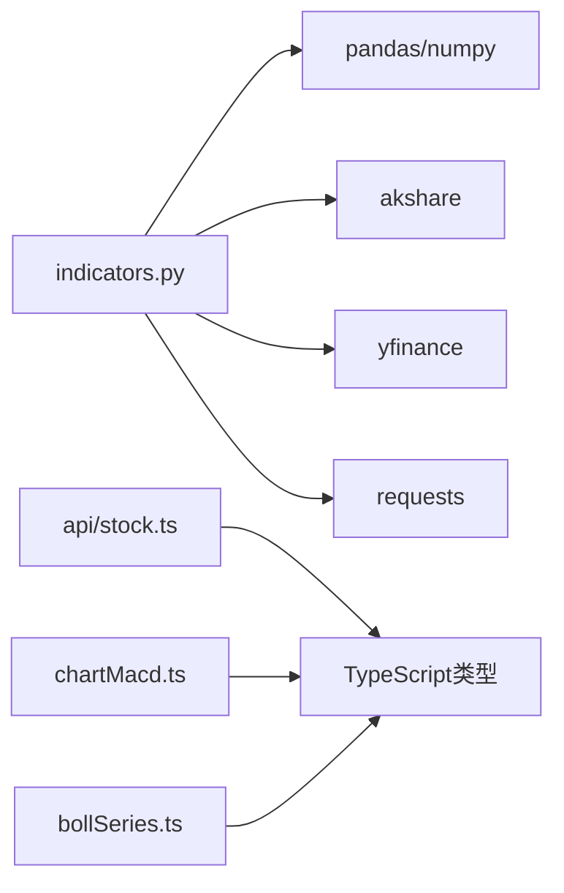

# 技术指标计算

<cite>
**本文引用的文件**
- [backend/services/indicators.py](file://backend/services/indicators.py)
- [frontend/src/chartMacd.ts](file://frontend/src/chartMacd.ts)
- [frontend/src/bollSeries.ts](file://frontend/src/bollSeries.ts)
- [frontend/src/api/stock.ts](file://frontend/src/api/stock.ts)
- [backend/tests/test_defense_radar_trigger.py](file://backend/tests/test_defense_radar_trigger.py)
</cite>

## 目录
1. [简介](#简介)
2. [项目结构](#项目结构)
3. [核心组件](#核心组件)
4. [架构总览](#架构总览)
5. [详细组件分析](#详细组件分析)
6. [依赖分析](#依赖分析)
7. [性能考虑](#性能考虑)
8. [故障排查指南](#故障排查指南)
9. [结论](#结论)
10. [附录](#附录)

## 简介
本文件围绕技术指标计算功能，系统性梳理后端指标计算实现与前端可视化适配，重点覆盖以下内容：
- 指标计算原理与实现：MACD（短期EMA、长期EMA、DEA线、柱状图）、布林带（移动平均、标准差、上下轨）、KDJ（RSV、K线平滑、D线、J线）。
- 技术要点：指数移动平均平滑系数、滚动窗口边界处理、数值稳定性保障。
- 数据后处理与格式化：数据对齐、缺失值处理、可视化适配。
- 代码示例路径：展示如何实现各指标的计算函数、参数配置方法、结果数据结构化处理。
- 缠论分析中的辅助作用：MACD背驰强度、布林带位置、KDJ配合等在中枢与笔/线段识别中的应用。

## 项目结构
后端采用Python服务模块集中实现指标计算与K线衍生分析；前端TypeScript模块负责指标数据结构定义与可视化适配。

**图表来源**
- [backend/services/indicators.py:674-706](file://backend/services/indicators.py#L674-L706)
- [frontend/src/api/stock.ts:1-112](file://frontend/src/api/stock.ts#L1-L112)
- [frontend/src/chartMacd.ts:1-71](file://frontend/src/chartMacd.ts#L1-L71)
- [frontend/src/bollSeries.ts:1-34](file://frontend/src/bollSeries.ts#L1-L34)
- [backend/tests/test_defense_radar_trigger.py:1-254](file://backend/tests/test_defense_radar_trigger.py#L1-L254)

**章节来源**
- [backend/services/indicators.py:1512-1658](file://backend/services/indicators.py#L1512-L1658)
- [frontend/src/api/stock.ts:1-112](file://frontend/src/api/stock.ts#L1-L112)

## 核心组件
- 指标计算函数
  - MACD：短期EMA（span=12）、长期EMA（span=26）、DEA（span=9）、柱状图=2×(DIF-DEA)
  - 布林带：MA(period=20)、标准差（ddof=0）、上下轨=MA±num_std×STD
  - KDJ：RSV=(C-L9)/(H9-L9)×100，K=RSV的EWM(alpha=1/3)，D=K的EWM(alpha=1/3)，J=3K−2D
- 数据结构
  - 后端输出：latest指标字典与历史指标列表，包含日期、收盘价、成交量、MACD、布林带、KDJ。
  - 前端接口：Macd、Boll、Kdj、IndexKlinePoint、IndexKlineResponse等。
- 可视化适配
  - MACD柱颜色与背驰标注、布林带上下轨与中轨、K线时间轴对齐。

**章节来源**
- [backend/services/indicators.py:674-706](file://backend/services/indicators.py#L674-L706)
- [frontend/src/api/stock.ts:1-112](file://frontend/src/api/stock.ts#L1-L112)
- [frontend/src/chartMacd.ts:1-71](file://frontend/src/chartMacd.ts#L1-L71)
- [frontend/src/bollSeries.ts:1-34](file://frontend/src/bollSeries.ts#L1-L34)

## 架构总览
后端服务根据请求参数加载K线数据，计算指标并返回结构化结果；前端接收数据并渲染图表，利用指标进行背驰与中枢识别。

**图表来源**
- [backend/services/indicators.py:1512-1658](file://backend/services/indicators.py#L1512-L1658)
- [frontend/src/api/stock.ts:132-183](file://frontend/src/api/stock.ts#L132-L183)

**章节来源**
- [backend/services/indicators.py:1512-1658](file://backend/services/indicators.py#L1512-L1658)
- [frontend/src/api/stock.ts:132-183](file://frontend/src/api/stock.ts#L132-L183)

## 详细组件分析

### MACD指标计算
- 计算步骤
  - 短期EMA（span=12）、长期EMA（span=26）
  - DIF=短期EMA−长期EMA
  - DEA=DIF的EMA（span=9）
  - 柱状图=2×(DIF−DEA)
- 参数与平滑
  - span控制平滑程度，span越小越敏感；DEA使用更短周期以捕捉动能变化。
- 数值稳定性
  - 使用pandas的ewm默认不调整（adjust=False），确保指数平滑一致性。
- 结果结构
  - 输出包含dif、dea、macd三项，供前端MACD柱与背驰分析使用。

**图表来源**
- [backend/services/indicators.py:674-680](file://backend/services/indicators.py#L674-L680)

**章节来源**
- [backend/services/indicators.py:674-680](file://backend/services/indicators.py#L674-L680)

### 布林带指标计算
- 计算步骤
  - MA(period=20)、STD(period=20, ddof=0)
  - 上轨=MA+num_std×STD，中轨=MA，下轨=MA−num_std×STD
- 参数设置
  - period=20、num_std=2.0，符合常见实现。
- 边界处理
  - min_periods=period，确保前20根K线不提前输出有效值。
- 结果结构
  - 输出upper、middle、lower，前端用于主图叠加与y轴范围计算。

**图表来源**
- [backend/services/indicators.py:683-688](file://backend/services/indicators.py#L683-L688)

**章节来源**
- [backend/services/indicators.py:683-688](file://backend/services/indicators.py#L683-L688)

### KDJ指标计算
- 计算步骤
  - RSV=(close−min(low,9))/(max(high,9)−min(low,9))×100
  - K=RSV的EWM(alpha=1/3)，D=K的EWM(alpha=1/3)，J=3K−2D
- 平滑与参数
  - alpha=1/3为经典平滑系数，兼顾响应速度与平滑度。
- 结果结构
  - 输出k、d、j，前端用于超买超卖与金死叉判断。

**图表来源**
- [backend/services/indicators.py:691-705](file://backend/services/indicators.py#L691-L705)

**章节来源**
- [backend/services/indicators.py:691-705](file://backend/services/indicators.py#L691-L705)

### 指标数据后处理与格式化
- 数据对齐
  - 日期统一为“YYYY-MM-DD”（日线）或“YYYY-MM-DD HH:MM”（分钟线），确保与缠论分型/笔/线段日期键一致。
- 缺失值处理
  - 指标计算使用rolling/min_periods保证前N期无输出；concat拼接时对齐索引。
- 可视化适配
  - MACD：柱状图为负时采用绿色、正时红色；背驰区域面积用于强度对比。
  - 布林带：上下轨与中轨叠加，参与y轴极值计算。
  - KDJ：与价格分离绘制，用于超买超卖信号。

**章节来源**
- [backend/services/indicators.py:1872-1898](file://backend/services/indicators.py#L1872-L1898)
- [frontend/src/chartMacd.ts:1-71](file://frontend/src/chartMacd.ts#L1-L71)
- [frontend/src/bollSeries.ts:1-34](file://frontend/src/bollSeries.ts#L1-L34)

### 指标在缠论分析中的辅助作用
- MACD背驰
  - 通过相邻向下笔区间内MACD柱绝对值面积变化判断背驰强度，辅助中枢识别与买卖点确认。
- 布林带
  - 价格站回中轨可作为阶段性企稳信号；通道收窄/开口影响趋势强度。
- KDJ
  - 与价格形态结合判断超买超卖背离，辅助笔与线段转折确认。
- 测试验证
  - 单元测试覆盖MACD动能变化判定、严格蓝三角形态、防线区间判断等，确保指标驱动的信号稳健。

**章节来源**
- [backend/tests/test_defense_radar_trigger.py:182-250](file://backend/tests/test_defense_radar_trigger.py#L182-L250)
- [frontend/src/chartMacd.ts:18-43](file://frontend/src/chartMacd.ts#L18-L43)

## 依赖分析
- 后端依赖
  - pandas/numpy：滚动窗口、指数加权、数据拼接与类型转换。
  - akshare/yfinance/requests：行情数据拉取与缓存。
- 前端依赖
  - 类型定义：Macd、Boll、Kdj、IndexKlinePoint、IndexKlineResponse。
  - 可视化工具：MACD柱面积计算、布林带序列构建、tooltip格式化。

**图表来源**
- [backend/services/indicators.py:12-25](file://backend/services/indicators.py#L12-L25)
- [frontend/src/api/stock.ts:1-112](file://frontend/src/api/stock.ts#L1-L112)
- [frontend/src/chartMacd.ts:1-71](file://frontend/src/chartMacd.ts#L1-L71)
- [frontend/src/bollSeries.ts:1-34](file://frontend/src/bollSeries.ts#L1-L34)

**章节来源**
- [backend/services/indicators.py:12-25](file://backend/services/indicators.py#L12-L25)
- [frontend/src/api/stock.ts:1-112](file://frontend/src/api/stock.ts#L1-L112)

## 性能考虑
- 计算窗口限制：缠论相关计算仅保留最近258根K线，降低复杂度与内存占用。
- 指标计算批量化：pandas rolling/ewm向量化，避免循环。
- 缓存策略：K线与响应缓存（TTL/LRU），减少重复拉取与重算。
- 数据类型与缺失值：统一转换与对齐，避免重复解析与类型不一致带来的额外开销。

**章节来源**
- [backend/services/indicators.py:1867-1870](file://backend/services/indicators.py#L1867-L1870)
- [backend/services/indicators.py:149-176](file://backend/services/indicators.py#L149-L176)

## 故障排查指南
- 指标为空或不完整
  - 检查数据源是否返回必要字段（date/open/high/low/close/volume），并确认日期排序与去重。
  - 确认rolling窗口大小与min_periods设置是否导致早期无输出。
- MACD背驰误判
  - 核对相邻笔区间内MACD柱面积计算逻辑，确保时间范围与数据对齐正确。
  - 检查alpha与span参数是否与预期一致。
- 布林带异常
  - 检查period与num_std参数，确认ddof=0与min_periods设置。
- KDJ异常
  - 检查RSV分母是否为0，必要时加入极小值或NaN保护。
- 单元测试参考
  - 参考测试用例中MACD动能变化、严格蓝三角形态与防线区间判断，定位问题范围。

**章节来源**
- [backend/tests/test_defense_radar_trigger.py:182-250](file://backend/tests/test_defense_radar_trigger.py#L182-L250)
- [backend/services/indicators.py:674-706](file://backend/services/indicators.py#L674-L706)

## 结论
本项目的技术指标计算以pandas为核心，实现了MACD、布林带与KDJ的标准化实现，并与前端可视化紧密衔接。通过合理的参数设置、滚动窗口边界处理与数值稳定性保障，指标在缠论分析中发挥重要辅助作用，尤其在MACD背驰强度、布林带通道状态与KDJ超买超卖信号方面，为中枢识别与买卖点判断提供了可靠依据。

## 附录
- 代码示例路径
  - MACD计算函数：[backend/services/indicators.py:674-680](file://backend/services/indicators.py#L674-L680)
  - 布林带计算函数：[backend/services/indicators.py:683-688](file://backend/services/indicators.py#L683-L688)
  - KDJ计算函数：[backend/services/indicators.py:691-705](file://backend/services/indicators.py#L691-L705)
  - 最新指标接口：[backend/services/indicators.py:1512-1583](file://backend/services/indicators.py#L1512-L1583)
  - 历史指标接口：[backend/services/indicators.py:1586-1658](file://backend/services/indicators.py#L1586-L1658)
  - 指标数据结构定义：[frontend/src/api/stock.ts:1-112](file://frontend/src/api/stock.ts#L1-L112)
  - MACD可视化与背驰工具：[frontend/src/chartMacd.ts:1-71](file://frontend/src/chartMacd.ts#L1-L71)
  - 布林带可视化工具：[frontend/src/bollSeries.ts:1-34](file://frontend/src/bollSeries.ts#L1-L34)
  - 指标驱动的测试用例：[backend/tests/test_defense_radar_trigger.py:182-250](file://backend/tests/test_defense_radar_trigger.py#L182-L250)