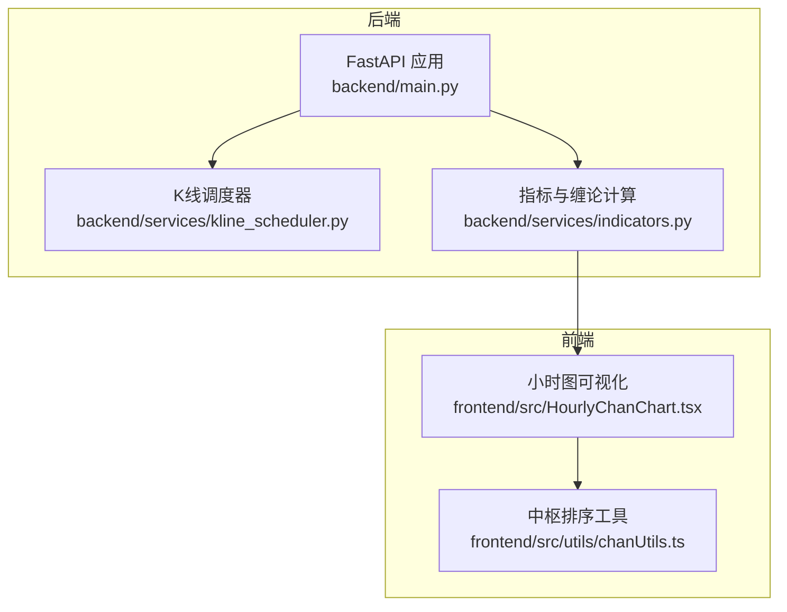
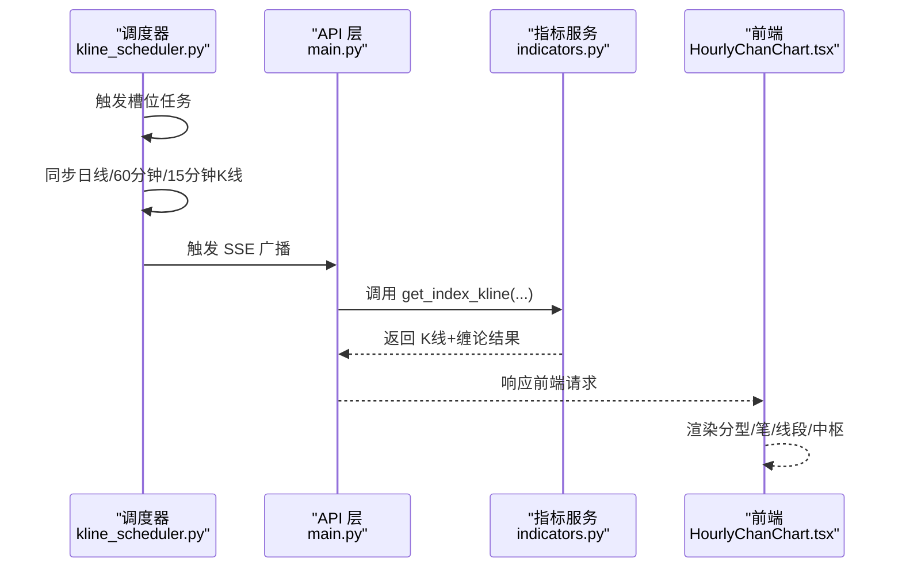
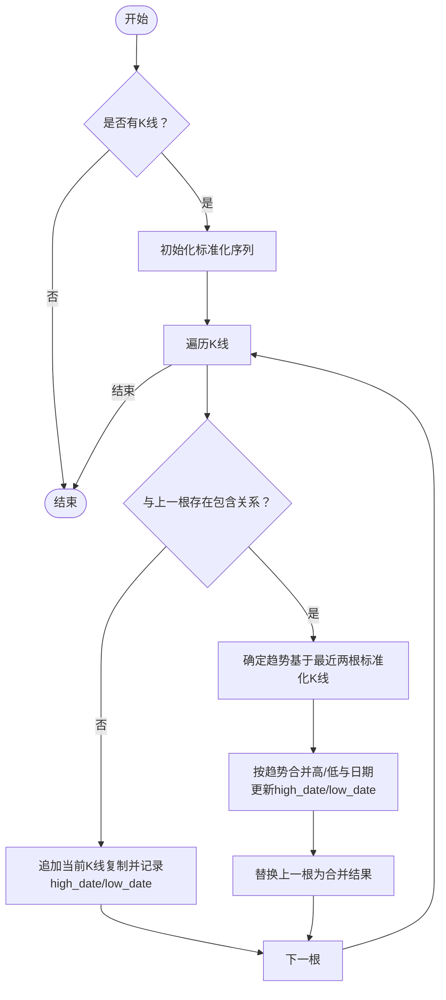
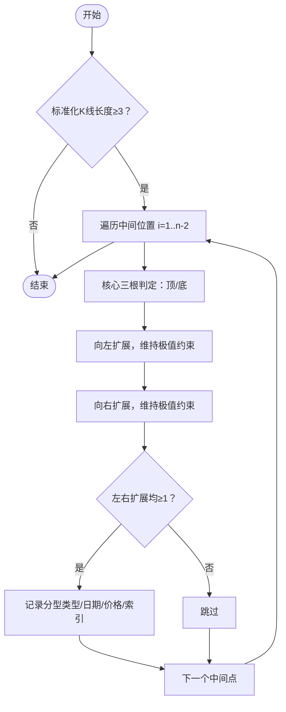
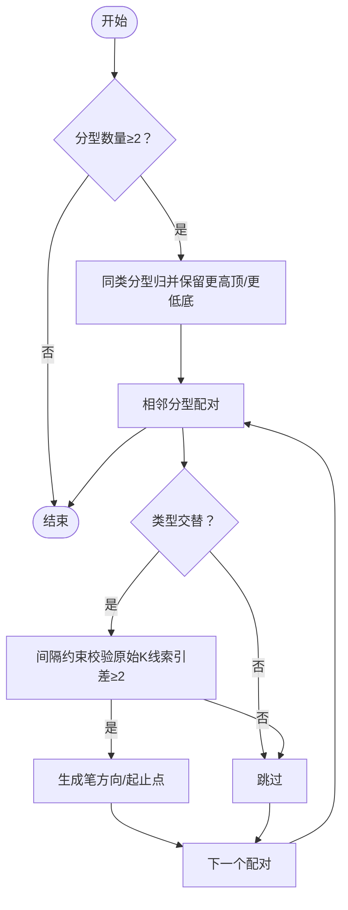
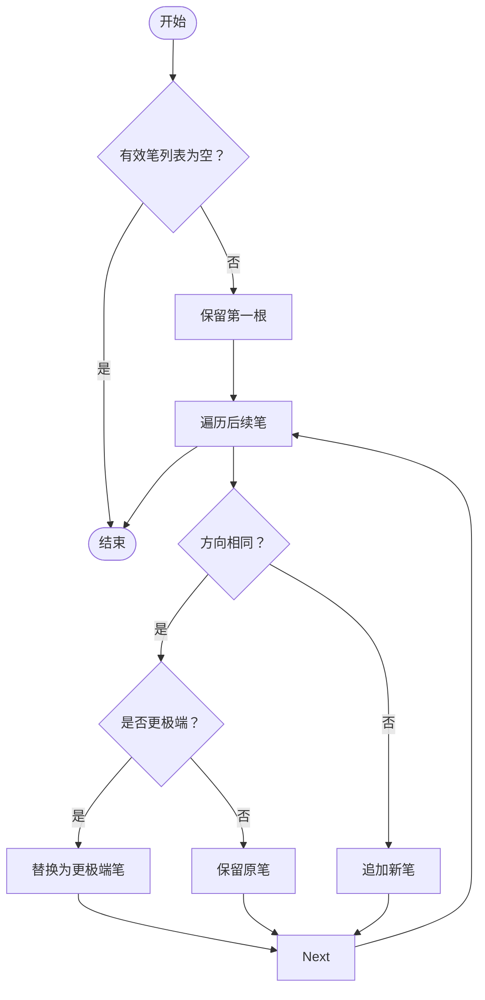
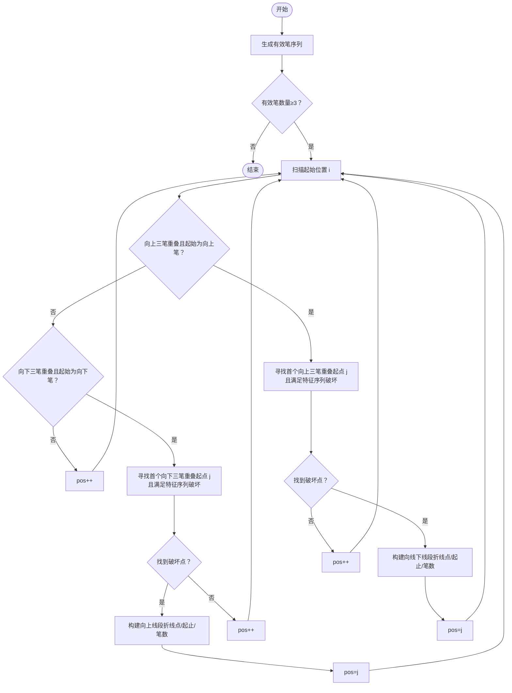
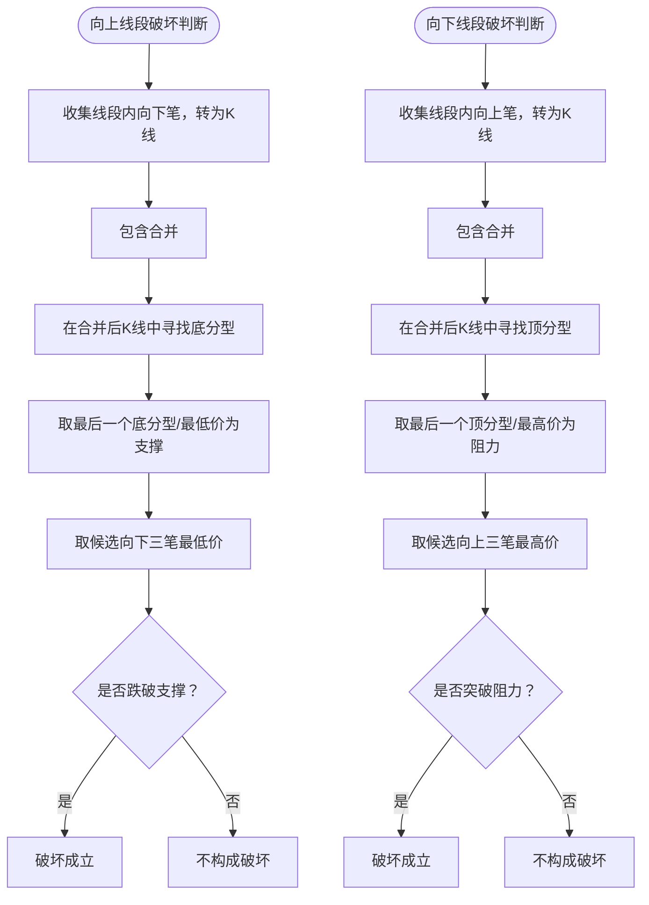
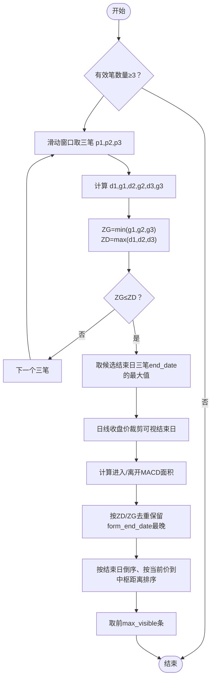
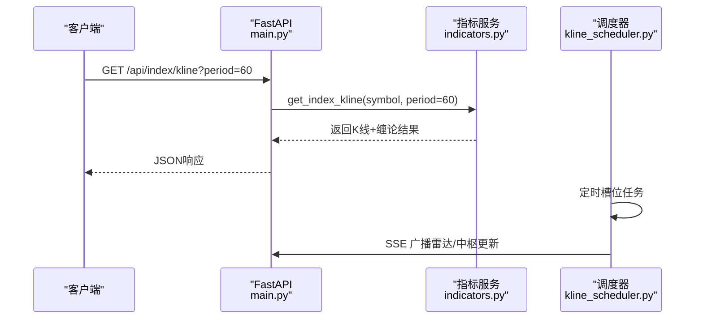

# 笔和线段计算

<cite>
**本文引用的文件**
- [main.py](file://backend/main.py)
- [kline_scheduler.py](file://backend/services/kline_scheduler.py)
- [indicators.py](file://backend/services/indicators.py)
- [HourlyChanChart.tsx](file://frontend/src/HourlyChanChart.tsx)
- [chanUtils.ts](file://frontend/src/utils/chanUtils.ts)
</cite>

## 目录
1. [简介](#简介)
2. [项目结构](#项目结构)
3. [核心组件](#核心组件)
4. [架构总览](#架构总览)
5. [详细组件分析](#详细组件分析)
6. [依赖分析](#依赖分析)
7. [性能考量](#性能考量)
8. [故障排查指南](#故障排查指南)
9. [结论](#结论)
10. [附录](#附录)

## 简介
本文件围绕缠论中的“笔”和“线段”计算进行系统化说明，结合后端指标服务与前端可视化组件，解释以下内容：
- 笔的定义与构成要素（至少3根K线、包含关系处理、方向性判断）
- 线段的形成机制（相邻笔的方向一致性、线段起止点、线段级别的K线合并策略）
- 关键算法：方向性验证、极值点识别、线段延续性判断
- 与中枢计算的关系：笔和线段作为中枢构建的基础
- 代码级实现路径与流程图，帮助理解递归/迭代处理与边界条件

## 项目结构
后端通过 FastAPI 提供指标与K线接口，核心缠论计算位于指标服务模块；前端负责展示分型、笔、线段与中枢。

**图表来源**
- [main.py:106-241](file://backend/main.py#L106-L241)
- [kline_scheduler.py:1661-1969](file://backend/services/kline_scheduler.py#L1661-L1969)
- [indicators.py:1661-1969](file://backend/services/indicators.py#L1661-L1969)
- [HourlyChanChart.tsx:179-219](file://frontend/src/HourlyChanChart.tsx#L179-L219)
- [chanUtils.ts:1-13](file://frontend/src/utils/chanUtils.ts#L1-L13)

**章节来源**
- [main.py:106-241](file://backend/main.py#L106-L241)
- [kline_scheduler.py:1661-1969](file://backend/services/kline_scheduler.py#L1661-L1969)
- [indicators.py:1661-1969](file://backend/services/indicators.py#L1661-L1969)
- [HourlyChanChart.tsx:179-219](file://frontend/src/HourlyChanChart.tsx#L179-L219)
- [chanUtils.ts:1-13](file://frontend/src/utils/chanUtils.ts#L1-L13)

## 核心组件
- K线与指标服务：提供日线/60分钟/15分钟K线，附加MACD、布林等指标，供缠论计算使用。
- 缠论计算模块：包含K线包含关系处理、分型识别、笔生成、线段构建、中枢生成等。
- 前端可视化：展示分型、笔、线段折线与中枢区域，辅助理解计算结果。

**章节来源**
- [indicators.py:1661-1969](file://backend/services/indicators.py#L1661-L1969)
- [HourlyChanChart.tsx:179-219](file://frontend/src/HourlyChanChart.tsx#L179-L219)

## 架构总览
后端通过定时任务拉取/刷新K线，计算缠论要素并缓存；API对外提供K线与缠论结果；前端接收并渲染。

**图表来源**
- [kline_scheduler.py:214-259](file://backend/services/kline_scheduler.py#L214-L259)
- [main.py:164-195](file://backend/main.py#L164-L195)
- [indicators.py:1661-1969](file://backend/services/indicators.py#L1661-L1969)
- [HourlyChanChart.tsx:179-219](file://frontend/src/HourlyChanChart.tsx#L179-L219)

## 详细组件分析

### K线包含关系与标准化
- 目标：将包含关系的K线合并为标准化K线序列，保留“实际极值”对应的原始K线日期，确保分型标注与实盘一致。
- 关键点：
  - 包含关系判断：以高/低区间包含关系为准。
  - 合并策略：按趋势（上升/下降）合并高/低与日期，累计成交量。
  - 极值日期：high_date/low_date 指向实际创出极值的原始K线日期。

**图表来源**
- [indicators.py:800-851](file://backend/services/indicators.py#L800-L851)

**章节来源**
- [indicators.py:800-851](file://backend/services/indicators.py#L800-L851)

### 分型识别（顶/底）
- 目标：从标准化K线中识别有效分型，支持扩展到多于3根的有效区间。
- 关键点：
  - 核心三根判定：顶分型要求中间K线最高/最低均大于左右；底分型相反。
  - 扩展规则：向两侧连续扩展，只要仍满足“中间为极值”的约束即视为有效。
  - 分型日期：顶取 high_date，底取 low_date，确保与实盘画线一致。

**图表来源**
- [indicators.py:853-948](file://backend/services/indicators.py#L853-L948)

**章节来源**
- [indicators.py:853-948](file://backend/services/indicators.py#L853-L948)

### 笔的生成（分型配对与间隔约束）
- 目标：由分型生成笔，满足类型交替与间隔约束。
- 关键点：
  - 类型交替：底→顶 或 顶→底。
  - 间隔约束：两分型之间至少隔1根独立K线（按原始K线索引判断，避免合并后误判）。
  - 方向性：向上笔起点为底分型最低点，终点为顶分型最高点；反之亦然。

**图表来源**
- [indicators.py:951-1058](file://backend/services/indicators.py#L951-L1058)

**章节来源**
- [indicators.py:951-1058](file://backend/services/indicators.py#L951-L1058)

### 有效笔与三笔重叠判断
- 目标：对连续同向笔进行合并，确保方向交替；三笔重叠判断用于线段形成。
- 关键点：
  - 同向笔合并：保留更极端的一根。
  - 三笔重叠：将三笔视为K线进行包含合并，再判断合并后是否存在公共价域重叠。

**图表来源**
- [indicators.py:1105-1124](file://backend/services/indicators.py#L1105-L1124)

**章节来源**
- [indicators.py:1105-1124](file://backend/services/indicators.py#L1105-L1124)

### 线段构建（三笔重叠+特征序列破坏）
- 目标：由有效笔生成线段，满足三笔重叠与特征序列破坏条件。
- 关键点：
  - 起始条件：至少3根连续交替笔，且三笔经包含合并后仍有价域重叠。
  - 向上线段：由向上笔起始，延伸至首个“向下三笔重叠起点”，且该三笔对前段特征序列（向下笔合并后分型）构成破坏。
  - 向下线段：对称规则（特征序列为向上笔，破坏为向上突破阻力）。
  - 折线点：沿笔端点逐笔转折，避免首尾直连。

**图表来源**
- [indicators.py:1226-1336](file://backend/services/indicators.py#L1226-L1336)

**章节来源**
- [indicators.py:1226-1336](file://backend/services/indicators.py#L1226-L1336)

### 特征序列与破坏判断
- 向上线段的破坏：候选向下三笔的最低价跌破“向下笔经包含合并后最后一个底分型/支撑”。
- 向下线段的破坏：候选向上三笔的最高价突破“向上笔经包含合并后最后一个顶分型/阻力”。

**图表来源**
- [indicators.py:1185-1224](file://backend/services/indicators.py#L1185-L1224)

**章节来源**
- [indicators.py:1185-1224](file://backend/services/indicators.py#L1185-L1224)

### 中枢计算（基于有效笔）
- 目标：由连续三笔的有效端点价域生成中枢，结合日线收盘价裁剪可视结束日。
- 关键点：
  - 三笔端点价域：ZD=max(低端)、ZG=min(高端)，当ZG≤ZD时构成中枢。
  - 可视结束日：首次出现收盘价离开区间时，结束于此前最后一个仍在区间内的交易日。
  - 去重：按ZD/ZG四舍五入到指定精度，保留form_end_date最晚者。

**图表来源**
- [indicators.py:1446-1509](file://backend/services/indicators.py#L1446-L1509)

**章节来源**
- [indicators.py:1446-1509](file://backend/services/indicators.py#L1446-L1509)

### API与调度集成
- API端点：提供指数/股票K线与缠论结果，支持daily/60/15周期。
- 调度器：定时同步K线并触发SSE广播，前端监听实时更新。

**图表来源**
- [main.py:164-195](file://backend/main.py#L164-L195)
- [indicators.py:1661-1969](file://backend/services/indicators.py#L1661-L1969)
- [kline_scheduler.py:214-259](file://backend/services/kline_scheduler.py#L214-L259)

**章节来源**
- [main.py:164-195](file://backend/main.py#L164-L195)
- [indicators.py:1661-1969](file://backend/services/indicators.py#L1661-L1969)
- [kline_scheduler.py:214-259](file://backend/services/kline_scheduler.py#L214-L259)

## 依赖分析
- 后端依赖：pandas、akshare、requests、yfinance等，用于数据获取与计算。
- 前端依赖：ECharts、React等，用于可视化展示。
- 组件耦合：
  - 指标服务与前端通过API交互，数据结构约定清晰（分型/笔/线段/中枢）。
  - 调度器与API通过SSE联动，确保前端实时更新。

**图表来源**
- [indicators.py:1661-1969](file://backend/services/indicators.py#L1661-L1969)
- [HourlyChanChart.tsx:179-219](file://frontend/src/HourlyChanChart.tsx#L179-L219)
- [chanUtils.ts:1-13](file://frontend/src/utils/chanUtils.ts#L1-L13)
- [main.py:164-195](file://backend/main.py#L164-L195)
- [kline_scheduler.py:214-259](file://backend/services/kline_scheduler.py#L214-L259)

**章节来源**
- [indicators.py:1661-1969](file://backend/services/indicators.py#L1661-L1969)
- [HourlyChanChart.tsx:179-219](file://frontend/src/HourlyChanChart.tsx#L179-L219)
- [chanUtils.ts:1-13](file://frontend/src/utils/chanUtils.ts#L1-L13)
- [main.py:164-195](file://backend/main.py#L164-L195)
- [kline_scheduler.py:214-259](file://backend/services/kline_scheduler.py#L214-L259)

## 性能考量
- 计算限制：仅使用最近258根K线，控制计算规模与内存占用。
- 缓存策略：按symbol+period+时间范围缓存响应，本地CSV变更时自动清理并重算。
- 指标计算：MACD、布林等指标按需计算并拼接，避免重复计算。
- 前端渲染：折线点沿笔端点逐笔转折，减少长线段直连带来的视觉噪声。

[本节为通用指导，不直接分析具体文件]

## 故障排查指南
- 数据缺失：检查K线数据源与本地缓存，确认symbol格式与period参数。
- 计算异常：查看日志中“PERF kline”统计，定位耗时环节（包含合并/分型/笔/线段/中枢）。
- 实时更新：确认调度器SSE回调设置与前端SSE订阅是否正常。

**章节来源**
- [indicators.py:1686-1696](file://backend/services/indicators.py#L1686-L1696)
- [main.py:243-284](file://backend/main.py#L243-L284)
- [kline_scheduler.py:98-106](file://backend/services/kline_scheduler.py#L98-L106)

## 结论
本项目实现了完整的缠论笔与线段计算链路：从K线包含关系标准化、分型识别、笔生成、线段构建，到中枢生成与前端可视化。通过定时调度与缓存机制，确保数据新鲜与性能稳定；通过SSE推送，前端可实时获取最新中枢与信号。

[本节为总结性内容，不直接分析具体文件]

## 附录
- 代码示例路径（不展示具体代码）：
  - K线包含关系处理：[indicators.py:800-851](file://backend/services/indicators.py#L800-L851)
  - 分型识别：[indicators.py:853-948](file://backend/services/indicators.py#L853-L948)
  - 笔生成：[indicators.py:951-1058](file://backend/services/indicators.py#L951-L1058)
  - 线段构建：[indicators.py:1226-1336](file://backend/services/indicators.py#L1226-L1336)
  - 中枢计算：[indicators.py:1446-1509](file://backend/services/indicators.py#L1446-L1509)
  - API与调度：[main.py:164-195](file://backend/main.py#L164-L195)、[kline_scheduler.py:214-259](file://backend/services/kline_scheduler.py#L214-L259)