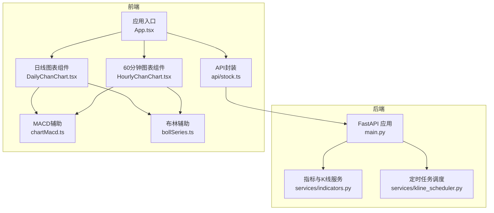
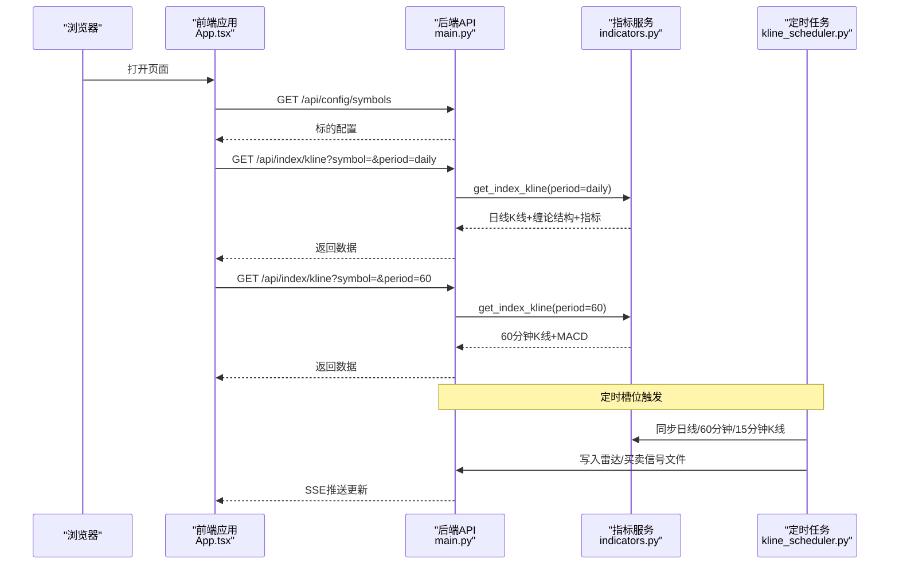
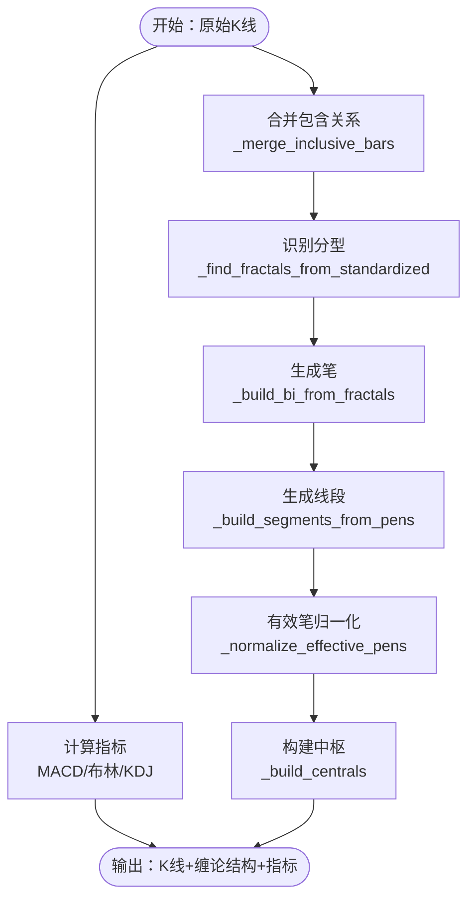
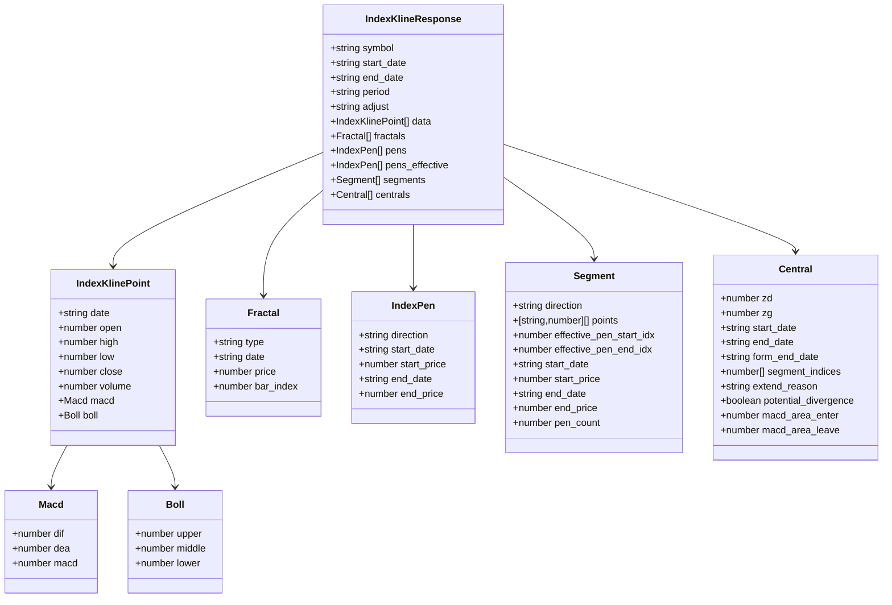
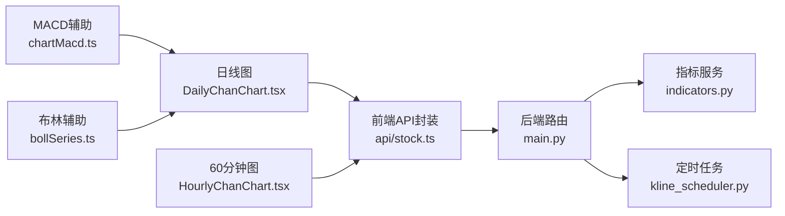

# 缠论技术分析可视化

<cite>
**本文档引用的文件**
- [backend/main.py](file://backend/main.py)
- [backend/services/indicators.py](file://backend/services/indicators.py)
- [backend/services/kline_scheduler.py](file://backend/services/kline_scheduler.py)
- [frontend/src/DailyChanChart.tsx](file://frontend/src/DailyChanChart.tsx)
- [frontend/src/HourlyChanChart.tsx](file://frontend/src/HourlyChanChart.tsx)
- [frontend/src/api/stock.ts](file://frontend/src/api/stock.ts)
- [frontend/src/chartMacd.ts](file://frontend/src/chartMacd.ts)
- [frontend/src/bollSeries.ts](file://frontend/src/bollSeries.ts)
- [frontend/src/App.tsx](file://frontend/src/App.tsx)
</cite>

## 目录
1. [简介](#简介)
2. [项目结构](#项目结构)
3. [核心组件](#核心组件)
4. [架构总览](#架构总览)
5. [详细组件分析](#详细组件分析)
6. [依赖分析](#依赖分析)
7. [性能考虑](#性能考虑)
8. [故障排查指南](#故障排查指南)
9. [结论](#结论)
10. [附录](#附录)

## 简介
本项目围绕缠论技术分析的可视化展开，提供日线与60分钟图的完整可视化方案，涵盖K线合并、分型识别、笔与线段计算、中枢构建等核心流程，并集成MACD、布林带、KDJ等技术指标。后端通过定时任务拉取并缓存K线数据，计算缠论衍生结构并通过REST API提供；前端使用ECharts进行高性能渲染，支持实时数据更新与交互式分析。

## 项目结构
- 后端（FastAPI）：提供指标查询、K线获取、雷达摘要、持仓管理、定时任务调度等接口
- 前端（React + ECharts）：负责图表渲染、数据绑定、交互与实时更新
- 数据缓存：本地CSV缓存与内存响应缓存，结合mtime变更触发重算

**图表来源**
- [backend/main.py:106-284](file://backend/main.py#L106-L284)
- [backend/services/indicators.py:1661-1969](file://backend/services/indicators.py#L1661-L1969)
- [backend/services/kline_scheduler.py:452-498](file://backend/services/kline_scheduler.py#L452-L498)
- [frontend/src/App.tsx:584-800](file://frontend/src/App.tsx#L584-L800)
- [frontend/src/DailyChanChart.tsx:161-820](file://frontend/src/DailyChanChart.tsx#L161-L820)
- [frontend/src/HourlyChanChart.tsx:179-1632](file://frontend/src/HourlyChanChart.tsx#L179-L1632)
- [frontend/src/api/stock.ts:185-215](file://frontend/src/api/stock.ts#L185-L215)
- [frontend/src/chartMacd.ts:1-71](file://frontend/src/chartMacd.ts#L1-L71)
- [frontend/src/bollSeries.ts:1-34](file://frontend/src/bollSeries.ts#L1-L34)

**章节来源**
- [backend/main.py:106-284](file://backend/main.py#L106-L284)
- [backend/services/indicators.py:1661-1969](file://backend/services/indicators.py#L1661-L1969)
- [backend/services/kline_scheduler.py:452-498](file://backend/services/kline_scheduler.py#L452-L498)
- [frontend/src/App.tsx:584-800](file://frontend/src/App.tsx#L584-L800)

## 核心组件
- 后端API与路由：提供K线、指标、雷达摘要、持仓等接口，支持CORS与SSE推送
- 指标与K线服务：实现K线合并、分型识别、笔与线段计算、中枢构建、MACD/布林/KDJ等指标
- 定时任务调度：按北京时间槽位同步日线/60分钟/15分钟K线，计算雷达与买卖信号，推送SSE
- 前端图表组件：日线与60分钟图，集成分型、笔、线段、中枢、背驰箭头、MACD等可视化元素
- 数据绑定与缓存：前端通过API封装获取数据，后端基于本地CSV与内存缓存提升性能

**章节来源**
- [backend/main.py:127-284](file://backend/main.py#L127-L284)
- [backend/services/indicators.py:1661-1969](file://backend/services/indicators.py#L1661-L1969)
- [backend/services/kline_scheduler.py:214-259](file://backend/services/kline_scheduler.py#L214-L259)
- [frontend/src/DailyChanChart.tsx:161-820](file://frontend/src/DailyChanChart.tsx#L161-L820)
- [frontend/src/HourlyChanChart.tsx:179-1632](file://frontend/src/HourlyChanChart.tsx#L179-L1632)
- [frontend/src/api/stock.ts:185-215](file://frontend/src/api/stock.ts#L185-L215)

## 架构总览
后端通过定时任务拉取并缓存K线，计算缠论结构与技术指标，提供REST API；前端通过API封装获取数据并渲染ECharts图表，支持SSE实时推送与交互式分析。

**图表来源**
- [backend/main.py:164-195](file://backend/main.py#L164-L195)
- [backend/services/indicators.py:1661-1969](file://backend/services/indicators.py#L1661-L1969)
- [backend/services/kline_scheduler.py:214-259](file://backend/services/kline_scheduler.py#L214-L259)
- [frontend/src/App.tsx:584-800](file://frontend/src/App.tsx#L584-L800)

## 详细组件分析

### 后端API与路由
- 提供K线查询、指标查询、雷达摘要、持仓管理、定时任务状态等接口
- 支持CORS与SSE实时推送，用于雷达更新与止损告警
- 异常处理与日志记录，保障服务稳定性

**章节来源**
- [backend/main.py:127-284](file://backend/main.py#L127-L284)

### 指标与K线服务（缠论核心）
- K线合并：处理包含关系，生成标准化K线序列
- 分型识别：顶/底分型判定与扩展，保留更高顶/更低底
- 笔与线段：按交替类型配对与间隔要求生成笔，三笔重叠与特征序列破坏决定线段终结
- 中枢构建：三笔端点价域形成中枢，按收盘价离开区间裁剪可视结束，支持MACD面积背驰判断
- 技术指标：MACD、布林带、KDJ计算并附着于K线数据

**图表来源**
- [backend/services/indicators.py:800-1200](file://backend/services/indicators.py#L800-L1200)
- [backend/services/indicators.py:1200-1600](file://backend/services/indicators.py#L1200-L1600)
- [backend/services/indicators.py:1600-1969](file://backend/services/indicators.py#L1600-L1969)

**章节来源**
- [backend/services/indicators.py:800-1200](file://backend/services/indicators.py#L800-L1200)
- [backend/services/indicators.py:1200-1600](file://backend/services/indicators.py#L1200-L1600)
- [backend/services/indicators.py:1600-1969](file://backend/services/indicators.py#L1600-L1969)

### 定时任务调度
- 北京时间槽位：10:31/11:31/14:01/15:01（60分钟+雷达），16:01（日线+60分钟+雷达）
- 同步日线/60分钟/15分钟K线，计算雷达与买卖信号，写入文件并推送SSE
- 多worker去重与心跳监控，保障调度稳定性

**章节来源**
- [backend/services/kline_scheduler.py:43-49](file://backend/services/kline_scheduler.py#L43-L49)
- [backend/services/kline_scheduler.py:214-259](file://backend/services/kline_scheduler.py#L214-L259)
- [backend/services/kline_scheduler.py:452-498](file://backend/services/kline_scheduler.py#L452-L498)

### 前端图表组件（日线与60分钟）
- 日线图：K线蜡烛、BOLL带、顶/底分型、笔、线段、中枢框与ZG/ZD/DD线、背驰箭头、MACD叠加
- 60分钟图：在日线基础上叠加买卖信号标记、跨级别风控提示、三类买点（3B）识别
- 数据绑定：通过API封装获取K线与缠论结构，ECharts配置series与markArea/markLine

**图表来源**
- [frontend/src/api/stock.ts:69-112](file://frontend/src/api/stock.ts#L69-L112)

**章节来源**
- [frontend/src/DailyChanChart.tsx:161-820](file://frontend/src/DailyChanChart.tsx#L161-L820)
- [frontend/src/HourlyChanChart.tsx:179-1632](file://frontend/src/HourlyChanChart.tsx#L179-L1632)
- [frontend/src/api/stock.ts:69-112](file://frontend/src/api/stock.ts#L69-L112)

### 技术指标实现与参数
- MACD：12/26/9参数，DIF、DEA、MACD柱叠加
- 布林带：20日周期、2倍标准差
- KDJ：9日周期，K/D平滑

**章节来源**
- [backend/services/indicators.py:674-706](file://backend/services/indicators.py#L674-L706)
- [frontend/src/chartMacd.ts:1-71](file://frontend/src/chartMacd.ts#L1-L71)
- [frontend/src/bollSeries.ts:1-34](file://frontend/src/bollSeries.ts#L1-L34)

### 数据流与实时更新
- 前端通过API封装发起请求，后端按period与时间范围返回K线与缠论结构
- SSE推送：后端定时任务完成后向客户端推送雷达更新与止损告警
- 缓存策略：本地CSV与内存响应缓存，按mtime变化触发重算，TTL控制命中

**章节来源**
- [frontend/src/api/stock.ts:185-215](file://frontend/src/api/stock.ts#L185-L215)
- [backend/main.py:243-284](file://backend/main.py#L243-L284)
- [backend/services/indicators.py:1661-1969](file://backend/services/indicators.py#L1661-L1969)

## 依赖分析
- 后端依赖：FastAPI、pandas、akshare、yfinance、requests等
- 前端依赖：React、ECharts、echarts-for-react、自定义工具模块
- 组件耦合：前端图表组件依赖API封装；API封装依赖后端服务；定时任务驱动后端数据更新

**图表来源**
- [frontend/src/api/stock.ts:185-215](file://frontend/src/api/stock.ts#L185-L215)
- [backend/main.py:127-284](file://backend/main.py#L127-L284)
- [backend/services/indicators.py:1661-1969](file://backend/services/indicators.py#L1661-L1969)
- [backend/services/kline_scheduler.py:452-498](file://backend/services/kline_scheduler.py#L452-L498)
- [frontend/src/DailyChanChart.tsx:161-820](file://frontend/src/DailyChanChart.tsx#L161-L820)
- [frontend/src/HourlyChanChart.tsx:179-1632](file://frontend/src/HourlyChanChart.tsx#L179-L1632)
- [frontend/src/chartMacd.ts:1-71](file://frontend/src/chartMacd.ts#L1-L71)
- [frontend/src/bollSeries.ts:1-34](file://frontend/src/bollSeries.ts#L1-L34)

**章节来源**
- [frontend/src/api/stock.ts:185-215](file://frontend/src/api/stock.ts#L185-L215)
- [backend/main.py:127-284](file://backend/main.py#L127-L284)
- [backend/services/indicators.py:1661-1969](file://backend/services/indicators.py#L1661-L1969)
- [backend/services/kline_scheduler.py:452-498](file://backend/services/kline_scheduler.py#L452-L498)
- [frontend/src/DailyChanChart.tsx:161-820](file://frontend/src/DailyChanChart.tsx#L161-L820)
- [frontend/src/HourlyChanChart.tsx:179-1632](file://frontend/src/HourlyChanChart.tsx#L179-L1632)
- [frontend/src/chartMacd.ts:1-71](file://frontend/src/chartMacd.ts#L1-L71)
- [frontend/src/bollSeries.ts:1-34](file://frontend/src/bollSeries.ts#L1-L34)

## 性能考虑
- 后端：K线计算限制在258根以内，降低复杂度；本地CSV优先与mtime比对触发重算；内存响应缓存与TTL控制
- 前端：ECharts SVG渲染，series与markArea/markLine按需配置，避免不必要的重绘
- 实时性：SSE推送与定时任务槽位，兼顾数据新鲜度与系统负载

**章节来源**
- [backend/services/indicators.py:1867-1870](file://backend/services/indicators.py#L1867-L1870)
- [backend/services/indicators.py:1661-1969](file://backend/services/indicators.py#L1661-L1969)
- [backend/services/kline_scheduler.py:214-259](file://backend/services/kline_scheduler.py#L214-L259)

## 故障排查指南
- 后端接口异常：检查HTTP状态码与日志，确认参数合法性与数据源可用性
- SSE连接问题：确认CORS配置与EventSource连接状态，关注心跳与断线重连
- 数据不更新：检查定时任务状态文件与心跳年龄，确认本地CSV更新与mtime变化
- 前端渲染异常：核对API返回数据结构与ECharts配置，确认series与markArea数据格式

**章节来源**
- [backend/main.py:127-142](file://backend/main.py#L127-L142)
- [backend/main.py:243-284](file://backend/main.py#L243-L284)
- [backend/services/kline_scheduler.py:414-449](file://backend/services/kline_scheduler.py#L414-L449)
- [frontend/src/api/stock.ts:185-215](file://frontend/src/api/stock.ts#L185-L215)

## 结论
本项目通过后端定时任务与缓存策略，结合前端ECharts可视化，实现了缠论技术分析的高效可视化方案。日线与60分钟图完整呈现K线、分型、笔、线段、中枢与背驰等核心要素，并集成MACD、布林带、KDJ等指标，为投资决策提供直观支持。通过SSE与缓存机制，系统在保证实时性的同时兼顾性能与稳定性。

## 附录
- 代码示例路径（不直接展示代码内容）：
  - 后端K线与缠论计算：[backend/services/indicators.py:1661-1969](file://backend/services/indicators.py#L1661-L1969)
  - 日线图表组件渲染：[frontend/src/DailyChanChart.tsx:412-734](file://frontend/src/DailyChanChart.tsx#L412-L734)
  - 60分钟图表组件渲染：[frontend/src/HourlyChanChart.tsx:728-820](file://frontend/src/HourlyChanChart.tsx#L728-L820)
  - API封装与SSE连接：[frontend/src/api/stock.ts:185-215](file://frontend/src/api/stock.ts#L185-L215), [frontend/src/api/stock.ts:480-497](file://frontend/src/api/stock.ts#L480-L497)
  - MACD辅助函数：[frontend/src/chartMacd.ts:1-71](file://frontend/src/chartMacd.ts#L1-L71)
  - 布林辅助函数：[frontend/src/bollSeries.ts:1-34](file://frontend/src/bollSeries.ts#L1-L34)