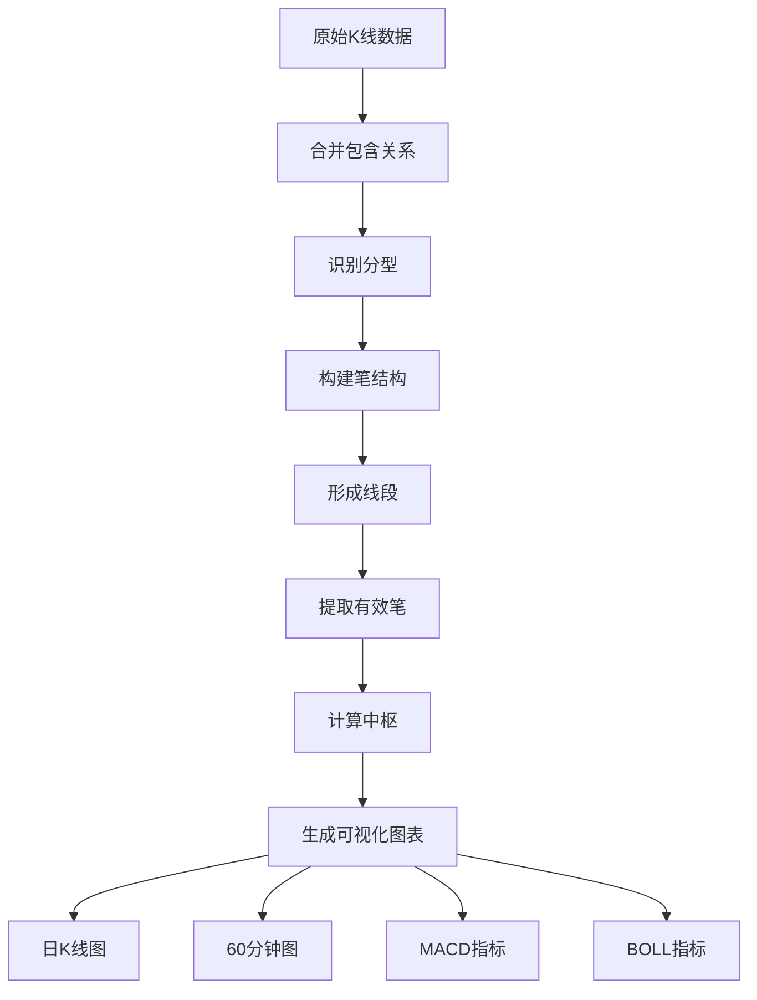
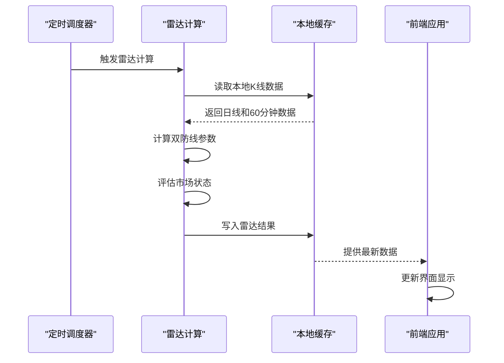
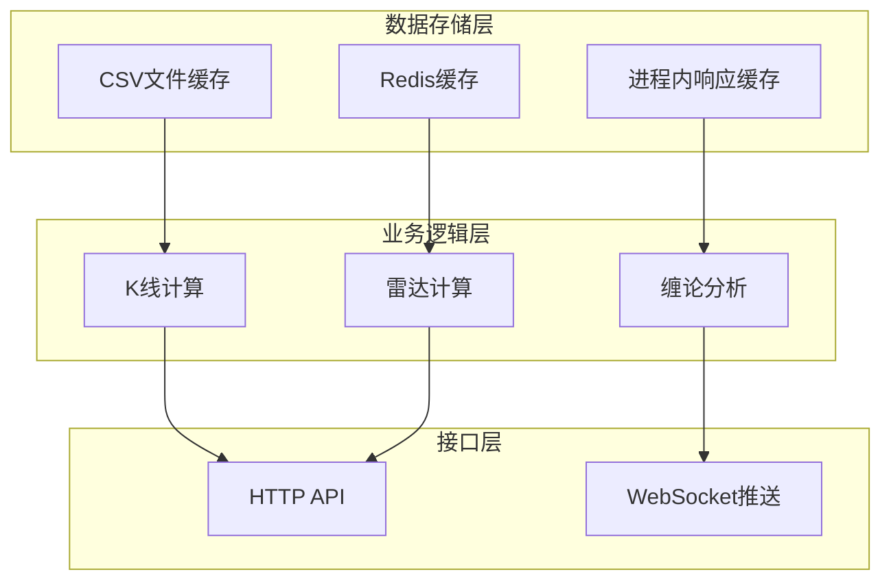
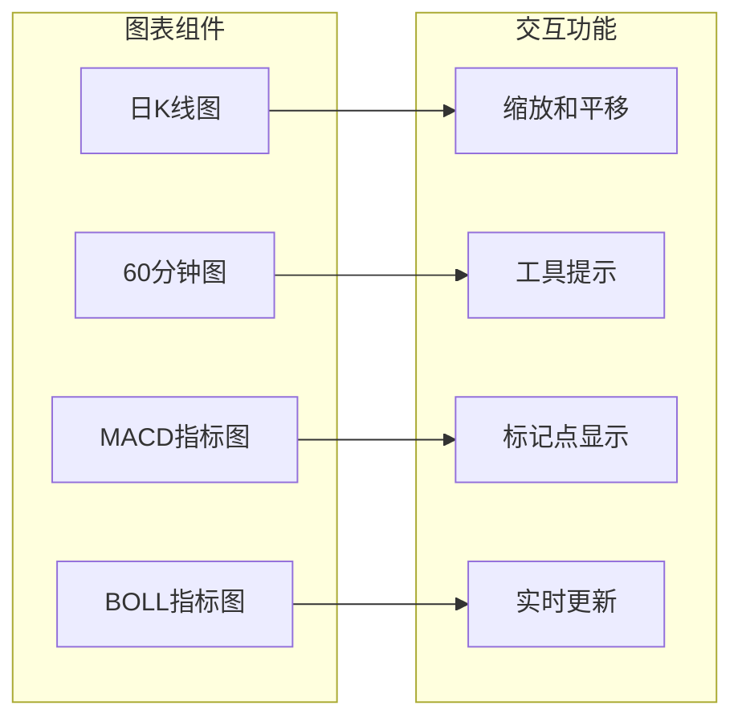
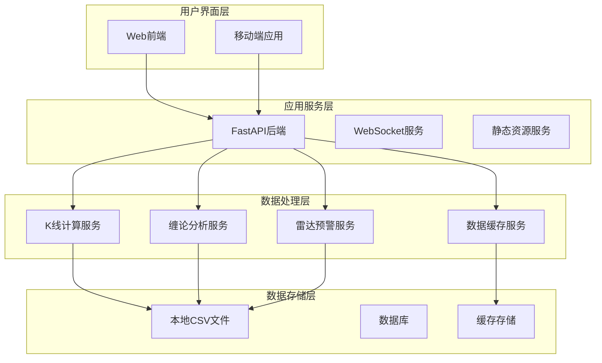

# 项目介绍

<cite>
**本文档引用的文件**
- [README.md](file://README.md)
- [backend/main.py](file://backend/main.py)
- [backend/services/indicators.py](file://backend/services/indicators.py)
- [backend/services/defense_radar.py](file://backend/services/defense_radar.py)
- [backend/services/kline_scheduler.py](file://backend/services/kline_scheduler.py)
- [backend/services/buy_sell_signals.py](file://backend/services/buy_sell_signals.py)
- [frontend/src/App.tsx](file://frontend/src/App.tsx)
- [frontend/src/DailyChanChart.tsx](file://frontend/src/DailyChanChart.tsx)
- [frontend/src/HourlyChanChart.tsx](file://frontend/src/HourlyChanChart.tsx)
- [frontend/src/DefenseAlertBrief.tsx](file://frontend/src/DefenseAlertBrief.tsx)
</cite>

## 目录
1. [项目概述](#项目概述)
2. [核心价值与目标定位](#核心价值与目标定位)
3. [双核心功能详解](#双核心功能详解)
4. [设计理念与架构特色](#设计理念与架构特色)
5. [技术实现亮点](#技术实现亮点)
6. [用户群体与适用场景](#用户群体与适用场景)
7. [系统架构概览](#系统架构概览)
8. [性能与可靠性保障](#性能与可靠性保障)
9. [总结与展望](#总结与展望)

## 项目概述

fin-analysis 是一个专注于A股/ETF/指数的本地优先金融分析系统，采用前后端分离架构，提供基于缠论的技术分析和双防线雷达预警两大核心功能。项目通过本地数据缓存策略、专业的金融图表展示和实时预警机制，为不同层次的用户提供全面的市场分析工具。

该项目采用Python FastAPI作为后端服务，React TypeScript作为前端框架，结合ECharts进行专业金融图表渲染，形成了一个功能完备、性能优异的金融分析平台。

## 核心价值与目标定位

### 价值主张

**本地优先的数据处理策略**：通过严格的本地缓存机制，确保数据访问的快速性和稳定性，避免网络波动对分析体验的影响。

**专业级技术分析**：基于缠论的深度分析方法，提供分型、笔、线段、中枢等专业分析工具，帮助用户准确把握市场节奏。

**实时预警机制**：双防线雷达系统能够实时监控市场动态，及时发出买入和卖出信号，提高投资决策效率。

### 目标用户

- **个人投资者**：需要专业分析工具进行投资决策
- **专业分析师**：需要深度技术分析和实时监控能力
- **量化研究者**：需要可扩展的分析框架和数据接口
- **开发者**：需要开源的金融分析平台进行二次开发

## 双核心功能详解

### A股/ETF/指数缠论可视化分析

缠论分析是本项目的核心技术特色，通过以下步骤实现：

**技术特点**：
- **多级别分析**：支持日线和60分钟线的双重分析
- **专业指标**：集成MACD、BOLL等技术指标
- **可视化展示**：通过ECharts提供直观的图表展示
- **实时更新**：基于定时任务的自动化数据更新

### 双防线雷达预警系统

双防线雷达系统提供实时的市场监控和预警功能：

**预警机制**：
- **绝对防线**：基于日线中枢的支撑位
- **缓冲带**：±1%的安全区域
- **实时监控**：60分钟级别的现价跟踪
- **智能分类**：将市场状态分为安全、一级警报、终极警报、红色警报四个等级

## 设计理念与架构特色

### 本地优先的数据缓存策略

项目采用多层次的本地缓存机制：

**缓存策略优势**：
- **快速响应**：本地文件系统提供毫秒级响应速度
- **数据一致性**：基于文件mtime的智能失效机制
- **容错性强**：多层缓存确保系统稳定性
- **资源优化**：减少网络请求和第三方服务依赖

### 基于缠论的技术分析方法

缠论作为核心技术框架，提供了严谨的市场分析方法：

**核心概念**：
- **分型**：通过K线形态识别趋势转折点
- **笔**：连接相邻分型的最小单位
- **线段**：由多笔组成的趋势片段
- **中枢**：价格在一个时间段内的震荡区间

**分析流程**：
1. 数据预处理和清洗
2. 分型识别和验证
3. 笔结构的构建和修正
4. 线段的形成和扩展
5. 中枢的计算和标注

### 专业的金融图表展示

前端采用ECharts进行专业的金融图表渲染：

## 技术实现亮点

### 后端服务架构

后端采用FastAPI框架，提供高性能的API服务：

**核心特性**：
- **异步处理**：支持高并发请求处理
- **类型安全**：基于Pydantic的数据验证
- **自动文档**：内置Swagger UI接口文档
- **中间件支持**：灵活的请求处理管道

**服务模块划分**：
- **数据服务**：K线数据获取和缓存管理
- **分析服务**：缠论计算和技术指标分析
- **监控服务**：雷达计算和预警生成
- **调度服务**：定时任务管理和状态监控

### 前端交互设计

前端采用React + TypeScript + ECharts的现代化技术栈：

**组件化架构**：
- **图表组件**：独立的K线图和指标图组件
- **状态管理**：基于React Hooks的状态管理
- **响应式设计**：适配不同屏幕尺寸的布局
- **实时更新**：WebSocket实现数据的实时推送

**用户体验优化**：
- **加载状态**：友好的加载指示和错误处理
- **交互反馈**：丰富的鼠标悬停和点击反馈
- **性能优化**：虚拟滚动和数据懒加载
- **无障碍支持**：符合WCAG标准的可访问性设计

## 用户群体与适用场景

### 投资者应用场景

**个人投资者**：
- **趋势判断**：通过缠论分析识别市场趋势
- **入场时机**：利用雷达系统确定最佳买入时机
- **风险控制**：实时监控市场风险，及时调整策略

**机构投资者**：
- **量化分析**：基于缠论的量化交易策略
- **组合管理**：多标的实时监控和分析
- **风险管理**：基于中枢的动态止损设置

### 开发者应用场景

**技术开发者**：
- **API集成**：基于RESTful API的系统集成
- **二次开发**：基于现有框架的功能扩展
- **算法研究**：基于缠论的算法研究和实验

**数据分析师**：
- **数据挖掘**：基于历史数据的模式识别
- **可视化展示**：专业的金融图表制作
- **报告生成**：自动化分析报告的生成

## 系统架构概览

### 整体架构设计

### 数据流处理

**实时数据流**：
1. **定时同步**：每天16:01进行全量数据同步
2. **增量更新**：每小时进行60分钟数据更新
3. **实时监控**：WebSocket推送最新的市场数据
4. **缓存管理**：基于文件mtime的智能缓存失效

**离线处理能力**：
- **本地计算**：所有分析逻辑在本地完成
- **数据持久化**：所有计算结果持久化存储
- **断点续传**：支持网络中断后的数据恢复
- **版本控制**：支持历史数据的版本管理和回溯

## 性能与可靠性保障

### 性能优化策略

**前端性能优化**：
- **虚拟DOM**：React的高效DOM更新机制
- **组件懒加载**：按需加载大型图表组件
- **数据压缩**：WebSocket传输的数据压缩
- **缓存策略**：多级缓存减少重复计算

**后端性能优化**：
- **异步I/O**：非阻塞的文件读写操作
- **进程池**：多进程并行处理大量计算任务
- **连接池**：数据库连接的复用和管理
- **内存管理**：智能的内存分配和回收

### 可靠性保障机制

**容错处理**：
- **异常捕获**：全局异常处理和错误恢复
- **重试机制**：网络请求的自动重试
- **降级策略**：服务不可用时的降级处理
- **监控告警**：系统异常的实时告警机制

**数据完整性**：
- **校验机制**：数据格式和内容的双重校验
- **备份策略**：关键数据的定期备份
- **一致性检查**：数据一致性的自动检查
- **事务管理**：关键操作的事务性保证

## 总结与展望

### 项目优势总结

**技术创新性**：
- 采用缠论这一独特的技术分析方法
- 实现了本地优先的高性能数据处理
- 提供了完整的实时预警解决方案

**实用性价值**：
- 针对A股市场的深度优化
- 提供了从入门到专业的完整分析工具
- 具备良好的扩展性和定制能力

**技术先进性**：
- 采用现代化的技术栈和架构设计
- 实现了前后端分离的最佳实践
- 具备良好的可维护性和可扩展性

### 发展前景

**功能扩展方向**：
- 支持更多市场和资产类别
- 增强机器学习和AI分析能力
- 优化移动端用户体验
- 扩展多语言支持

**技术演进方向**：
- 采用微服务架构提升系统弹性
- 集成更多第三方数据源
- 增强实时计算能力和响应速度
- 完善API生态和开发者工具

**市场应用方向**：
- 企业级部署和私有化部署
- 与券商和基金公司的合作
- 开发标准化的金融分析产品
- 建立完善的用户服务体系

fin-analysis项目通过其独特的技术架构和专业的功能设计，为金融分析领域提供了一个优秀的开源解决方案，具有广阔的发展前景和应用价值。