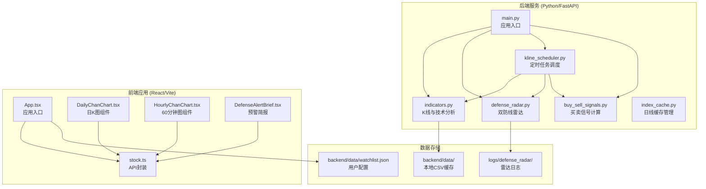
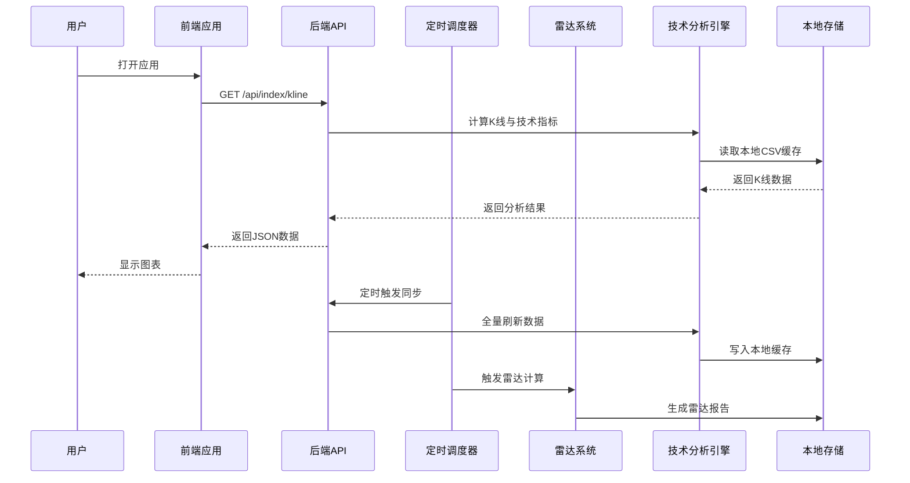
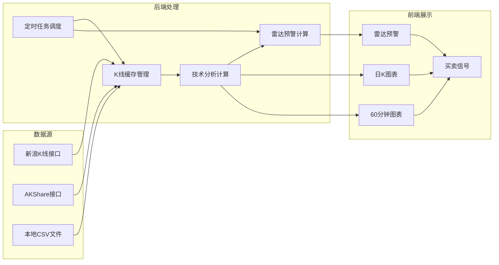
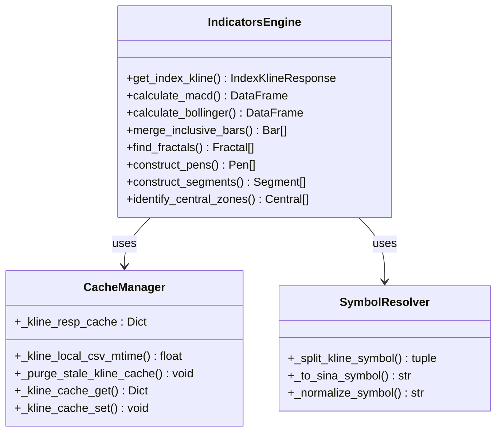
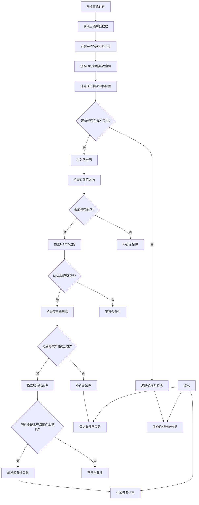
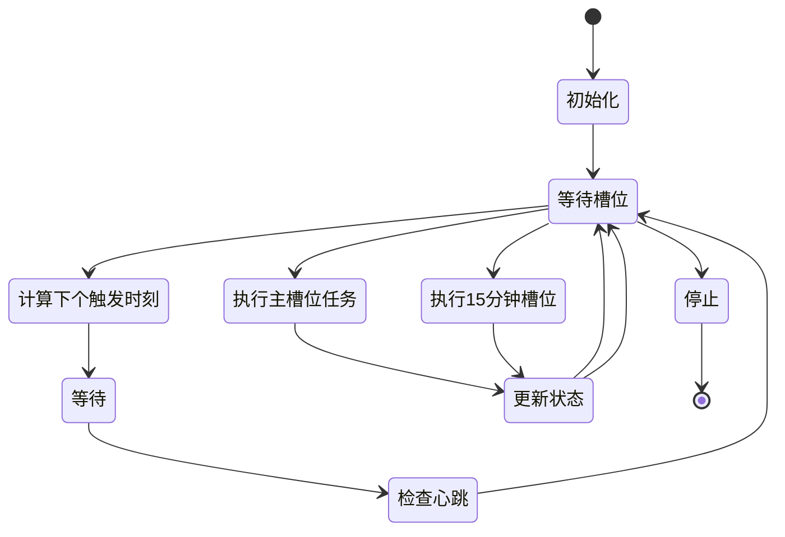
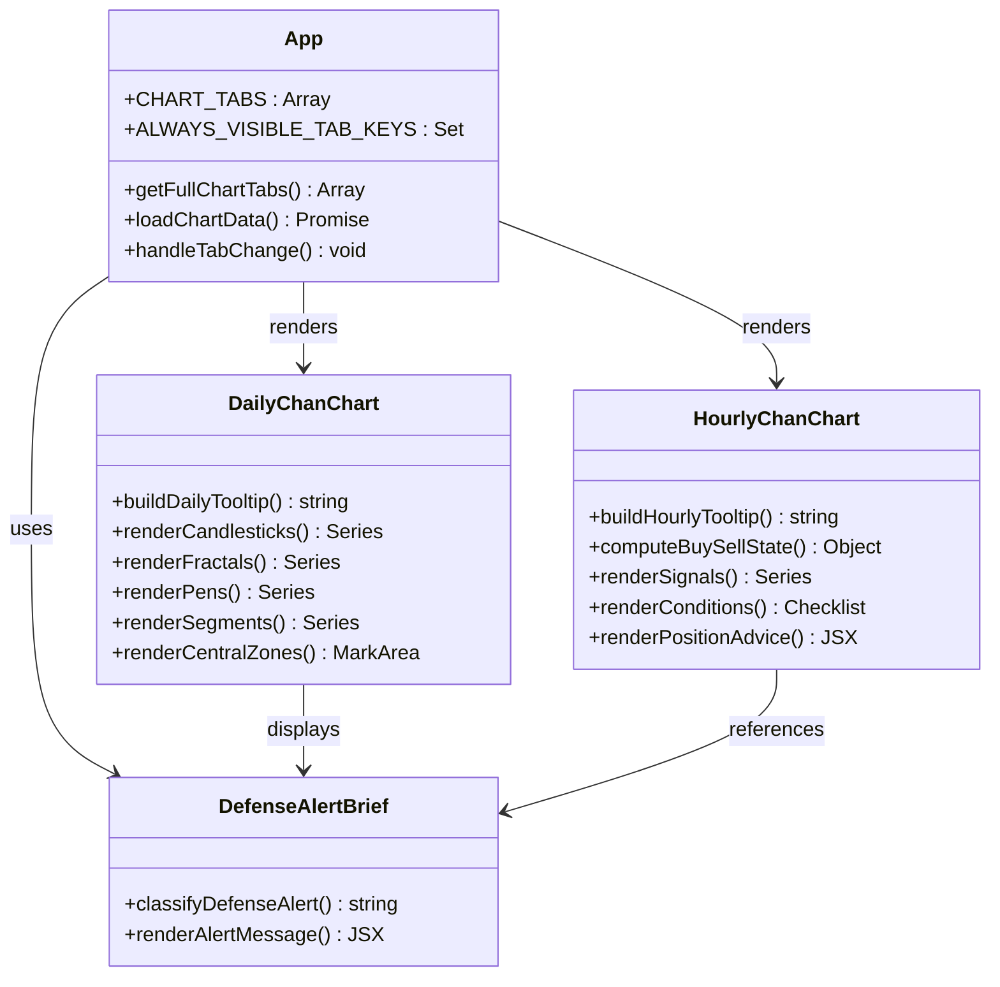
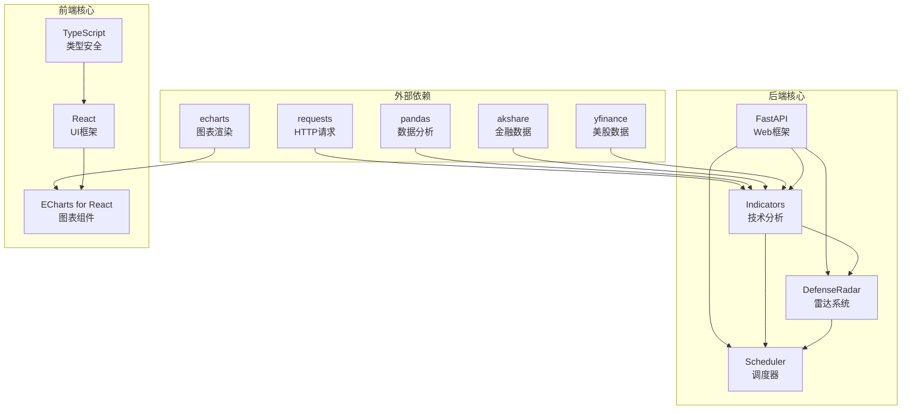

# 项目概述

<cite>
**本文档引用的文件**
- [README.md](file://README.md)
- [backend/main.py](file://backend/main.py)
- [backend/services/indicators.py](file://backend/services/indicators.py)
- [backend/services/defense_radar.py](file://backend/services/defense_radar.py)
- [backend/services/kline_scheduler.py](file://backend/services/kline_scheduler.py)
- [backend/services/buy_sell_signals.py](file://backend/services/buy_sell_signals.py)
- [frontend/src/App.tsx](file://frontend/src/App.tsx)
- [frontend/src/DailyChanChart.tsx](file://frontend/src/DailyChanChart.tsx)
- [frontend/src/HourlyChanChart.tsx](file://frontend/src/HourlyChanChart.tsx)
- [backend/data/watchlist.json](file://backend/data/watchlist.json)
</cite>

## 目录
1. [项目简介](#项目简介)
2. [项目结构](#项目结构)
3. [核心组件](#核心组件)
4. [架构概览](#架构概览)
5. [详细组件分析](#详细组件分析)
6. [依赖关系分析](#依赖关系分析)
7. [性能考虑](#性能考虑)
8. [故障排查指南](#故障排查指南)
9. [结论](#结论)
10. [附录](#附录)

## 项目简介

本项目是一个基于 Python/FastAPI + React 的金融分析系统，专注于 A 股/ETF/指数的缠论可视化分析与双防线雷达预警。系统采用前后端分离的微服务架构，通过定时任务调度系统实现本地优先的数据缓存策略，并提供实时数据推送机制。

### 核心价值与目标

**缠论可视化分析**
- 提供日 K 线与 60 分钟 K 线的完整缠论分析，包括分型、笔、线段、中枢等技术要素
- 支持 A 股/ETF/指数的统一分析框架，涵盖 6 位 A 股代码、5 位港股代码及指数代码
- 集成 MACD、BOLL 等技术指标，提供多维度的技术分析视角

**双防线雷达预警**
- 基于日线中枢的绝对防线理论，构建"黄金伏击圈"预警体系
- 实时监控标的在中枢下沿 ±1% 缓冲带内的交易机会
- 提供一级警报、终极警报、红色警报的分级预警机制

**专业金融图表展示**
- 基于 ECharts 的专业金融图表，支持分型标注、笔线段绘制、中枢框线等技术分析元素
- 提供日 K 图与 60 分钟图的双视图分析模式
- 支持实时数据推送与自动刷新机制

### 技术特色

**本地优先数据缓存策略**
- 严格的本地 CSV 文件优先策略，减少网络依赖
- 基于文件 mtime 的智能缓存失效机制
- 支持日线与 60 分钟数据的独立缓存管理

**基于缠论的技术分析方法**
- 完整的缠论算法实现，包括包含关系合并、分型识别、笔划分、线段构建
- 中枢识别与有效性验证，支持 A/B/C 三级中枢分析
- 与后端完全一致的档位分类逻辑

**实时数据推送机制**
- SSE（Server-Sent Events）实现实时数据推送
- 支持雷达更新、止损触发等关键事件的即时通知
- 前端自动刷新与用户交互优化

## 项目结构

项目采用典型的前后端分离架构，后端使用 Python/FastAPI 提供 RESTful API，前端使用 React/Vite 构建现代化的 Web 应用。

**图表来源**
- [backend/main.py:1-514](file://backend/main.py#L1-L514)
- [backend/services/indicators.py:1-800](file://backend/services/indicators.py#L1-L800)
- [backend/services/defense_radar.py:1-800](file://backend/services/defense_radar.py#L1-L800)
- [backend/services/kline_scheduler.py:1-492](file://backend/services/kline_scheduler.py#L1-L492)
- [frontend/src/App.tsx:1-800](file://frontend/src/App.tsx#L1-L800)

**章节来源**
- [README.md:216-244](file://README.md#L216-L244)

## 核心组件

### 后端核心组件

**FastAPI 应用服务**
- 提供统一的 RESTful API 接口，支持 K 线查询、技术分析、雷达预警等功能
- 实现进程生命周期管理，包含定时任务的启动与关闭
- 支持 CORS 跨域访问，便于前端调试

**K线与技术分析引擎**
- 实现完整的缠论算法，包括包含关系合并、分型识别、笔划分、线段构建
- 集成 MACD、BOLL 等技术指标计算
- 提供本地 CSV 优先的数据缓存策略

**双防线雷达系统**
- 基于日线中枢的绝对防线理论，构建预警机制
- 实现四级条件过滤，确保信号质量
- 自动生成雷达报告与摘要文件

**定时任务调度系统**
- 基于北京时间的精确调度，支持 10:31/11:31/14:01/15:01/16:01 等关键时点
- 实现日线与 60 分钟数据的独立同步
- 支持 15 分钟独立同步机制

### 前端核心组件

**应用入口与路由管理**
- 管理所有标的的配置信息，包括 ETF、股票、港股等
- 实现 Tab 切换与数据加载策略
- 支持用户自定义标的与观察列表

**技术图表组件**
- 日 K 图组件：提供完整的缠论分析展示，包括中枢、分型、笔线段等
- 60 分钟图组件：专注于短期交易分析，集成买卖信号识别
- 支持实时数据更新与用户交互

**数据管理与状态同步**
- 实现与后端 API 的数据同步机制
- 支持 SSE 实时数据推送
- 提供本地存储的用户偏好设置

**章节来源**
- [backend/main.py:94-514](file://backend/main.py#L94-L514)
- [backend/services/indicators.py:1-800](file://backend/services/indicators.py#L1-L800)
- [backend/services/defense_radar.py:1-800](file://backend/services/defense_radar.py#L1-L800)
- [frontend/src/App.tsx:1-800](file://frontend/src/App.tsx#L1-L800)

## 架构概览

系统采用微服务架构，后端通过 FastAPI 提供 API 服务，前端通过 React 构建用户界面，两者通过 HTTP 协议通信。

**图表来源**
- [backend/services/kline_scheduler.py:211-256](file://backend/services/kline_scheduler.py#L211-L256)
- [backend/services/indicators.py:1-800](file://backend/services/indicators.py#L1-L800)
- [backend/services/defense_radar.py:747-800](file://backend/services/defense_radar.py#L747-L800)

### 数据流架构

**图表来源**
- [backend/services/indicators.py:359-581](file://backend/services/indicators.py#L359-L581)
- [backend/services/kline_scheduler.py:131-256](file://backend/services/kline_scheduler.py#L131-L256)

## 详细组件分析

### K线与技术分析引擎

技术分析引擎是系统的核心组件，负责实现完整的缠论算法和各种技术指标计算。

**图表来源**
- [backend/services/indicators.py:1-800](file://backend/services/indicators.py#L1-L800)

**组件特性分析**

**本地缓存策略**
- 响应缓存：基于 `(symbol, period, start_date, end_date)` 的组合键缓存
- 文件监控：通过 `os.stat().st_mtime` 监控本地 CSV 文件变更
- TTL 机制：默认 300 秒的缓存过期时间
- 独立缓存：日线与 60 分钟缓存相互独立，避免互相影响

**缠论算法实现**
- 包含关系合并：识别并合并具有包含关系的 K 线
- 分型识别：基于合并后的 K 线序列识别顶分型和底分型
- 笔划分：连接相邻的分型，形成笔的序列
- 线段构建：将方向相同的笔连接形成线段
- 中枢识别：基于有效笔序列识别中枢，支持 A/B/C 三级中枢

**技术指标计算**
- MACD：12/26/9 参数的标准 MACD 计算
- BOLL：20 日均线，2 标准差的布林带计算
- KDJ：9 日参数的随机指标计算

**章节来源**
- [backend/services/indicators.py:1-800](file://backend/services/indicators.py#L1-L800)

### 双防线雷达系统

雷达系统基于日线中枢的绝对防线理论，构建完整的预警机制。

**图表来源**
- [backend/services/defense_radar.py:593-744](file://backend/services/defense_radar.py#L593-L744)

**雷达算法详解**

**档位分类逻辑**
- 绝对防线：MIN(C-ZD, A-ZD) 作为绝对防线基准
- 一级警报：现价位于绝对防线 ±1% 缓冲带内
- 红色警报：现价跌破绝对防线，视为破位禁买
- 终极警报：特殊情况下的一级警报升级

**四条件串联过滤**
1. **伏击带条件**：现价处于绝对防线 ±1% 缓冲带内
2. **笔向条件**：60 分钟有效笔序列末笔方向向下
3. **MACD 条件**：MACD 动能转强，绿柱面积缩小或红柱伸长
4. **形态条件**：严格底分型配合 K 线确认

**前端联动机制**
- `has_alert` 字段控制 Tab 显示
- `pen_60m` 字段控制 60 分钟图的显示策略
- `full_trigger` 字段决定 Tab 的颜色状态

**章节来源**
- [backend/services/defense_radar.py:196-744](file://backend/services/defense_radar.py#L196-L744)

### 定时任务调度系统

调度系统采用独立线程的方式，基于北京时间进行精确的定时任务管理。

**图表来源**
- [backend/services/kline_scheduler.py:286-373](file://backend/services/kline_scheduler.py#L286-L373)

**调度策略分析**

**主槽位设计**
- 10:31/11:31/14:01/15:01：60 分钟数据全量刷新 + 雷达计算
- 16:01：日线数据全量刷新 + 60 分钟数据刷新 + 雷达计算
- 支持日线同步标志位，控制是否进行日线全量刷新

**15 分钟独立槽位**
- 交易时间内每 15 分钟触发一次 60 分钟数据同步
- 避免与主槽位重复同步，提高效率
- 支持独立的心跳监控机制

**去重与容错机制**
- 文件锁机制确保多进程环境下只有一个调度器运行
- 心跳监控：每 30 分钟记录一次心跳，超过 10 分钟无心跳视为异常
- 自动重启：工作线程异常退出后自动重启

**章节来源**
- [backend/services/kline_scheduler.py:1-492](file://backend/services/kline_scheduler.py#L1-L492)

### 前端图表系统

前端采用 React + ECharts 构建专业的金融图表展示系统。

**图表来源**
- [frontend/src/App.tsx:1-800](file://frontend/src/App.tsx#L1-L800)
- [frontend/src/DailyChanChart.tsx:1-800](file://frontend/src/DailyChanChart.tsx#L1-L800)
- [frontend/src/HourlyChanChart.tsx:1-800](file://frontend/src/HourlyChanChart.tsx#L1-L800)

**图表组件特性**

**日 K 图表组件**
- 完整的缠论分析展示，包括中枢、分型、笔线段等
- 支持鼠标悬停显示详细的技术分析信息
- 实现中枢区域的着色标记，直观显示支撑阻力位
- 集成 MACD 指标显示，支持双轴布局

**60 分钟图表组件**
- 专注于短期交易分析，集成买卖信号识别
- 实现跨级别的风控机制，基于日线中枢的保护
- 提供详细的买卖条件检查清单，帮助用户理解信号
- 支持持仓信息的集成展示

**预警简报组件**
- 基于绝对防线理论的档位分类
- 实时显示标的的预警状态与建议
- 支持与雷达系统的数据同步

**章节来源**
- [frontend/src/App.tsx:1-800](file://frontend/src/App.tsx#L1-L800)
- [frontend/src/DailyChanChart.tsx:1-800](file://frontend/src/DailyChanChart.tsx#L1-L800)
- [frontend/src/HourlyChanChart.tsx:1-800](file://frontend/src/HourlyChanChart.tsx#L1-L800)

## 依赖关系分析

系统各组件之间存在清晰的依赖关系，形成了完整的数据处理链条。

**图表来源**
- [backend/main.py:1-514](file://backend/main.py#L1-L514)
- [backend/services/indicators.py:1-800](file://backend/services/indicators.py#L1-L800)
- [frontend/src/App.tsx:1-800](file://frontend/src/App.tsx#L1-L800)

### 关键依赖分析

**后端依赖关系**
- `requests`：用于 HTTP 请求，特别是新浪 K 线接口
- `pandas`：核心数据分析库，用于 K 线数据处理
- `akshare`：第三方金融数据接口，提供港股等数据源
- `yfinance`：美股数据接口，支持港股 15 分钟数据获取

**前端依赖关系**
- `echarts`：专业金融图表库，支持复杂的图表渲染
- `echarts-for-react`：React 组件封装，简化图表集成
- `typescript`：提供类型安全，减少运行时错误

**数据依赖关系**
- 本地 CSV 文件作为主要数据源，减少对外部接口的依赖
- Redis 缓存用于临时数据存储，支持实时数据推送
- 日志文件记录雷达分析结果，支持历史回溯

**章节来源**
- [backend/main.py:1-514](file://backend/main.py#L1-L514)
- [backend/services/indicators.py:1-800](file://backend/services/indicators.py#L1-L800)
- [frontend/src/App.tsx:1-800](file://frontend/src/App.tsx#L1-L800)

## 性能考虑

系统在设计时充分考虑了性能优化，采用了多种策略来提升响应速度和用户体验。

### 缓存策略优化

**多层缓存架构**
- 进程内响应缓存：基于内存的快速访问，支持 TTL 过期
- 本地文件缓存：基于 CSV 文件的持久化存储
- 智能失效机制：通过文件 mtime 监控数据变更

**缓存键设计**
- `(symbol, period, start_date, end_date)` 组合键，确保缓存粒度精确
- 支持不同周期数据的独立缓存，避免相互影响
- 缓存容量限制，防止内存泄漏

### 并发处理优化

**异步处理机制**
- SSE 实时推送，支持多客户端连接
- 异步任务队列，处理耗时的计算任务
- 线程池管理，优化 CPU 密集型计算

**数据库连接池**
- 连接池复用，减少连接建立开销
- 连接超时控制，防止资源泄露
- 连接健康检查，确保连接有效性

### 前端性能优化

**懒加载策略**
- 图表组件按需加载，减少初始包大小
- 数据分页加载，避免一次性加载大量数据
- 图片和静态资源压缩，提升加载速度

**渲染优化**
- 虚拟滚动，支持大数据量的高效渲染
- 图表渲染优化，减少不必要的重绘
- 事件委托，提升交互响应速度

## 故障排查指南

### 常见问题诊断

**API 接口问题**
- 404 错误：检查路由是否正确注册，确认后端已重启
- 500 错误：查看后端日志，检查数据源连接状态
- 超时错误：检查网络连接，确认数据源可用性

**数据同步问题**
- 缓存失效：检查本地 CSV 文件是否更新，确认 mtime 变化
- 数据缺失：验证数据源接口，检查网络连接状态
- 格式错误：确认数据格式符合预期，检查字段映射

**图表显示问题**
- 数据不更新：检查定时任务是否正常运行，确认缓存策略
- 图表异常：验证数据完整性，检查 ECharts 配置
- 性能问题：优化数据量，检查渲染性能

### 调试工具使用

**后端调试**
- 启用详细日志：设置日志级别为 DEBUG，捕获详细信息
- API 测试：使用 curl 或 Postman 测试接口
- 性能分析：使用性能分析工具识别瓶颈

**前端调试**
- 浏览器开发者工具：检查网络请求和响应
- Redux DevTools：调试状态管理
- 性能面板：分析渲染性能

**章节来源**
- [README.md:255-269](file://README.md#L255-L269)

## 结论

本项目成功构建了一个功能完整、性能优异的金融分析系统。通过采用本地优先的数据缓存策略、专业的缠论技术分析方法和实时数据推送机制，系统为用户提供了一套完整的 A 股/ETF/指数分析工具。

### 系统优势

**技术先进性**
- 采用最新的 Python/FastAPI 技术栈，确保系统的稳定性与扩展性
- 基于 ECharts 的专业图表展示，提供优秀的用户体验
- 实现完整的缠论算法，支持深度的技术分析需求

**架构合理性**
- 前后端分离的设计，便于团队协作和独立开发
- 微服务架构支持，便于功能扩展和维护
- 定时任务调度系统，确保数据的及时性和准确性

**实用性价值**
- 本地优先的缓存策略，减少对外部依赖
- 双防线雷达预警，提供实用的投资指导
- 实时数据推送，支持动态决策制定

### 发展前景

系统具备良好的扩展基础，可以进一步完善以下方面：
- 增加更多技术分析指标和算法
- 扩展支持更多市场和资产类别
- 增强机器学习和人工智能功能
- 优化移动端用户体验

## 附录

### 快速开始指南

**环境要求**
- Python 3.9+
- Node.js 16+
- MySQL 8.0+（可选）

**安装步骤**
1. 克隆项目到本地
2. 安装后端依赖：`pip install -r backend/requirements.txt`
3. 安装前端依赖：`npm install`
4. 启动后端服务：`cd backend && python main.py`
5. 启动前端服务：`cd frontend && npm run dev`

**基本使用方法**
1. 访问 `http://localhost:5173` 查看前端界面
2. 通过 `/api/index/kline` 接口获取 K 线数据
3. 使用 `/api/diagnosis/defense-radar/summary` 获取雷达摘要
4. 通过 SSE 接口 `/api/sse/radar-updates` 实时接收更新

### 技术术语说明

**缠论相关术语**
- 分型：K 线序列中的局部高点或低点
- 笔：相邻分型之间的连接线段
- 线段：方向相同的笔的组合
- 中枢：由多个有效笔构成的价格区间

**技术分析术语**
- MACD：指数平滑异同移动平均线
- BOLL：布林带指标
- KDJ：随机指标
- 支撑/阻力：价格的重要支撑或阻力位

### 版本更新记录

**v1.0.0**
- 系统初始化版本
- 实现基础的 K 线分析功能
- 集成双防线雷达预警系统

**v1.1.0**
- 优化缓存策略，提升性能
- 增强前端交互体验
- 完善错误处理机制

**v1.2.0**
- 添加实时数据推送功能
- 扩展支持更多技术指标
- 优化移动端适配