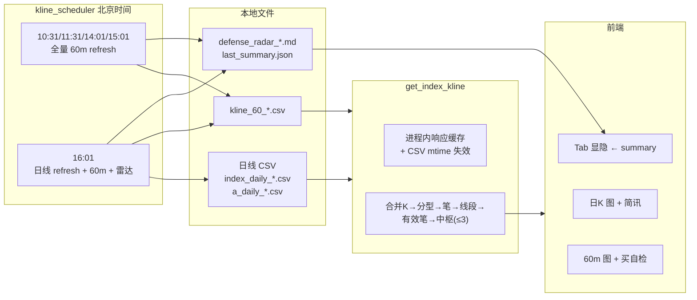

# fin-analysis

本地优先的 A 股 / ETF / 指数 **缠论** 可视化 + **双防线雷达**：后端 FastAPI 负责 K 线缓存、缠论计算、定时同步与雷达；前端 React 展示日 K / 60 分钟图、双防线简讯与 Tab 显隐策略。

---

## 1. 技术栈

| 层级 | 技术 |
|------|------|
| 后端 | Python 3.9+、FastAPI、uvicorn、pandas、akshare（部分场景）、新浪 K 线 HTTP |
| 前端 | React、TypeScript、Vite、ECharts（echarts-for-react） |
| 数据 | `backend/data/` 下日线 CSV、`kline_60_*.csv`；`logs/defense_radar/` 下雷达 md / json |

---

## 2. 快速启动

```bash
cd backend && pip install -r requirements.txt
cd ../frontend && npm install
# 项目根目录：后端 8000 + 前端 5173
./restart_services.sh
```

- 后端：<http://127.0.0.1:8000> · API 文档：<http://127.0.0.1:8000/docs>  
- 前端：<http://127.0.0.1:5173> · 默认请求后端 `http://127.0.0.1:8000`（见 `frontend/src/api/stock.ts`）

**重要：** 修改 `backend/main.py` 等路由后必须**重启后端**，否则可能仍加载旧路由（例如缺少 `/api/diagnosis/defense-radar/summary`）。

---

## 3. 整体数据流（逻辑总览）



---

## 4. 后端逻辑

### 4.1 进程生命周期（`main.py`）

- 使用 FastAPI **lifespan**：启动时 `setup_kline_scheduler()` 开启定时线程；关闭时 `shutdown_kline_scheduler()`。
- CORS：允许任意来源（本地开发）。

### 4.2 HTTP 接口一览

| 方法 | 路径 | 作用 |
|------|------|------|
| GET | `/api/stock/indicators` | 单票最新指标（akshare 等） |
| GET | `/api/stock/history-indicators` | 历史指标序列 |
| GET | `/api/index/kline` | **核心**：K 线 + MACD/BOLL + 缠论字段（分型/笔/线段/有效笔/中枢） |
| GET | `/api/diagnosis/defense-radar/summary` | 双防线摘要 JSON；优先读 `last_summary.json`，响应头 `Cache-Control: no-store` |
| POST | `/api/diagnosis/defense-radar` | 手动跑雷达，写 md + 更新 `last_summary.json` |
| GET | `/` | 健康检查 |

**`/api/index/kline` 参数要点**

- `symbol`：指数 `sh000001` / `sz399001` 等；A 股/ETF **6 位**；港股 `hk01810` 或 5 位。
- `period`：`daily` | `60`。
- `start_date`：日线默认自 `2024-12-01`；60m 前端常用「近 90 日」起算日期。
- `refresh`：`true` 时强制拉网（60m 会写 `kline_60_*.csv`）；`false` 时日线读本地 CSV，60m **仅读本地 CSV**（无文件会报错，需先由定时任务或 `refresh=true` 预热）。

### 4.3 K 线计算与缠论（`services/indicators.py` · `get_index_kline`）

对 `daily` / `60` 在截断后的 K 序列上：

1. **合并包含关系** → **分型** → **笔** → **线段** → **有效笔**  
2. **中枢**：连续三笔有效笔价域满足 ZG/ZD 规则；按与最新收盘距离排序后取 **至多 3 段**（前端按时间排序标为 A/B/C，末段为当前 C 中枢）。  
3. 附 **MACD**、**BOLL(20,2)**。

**进程内响应缓存 + 按本地文件 mtime 失效（日线与 60m 互不干扰）**

- 缓存键：`(symbol, period, start_date, end_date)`。  
- **`refresh=false`**：若该 `symbol + period` 对应 **本地 CSV 的 mtime** 新于缓存记录，则**丢弃该标的该周期下全部缓存键**并重算（分型/笔/中枢全部重来）。  
  - **日线**文件：指数 `backend/data/index_daily_*.csv`；A 股/ETF `a_daily_qfq_*.csv` 或 `a_daily_nq_*.csv`（ETF 与股票路径规则见 `index_cache.py`）。  
  - **60m** 文件：`backend/data/kline_60_{symbol}.csv`。  
- **港股日线**无本地 CSV：**不参与 mtime 比对**，仅靠缓存 **TTL（默认 300s）**。  
- **`refresh=true`**：清除该标的该周期下全部缓存后完整计算（定时任务与排障用）。

### 4.4 日线本地缓存（`services/index_cache.py`）

- 新浪 `scale=240` 拉日线，锚点自 `2024-12-01`。  
- **严格本地优先**：默认只读 CSV；仅 `force_refresh=True` 或文件不存在时访问网络并写回。

### 4.5 定时任务（`services/kline_scheduler.py`）

- **时区**：`Asia/Shanghai`，独立线程 `sleep` 到下一槽位。  
- **10:31、11:31、14:01、15:01**：对每个同步标的 `get_index_kline(..., period="60", refresh=True)`，再 `run_defense_radar(refresh=False)`。  
- **16:01**：先对每个标的 `get_index_kline(..., period="daily", refresh=True)`，再执行与上相同的 60m 全量 + 雷达。  
- **同步列表**：`sh000001` + `defense_radar.DEFENSE_RADAR_WATCHLIST` 中的代码，**排除** `hk01810`（60m 数据源限制）。  
- 雷达假定 **前置已写盘**，自身默认只读本地 K 线。

### 4.6 双防线雷达（`services/defense_radar.py`）

**扫描范围**  
与前端 `CHART_TABS` 中标的一致（**不含上证指数** `sh000001`）。`DEFENSE_RADAR_WATCHLIST` 须与前端代码保持同步。

**价位口径（默认 `refresh=False`）**

- **A-ZD / C-ZD**：由 **日线** 中枢按时间排序后，**第一段下沿**与**最后一段下沿**。  
- **现价 P**：**60 分钟** K 线 **最后一根收盘价**（与本地 `kline_60_*.csv` 一致）。  

**分类逻辑 `_classify`（与用户规则一致）**

- `Support_High = max(C-ZD, A-ZD)`，`Support_Low = min(...)`。  
- 一级伏击带：`Support_High × [0.99, 1.01]`。  
- 终极伏击带：`Support_Low × [0.99, 1.01]`。  
- 红色：`P < Support_Low × 0.99`（破极限下沿再 1%）。  
- 其余区间含「观望」「高于第一伏击上沿」等文案。

**`has_alert` + `pen_60m`（控制前端 Tab）**  
- `has_alert`：仅当 `alert` 含 `【一级警报】`、`【终极警报】`、`【红色警报】` 之一为真。  
- 非核心 ETF 在 `has_alert` 为真时，还须摘要中 **`pen_60m === "向下"`** 才显示 Tab；**`pen_60m === "向上"`** 时不显示（与 60m 有效笔最后一笔一致）。

**产物**

- `logs/defense_radar/defense_radar_YYYYMMDD_HHMMSS.md`：表格。  
- `logs/defense_radar/last_summary.json`：`generated_at` + `symbols[]`（`code/name/alert/has_alert/pen_60m`）。

**手动执行**

```bash
python backend/run_defense_radar.py          # 只读本地
python backend/run_defense_radar.py --refresh  # 排障：先拉网再算
```

### 4.7 梅花2test（889999）与「未来 K」Mock

- 测试标的 **889999**（显示名梅花2test）**不列入** `DEFENSE_RADAR_WATCHLIST`：与实盘雷达列表隔离，跑雷达时在实盘标的之后**单独追加**一行（`analyze_meihua2test_symbol`）；定时任务也不会对 889999 做网络 refresh，仅读本地夹具 CSV。
- 本地 CSV 由 `backend/scripts/build_meihua2test_fixture.py` 从 600873 复制基座并**追加日历上在未来**的日线与 60m（需本机已有 `600873` 源 CSV）；脚本结束时会试算雷达，**full_trigger 非真仅提示、不退出失败**。
- **889999 专用**：`get_index_kline` 对 **889999** 会把 `end_ts` 放宽到本地 CSV 内最大日期/时间，使「晚于当前时刻」的 mock K 仍参与缠论与图；**不必**再设 `MEIHUA2TEST_FUTURE_K=1`。若要对 889999 也按当前时刻截断（少见），可设 `MEIHUA2TEST_FUTURE_K=0`。
- 重新生成夹具并安装到 `backend/data/`：  
  `cd backend && python3 scripts/build_meihua2test_fixture.py`
- **手工改 Mock**：`tests/fixtures/meihua2test/` 与 `backend/data/` 下的 `kline_60_889999.csv`、`a_daily_qfq_889999.csv` 可直接编辑尾部；与脚本生成内容不必一致，以本地文件为准。改后刷新前端或等 K 线缓存按 mtime 失效。

**当前夹具约定（暴力 V 型、仅两根 60m，避免与上一根包含）**

- 历史段保留至 **2026-04-10 15:00**（与 600873 基座一致），其后再接 **下一交易日**两根 60m（示例为 **2026-04-13 10:30、11:30**）。
- **Mock K1（深坑）**：开 11.03，高 11.05，低 **10.80**，收 10.85。  
- **Mock K2（反包）**：开 10.85，高 **11.50**（须高于 K1 高 11.05），低 **10.82**（须高于 K1 低 10.80），收 11.45。  
- **日线 2026-04-13**：由上述两根合成——开 11.03，高 11.50，低 10.80，收 11.45；成交量为两根 60m 成交量之和（夹具里可用占位额）。

---

## 5. 前端逻辑（`frontend/src`）

### 5.1 配置与 Tab 策略（`App.tsx`）

- **`CHART_TABS`**：每个品种 `key / code / tabLabel / seriesName / seriesName60`。  
- **顶栏实际列表 `CHART_TABS_FOR_NAV`**：去掉 **港股小米** `hk01810`（不在顶栏展示）。  
- **始终显示的 Tab（核心 ETF）**：`CORE_ETF_TAB_KEYS` = 沪深300（510300）、科创50（588000）、创业板（159915）。  
- **其余品种**：须 **`has_alert === true` 且 `pen_60m === "向下"`**（摘要来自 `last_summary.json`）；`pen_60m === "向上"` 不显示。摘要未加载成功时（`defenseCodeToAlert === null`）只显示上述三只核心 ETF。  
- **摘要请求**：`fetchDefenseRadarSummary` 使用 `cache: 'no-store'`；`code` 统一 `String` 化再查 Map，避免类型不一致。

### 5.2 数据加载时机

| 时机 | 行为 |
|------|------|
| 首屏 | `loadDefenseSummary`；`loadIndexDailyKline`（上证日线）；`refreshIndex60Only`（上证 60m，`refresh=false`） |
| 切换到某品种 Tab | 若尚无缓存则 `fetchDailyForTab`、`fetch60ForTab`（60m 只读本地） |
| `visibilitychange` 为可见 | `refresh60MinuteKlines`（上证 60m + 当前 Tab 60m）+ `loadDefenseSummary` |
| 摘要更新后当前 Tab 被隐藏 | 自动切回「上证指数」 |

**说明：** 不在整点轮询；**刷新浏览器**或**切回标签页**可拿到最新摘要与 60m。日线依赖 **16:01** 定时任务写本地后，下一次读盘 + mtime 机制或 TTL 才会更新中枢。

### 5.3 日 K 图（`DailyChanChart.tsx`）

- ECharts：K 线、BOLL、分型、笔、线段、中枢框、MACD 等。  
- **`DefenseAlertBrief`**：用 **日线收盘** 与 **当日图 C-ZD / A-ZD** 做与后端一致的档位分类；含 **【大盘】** 块：上证日线档位 + 与个股的共振/背离提示（非上证 Tab）。  
- **上证 Tab**：`isIndexSelf`，不重复写大盘档位说明。  
- **非上证**：展示与 `last_summary.json` 同步的 **雷达原文** + `generated_at`。  

### 5.4 60 分钟图（`HourlyChanChart.tsx`）

- 主图逻辑与日 K 同源（合并 / 笔 / 有效笔 / 线段 / 中枢）。  
- 侧栏 **日线 C-ZD / A-ZD** 水平参考线来自 **该品种日线**（非图表内 60m 中枢）。  
- **「买」条件自检列表** + **卖条件优先**（如日线跌破 C-ZD/A-ZD、笔向翻转、顶分型+背驰、MACD/BOLL 等组合，见组件内逻辑）。  
- **不展示** `DefenseAlertBrief`（简讯仅在日 K）。

### 5.5 档位分类复用（`DefenseAlertBrief.tsx`）

- 导出 `classifyDefenseAlert`，与后端 `_classify` 区间规则一致，供 App 计算 `indexDefenseKind`。

---

## 6. 目录结构（核心文件）

```
fin-analysis/
├── README.md
├── restart_services.sh          # 重启后端+前端，日志写入 logs/
├── backend/
│   ├── main.py                  # 路由与 lifespan
│   ├── requirements.txt
│   ├── run_defense_radar.py     # 命令行跑雷达
│   ├── data/                    # 日线 CSV、kline_60_*.csv
│   └── services/
│       ├── indicators.py        # get_index_kline、缠论、响应缓存+mtime
│       ├── index_cache.py       # 日线落盘
│       ├── kline_scheduler.py   # 定时槽位
│       └── defense_radar.py     # 雷达与摘要
├── frontend/
│   └── src/
│       ├── App.tsx
│       ├── App.css
│       ├── DailyChanChart.tsx
│       ├── HourlyChanChart.tsx
│       ├── DefenseAlertBrief.tsx
│       ├── api/stock.ts         # API_BASE_URL、fetch 封装
│       └── ...
└── logs/
    ├── defense_radar/           # *.md、last_summary.json
    └── backend_*.log / frontend_*.log
```

---

## 7. 口径差异提示（避免误解）

- **雷达现价 P** = **60m 末根收盘**；**日 K 侧栏「现价」** = **日线末根收盘**。二者在同一交易日可能不同，故简讯档位与雷达原文可能略有差异，以 md/json 原文为准对照。  
- **上证指数**不参与双防线雷达列表；大盘档位仅供个股侧栏对照。

---

## 8. 排障简表

| 现象 | 可能原因 |
|------|----------|
| 摘要 404 | 后端未重启或旧进程无新路由 |
| 有警报的 Tab 不显示 | 摘要请求失败被 catch 成空 Map；或后端未写 `last_summary.json` |
| 60m 报错「本地缓存不存在」 | 未跑过定时任务或从未对该 symbol `refresh=true` |
| 中枢长时间不变 | 本地 CSV 未更新；或仅命中 TTL 内缓存（港股日线） |

---

## 9. 许可证与合规

内部/个人学习用途；行情数据请遵守数据源与交易所相关条款。
